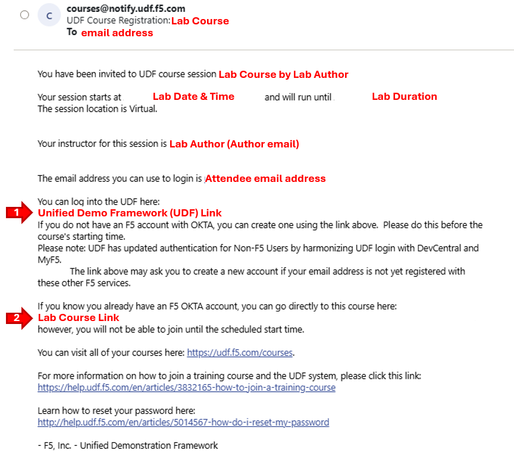
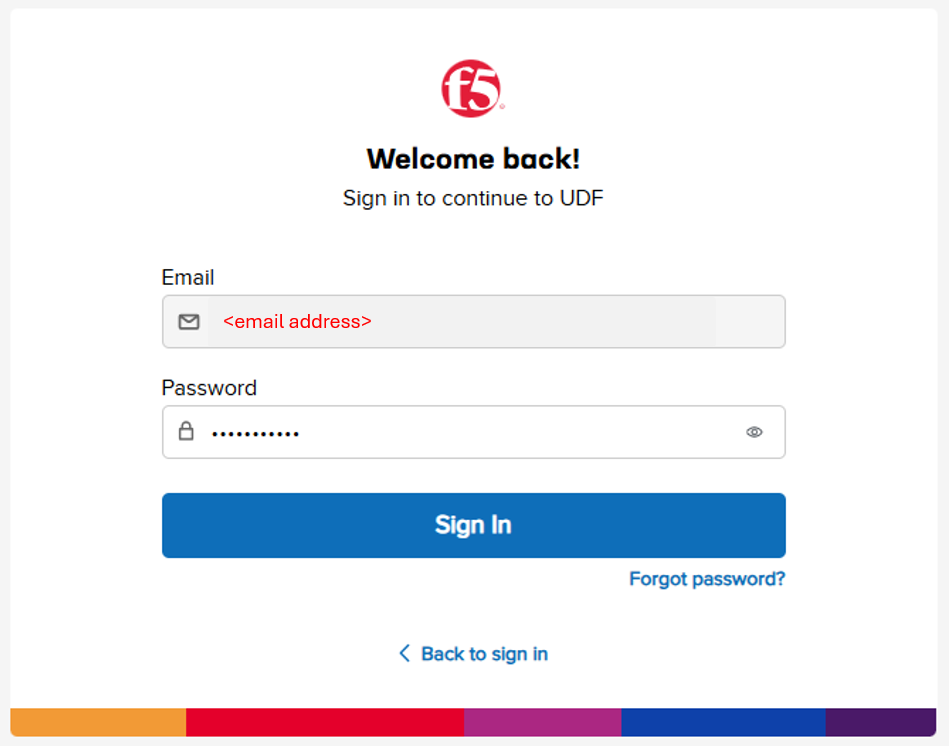
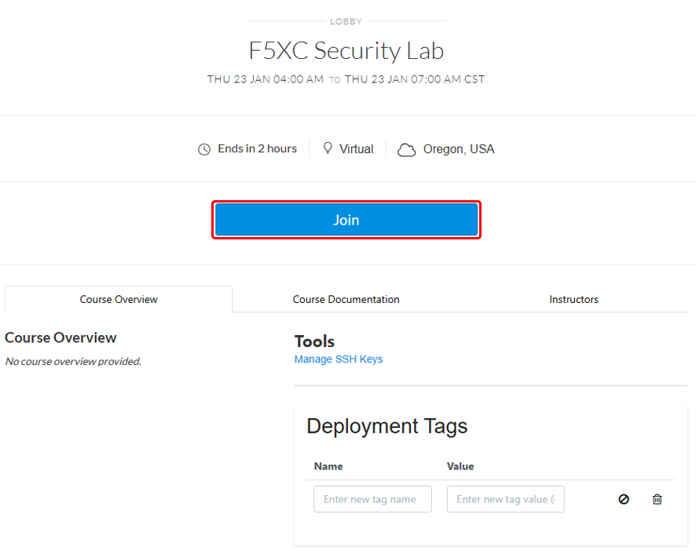
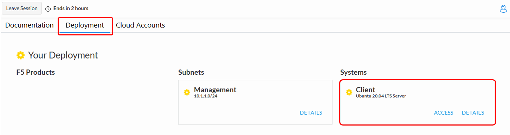
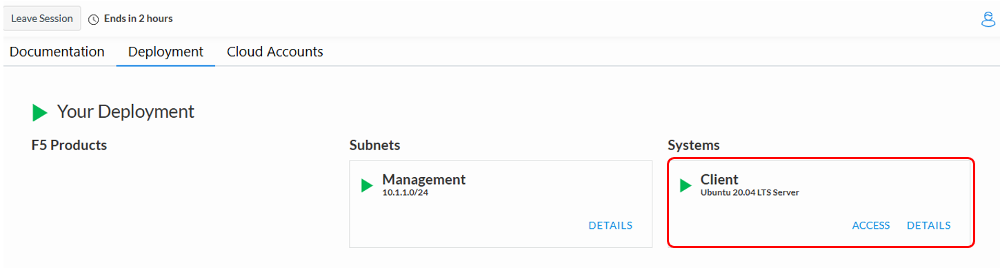
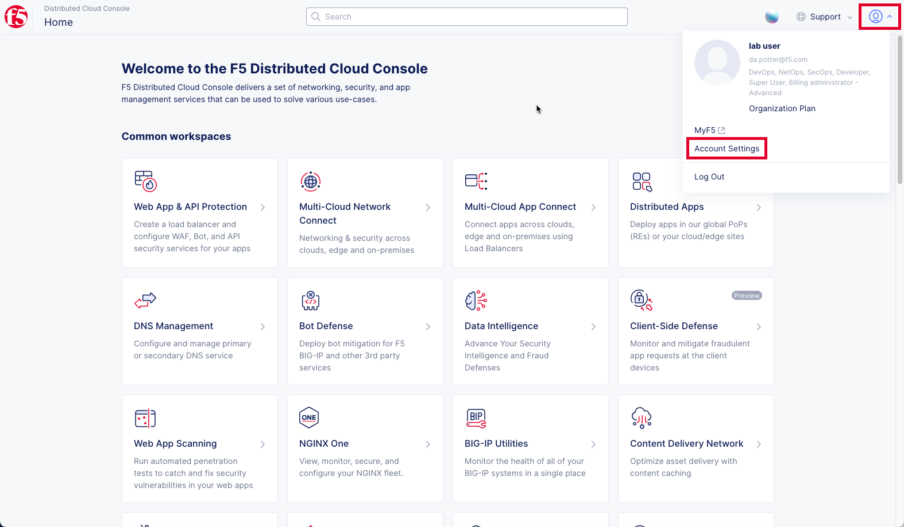
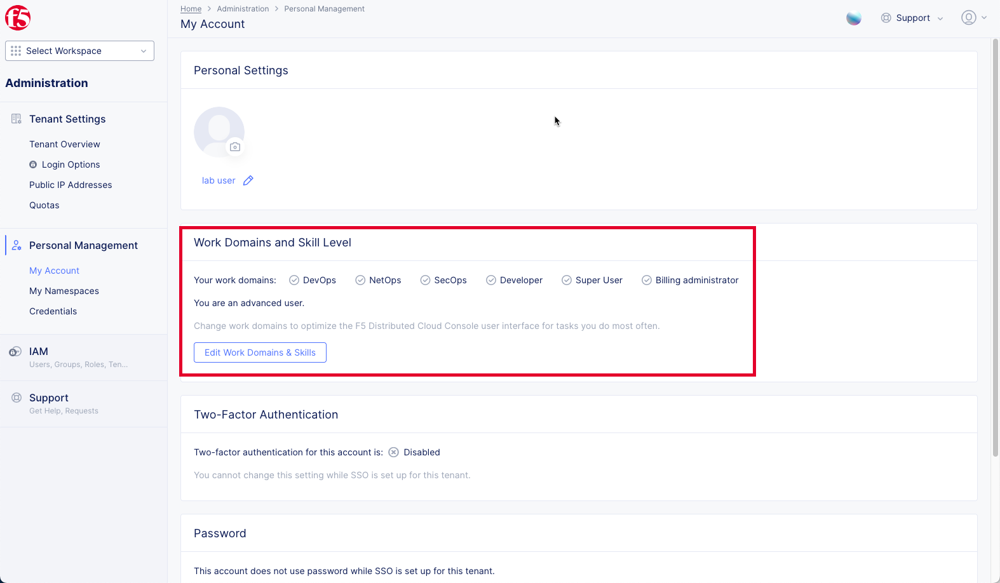
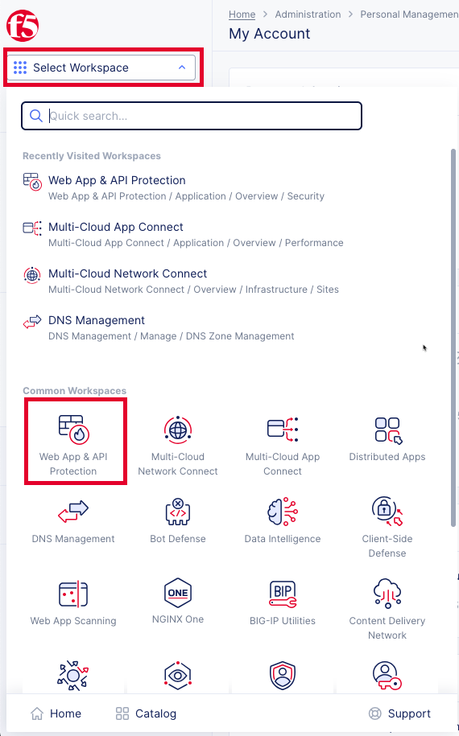
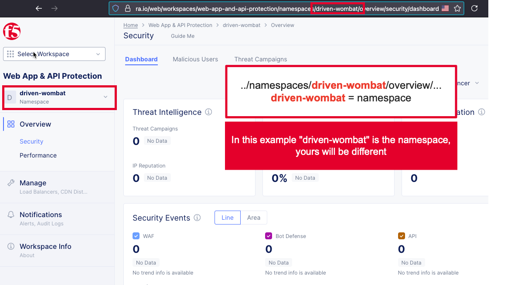

Introduction: Accessing F5 S3 BIG-IP Lab Environment
====================================================

Modern AI and data-intensive applications depend on fast, reliable access to S3-compatible storage. While
object stores like MinIO scale horizontally, apps frequently couple themselves tightly to individual storage
endpoints. This creates brittle deployments, uneven utilization, and high operational overhead.
F5 BIG-IP Local Traffic Manager (LTM) solves this challenge by providing a single, resilient abstracted
endpoint for S3 data delivery. With BIG-IP, applications connect to one virtual IP, while traffic is intelligently
distributed across one or more clusters, governed by policies, and protected by health monitoring.

Course/Lab Invitation
~~~~~~~~~~~~~~~~~~~~~

+----------------------------------------------------------------------------------------------+
| Course/Lab Attendees will receive an email similar to the graphic displayed in this section. |
| The email will come from courses@notify.udf.f5.com.                                          |
|                                                                                              |
| As attendees maybe registered for several lab/courses, ensure the corrcetly identified course|
| is selected.  Use either the first or second link position (indicated by arrows) based on    |
| the attendee's F5 UDF (Unified Demo Framework) Account Status.                               |
|                                                                                              |
| #. **New UDF Users**                                                                         |
| #. **Returning UDF Users going directly to Course**                                          |
+----------------------------------------------------------------------------------------------+
| |intro001|                                                                                   |
+----------------------------------------------------------------------------------------------+

Accessing UDF (F5 Unified Demo Framework)
~~~~~~~~~~~~~~~~~~~~~~~~~~~~~~~~~~~~~~~~~

+----------------------------------------------------------------------------------------------+
| The following will guide attendees through the initial Lab environment access within F5 UDF. |
| Following the instructions from the Course/Lab invitation above, attendees will be prompted  |
| to login at  https://udf.f5.com                                                              |
|                                                                                              |
| .. note::                                                                                    |
|    *The steps for new UDF Users or the steps for resetting UDF User account passwords are*   |
|    *not shown. Please contact a member of the lab team if further assistance is needed.*     |
+----------------------------------------------------------------------------------------------+
| |intro002|                                                                                   |
+----------------------------------------------------------------------------------------------+

+----------------------------------------------------------------------------------------------+
| Attendees may be prompted to enter their UDF account, password and complete MFA as shown.    |
| MFA must be completed by either selecting **Send Push** or **Enter Code**.                   |
|                                                                                              |
| .. note::                                                                                    |
|    *MFA process will very based on the MFA integration selected for the UDF Account. OKTA*   |
|    *Verify is shown.*                                                                        |
+----------------------------------------------------------------------------------------------+
| |intro003|                                                                                   |
|                                                                                              |
| |intro004|                                                                                   |
|                                                                                              |
| |intro005|                                                                                   |
+----------------------------------------------------------------------------------------------+

+----------------------------------------------------------------------------------------------+
| Attendees will then be presented their scheduled course sessions. Locate the course/lab with |
| the appropriate **Date**, **Time** and **Name** and then click **Launch**.                   |
+----------------------------------------------------------------------------------------------+
| |intro006|                                                                                   |
+----------------------------------------------------------------------------------------------+

+----------------------------------------------------------------------------------------------+
| Once redirected to the selected Course/Lab, click the **Join** button.                       |
+----------------------------------------------------------------------------------------------+
| |intro007|                                                                                   |
+----------------------------------------------------------------------------------------------+

+----------------------------------------------------------------------------------------------+
| The Lab environment window will now be displayed.  Click on the **Deployment** tab in the    |
| horizontal navigation links.  Locate and observe the state of **Client** system.             |
|                                                                                              |
| In approximately 5-7 minutes the associated **yellow gear** starting icon will change to a   |
| **green arrow** (running) icon and attendees will proceed to the next section of steps.      |
|                                                                                              |
| .. note::                                                                                    |
|    *Your specific lab environment may vary from the graphics shown below. The **Client***    |
|    *will, however, be consistent.*                                                           |
+----------------------------------------------------------------------------------------------+
| |intro008|                                                                                   |
|                                                                                              |
| |intro009|                                                                                   |
+----------------------------------------------------------------------------------------------+

+----------------------------------------------------------------------------------------------+
| **Beginning of Lab:**  You are now ready to begin the lab, Enjoy! Ask questions as needed.   |
+----------------------------------------------------------------------------------------------+
| |labbgn|                                                                                     |
+----------------------------------------------------------------------------------------------+

.. |intro002| image:: _static/intro-02.png
   :width: 800px
.. |intro003| image:: _static/intro-03.png
   :width: 800px

.. |intro005| image:: _static/intro-05.png
   :width: 800px
.. |intro006| image:: _static/intro-06.png
   :width: 800px

.. |intro010| image:: _static/intro-10.png
   :width: 800px
.. |intro011| image:: _static/intro-11.png
   :width: 800px
.. |intro012| image:: _static/intro-12.png
   :width: 800px
.. |intro013| image:: _static/intro-13.png
   :width: 800px
.. |intro014| image:: _static/intro-14.png
   :width: 800px
.. |intro015| image:: _static/intro-15.png
   :width: 800px

.. |labbgn| image:: _static/labbgn.png
   :width: 800px

