Lab 2: Fine-grained Policy Enforcement & Bucket Migration
====================================

AI training and fine-tuning workloads generate highly variable request rates. Spikes in requests per second
(RPS) can saturate storage clusters, disrupting other workloads and risking missed SLAs.
At the same time, data migrations are common — moving buckets between clusters or rebalancing capacity.
Migrations need to be surgical and transparent, without requiring client reconfiguration.

**Technical Problem**

- No central control: clients can easily flood individual nodes with requests, overwhelming cluster members.
- Data migrations require manual endpoint changes or application rewrites.
- Lack of policy enforcement leads to instability and risk during transitions.

**Solution with BIG-IP Local Traffic Manager (LTM)**

- **iRules** can be applied to cap connections, control RPS, and enforce thresholds at the dataplane.
- **Local Traffic Policies** redirect traffic based on bucket or host headers.
- **Outcome**: Clusters are stabilized under load, migrations are executed seamlessly, and clients keep using the same VIP.

Task 1. Review the Lab Environment
~~~~~~~~~~~~~~~~~~~~~~~~~~~~~~~~~~

These values align with the UDF topology. Keep them unchanged unless your
environment differs.

======================== ========================================= ==================================
Component                Purpose                                   Where to access
======================== ========================================= ==================================
BIG‑IP VIP for Cluster‑1 Single front door for MinIO cluster       WARP parameters: 10.1.40.160:9000
------------------------ ----------------------------------------- ----------------------------------
Cluster‑1 MinIO AIStor   Primary storage cluster                   10.1.10.100-103:9000
------------------------ ----------------------------------------- ----------------------------------
Cluster‑2 MinIO AIStor   Migration target for bucket A             10.1.20.100:9000
------------------------ ----------------------------------------- ----------------------------------
WARP GUI                 Generate high-RPS S3 workloads            UDF → Traffic-Gen → Firefox
------------------------ ----------------------------------------- ----------------------------------
BIG‑IP TMUI              Attach iRules, configure policies         UDF → BIG‑IP → Access → TMUI
======================== ========================================= ==================================
      

Task 2: Rate Limiting S3 Traffic with iRules
~~~~~~~~~~~~~~~~~~~~~~~~~~~~~~~~~~~~~~~~~~~~~~~~~~~~~~~~~~~~~

The following steps will create a massive spike in sudden S3 activity, and an approach using BIG-IP to
throttle down a specific source of the excessive load being received.

+---------------------------------------------------------------------------------------------------------------+
| 1. Open MinIO WARP (UDF → Components → Traffic‑Gen → Access → Firefox).                                       |
|                                                                                                               |
| 2. Set the load target to Endpoint: 10.1.40.160:9000 (BIG-IP VIP for Cluster-1).                              |
|                                                                                                               |
| 3. Duration: 5 minutes, Concurrency 50 threads.                                                               |
|                                                                                                               |
| 4. Click Run Benchmark.                                                                                       |
+---------------------------------------------------------------------------------------------------------------+
| |lab314|                                                                                                      |
|                                                                                                               |
|                                                                                                               |
+---------------------------------------------------------------------------------------------------------------+

~~~~~~~~~~~~~~~~~~~~~~~~~~~~~~~~~~~~~~~~~~~~~~~~~~~~~~~~~~

+---------------------------------------------------------------------------------------------------------------+
| 1. Open BIG-IP TMUI (UDF → Components → BIG-IP 21 → Access → TMUI).  The credentials are under lab            |
|    Documentation tab (admin/bigip123).                                                                        |
|                                                                                                               |
| 2. Select Statistics -> Dashboard                                                                             |
|                                                                                                               |
| 3. Set Dashboard type pulldown (upper left) to "LTM" and click under View (upper right) to "Minio-Cluster-1"  |
|                                                                                                               |
| 4. Since traffic is already underway, the moment the spike started may not be visible as displayed below.     |
|                                                                                                               |
+---------------------------------------------------------------------------------------------------------------+
| |lab315|                                                                                                      |
|                                                                                                               |
|                                                                                                               |
+---------------------------------------------------------------------------------------------------------------+

Task 3: Apply Rate Limiting iRule
~~~~~~~~~~~~~~~~~~~~~~~~~~~~~~~~~~~~~~~~~~~~~~~~~~~~~~~~~~~~~

The following steps will demonstrate how one S3 source address may be throttled, allowing only a specific number of 
transactions over time, once a threshold has been first exceeded.

+---------------------------------------------------------------------------------------------------------------+
| 1. In BIG-IP TMUI go to Local Traffic -> iRules -> iRule List                                                 | 
|                                                                                                               |
| 2.  Choose "Show All" in list display control at bottom right of iRule list.                                  |
|                                                                                                               |
+---------------------------------------------------------------------------------------------------------------+
| |lab316|                                                                                                      |
|                                                                                                               |
|                                                                                                               |
+---------------------------------------------------------------------------------------------------------------+

+---------------------------------------------------------------------------------------------------------------+
| 1. Open and review the iRule-RateLimit-Cluster1                                                               | 
|                                                                                                               |
| 2. This simple example has the iRule act as a gatekeeper, a unique source IP address may transact with a      |
|    URL (eg an S3 endpoint) 10 times, after which new transactions are limited to a rolling 6 second           |
|    window used to re-admit new S3 commands.                                                                   |
|                                                                                                               |
+---------------------------------------------------------------------------------------------------------------+
| |lab317|                                                                                                      |
|                                                                                                               |
|                                                                                                               |
+---------------------------------------------------------------------------------------------------------------+

+---------------------------------------------------------------------------------------------------------------+
| 1. Attach the iRule to the Virtual Server in BIG-IP TMUI: Local Traffic -> Virtual Servers-> MinIO-Cluster-1  |                                                             
|    (you will find iRules on the "Resources" tab of the Virtual Server configuration).                         |                                                                                  
|                                                                                                               |
+---------------------------------------------------------------------------------------------------------------+
| |lab318|                                                                                                      |
|                                                                                                               |
|                                                                                                               |
+---------------------------------------------------------------------------------------------------------------+

+---------------------------------------------------------------------------------------------------------------+
| 1. Within the Resources tab, click on Manage button.                                                          | 
|                                                                                                               |
| 2. Select the **iRule-RateLimit-Cluster1** from the list, click Finished.                                     |
|                                                                                                               |
+---------------------------------------------------------------------------------------------------------------+
| |lab319|                                                                                                      |
|                                                                                                               |
|                                                                                                               |
+---------------------------------------------------------------------------------------------------------------+

Re-Run the WARP workload, now that the iRule is in place.

**Expected:**

- Active Connections drop aggressively
- Cluster remains stable under the controlled load.

+---------------------------------------------------------------------------------------------------------------+
| 1.  Use the BIG-IP Dashboard to demonstrate the transactions per second has been brought down after           |                                             
|     the initial trafficexceeds what the iRule will permit.                                                    |                                                                                  
|                                                                                                               |
+---------------------------------------------------------------------------------------------------------------+
| |lab320|                                                                                                      |
|                                                                                                               |
|                                                                                                               |
+---------------------------------------------------------------------------------------------------------------+

Task 4: Bucket Migration with Local Traffic Policies
~~~~~~~~~~~~~~~~~~~~~~~~~~~~~~~~~~~~~~~~~~~~~~~~~~~~~~~~~~~~~

This scenario addresses BIG-IP LTM applying traffic policy to route traffic that only targets a specific S3 bucket
to a different (backup) cluster. This allows for very granual migrations and AI DAta delivery traffic controls.

+---------------------------------------------------------------------------------------------------------------+
| 1. Open MinIO Warp tool (UDF → Components → Traffic-Gen → Access → Firefox,                                   |
|    from Documentation tab admin/admin).                                                                       |
|                                                                                                               |
| 2. Select the nwq target: **BigIP-cluster-1 (cluster1-bucket-a) -> cluster2**                                 |
|                                                                                                               |
| 3. Select **only** the cluster1-bucket-a bucket (Bucket A), which is present on both MinIO clusters           |
|    configured in UDF.                                                                                         |
|                                                                                                               |
| 4. Use the sliders to set Duration to 10 mins and Concurrency to 20 threads                                   |
|                                                                                                               |
| 5. Make sure that the IP address in WARP Parameters is a new BIG-IP VIP at  10.1.40.161:9000                  |
|                                                                                                               |
+---------------------------------------------------------------------------------------------------------------+
| |lab321|                                                                                                      |
|                                                                                                               |
|                                                                                                               |
+---------------------------------------------------------------------------------------------------------------+

Click Run Benchmark button in Warp to send load to the cluster.

**Expected Result**  Traffic is targeting a new VIP configured in the Virtual Server *minio-cluster-migration*, which is
the starting point of our scenario, where all traffic is being sent to the original cluster *Cluster-1*. Next we will
attach an LTM "local traffic" policy, to strip out just the bucket A requests and forward them to a different pool/cluster
*Cluster-2*.

Go to the **BIG-IP TMUI**.

Click on Local Traffic -> Policies -> Policy List

|lab322|

Click on our one policy to review the conditions/action:

- Condition: HTTP URI path starts with /cluster1-bucket-a
- Action: Forward to Cluster-2 pool

|lab323|

This is an example of a published local policy, as such you will not be able to add new rules with more conditions and actions.  Rather, to experiment with possible additional rules, one may add a new policy in the policy list screen and investigate rule possibilities.

Let us now apply the local policy to the virtual server titled **minio-cluster-migration** (not the original virtual server)

- Find the virtual server and click **Edit** in the **Resources** tab

- Click **Manage** button for **Policies**

- Add **ltm-migrate-cluster1-cluster2** policy and click **Finish**.   The policy is added to the virtual server immediately, rules with action take effect.

|lab325|

**Verification**

Use the AST tool (to review the Dashboards) UDF -> AST -> Access -> Grafana.

- In AST: Dashboards → BigIP - Device → Device Pools look at the key metrics, such as **Active Pool Connections**.
- Click the 3 dots and choose "View" to increase the size to full screen.
- For ease of display, alter the pools being graphed to **only** include Cluster-1 and Cluster-2

|lab324|

A complementary way to demonstrate this switch over in S3 delivery, based upon the local policy being invoked, is
to use TMUI Pool Statistics and examing the current TCP connections delivering S3 data.

At the moment the policy kicks in, the current connections count will drop to **zero** on cluster-1 nodes.   All traffic and current connections
will exclusively be seen on cluster-2.

|lab326|

Task 5: Generate Traffic for Multiple Buckets
~~~~~~~~~~~~~~~~~~~~~~~~~~~~~~~~~~~~~~~~~~~~~~~~~~~~~~~~~~~~~

Open the MinIO Warp bench tool (UDF -> Components -> Traffic-Gen -> Access -> Firefox)

- Select the target: **BigIP-cluster-1 (cluster1-bucket-a) -> cluster2**

- Select *all* buckets (not just bucket-a)

- Place sliders at Duration 180 seconds and Concurrenct to 20 threads

- Make sure the IP address in the Warp Parameters is set to the new BIG-IP virtual server **10.1.40.161:9000**

Click **Run Benchmark** to start the S3 traffic load.

**Expectation**:

Traffic is still being sent to the VIP configured in the Virtual Server minio-cluster-migration,
however it has a mix of different buckets. Because of the policy we previously applied, the traffic to Bucket A will be routed
to the new cluster Cluster-2, while all **other** buckets are being sent to the original cluster Cluster-1.

|lab327|

As expected, the green line Cluster-1 connections carry S3 traffic for buckets B and C; while the yellow line for
Cluster-2 represents only those connections required to service bucket A load generated by the WARP tool.

Troubleshooting
~~~~~~~~~~~~~~~~~~~~~~~~~~~~~~~~~~~~~~~~~~~~~~~~~~~~~~~~~~~~~

**Policy not applied:** Ensure the policy is attached to the correct virtual server.   The iRule is applied on on virtual server while the local policy was
applied to another virtual server

**Traffic not redirected:** Double-check WARP tool selections **Bucket A** or all buckets.

What You Learned — Value of BIG-IP LTM
~~~~~~~~~~~~~~~~~~~~~~~~~~~~~~~~~~~~~~~~~~~~~~~~~~~~~~~~~~~~~

- **Resilience under spikes:** iRules stabilize request load.
- **Seamless migrations:** Local Traffic Policies redirect buckets without endpoint changes.
- **Business alignment:** Traffic is steered by business rules, not app rewrites.
- **Outcome:** AI data pipelines stay predictable, protected, and flexible.

+-----------------------------------------------------------------------------------------------------------------------------------+
| **End of Lab 2**.  In this lab you explored data plane programability by adding an iRule to police excessive S3 traffic           |
| generators.   Without toching any endpoint, a local policy re-directed traffic from cluster-1 to cluster-2.                       |
| Real-time impacts of iRules and policies was demonstrated when traffic was steered in the middle of Warp S3 test runs.            |
+-----------------------------------------------------------------------------------------------------------------------------------+
|  |labend|                                                                                                                         |
+-----------------------------------------------------------------------------------------------------------------------------------+

.. |lab300| image:: ../_static/lab3-appworld2025-topology-diagram.png
   :width: 800px
.. |lab301| image:: ../_static/lab3-appworld2025-task1-originserverr.png
   :width: 800px
.. |lab302| image:: ../_static/lab3-appworld2025-task2-lb-add-origin-pool.png
   :width: 800px
.. |lab303| image:: ../_static/lab3-appworld2025-task2-lb-add-origin-pool2.png
   :width: 800px
.. |lab304| image:: ../_static/lab3-appworld2025-task2-lb-origin-pool-added.png
   :width: 800px
.. |lab305| image:: ../_static/lab3-appworld2025-task2-lb-other-settings.png
   :width: 800px
.. |lab306| image:: ../_static/lab3-appworld2025-task2-lb-change-vip-advertisement.png
   :width: 800px
.. |lab307| image:: ../_static/lab3-appworld2025-list-sites-advertise.png
   :width: 800px
.. |lab308| image:: ../_static/lab3-appworld2025-task2-lb-site-change.png
   :width: 800px
.. |lab309| image:: ../_static/screenshot-global-vip-private.png
   :width: 800px
.. |lab310| image:: ../_static/lab3-appworld2025-waf-block-message.png
   :width: 800px
.. |lab311| image:: ../_static/lab2-appworld2025-task2-lb.png
   :width: 800px 
.. |lab312| image:: ../_static/screenshot-global-vip-private.png
   :width: 800px 
.. |lab313| image:: ../_static/lab3-appworld2025-waf-block-message.png
   :width: 800px 
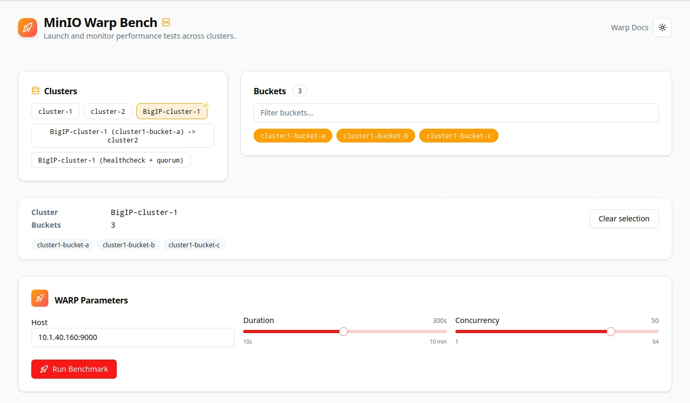
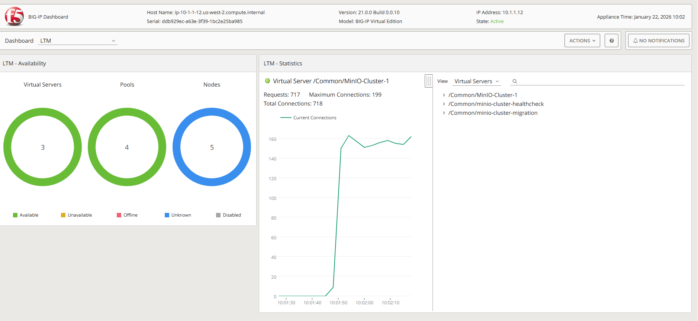
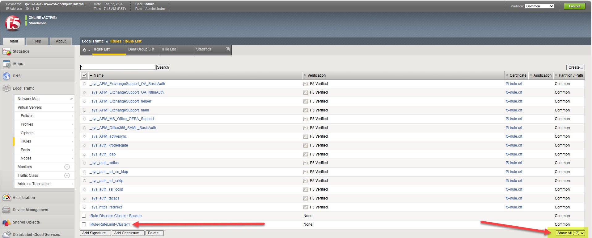
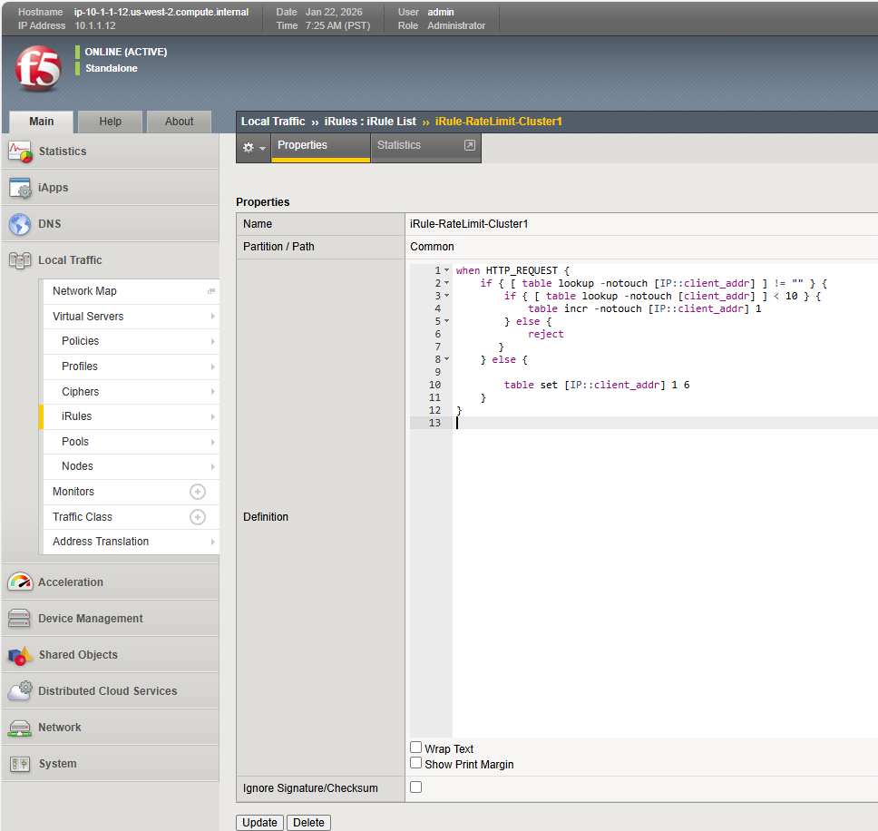
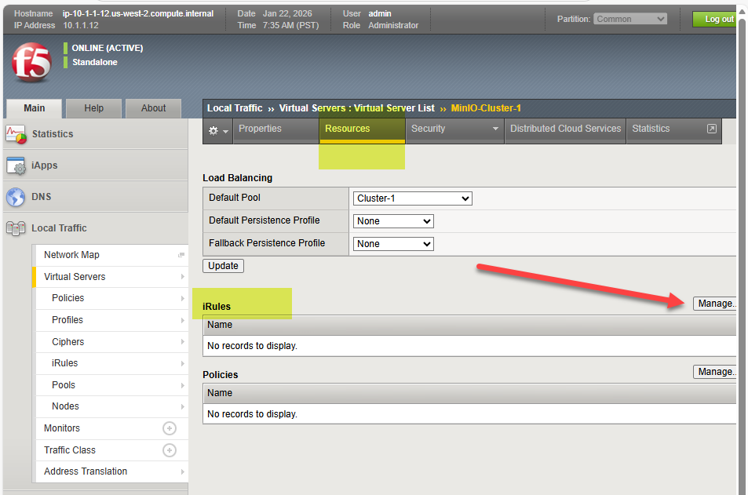
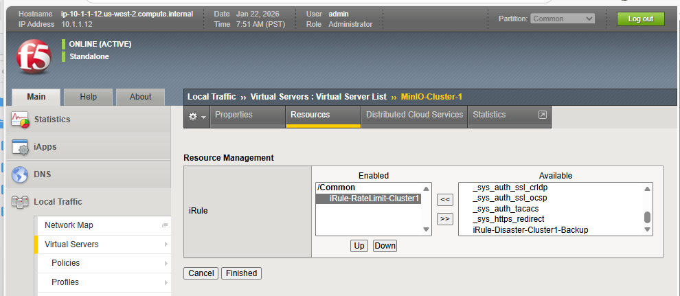
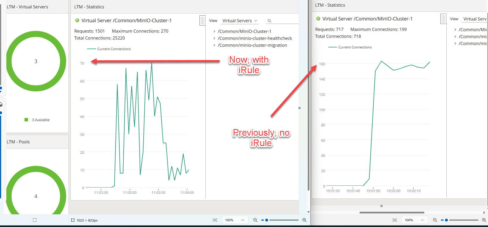
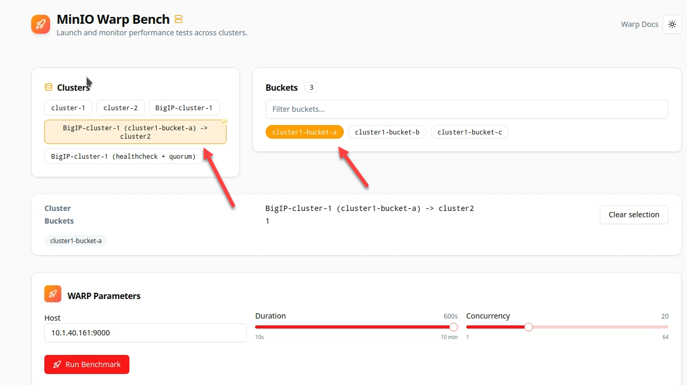
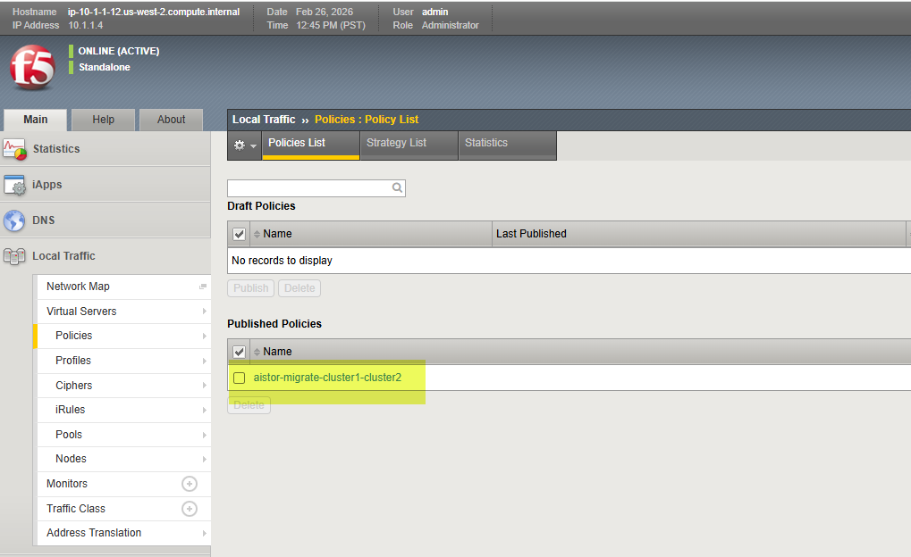
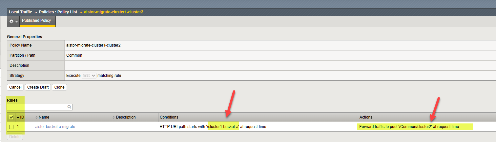
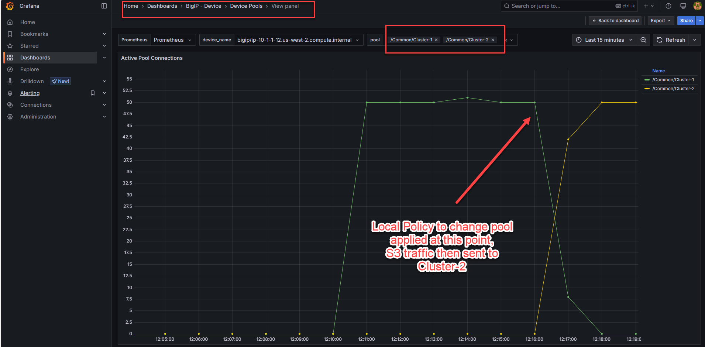
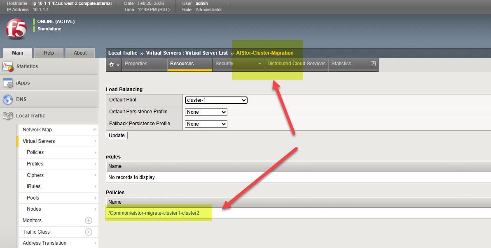
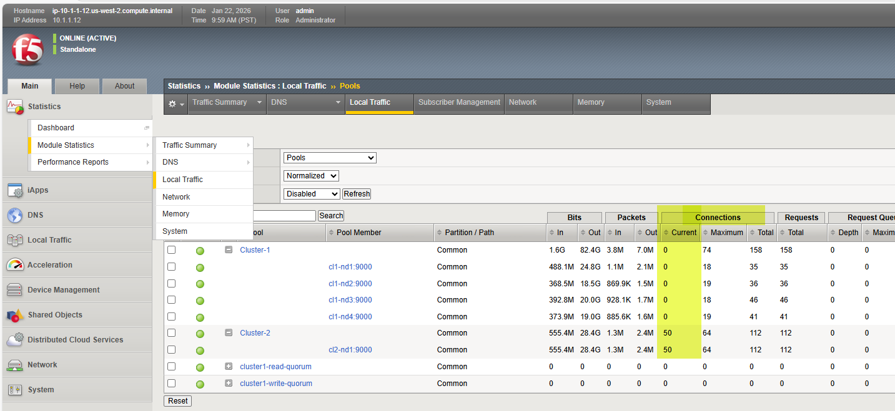
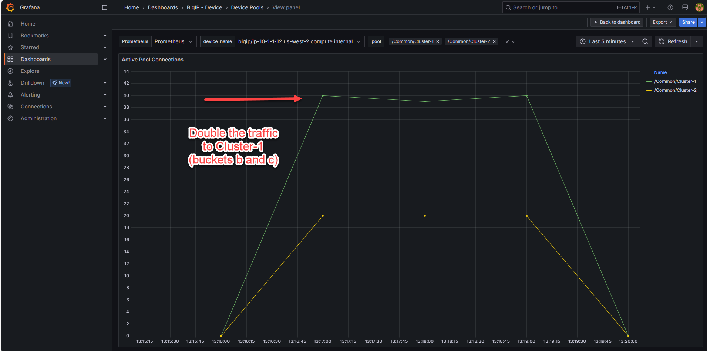
.. |labend| image:: ../_static/labend.png
   :width: 800px
