Exercise 1: Initial Setup
=========================

In this lab, you will use the F5OS user interfaces to perform initial platform configuration and setup tasks, then configure new tenants. If you have no partner, complete all sections. If you are partnered up, follow the section A or section B. 

When done with your respective section, review the changes made in the other section to see each configuration element.

If you prefer CLI configuration to the GUI, ssh into the rSeries instead of using the GUI and follow those instructions below.

**Student A Section:**

UI Option - See below for CLI

 - Log into the webUI of the rSeries appliance at:  https://10.193.5.10+X 
 - Navigate to System Settings -> General
 - Set the Hostname to r5900-X.aw26.lab where X is your station number
   - **Note** : Allowed characters are lowercase alphanumeric characters (a-z, 0-9) and hyphens (-)
 - Configure a Login Banner such as "Welcome to Appworld 2026"
 - Configure a MOTB Banner such as "Hello from r5900-X"
 - Click the *Save* button at the bottom right of the page
 
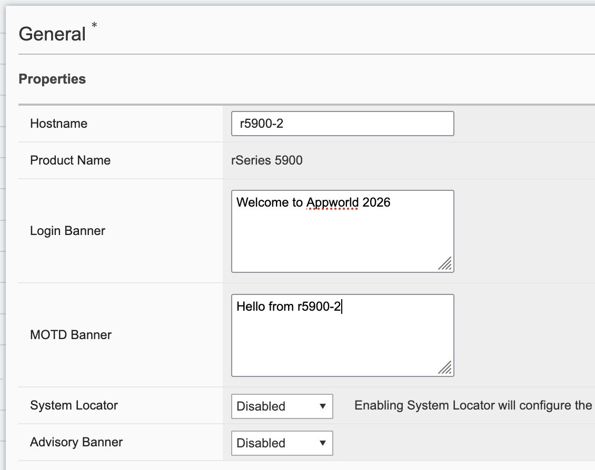

Click OK on the General Properties dialog box.
 
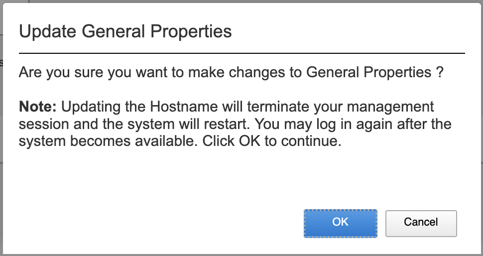

You will be logged out of the UI and have to re-login.  Your browser may prompt to reconnect to the BIG-IP since changing the hostname updated the self-signed management certificate
CLI Example:	``ssh as user admin`` 

.. code-block:: none

   appliance-1# config
   appliance-1(config)# system config hostname r5900-<X>.aw26.lab
   appliance-1(config)# system config login-banner "Welcome to Appworld 2026"
   appliance-1(config)# system config motd-banner "You have logged into r5900-<X>.1"
   appliance-1(config)# commit
   Commit complete.
   r5900-1(config)# exit

Next change the default timeouts (note Token is minutes, CLI Idle is seconds)

 - Navigate Authentication & Access -> Authentication Settings
 - Set Token Lifetime to 60 minutes
 - Save your change, Click Save button at the bottom right of the page
 
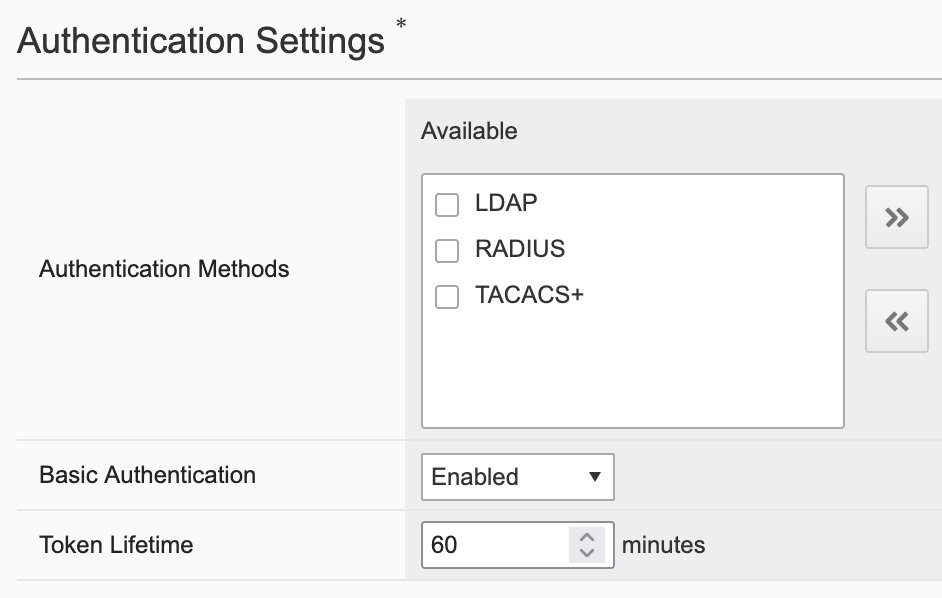

 - Navigate to System Settings -> System Security
 - Set CLI Idle Timeout to 1200 seconds (at the bottom of the page)
 - Click **Save** button at the bottom right of the page
 
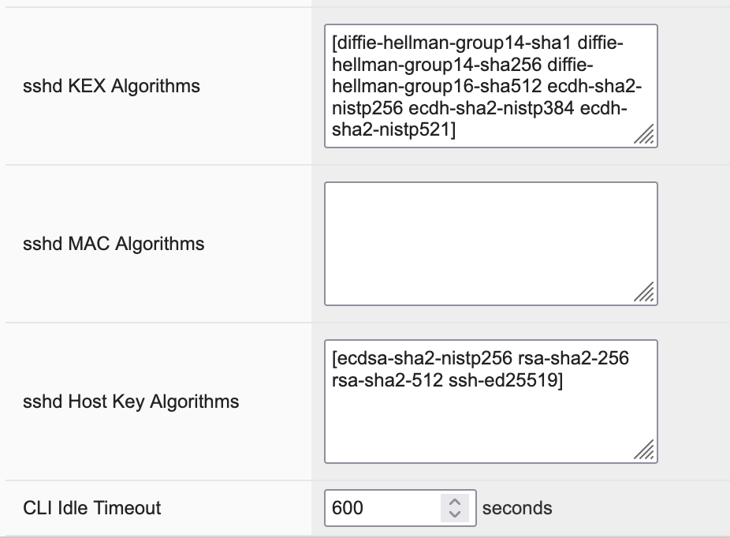

 - CLI commands
.. code-block:: none

   r5900-1# config
   r5900-1(config)# system aaa restconf-token config lifetime 60
   r5900-1(config)# system settings config idle-timeout 1200
   r5900-1(config)# commit
   Commit complete.
   r5900-1(config)# exit

The Default port group speeds are 100G and 25G respectively. This lab uses 4x10 breakouts for the dual 20G ports, and the portgroup must be changed from a factory default. Changes require a reboot, so to save time the rSeries should already be in the correct mode. 

To validate this: navigate to Dashboard -> Network which displays a layout of current network port speeds and status:

 
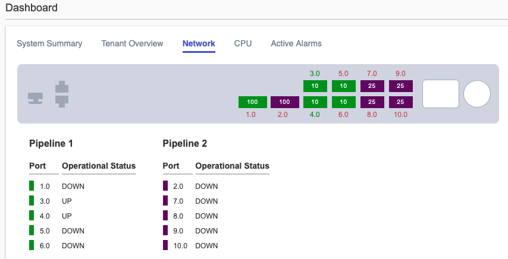

CLI commands

.. code-block:: none

   r5900-1# show port-mappings port-mapping 
   r5900-1# show running-config portgroups portgroup config mode
   
   

Next, we will add a VLAN into F5OS. The internal VLAN is numbered 10+X

Navigate to Network Settings -> VLANs
Click Add to add the internal VLAN
 
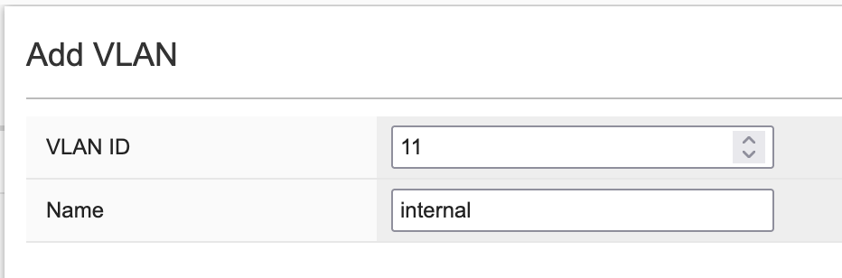

CLI from config mode

.. code-block:: none

   r5900-1(config)# config
   r5900-1(config)# vlans vlan (10+X) config vlan-id (10+X) name internal

	example: vlans vlan 11 config vlan-id 11 name internal

.. code-block:: none

   r5900-1(config-vlan-11)# commit
   r5900-1(config-vlan-11)# exit
   

With the internal VLAN created, we now add it to the LAG

Navigate to Network Settings -> LAGs 
Click on the LAG_20G LAG to enter edit mode
Select VLAN 11 and interface 3.0 to add both to LAG_20G
Click Save & Close
 
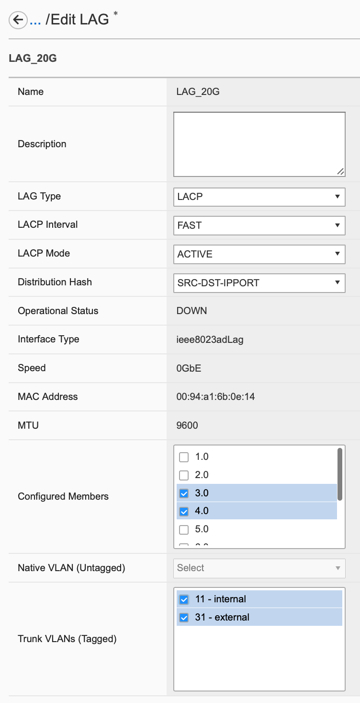

CLI from config mode <<JHart:  need to update the steps to get LACP mode and speed - I have the command from Adnan's testing I just need to put them in.>>

.. code-block:: none

   r5900-1(config)# interfaces interface LAG_20G aggregation switched-vlan config trunk-vlans [ <10+X> ]
   r5900-1(config-interface-LAG_20G)# exit
   r5900-1(config)# interfaces interface 3.0 ethernet config aggregate-id LAG_20G
   r5900-1(config-interface-3.0)# exit
   r5900-1(config)#commit
   

Navigate to Network Settings -> LLDP Configuration and click on interface 3.0
Ensure that LLDP is Enabled, the system name is the r5900-X.  Enable LLDP on interface 3.0 by checking the box
Save the changes. 	
 
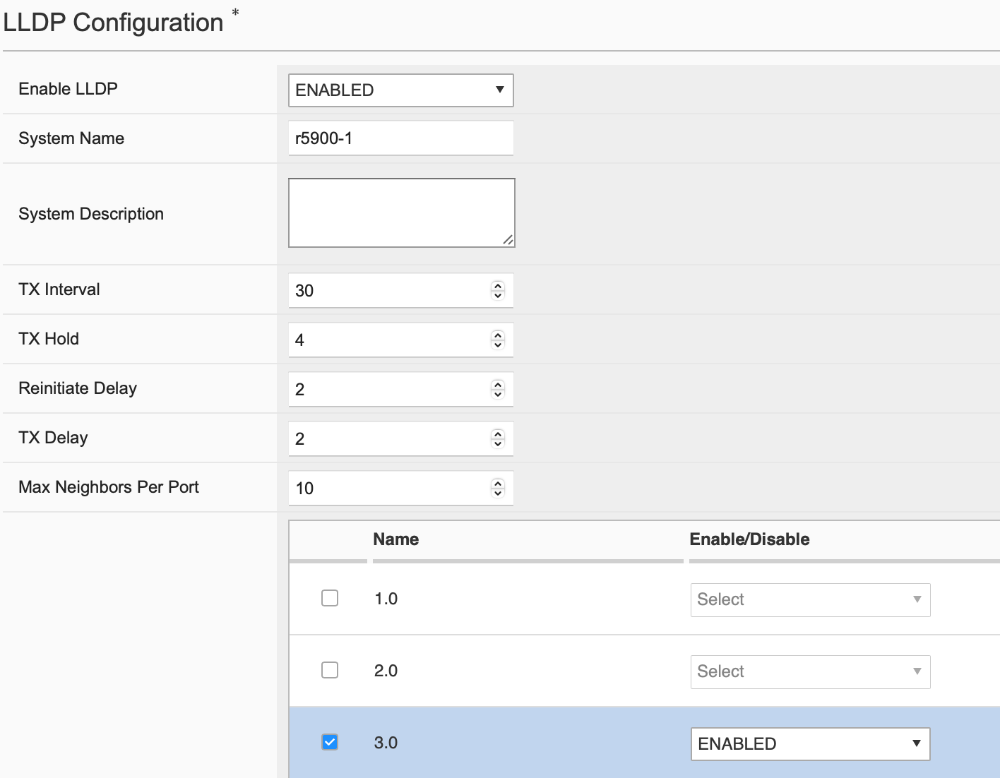

CLI from config mode

.. code-block:: none

   r5900-1(config)# lldp config enabled
   r5900-1(config)# lldp config system-name r5900-<X>
   r5900-1(config)# lldp interfaces interface 3.0
   r5900-1(config-interface-3.0)# exit
   r5900-1(config)# commit
   r5900-1(config)# exit
   

Navigate to Authentication & Access -> Authentication Settings and click on the Show button for Local Password Policy. Here you can see the default password policy settings for users that is a strong default position, however options exist to align with organization standards for longer minimum passwords, change differential and required characters.
 
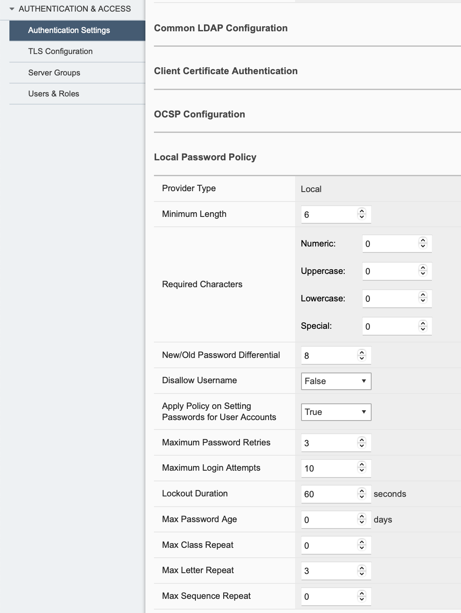

CLI commands [Not from config mode]

.. code-block:: none

   r5900-1# show running-config system aaa password-policy
   system aaa password-policy config min-length 6
   system aaa password-policy config required-numeric 0
   system aaa password-policy config required-uppercase 0
   system aaa password-policy config required-lowercase 0
   system aaa password-policy config required-special 0
   system aaa password-policy config max-letter-repeat 3
   system aaa password-policy config max-sequence-repeat 0
   system aaa password-policy config max-class-repeat 0
   system aaa password-policy config required-differences 8
   system aaa password-policy config reject-username false
   system aaa password-policy config apply-to-root true
   system aaa password-policy config retries 3
   system aaa password-policy config max-login-failures 10
   system aaa password-policy config unlock-time 60
   system aaa password-policy config root-lockout true
   system aaa password-policy config root-unlock-time 60
   system aaa password-policy config max-age 0
   

<<JHart: do we want to move this verification above creating the LAGs just in case something is weird and the settings revert back to default in labville?>>

<BVL I think its just a way to show them stuff at the end, this would only be changed if someone manually changes it and reboots the appliance from what I have seen> 

The Default port group speeds are 100G and 25G respectively. This lab uses 4x10 breakouts for the dual 20G ports, which would require changing from a factory default configuration. Portgroup speed changes require a reboot, so to save time the rSeries should already be in the correct mode. 

To validate this: navigate to Dashboard -> Network which displays a layout of current network port speeds and status:

 

CLI Commands [Not from config mode]

.. code-block:: none

   r5900-1# show port-mappings port-mapping 
   r5900-1# show running-config portgroups portgroup config mode
   

At this point, layer 1 should be up between the rSeries appliance and the upstream switch. In the webUI, explore the following tabs -- LAGs, LACP Details, and LLDP Details.  Network Details gives a table summary of all network interfaces

CLI Commands [Not from config mode]

.. code-block:: none

   r5900-1# show interfaces interface 3.0
   r5900-1# show interfaces interface LAG_20G
   r5900-1# show lacp interfaces interface LAG_20G 
   r5900-1# show lacp interfaces interface LAG_20G state
   r5900-1# show lacp interfaces interface LAG_20G members
   r5900-1# show lacp interfaces interface LAG_20G members | tab
   

//End of Exercise 1 (Student A)	
Student B Section:

We will begin by configuring a VLAN and the 20G LAG for the rSeries. 

Navigate to Network Settings -> VLANs
Click Add to add the external then the internal vlans

 
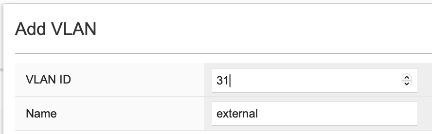

CLI from config mode

.. code-block:: none

   r5900-1(config)# vlans vlan (30+X) config vlan-id (30+X) name external
   r5900-1(config-vlan-31)# exit
   

Navigate to Network Settings -> LAGs and click the Add button
Configure LAG_20G as shown below
Click Save And Close button at the bottom right of the page

 
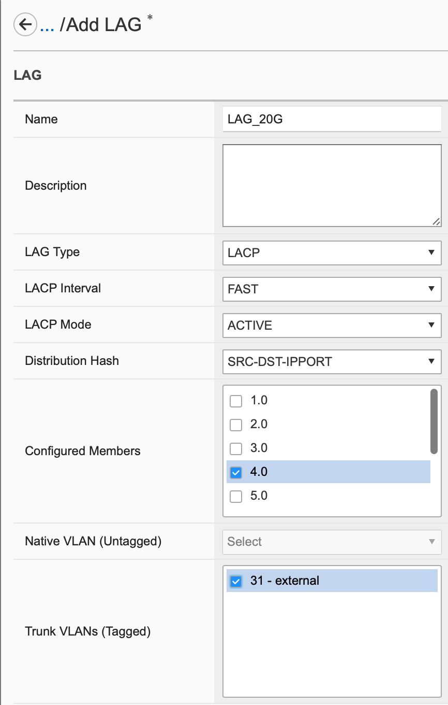

CLI from config mode

.. code-block:: none

   r5900-1(config)# interfaces interface LAG_20G config type ieee8023adLag
   r5900-1(config-interface-LAG_20G)# aggregation config lag-type LACP
   r5900-1(config-interface-LAG_20G)# aggregation switched-vlan config trunk-vlans [ <30+X> ]
   r5900-1(config-interface-LAG_20G)# exit
   r5900-1(config)# interfaces interface 4.0 ethernet config aggregate-id LAG_20G
   r5900-1(config-interface-4.0)# exit
   r5900-1(config)# lacp interfaces interface LAG_20G config interval FAST lacp-mode ACTIVE
   r5900-1(config-interface-LAG_20G)# exit
   r5900-1(config)#commit
   

Log into the webUI of the rSeries appliance at:  https://10.193.5.10+X 
Navigate to System Settings -> DNS
Click Add under DNS Lookup Servers, and add 8.8.8.8 and 8.8.4.4
Save your changes
 
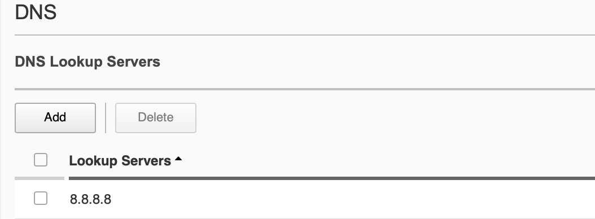

CLI:	ssh as user admin 

.. code-block:: none

   r5900-1# config
   r5900-1(config)# system dns servers server 8.8.8.8
   r5900-1(config)# system dns servers server 8.8.4.4
   r5900-1(config-server-8.8.4.4)# commit
   r5900-1(config-server-8.8.4.4)# exit
   r5900-1(config)# exit
   

Navigate to System Settings -> Time Settings
Click Add under NTP Servers, and add time.nist.gov
Save your changes
 
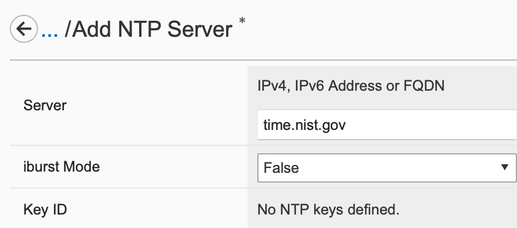

CLI from config mode

.. code-block:: none

   r5900-1(config)# system ntp servers server time.nist.gov
   r5900-1(config-server-time.nist.gov)# exit
   r5900-1(config-community-appworld)# exit
   

Navigate to System Settings -> SNMP Configuration
Under Add under Communities, and add a community
 
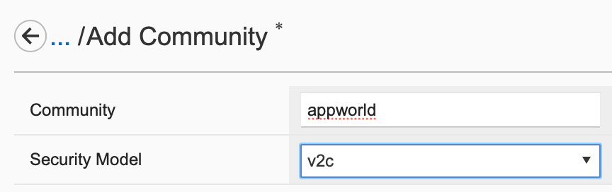

CLI from config mode

r5900-1(config)# system snmp communities community appworld config security-model [ v2c ]

After configuring an SNMP community, an additional step is needed to enable SNMP polling. By default, F5OS enables an implicit firewall on the management interface that restricts access to certain ports, and port 161 is blocked.

The Allowed IP Addresses feature under System Settings -> System Security provides the mechanism to add additional ports/protocols as well as lock down existing services. 
Refer to this knowledge article for more details and some general guidelines. 
The next step is to allow SNMP access for the lab environment.

Note: Use care setting port to All: if a typo is made in the allow list (and there is not another matching allow list), the policy could lock access out requiring a console login to re-configure J 

Navigate to System Settings -> System Security
Click Add under Allowed IP Addresses, and add the following
Save your changes
 
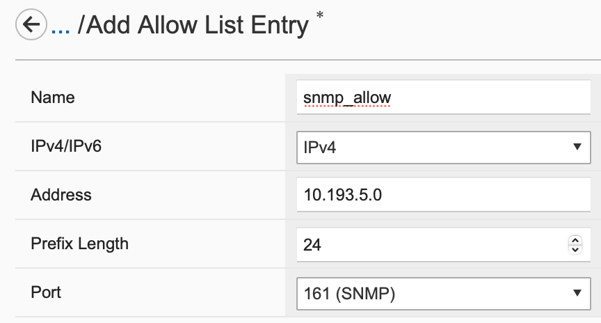

CLI from config mode

.. code-block:: none

   r5900-1(config)# system allowed-ips allowed-ip snmp_allow config ipv4 address 10.193.5.0 prefix-length 24 port 161
   r5900-1(config-allowed-ip-snmp_allow)# exit
   r5900-1(config)#
   

Navigate to Network Settings -> LLDP Configuration
Ensure that LLDP is Enabled, the system name is the r5900-X.
Ensure LLDP on interface 3.0 is enabled (should have been done by Student A)
Click on interface 4.0 and selelct ePerform the same for interface 4.0
Save the changes. 	
 
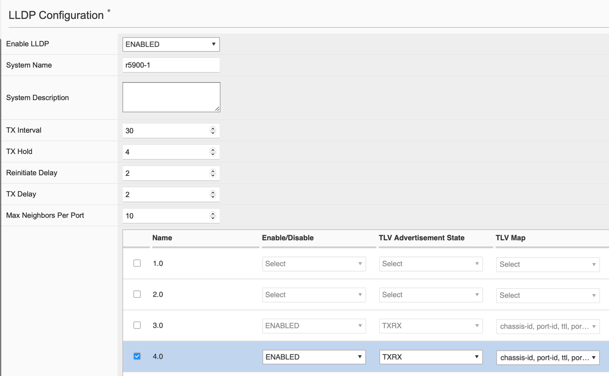

CLI from config mode

.. code-block:: none

   r5900-1(config)# lldp config enabled
   r5900-1(config)# lldp config system-name r5900-1
   r5900-1(config)# lldp interfaces interface 4.0
   r5900-1(config-interface-4.0)# exit
   r5900-1(config)# commit
   r5900-1(config)# exit
   

At this point, layer 1 should be up between the F5OS and the upstream switch. In the GUI, explore the following Network Settings tabs: LAGs, LACP Details, and LLDP Details.  

Network Details gives a table summary of all network interfaces.
CLI 

.. code-block:: none

   r5900-1# show interfaces interface 4.0
   r5900-1# show interfaces interface LAG_20G
   r5900-1# show lacp interfaces interface LAG_20G 
   r5900-1# show lacp interfaces interface LAG_20G state
   r5900-1# show lacp interfaces interface LAG_20G members
   r5900-1# show lacp interfaces interface LAG_20G members | tab
   r5900-1# show lldp state
   r5900-1# show lldp interfaces interface state
   r5900-1# show lldp interfaces interface neighbors
   
   
   

Navigate to Authentication & Access -> Authentication Settings and click on the Show button for Local Password Policy. Here you can see the default password policy settings for users that is a strong default position, however options exist to align with organization standards for longer minimum passwords, change differential and required characters.

 

CLI from config mode

.. code-block:: none

   r5900-1# show running-config system aaa password-policy
   system aaa password-policy config min-length 6
   system aaa password-policy config required-numeric 0
   system aaa password-policy config required-uppercase 0
   system aaa password-policy config required-lowercase 0
   system aaa password-policy config required-special 0
   system aaa password-policy config max-letter-repeat 3
   system aaa password-policy config max-sequence-repeat 0
   system aaa password-policy config max-class-repeat 0
   system aaa password-policy config required-differences 8
   system aaa password-policy config reject-username false
   system aaa password-policy config apply-to-root true
   system aaa password-policy config retries 3
   system aaa password-policy config max-login-failures 10
   system aaa password-policy config unlock-time 60
   system aaa password-policy config root-lockout true
   system aaa password-policy config root-unlock-time 60
   system aaa password-policy config max-age 0
   

At this point, layer 1 should be up between the rSeries appliance and the upstream switch. In the webUI, explore the following tabs -- LAGs, LACP Details, and LLDP Details.  Network Details gives a table summary of all network interfaces

CLI from config mode

.. code-block:: none

   r5900-1# show interfaces interface 3.0
   r5900-1# show interfaces interface LAG_20G
   r5900-1# show lacp interfaces interface LAG_20G 
   r5900-1# show lacp interfaces interface LAG_20G state
   r5900-1# show lacp interfaces interface LAG_20G members
   r5900-1# show lacp interfaces interface LAG_20G members | tab
   

//End of Exercise 1 (Student B)
