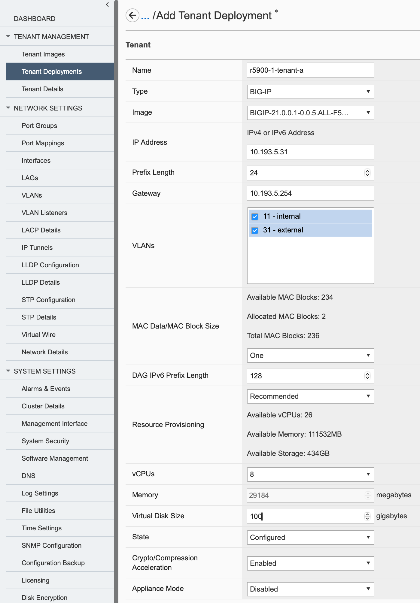
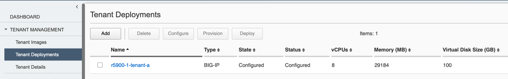

Exercise 2: Tenant Creation and Migration
=========================================

In this exercise, each student must create a new tenant and migrate a configuration into it; individual settings may differ for Student A and Student B, as noted below.

- Navigate to Tenant Deployments and click Add
- Create a new tenant with the following new settings (all others leave as default) 

  - Name: r5900-X-tenant-a or r5900-X-tenant-b
  - Type: BIG-IP
  - Image: BIGIP-21.0.0.1-0.0.13  
  - IP Address: 10.193.5.30+X for tenant-a 10.193.5.50+X for tenant-b
  - Prefix Length: 24
  - Gateway: 10.193.5.254
  - VLANS: Check both VLANs 
  - vCPUs: 8
  - Virtual Disk Size: 100
  
- Click *Save & Close*

CLI:	ssh as user admin and enter config mode

.. code-block:: none

   r5900-1# config
   r5900-1(config)# tenants tenant r5900-<X>-tenant-<Y> config image BIGIP-21.0.0.1-0.0.13.ALL-F5OS.tar.bundle vcpu-cores-per-node 8 mgmt-ip 10.193.5.<30+X> prefix-length 24 gateway 10.193.5.254 vlans [ <10+X> <30+X> ] nodes 1 running-state configured memory 29184 storage size 100
   r5900-1(config-tenant-r5900-2-tenant-a)# !
   r5900-1(config-tenant-r5900-2-tenant-a)# commit
   r5900-1# exit
   
   

At this stage, the tenant configuration is complete; however, the tenant has not been started, and no resources have been provisioned. You can view the tenant state in *Dashboard → Tenant Overview* or *Tenant Management → Tenant Deployments*

To start the tenant, either select the tenant and click the Deploy button, or edit the tenant and change the *State* setting to *Deployed*

 

CLI show command

.. code-block:: none

   r5900-1# show tenant

See that newly created tenant is in ‘configured' state. To update the state, enter config mode 

.. code-block:: none

   r5900-1# config
   r5900-1(config)# tenants tenant r5900-2-tenant-a config running-state deployed
   r5900-11(config-tenant-r5900-2-tenant-a)#!
   r5900-11(config-tenant-r5900-2-tenant-a)# commit
   r5900-11(config-tenant-r5900-2-tenant-a)# exit
   r5900-1#(config) exit   
   
After you commit the change, F5OS will start deploying the tenant. The initial deployment requires creating the virtual disk, which takes longer than updating an existing tenant's running state. While the tenant is being created, the status will show as Starting in the GUI and CLI.  The tenant should be available in 3-5 minutes.

The tenant Status will show *Running* once it has booted; you can monitor the tenant startup by continuously pinging the management IP from your workstation -- successful replies indicate tenant services are coming up and you can log in.

.. code-block:: none

   r5900-1# show tenants tenant state status
   NAME              STATUS
   ---------------------------
   r5900-1-tenant-a  Running

**Note:** New tenants are created with a default TMOS install. For initial login use root/default (SSH); change the root password when prompted -- this password is temporary and will revert to the lab password Appworld26 after the UCS load completes.

Once the tenant is running, and management IP is reachable:

- SSH into the tenant as the *root* user and password *default*, the management IP will be10.193.5.(30+X For Student A or 50+X for Student B)
- When prompted, set a new password for the root user 
  
After resetting the password in the CLI remain in the CLI for the next steps.

Next, import the master key from the tenant you're migrating. This is necessary when the UCS contains encrypted passwords; without the master key, the UCS may fail to load. If the master key is unavailable, manually edit the configuration to remove encrypted elements so the UCS can load without errors.

Loading the master key from the bash shell can be referenced in knowledge article https://my.f5.com/manage/s/article/K9420. For this lab, both the UCS and master key files are on a web server 10.193.5.2 that can be downloaded to a laptop then uploaded to the BIG-IP tenant, or simple directly downloaded to the tenant via HTTPS.  

.. code-block:: none

   Filenames for Student A:
   UCS file:	r5900-<X>a.ucs
   Key file:	r5900-<X>a.key
   ------------------------
   Filenames for Student B:
   UCS file:	r5900-<X>b.ucs
   Key file:	r5900-<X>b.key

The following commands use curl from the BIG-IP tenant (remember to change the file names to your student and station assignments) to directly download the files: 

.. code-block:: none

   [root@localhost:Active:Standalone] config # curl -k https://10.193.5.2/r5900-2a.key -o /var/tmp/r5900-2a.key
   
   [root@localhost:Active:Standalone] config # curl -k https://10.193.5.2/r5900-2a.ucs -o /var/tmp/r5900-2a.ucs
   
   [root@localhost:Active:Standalone] config # ls -la /var/tmp/r5900-*

   -rw-r--r--. 1 root root       25 Jan 14 11:13 /var/tmp/r5900-1a.key
   -rw-r--r--. 1 root root 10918287 Jan 14 11:13 /var/tmp/r5900-1a.ucs

Next, re-key the master key from the txt file downloaded, as an example: 

.. code-block:: none 

   [root@localhost:Active:Standalone] config # cat /var/tmp/r5900-1a.key
   U5hNcJqbR0W4pjILPNa5/Q==
   [root@localhost:Active:Standalone] config # f5mku -r U5hNcJqbR0W4pjILPNa5/Q==
   Rekeying Master Key...
   [root@localhost:Active:Standalone] config # f5mku -K
   U5hNcJqbR0W4pjILPNa5/Q==

The final tenant migration step is to load the UCS file, using the platform-migrate option which ignores network interfaces and other items in the load process

.. code-block:: none

   tmsh
   root@(localhost)(cfg-sync Standalone)(Active)(/Common)(tmos)# load sys ucs /var/tmp/r5900-1a.ucs platform-migrate
   Replace all configuration on the system? (y/n) y
   …
   …
   Platform migrate loaded successfully. Saving configuration.
   /var/tmp/r5900-1a.ucs is loaded.
   root@(i5000-a)(cfg-sync Standalone)(INOPERATIVE)(/Common)(tmos)#

Within a minute or two the BIG‑IP status will change to Active and the configuration will be loaded. View the configuration in the UI or with tmsh to examine the virtual server, pool, and other settings. The Pool should be passing health checks and available along with the Virtual Servers

In F5OS, the virtctl command allows for a virtual console to any tenant. In addition, ssh can be used to enable virtual console to tenants with the following configuration. Begin by viewing the system aaa settings:

.. code-block:: none
   
   r5900-1# show system aaa authentication users
                     AUTHORIZED  LAST        TALLY                  EXPIRY
   USERNAME          KEYS        CHANGE      COUNT  ROLE            STATUS
   --------------------------------------------------------------------------
   admin             -           2026-01-25  0      admin           enabled

   r5900-8-tenant-a  -           0           0      tenant-console  locked
   r5900-8-tenant-b  -           0           0      tenant-console  locked
   root              -           2026-01-08  0      root            enabled

Notice that for each tenant, a username has been created with specific role of **tenant-console**. 

To enable use of this, a few configuration items must be done.

- First set the password for the account (this is only to scp to console, it is not a user login role) 

.. code-block:: none

   r5900-1# config
   r5900-1(config)# system aaa authentication users user <tenant USERNAME> config set-password

- Set Account to enabled 

.. code-block:: none

   r5900-1(config)# system aaa authentication users user <tenant USERNAME> config expiry-status enabled
   r5900-1(config-user-r5900-1-tenant-b)# commit
   r5900-1(config-user-r5900-1-tenant-b)# exit

- Set the last-change date

.. code-block:: none

   r5900-1(config)# system aaa authentication users user <tenant USERNAME> config last-change <date in format YYYY-MM-DD>
   r5900-1(config-user-r5900-1-tenant-b)# !
   r5900-1(config-user-r5900-1-tenant-b)# commit
   r5900-1(config-user-r5900-1-tenant-b)# exit
   r5900-1(config)# exit
      

Test console access to your tenant from your workstation/desktop using the password you set for the console account:

.. code-block:: none
   
   ssh <tenant-name>@<F5OS IP> -p 7001

Now test console access to your tenant from F5OS using the *virtctl* utility

.. code-block:: none

   virtctl console <tenant_name>-1

Note the trailing *-1* for the tenant name, and wonder why is that needed? To find out, execute *su admin* at the following command:

.. code-block:: none

   [root@appliance-1(r5900-11.aw26.lab):Active] ~ # su admin
   r5900-11# show tenants tenant

Full knowledge article on rSeries tenant console access: https://my.f5.com/manage/s/article/K33373310

//End of Exercise 2
