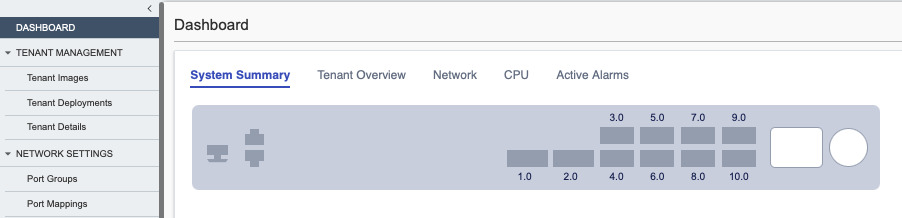
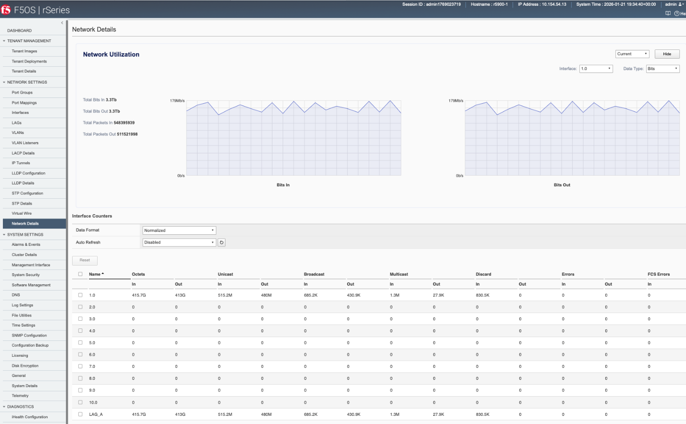
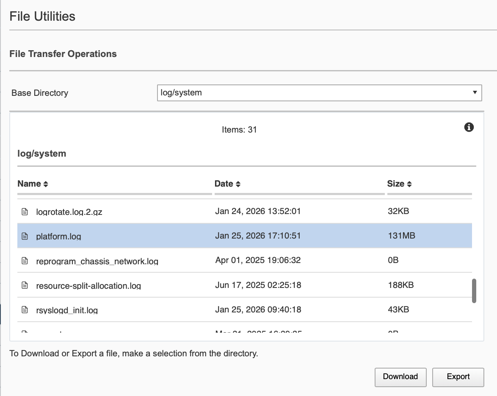
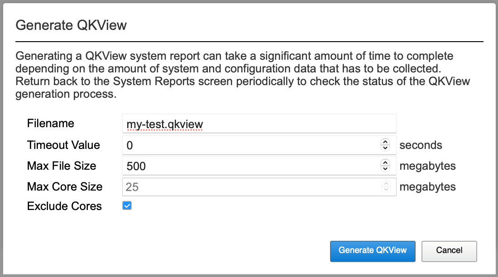

Exercise 3: Operations of F5OS and Tenants
==========================================

This lab will explore both the webUI and CLI interfaces demonstrating common operational tasks and troubleshooting of F5OS. When viewing information, there are places where the webUI will summarize and present data that would otherwise be part of multiple CLI commands, to maximize impact of a single screen of output. 

System Health
^^^^^^^^^^^^^

F5OS provides the platform for BIG-IP tenants to run on the appliance. Information regarding the health of the platform as a system is monitored in F5OS on rSeries. The Dashboard is the first place to look for high level information on system resource usage, network interface state, and if there are any active alarms. Browse and cycle through the 5 tabs. Are the tenant states reported as you expect? How are CPUs allocated?

 

When using the CLI, tab completion and pipes can format output and provide different views of output. As with any CLI, users will explore command tree structures as part of normal operations. Here are a few health/system related commands to begin with.

.. code-block:: none

   show system health summary
   show system alarm
   show system events
   show interfaces interface summary
   show components component cpu
   show components component platform state
   show components component fantray
   show components component psu-stats
   show components component psu-1 state
   
   

There is no EUD on F5OS platforms to potentially run, the equivalent is to run *show system health* which provides detailed output for F5 Support (this command is included in F5OS qkviews) 

Networking and Traffic on the Data Plane
^^^^^^^^^^^^^^^^^^^^^^^^^^^^^^^^^^^^^^^^

With the tenant up and running, there should be some background traffic running to the tenant. Validate this via the Tenant TMUI or CLI. If there is no traffic and your tenant is up and healthy, let a lab assistant know to help troubleshoot. 

From the tenant *tmsh* or even the *bash* shell, there are many ways to look at traffic, here are a few suggestions : 

- tmsh
.. code-block:: none
 
   root@(i5000-a)(cfg-sync Standalone)(Active)(/Common)(tmos)# show sys performance
   root@(i5000-a)(cfg-sync Standalone)(Active)(/Common)(tmos)# show ltm virtual

- bash shell

.. code-block:: none
   [root@i5000-a:Active:Standalone] config # bigtop -vname
   [root@i5000-a:Active:Standalone] config # tcpdump -enni 0.0 -c 10 port 443
   

From the tenant, we can see TMM processed traffic statistics, not network interface statitstics. The network layer is virtualized by the platform of F5OS. Looking at network interfaces in the tenant shows virtual paths to each TMM:

.. code-block:: none
   root@(i5000-a)(cfg-sync Standalone)(Active)(/Common)(tmos)# show net interface
   ------------------------------------------------------------------
   Net::Interface
   Name  Status    Bits   Bits    Pkts   Pkts  Drops  Errs      Media
                     In    Out      In    Out
   ------------------------------------------------------------------
   0.1       up    1.9M   1.8M    3.3K   3.3K      0     0  10000T-FD
   0.2       up    1.9M  26.4M    3.2K  70.0K      0     0  10000T-FD
   0.3       up    1.8M   1.8M    3.2K   3.2K      0     0  10000T-FD
   0.4       up    1.7M   1.7M    3.1K   3.1K      0     0  10000T-FD
   mgmt      up  448.8M   3.4M  228.5K   4.6K      0     0   100TX-FD

All layer 2 interface statistics for ports and trunks are monitored by F5OS. Details can be viewed in the F5OS webUI, viewed in the F5OS CLI, polling via SNMP or API interface calls.

In the webUI navigate to *Network -> Network Details*. This view shows stats on interfaces and LAGs in the lower section. Selecting an individual interface will display a graph of the traffic. For our lab interface 1.0 and 2.0 will carry traffic. Due to the nature of the lab traffic, the statistics between interfaces 3.0 and 4.0 may be unequal even though they are configured as LACP.

 

Within the CLI, the command *show interfaces interface | tab* view includes more information then shown in the above webUI view that requires a large amount of horizontal screen space to view.

The CLI command can be modified to show a subset of the columns to be viewed more easily in standard terminal sessions. Experiment with adding/removing other columns to customize your own view of this example command: 

.. code-block:: none
   r5900-1# show interfaces interface state | tab | de-select state forward-error-correction | de-select state mtu | de-select state counters in-broadcast-pkts | de-select state counters out-broadcast-pkts | de-select state counters in-multicast-pkts | de-select state counters out-multicast-pkts

LACP status can be seen on the *Network Settings -> LACP Details* screen or via CLI:

.. code-block:: none
   r5900-1# show lacp interfaces interface state

When troubleshooting an optical connection that has digital diagnostic monitoring (DDM) enabled, this is done witin F5OS on the rSeries, not in TMOS. This is done by viewing the portgroup information of the interface, which will output data such as optic type, vendor name, along with TX/RX power levels:

.. code-block:: none 
   r5900-1# show portgroups portgroup 3
   portgroups portgroup 1
   state vendor-name      "F5 NETWORKS INC."
   state vendor-oui       009065
   state vendor-partnum   "OPT-0031        "
   state vendor-revision  A1
   state vendor-serialnum "X61AN9U         "
   state transmitter-technology "850 nm VCSEL"
   state media            100GBASE-SR4
   state optic-state      QUALIFIED
   state ddm rx-pwr low-threshold alarm -14.0
   state ddm rx-pwr low-threshold warn -11.0
   state ddm rx-pwr instant val-lane1 -0.26
   state ddm rx-pwr instant val-lane2 -0.31
   state ddm rx-pwr instant val-lane3 -0.13
   state ddm rx-pwr instant val-lane4 -0.69

For advanced troubleshooting of traffic flows, *tcpdump* is a powerful tool. Most of the time, it is executed within the tenant which provides extended information using F5 trailers, however occasionally it may be useful to run a filtered packet capture from the F5OS command line.

With some background HTTP and HTTPS traffic running to the tenant we can compare the output from both layers. Start by opening a ssh session into both the F5OS and tenant, then execute the following two *tcpdump* commands in parallel. Match the host IP to the VIP from your tenant

F5OS:

.. code-block:: none
   r5900-1# system diagnostics tcpdump -i LAG_20G -c 20 host <VIP address in your Tenant> and port 80
Tenant:

.. code-block:: none
   [root@i5000-a:Active:Standalone] config # tcpdump -nni 0.0 -c 20  host <Virtual Server IP in your Tenant> and port 80

This filter matches a single client IP address being used by the traffic generator to help limit output. The output should be different between the two layers for this traffic.

Why would the packets capture for this be different at the tenant layer than F5OS?

Here are some samples of the above captures:

.. code-block:: none 
    BVL will update this section to include the why: the ePVA offloaded flow will only show SYN/FA/A packets, F5OS wills how the entire conversation

   Need to get filter correct for sample test traffic from Jim's tools, if its randomizing in a range we should catch it quickly. Idea is to not flood a lot of packets, just get a single flow>

System Software
^^^^^^^^^^^^^^^

F5OS provides the platform layer for rSeries and VELOS systems. Periodic maintenance is required in the form of software upgrades for features releases and security patches. 

Navigate to *System Settings -> Software Management*. Within this view, click the **Show** buttons to expand all information. Within this screen we can see all F5OS files available on the file system, what version is **In Use**, and the versions for firmware of any sub system.

The *Cluster Install Status* will show if there are any active platform layer installs taking place which would prevent the system from being fully active and ready for tenant operations.

From the command line: 

.. code-block:: none

   show system image
   show images image
   show system install
   show cluster install-status
   

Logs and Support Information
^^^^^^^^^^^^^^^^^^^^^^^^^^^^

Unlike TMOS which is based off a Linux management subsystem, F5OS is a Kubernetes based platform. Log files exist within the platform based on various subsystems which can be used to spot check for items or aggregated as part of a qkview to share with iHealth or F5 Support. 

Navigate to *System Settings -> Log Settings* and click the Show button for Software Component Log Levels. If needed, log levels of software services can be altered here, or within the CLI by configuring the service:

.. code-block:: none

   r5900-1# config
   r5900-1(config)# system logging sw-components sw-component platform-mgr config severity DEBUG
   r5900-1(config)# commit
   

The F5OS webUI does not currently support viewing or searching log files, instead individual log files can be downloaded by navigating to *System Settings -> File Utilities*. This screen allows for downloading and copying (exporting) some files to other systems, along with viewing the status current and previous file system operations. Use the Base Directory dropdown to select different locations on the file system for log files, such as *log/system* which has the location of the *platfrom.log* file. 

 

The F5OS CLI does contain interfaces to show log files. When coupled with *match* commands, log files can be quickly searched. The CLI command begines with *file list path*, flollowed by using tab completion to view options for directories and paths. 

.. code-block:: none
   r5900-1# file list path log/system | include name

For example, suppose we want to find a history of all F5OS boot sequences which shows each typme the rSeries has booted/restaretd.  We know the *platform.log* file has a **BOOT-MARKER** log line that appears on boot up. 

This command would show the first occurence, but not every occurance. How can we alter this command to see the last time the system was booted? To show all boot times? 

.. code-block:: none
   r5900-1# file show log/system/platform.log | begin BOOT | until BOOT

Like TMOS, F5OS utilizes a qkview as the collection of information for support engineers or iHealth to analyze. F5OS has been designed to generate and download qkviews locally, be uploaded directly to iHealth using tokens, or to transferred off the device via secure file transfer protocols, which is different than the XUI or ssh/bash interface for TMOS qkviews.

Start by navigating to the *Diagnostics -> System Reports*. This screen shows any currently stored qkview files by name and generation date along with logs of any uploaded to iHealth directly from the BIG-IP. To generate a new qkview, click the **Generate QKView** button. New to F5OS is the pop up box below that allows for optional collection settings:

 

From the CLI, the same qkview can be generated with the following:

.. code-block:: none
   r5900-1# system diagnostics qkview capture exclude-cores true filename my-test.qkview

Additional tools from the command like allow to see the running status of the qkview utility:

.. code-block:: none
   r5900-1# show system diagnostics qkview state status

To view the qkview completion percentage updated every 10 seconds: 

.. code-block:: none
   r5900-1# show system diagnostics qkview state status percentage | repeat 10

 Team: space to put any additional operational/intersting items for the students to perform here>

//End of Exercise 3
