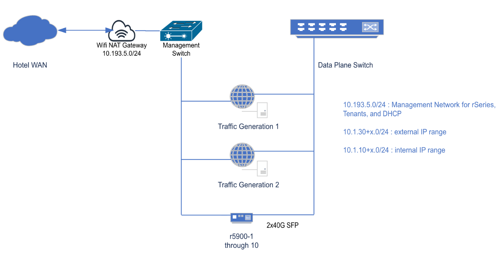

Intro
=====

.. contents::
   :depth: 2
   :local:

Intro to F5OS : Migrating to rSeries
====================================

Welcome to the F5OS Migration rSeries lab! In this lab, you will explore the F5OS-A platform layer used by the rSeries appliances and follow a step-by-step example of migrating an iSeries configuration to an rSeries BIG-IP tenant. 

Students in this lab will pair up as necessary to an assigned BIG-IP rSeries system. 

This guide will present both webUI and CLI examples for configuration elements where applicable, choose what you prefer. 

Intro to F5OS : Migrating to rSeries	2
Lab Information	2
Exercise 1: Initial Setup	4
Exercise 2: Tenant Creation and Migration	18
Exercise 3: Operations of F5OS and Tenants	24
System Health	24
Networking and Traffic on the Data Plane	25
System Software	27
Logs and Support Information	28

Lab Information
---------------

This lab is designed to be self-contained, with a single management VLAN that is shared with your laptops, and data plane VLANs that are internal to the lab only (no external access).  Below is a high-level diagram of the components. 

Connect to the WiFi accesspoint Network: rSeriesLab password: Appworld26

This access point connects your laptop to the private management VLAN to get to all rSeries devices as well as provided general Internet access. 
 

Record your assigned rSeries station number which is 1 through 10.  This number will be used as an offset for IP addressing during the lab.

<Lab testers, pretend you are station 1 and 2 for testing. The two r5900s for testing are our 11th and 12th systems, so for testing the IPs are 10.193.5.21 and 22 (X+10), not .11 and .12 , otherwise the lab instructions should map to correctly for station offsets J > 

If you are working with a partner, one student will follow the A instructions and the other the B instructions in the lab guide for Exercise 1.  If you are working alone, perform both A/B sections in Exercise 1. 

Select A or B by flipping a coin (remember those?), Left/Right seating position, or perhaps a quick game of rock-paper-scissors. 

Passwords used in configuration and authentication in this lab will be:  Appworld26

At this time, your rSeries appliance has only a management IP address and the admin password configured. To log into your assigned rSeries device, add 10 to your station number and use the 10.193.5.0/24 subnet. For example, station 8 will access the rSeries GUI and CLI at 10.193.5.18.

When accessing the CLI of the rSeries, use the admin user. If using the root user to login, the F5OS CLI can then be accessed by running su admin.
