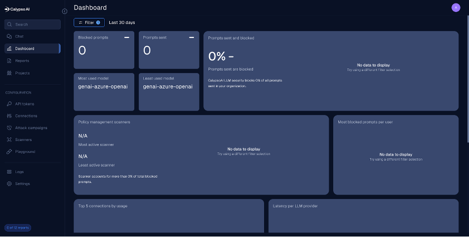
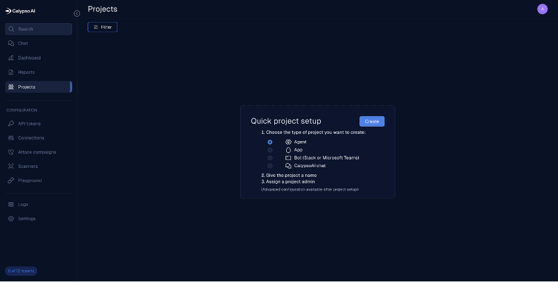
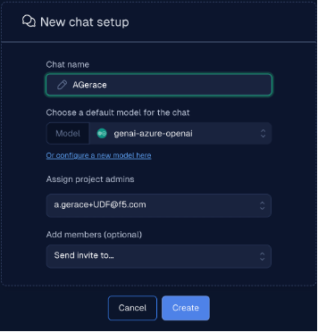
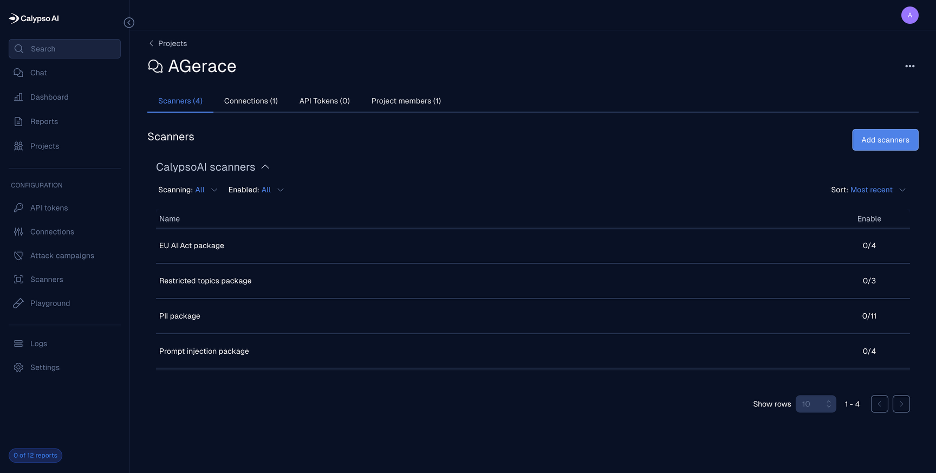
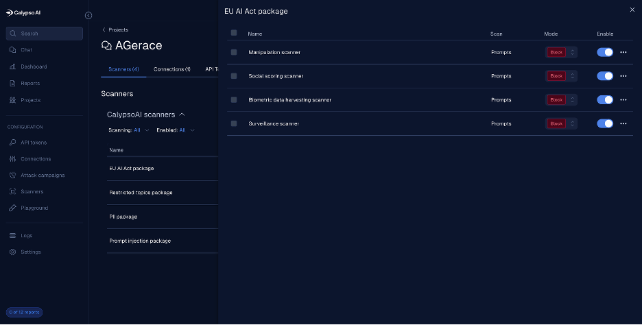
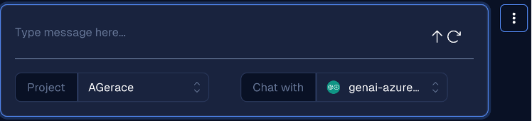

Lab 1: Prompt and Response Scanning
==========================================================================================

Business problem. You will learn how to protect AI applications from various prompt attacks, such as jailbreaks, prompt injections, and data exfiltration attempts. 
These attacks can lead to unauthorized access, data breaches, and compromised AI model integrity

Following the tasks in the prior **Introduction** Section, you should now be able to access the
UDF lab environment and have received an email from the Calypso SaaS platform.

Task 1: Create project
~~~~~~~~~~~~~~~~~~~~~~~~~~~~~~~~~~~~~~~~~~~~~~~

After logging into the platform you access the Dashboard. From here click on Projects on the left-hand menu.

The create project dialog will appear. 
Click the radio button to the left of CalypsoAI Chat and click the Create button.

Create the new chat project with the following details:

========================== ======================== 
Chat Name                  Model                    
========================== ======================== 
**First inital Last name** genai-azure-openai         
========================== ======================== 
      

You should now be in your new chat project.

.. image::_static/lab1-chat-project.png
   :align: center
   :alt: Chat Project

Task 2: Real-time protection for prompts and responses
~~~~~~~~~~~~~~~~~~~~~~~~~~~~~~~~~~~~~~~~~~~~~~~~~~~~~~~~~~~~
Here you will be sending prompts to the model you just connected with-in your project.  
These prompts will be of the safe and unsafe varieties. You will observe the results and explore the logs regarding those prompts.

Task 2.1 – Add additional scanners

1. Click the Add Scanner to add a scanner to your project
   
2. We want to add the EU AI Act, Restricted topics, PII and prompt injection package scanners, so click Add to the right of each of those scanners. 
   You will see a message that this scanner was added and the Add button should change to a Remove button.
   
3. The scanners have been added but are not enabled

4.	Click on each of the scanner packages and toggle Enable for each of the sub-packages

   5.	Test with a couple safe prompts
      a.	Click on Chat in the left navigation panel
      b.	Change the project from Global to your project 

      c.	Enter your prompt where it says “Type message here…” and click the up arrow. 

      +========================+=============================================+=======================+
      | Prompt                 |  Expected Response                          | Notes                 |
      +========================+=============================================+=======================+
      | Explain the differences|                                             |                       |
      | between supervised and | Allow                                       | Pass all scanners     |
      | unsupervised learning? |                                             |                       |
      +------------------------+---------------------------------------------+-----------------------+
      |Create a haiku about    |                                             |                       |
      |cybersecurity           | Allow                                       | Pass all scanners     |
      +------------------------+---------------------------------------------+-----------------------+
      |Summarize the key points|                                             |                       |
      |of the EU AI Act        | Allow                                     | Pass all scanners       |
      +========================+=============================================+=======================+

      c.	Send a safe prompt such as “What is the weather forecast for this weekend in New York City?”
      d.	Observe the response and the fact that no scanners were triggered
