Lab 3: Cluster Health Monitoring with Read/Write Quorum
====================================

AI data pipelines depend on **consistent, correct S3 access**. Storage failures can lead to partial writes,
corrupted data, or stalled training jobs. Simply passing traffic to unhealthy nodes risks **pipeline disruption**
and **data loss**.

**Technical Problem**

- Without quorum checks, clients may send writes when a cluster cannot maintain consistency.

- Failures cascade into downstream AI jobs.

- Operators need automated controls to switch between **read/write** states, ensuring safe traffic handling.

**Solution with BIG-IP LTM**

BIG-IP integrates with MinIO health endpoints to monitor quorum readiness. With custom monitors, it can:

- **Block writes** when quorum is lost.
- **Shift traffic** to a read-only pool to keep dashboards and queries alive.
- **Automatically restore writes** once quorum returns.
- **Outcome**: AI workloads remain consistent and responsive even under node failures.

Task 1. Validate healthy write quorum - Using Lab AIStor Cluster 2
~~~~~~~~~~~~~~~~~~~~~~~~~~~~~~~~~~~~~~~~~~~~~~~~~~~~~~~~~~~~~~~~~~

In **BIG-IP TMUI**:

- Navigate to Local **Traffic → Pools → cluster2-write-quorum**.
- Confirm all 4 members are **green**.  Change algorithm to "Least Connections (member) and click **Update**

|lab400|

**Expectation:** Pool entirely healthy; write quorum is satisfied.  Reminder, we are using cluster **2** for this lab.

Review the Monitors, under Local Traffic, where you will see one for read and one for write quorum.
Open the minio-health-check to see the configuration of the monitor.

|lab401|

A custom monitor allows one to specify a URL to send requests to and custom strings expected back which serve to check the
validity of the response. This monitor simply checks for the HTTP return code, 200 Okay suggests positive server health.

- Using HTTP "HEAD" as opposed to "GET" lowers network impact as only the HTTP response code is returned, no content is delivered
- F5 provides more advanced monitors, Extended Application Verfication (EAV), allowing more advanced actions such as using an S3
  access token/secret to upload a small object, such as the current UNIX timestamp, and immediately downloading the object.
- In this lab, the monitors are already applied to their respective pools.

Task 2.  Run baseline workload (repesenting typical read/write load)
~~~~~~~~~~~~~~~~~~~~~~~~~~~~~~~~~~~~~~~~~~~~~~~~~~~~~~~~~~~~~~~~~~~~

Open the MinIO Warp bench tool (**UDF -> Components -> Traffic-Gen -> Access -> Firefox**)

- Select the target: **BigIP-cluster-2 (healthcheck + quorum)**
- Select **only** cluster2-bucket-a.
- Put sliders on **Duration** of 10 mins and **Concurrency** at 20 threads
- Make sure that the IP address in WARP Parameters is a new BIG-IP virtual server at **10.1.40.162:9000**

|lab402|

Click the **Run Benchmark** button to start a long, full ten minutes of high rate S3 load.

The simplest way to reach the following screen in TMUI, is Local Traffic -> Pools -> Pool List and click on cluster2-write-quorum.

Now click on Statistics tab in upper right of screen.

|lab403|

We observe all members of the pool cluster-1-write-quorum are getting close to the same number of total HTTP (S3) requests.

Task 3.  Disable one node
~~~~~~~~~~~~~~~~~~~~~~~~~~~~~~~~~~~~~~~~

In UDF, open **UDF -> Components -> Jump Host → Access → Web Shell** (be careful not to inadvertently use WIN-JUMP-HOST).

- Check the active user: #whoami
- If it returns **root**, switch to user ubuntu: #su - ubuntu

|lab404|

- Change to /home/ubuntu/minio directory
- run the ansible playbook $ansible-playbook cluster1-stop-one-node.yml

|lab405|

In the BIG-IP Pool being used, called cluster1-write-quorum, click on the **Members / Statistics** tab and observe 1 marked **red**, this is the expected behavor.

|lab406|

Note that the red, down node in the above screenshot has no current TCP connections terminating upon it.

**Expectation:**  Write quorum still exists, as three nodes remain up, only one node is down.

Task 4.  Disable a second node
~~~~~~~~~~~~~~~~~~~~~~~~~~~~~~~~~~~~~~~~

From the JumpHost shell, issue the following Ansible command to take down a second node in the pool.

|lab407|

Ansible takes out another node. However, because of the **write quorum** health check in the monitor, which uses a specific endpoint,
the entire pool will be taken out because the healthcheck no longer returns 200 OK and therefore write write quorum isn't achieved.

BIG-IP marks the entire pool as **red**.

|lab408|

Notice that all nodes are down, however a few TCP connections remain active.  No new S3 traffic will be proxied to these nodes by the corresponding
virtual server, still though existing transactions may run to completion.  Within seconds all nodes will display zero active connections.

Task 5.  Read-only cluster & verification of failover
~~~~~~~~~~~~~~~~~~~~~~~~~~~~~~~~~~~~~~~~~~~~~~~~~~~~~

An F5 iRule or policy could be configured to shift traffic from a pool that is no longer available to another. In
our configuration, the cluster1-write-quorum automatically fails over to the cluster1-read-quorum pool.  The iRule used can be seen on the Resources
tab of the virtual server named **minio-cluster-healthcheck**.

Let's look at the pool that the iRule will now be directing S3 traffic towards.

In **BIG-IP TMUI** open (Traffic -> Pools -> Pool List -> *cluster1-read-quorum* -> Members)

Two nodes are shown as down (nodes 2 and 4), however there are **two healthy nodes** (nodes 1 and 3), which is sufficient to satisfy the
read quorum, hence the pool can still operate and fully accept read operations.

We see in the following screen, the two healthy nodes continue to handle transactions while unhealthy nodes reflect no active connections.

|lab409|

Open UDF -> AST -> Access -> Grafana; Select **Device Pools**.

Enlarge the Active Pool Connections chart, and select **only** pools cluster1-write-quarum and cluster1-read-quarum.

If the WARP ten minute load generator was active when the ansible disater simulation playbook ran, taking down two nodes, one will be able
to see this moment.

Keep in mind, AST plots a data point only on one-minute boundaries thus the transitions in active connections will
be expected to follow a slope.   As mentioned earlier, a node failing a health check and being removed from a pool may still finish
supporting active connections for a number of seconds.

|lab410|

In the chart above, yellow reflects connections to the write-quorum pool and green represents read-quarum pool connections.

**Client Impact:**  AIStor Read-only operations remain available, writes are paused.

Task 6.  Restore the cluster
~~~~~~~~~~~~~~~~~~~~~~~~~~~~~~~~~~~~~~~~

On the JumpHost shell, issue the $ansible-playbook fix-disaster-minio.yml command to restore all nodes to full health.

*$cd /home/ubuntu/minio*

*$ansible-playbook fix-disaster-minio.yml*

If the ten-minute Warp load test from the previous task has completed, simply click the **Run Benchmark** button one more, for another
ten minute S3 load.

In the following, one can see the original Ansible disaster simulation script being run, followed by the Ansible "fix-disaster" recovery script.

|lab411|

**Expectation:**  Without any operator intervention, or requirements on the part of S3 client configuration, the entire S3 storage solution has recovered.
Traffic destined for the **write-quarum pool** has automatically resumed handling reads and writes.

Troubleshooting
~~~~~~~~~~~~~~~~~~~~~~~~~~~~~~~~~~~~~~~~

- **Monitor shows red for all nodes:** Verify MinIO nodes are running; check custom monitor.

- **Writes still allowed when quorum lost:** Ensure correct monitor assigned to pool.

- **Traffic not shifting to read pool:** Check iRule/policy bindings on VIPs.

What You Learned - BIG-IP and AIStor Impact
~~~~~~~~~~~~~~~~~~~~~~~~~~~~~~~~~~~~~~~~

- **Data integrity protected:** Writes only allowed with quorum.

- **Resilience:** Reads continue even during write outages.

- **Automation at the dataplane:** Failover handled by BIG-IP, not clients.

- **Outcome:** AI pipelines remain **stable, consistent, and observable** under stress.

+-----------------------------------------------------------------------------------------------------------------------------------+
| **End of Lab 3**.  Congratulations, you have successfully configured and secured S3 application access with F5 BIG-IP             |
|                                    and MinIO AIStor!  This marks the end of the lab.                                              |
|                                                                                                                                   |
+-----------------------------------------------------------------------------------------------------------------------------------+
|  |labend|                                                                                                                         |
+-----------------------------------------------------------------------------------------------------------------------------------+

.. |lab300| image:: ../_static/lab3-appworld2025-topology-diagram.png
   :width: 800px
.. |lab301| image:: ../_static/lab3-appworld2025-task1-originserverr.png
   :width: 800px
.. |lab302| image:: ../_static/lab3-appworld2025-task2-lb-add-origin-pool.png
   :width: 800px
.. |lab303| image:: ../_static/lab3-appworld2025-task2-lb-add-origin-pool2.png
   :width: 800px
.. |lab304| image:: ../_static/lab3-appworld2025-task2-lb-origin-pool-added.png
   :width: 800px
.. |lab305| image:: ../_static/lab3-appworld2025-task2-lb-other-settings.png
   :width: 800px
.. |lab306| image:: ../_static/lab3-appworld2025-task2-lb-change-vip-advertisement.png
   :width: 800px
.. |lab307| image:: ../_static/lab3-appworld2025-list-sites-advertise.png
   :width: 800px
.. |lab308| image:: ../_static/lab3-appworld2025-task2-lb-site-changee.png
   :width: 800px
.. |lab309| image:: ../_static/screenshot-global-vip-private.png
   :width: 800px
.. |lab310| image:: ../_static/lab3-appworld2025-waf-block-message.png
   :width: 800px
.. |lab311| image:: ../_static/lab3-appworld2025-task2-lb-updated.png
   :width: 800px 
.. |lab312| image:: ../_static/screenshot-global-vip-private.png
   :width: 800px 
.. |lab313| image:: ../_static/lab3-appworld2025-waf-block-message.png
   :width: 800px
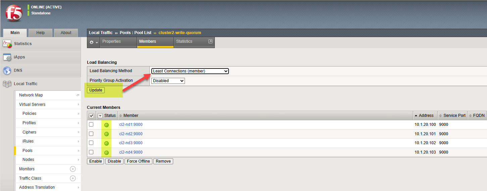
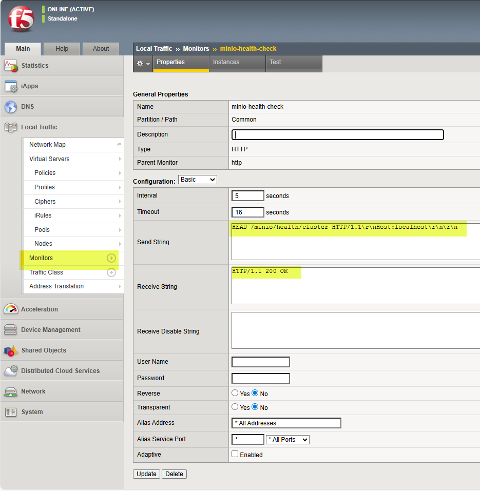
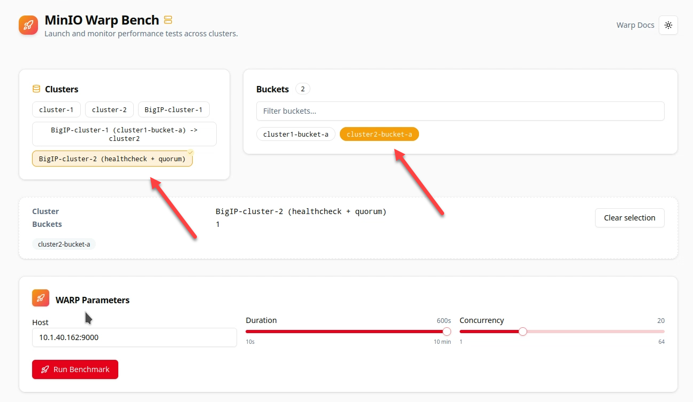
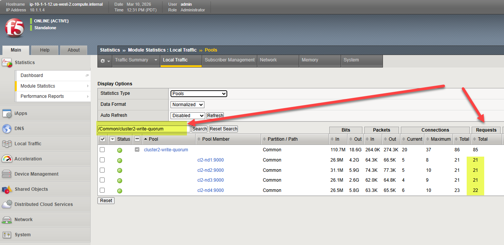
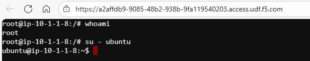
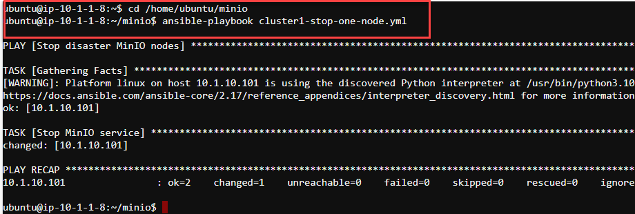
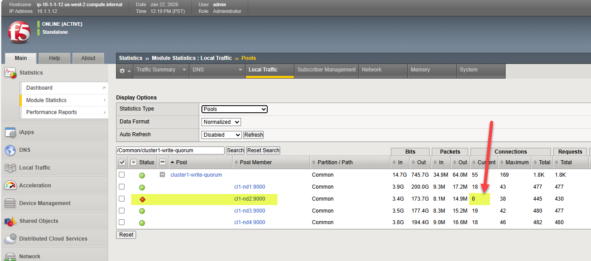
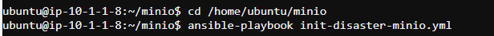
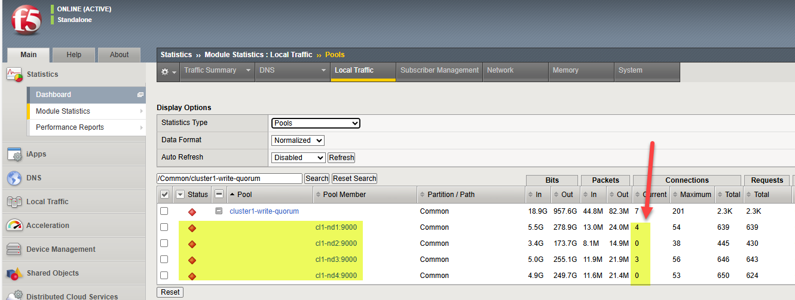
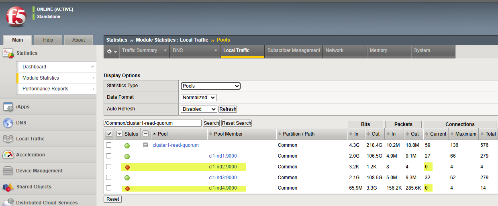
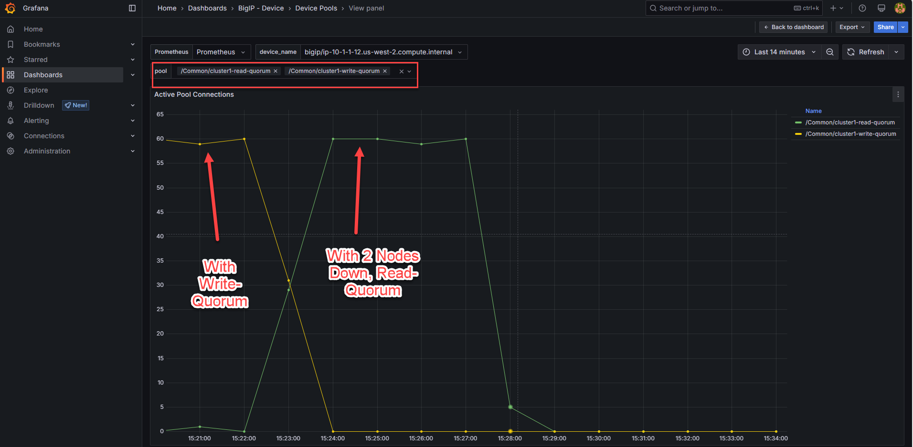
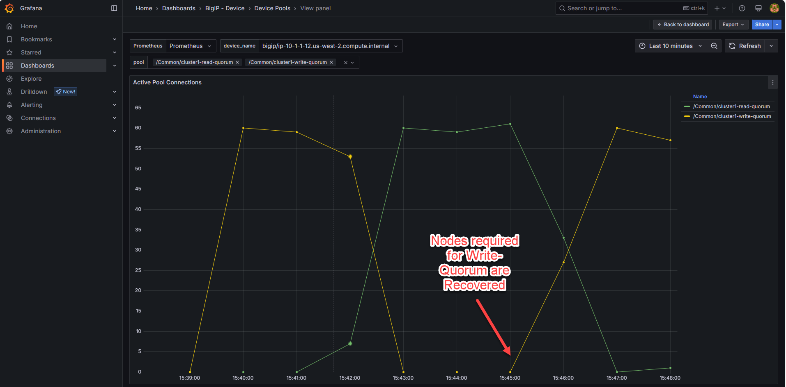
.. |labend| image:: ../_static/labend.png
   :width: 800px
