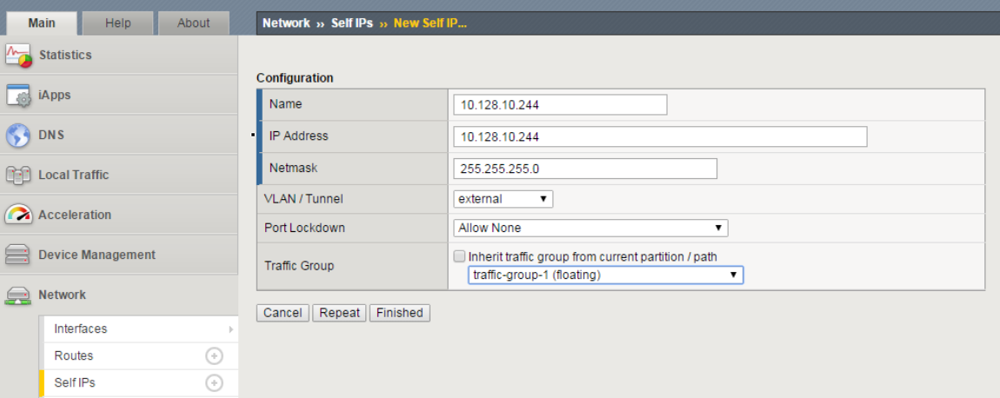
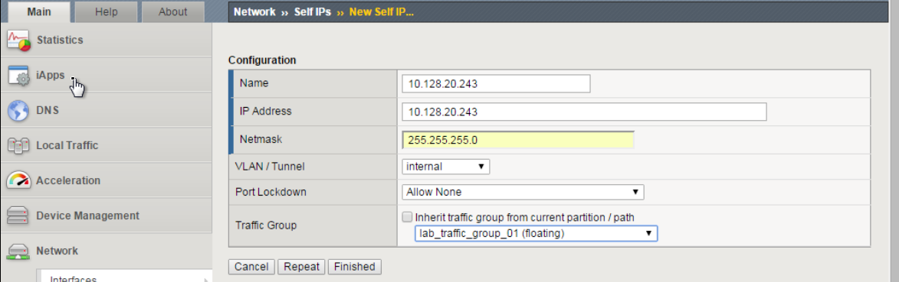
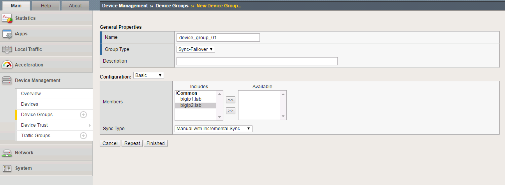
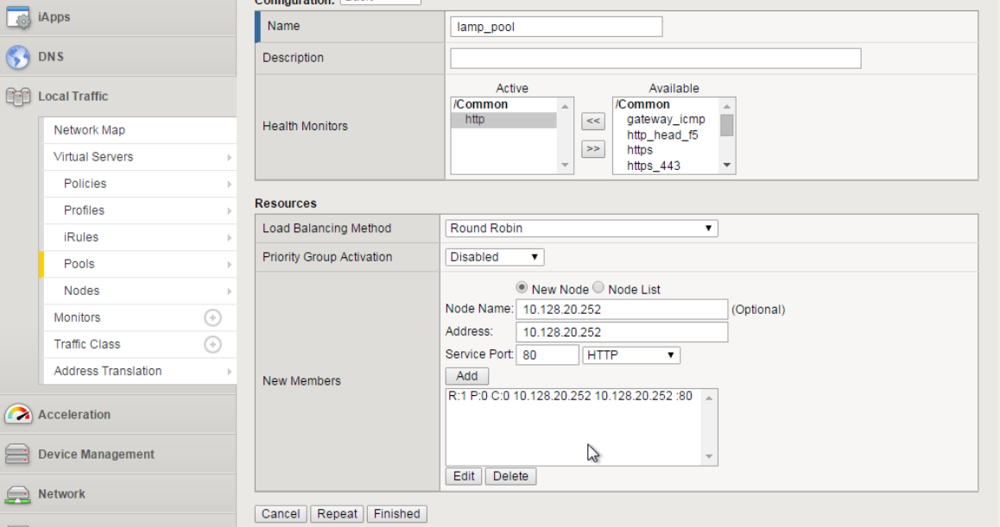
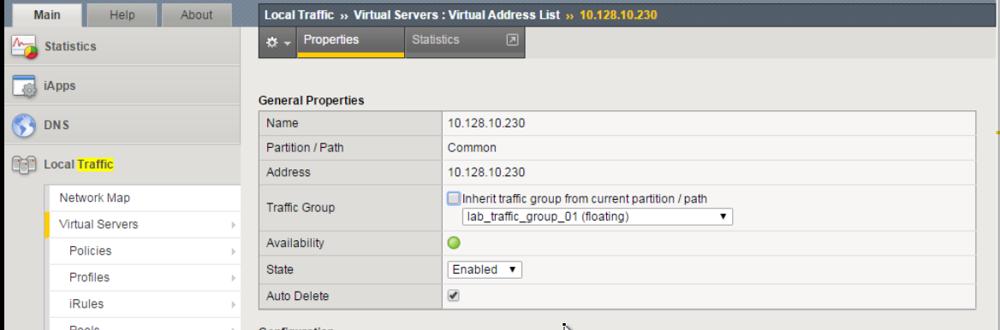
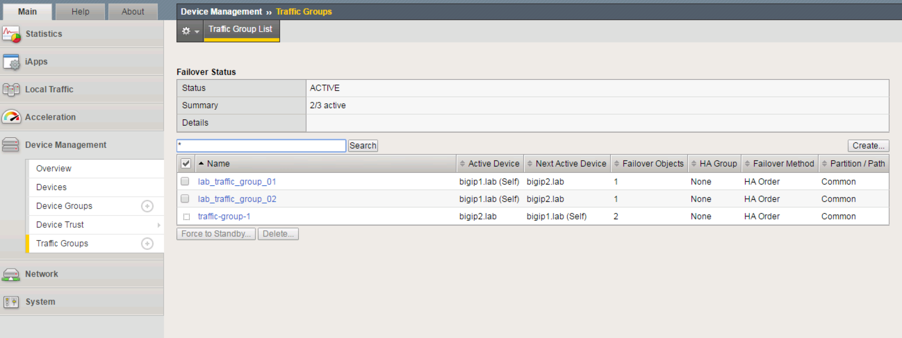

Lab 1: Active/Active ScaleN Clustering Exercise
------------------------------------------------

Configuration of active/active device cluster utilizing multiple traffic
groups.

**Objective:**

-  Create a two node cluster, with a traffic groups active on both
   BIG-IPs.

-  Create two standard virtual servers. Both virtual servers must be
   active on a different BIG-IP in the cluster.

**Prerequisites and Notes:**

    To save some time, both VE images have been provided for you. They
    are licensed, and have basic network connectivity established on the
    three VLANs listed below.

    1.1 = External Network Interface (WAN Side)

    1.2 = Internal network interface (LAN Side)

    1.3 = High Availability Network Interface \*not yet configured

    The following is the IP addressing scheme for every student.

    External: 10.128.10.0/24

    Internal: 10.128.20.0/24

    HA: 192.168.1.0/24

**Lab Requirements:**

-  Configure Floating Self-Ips

-  Create HA VLAN

-  Create additional Traffic Group

-  Build a Device Service Cluster

-  Create a pool of web servers

-  Create three virtual servers

-  Test failover

TASK 1 – Configure Floating Self-IP’s
~~~~~~~~~~~~~~~~~~~~~~~~~~~~~~~~~~~~~

Open Chrome on the Windows jump box. Connect to bigip1.

https://10.128.1.245 (accept certificate error)

Username: admin

Password: admin

Create Floating Self-Ips.

Go to Network -> Self Ips -> Create.

Create a Floating Self IP for External VLAN. Use 10.128.10.244 for both
the Name as well as the Address. Netmask will be 255.255.255.0. Port
lockdown = Allow None, Traffic group will be traffic-group-1 (floating).

|image1|

|image2|

Click Finished.

Create a floating Self IP for Internal VLAN. Use 10.128.20.244 for both
the Name as well as the Address. Netmask will be 255.255.255.0. Port
lockdown = None, Traffic group will be traffic-group-1 (floating).

Click Finished.

**→NOTE:** Although Self IP’s (non-floating) must be created on both
F5’s in a cluster (which was already completed for you), the creation of
Floating Self IP’s only needs to occur on a single F5, as they will
“float” to the other F5 after HA has been successfully completed.

TASK 2 – Create HA VLAN
~~~~~~~~~~~~~~~~~~~~~~~

Create HA VLAN

Go to Network -> VLANs -> VLAN List -> Create. Name = ha, Interface =
1.3 (untagged).

|image3|

Click Finished.

Repeat the above steps to create the ha vlan on bigip2.

Create one Self IP on bigip1 and one on bigip2 for ha vlan.

On bigip1, Go to Network -> Self IP’s -> Create. Name = 192.168.1.10, IP
Address = 192.168.1.10, Netmask = 255.255.255.0, VLAN = ha, Port
Lockdown = Allow Default, Traffic Group = traffic-group-local-only
(non-floating). Click Finished.

|image4|

On bigip2, Go to Network -> Self IP’s -> Create. Name = 192.168.1.11, IP
Address = 192.168.1.11, Netmask = 255.255.255.0, VLAN = ha, Port
Lockdown = Allow Default, Traffic Group = traffic-group-local-only
(non-floating)

**→NOTE:** It is critical the Self-IP on each big-ip be set to Allow
Default for the ha VLAN. This is because failover communication will be
configured to use those IP’s in an upcoming task.

TASK 3 – Create Traffic Groups and Additional Floating Self-IP’s
~~~~~~~~~~~~~~~~~~~~~~~~~~~~~~~~~~~~~~~~~~~~~~~~~~~~~~~~~~~~~~~~

Create 2 new traffic groups on bigip1.

Go to Device Management -> Traffic Groups -> Create. Name =
lab\_traffic\_group\_01. MAC Masquerade = 02:00:00:01:00:00. Failover
Method = Failover using Preferred Device Order and then Load Aware.

Click Create Traffic Group.

Go to Device Management -> Traffic Groups -> Create. Name =
lab\_traffic\_group\_02. MAC Masquerade = 02:00:00:02:00:00. Failover
Method = Failover using Preferred Device Order and then Load Aware.

Click Create Traffic Group.

Create additional Floating Self-IP’s for the Internal VLAN for each
traffic group.

|image5|

Create a floating Self IP for Internal VLAN. Use 10.128.20.243 for both
the Name as well as the Address. Netmask will be 255.255.255.0. Port
lockdown = Allow None, Traffic group will be lab\_traffic\_group\_01
(floating).

|image6|

Create a floating Self IP for Internal VLAN. Use 10.128.20.242 for both
the Name as well as the Address. Netmask will be 255.255.255.0. Port
lockdown = Allow None, Traffic group will be lab\_traffic\_group\_02
(floating).

TASK 4 – Configure Device Connectivity for HA Communication
~~~~~~~~~~~~~~~~~~~~~~~~~~~~~~~~~~~~~~~~~~~~~~~~~~~~~~~~~~~

Go to Device Management -> Devices -> select your device (bigip1).
Choose ConfigSync tab. Under Local Address, choose the HA address and
click Update.

Additionally, configure Network Failover. From the Failover Network tab,
choose Add. Add both the Management address as well as the HA VLAN
address.

**→IMPORTANT:** Perform both of the above steps on bigip2 as well.

On bigip1, add bigip2 to Peer List. Go to Device Management -> Device
Trust -> Device Trust Members.

|image7|

Click Add. Add the second F5’s Management Address. Click Retrieve Device
Information.

|image8|

Click Device Certificate Matches.

Click Add Device

Click on Device Management -> Devices. You will now see both F5’s.

|image9|

Create Device Group. Go to Device Management -> Device Groups -> Create.
Name = device\_group\_01. Group type = Sync-Failover. Add both devices
as Members.

|image10|

Click Finished.

You must now perform initial sync.

Click Awaiting Initial Sync in upper left corner.

|image11|

Select bigip1.lab (Self), and then choose Push the selected device
configuration to the group.

|image12|

Click Sync. You will notice the change in the upper left status to “In
Sync.”

TASK 5 – Create Web Server Pool and Virtual Servers
~~~~~~~~~~~~~~~~~~~~~~~~~~~~~~~~~~~~~~~~~~~~~~~~~~~

Create a web server pool. Go to Local Traffic -> Pools. Create. Name =
lamp\_pool, Health Monitor = http. Add the following Nodes: Node Name
and Address = 10.128.20.11, Port 80, Node Name and Address =
10.128.20.12, Port 80, Node Name and Address = 10.128.20.13, Port 80.
Click Add.

|image13|

Click Finished.

Create 2 Virtual Servers. Go to Local Traffic -> Virtual Servers,
Create.

Name = http\_vs\_01. Destination (Host) = 10.128.10.230, Port 80.
Default Pool = lamp\_pool. Change Source Address Translation (SNAT) to
Auto Map. Click Finished.

Name = http\_vs\_02. Destination (Host) = 10.128.10.231, Port 80.
Default Pool = lamp\_pool. Change Source Address Translation (SNAT) to
Auto Map. Click Finished.

|image14|

Sync your configuration.

TASK 6 – Configure Virtual Servers for Different Traffic Groups and Simulate Failover
~~~~~~~~~~~~~~~~~~~~~~~~~~~~~~~~~~~~~~~~~~~~~~~~~~~~~~~~~~~~~~~~~~~~~~~~~~~~~~~~~~~~~

Reconfigure the new Virtual Servers so that they reside in the 2 new
traffic groups.

Go to Local Traffic -> Virtual Servers -> Virtual Address List.

Click on 10.128.10.230 – change Traffic Group to
lab\_traffic\_group\_01.

|image15|

Click Update.

Perform the same procedure for 10.128.10.231, but place in
lab\_traffic\_group\_02.

Sync Configuration

Check which objects are in each Traffic Group by going to Device
Management -> Traffic Groups, select a group, and choose Failover
Objects.

You will now simulate a failover within the Active/Active cluster.

Go to Device Management -> Traffic Groups.

Take note of which devices are currently servicing each Traffic Group.
If 1 device is servicing a particular traffic group, and the other
device is servicing another traffic group, you will see that both bigip1
and bigip2 list their status as ACTIVE in the GUI.

|image16|

From bigip1, choose any Traffic Group which is currently active on it.

|image17|

Select Force to Standby to manually fail this traffic group over to
bigip2.

**→NOTE:** This is failing over the traffic group only, not the device.
When all traffic groups have been failed-over to bigip2, bigip1 will be
STANDBY, and bigip2 will be ACTIVE.

Why does bigip1 display as STANDBY when we never failed it over at the
device level?

Are all VIP’s still accessible?

What are some practical, real-world examples for what we just
configured?

.. |image0| image:: media/image1.emf
   :width: 7.62431in
   :height: 9.88002in
.. |image1| image:: media/image3.png
   :width: 6.50000in
   :height: 2.50069in

.. |image3| image:: media/image5.png
   :width: 6.66667in
   :height: 3.38542in
.. |image4| image:: media/image6.png
   :width: 6.67708in
   :height: 3.03125in

.. |image6| image:: media/image8.png
   :width: 6.50000in
   :height: 2.04097in
.. |image7| image:: media/image9.png
   :width: 7.05000in
   :height: 1.97292in
.. |image8| image:: media/image10.png
   :width: 7.05000in
   :height: 2.48194in
.. |image9| image:: media/image11.png
   :width: 6.50000in
   :height: 2.54236in

.. |image11| image:: media/image13.png
   :width: 6.50000in
   :height: 0.89931in
.. |image12| image:: media/image14.png
   :width: 7.05000in
   :height: 3.51667in

.. |image14| image:: media/image16.png
   :width: 6.50000in
   :height: 0.70278in

.. |image17| image:: media/image19.png
   :width: 7.05000in
   :height: 3.85625in
