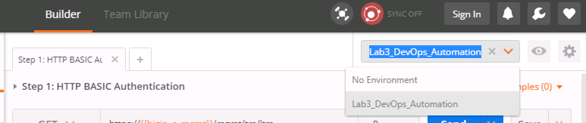
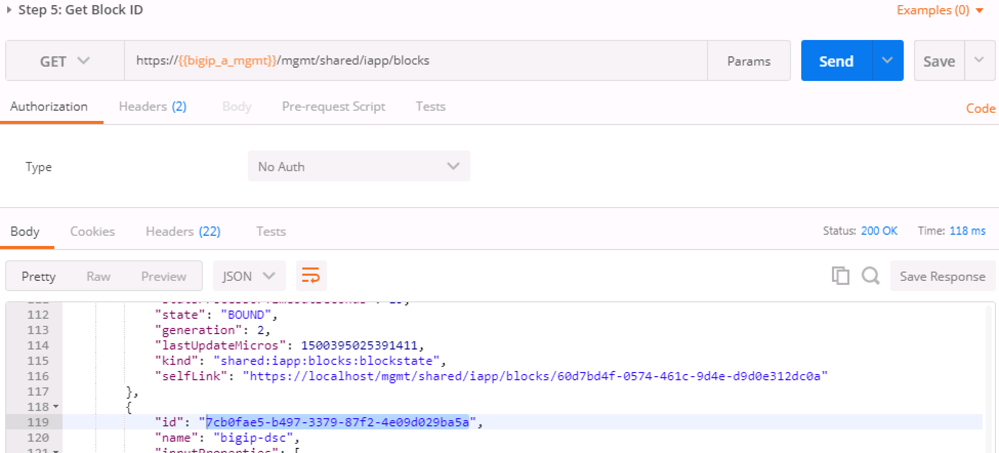
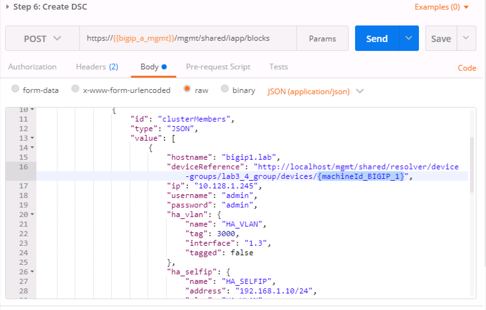

Lab 3 – Device Service Cluster Automation
=========================================

We'll be using POSTMAN and it is built upon Chrome libraries,
therefore, you must use Chrome to visit every BIG-IP login page (i.e.
http://10.128.1.245/) and bypass the security warning - otherwise the
REST calls will fail.  If you fail to bypass these security warnings 
because of the untrusted SSL certificate on the BIG-IP management
interface you will receive an error when attempting to send REST calls.

**Pre-lab work**

To start this lab, we'll want to start with a blank state again -
erasing all that hard work you've done. In order to do so, go to "SYSTEM
-> Archives" and then click on the UCS archive shown. Once it is up,
click to restore and start the process on both BIG-IP's in order to go
back to the default Lab configuration.

**Objective:** At a high level, we'll be building a simple
active/standby device service cluster (DSC), with some new DevOps
oriented packages that we've created, the heavy lifting will be taken
away, and we have some simple REST API calls to make. The high level
steps to do this are as follows:

1. Authenticate.  We'll show basic and token based authentication - but
we'll then use token authentication throughout the rest of the excercises.

2. Installation of the DevOps packages.  We'll SCP the packages to the BIG-IP's,
then via API, install them and verify they are installed.

3. Execute the device settings package in order to set the hostname,
device name, NTP server and NTP timezone.

4. Execute the DSC configuration package in order to create an
active/standby DSC.

Please note that when working with API's, generally once you create an
object it is done via a POST. If you try to modify an object by using
the POST method again, you will likely create another instance of what
you've done. Modifying is done via the PATCH HTTP method calling out the
same name/ID. There are a few "Optional" tasks created within POSTMAN
which you can experiment Unbinding and deleting application blocks.

TASK 1 – Authentication
~~~~~~~~~~~~~~~~~~~~~~~

One of the many basic concepts related to interaction with REST API’s is
how a particular consumer is authenticated to the system. BIG-IP and
iWorkflow support two types of authentication: HTTP BASIC and Token
based. It’s important to understand both of these authentication
mechanisms, as consumers of the API will often make use of both types
depending on the use case. This lab will demonstrate how to interact
with both types of authentication.

1. Open Postman from the Desktop and make sure the Environment is set to
   Lab3\_DevOps\_Automation

|image27|

TASK 2 – HTTP BASIC Authentication
~~~~~~~~~~~~~~~~~~~~~~~~~~~~~~~~~~

In this task we will use the Postman tool to send API requests using
HTTP BASIC authentication. As its name implies this method of
authentication encodes the user credentials via the existing BASIC
authentication method provided by the HTTP protocol. The mechanism this
method uses is to insert an HTTP header named ‘Authorization’ with a
value that is built by Base 64 encoding the
string <username>:<password>. The resulting header takes this form:

Authorization: Basic YWRtaW46YWRtaW4=

It should be noted that cracking the method of authentication is
TRIVIAL; as a result API calls should always be performed using HTTPS
(F5 default) rather than HTTP.

Perform the following steps to complete this task:

1. Open the Postman application from the link on the Desktop. Click the
   ‘Collections’ tab on the left side of the screen, expand the
   ‘Lab3\_DevOps\_Automation’ collection on the left side of the screen,
   expand the ‘Lab 3 Task 2/3 – API Authentication & ‘example’ folder:

|image28|

1. Click the ‘Step 1: HTTP BASIC Authentication’ item. Click the
   ‘Authorization’ tab and select ‘Basic Auth’ as the Type. Fill in the
   username and password (admin/admin) and click the ‘Update Request’
   button. Notice that the number of Headers in the Headers tab changed
   from 1 to 2. This is because Postman automatically created the HTTP
   header and updated your request to include it. Click the ‘Headers’
   tab and examine the HTTP header:

|image29|

1. Click the ‘Send’ button to send the request. If the request succeeds
   you should be presented with a listing of the /mgmt/tm/ltm Organizing
   Collection.

2. Update the credentials and specify an INCORRECT password. Send the
   request again and examine the response:

|image30|

TASK 3 – Token Based Authentication
~~~~~~~~~~~~~~~~~~~~~~~~~~~~~~~~~~~

One of the disadvantages of BASIC Authentication is that credentials are
sent with each and every request. This can result in a much greater
attack surface being exposed unnecessarily. As a result Token Based
Authentication (TBA) is preferred in many cases. This method only sends
the credentials once, on the first request. The system then responds
with a unique token for that session and the consumer then uses that
token for all subsequent requests. Both BIG-IP and iWorkflow support
token-based authentication that drops down to the underlying
authentication subsystems available in TMOS. As a result the system can
be configured to support external authentication providers (RADIUS,
TACACS, AD, etc) and those authentication methods can flow through to
the REST API. In this task we will demonstrate TBA using the local
authentication database, however, authentication to external providers
is fully supported.

For more information about external authentication providers see the
section titled “\ **About external authentication providers with
iControl REST**\ ” in the iControl REST API User Guide available
at \ `https://devcentral.f5.com <https://devcentral.f5.com/>`__

Perform the following steps to complete this task:

1. Click the ‘Step 2: Get Authentication Token’ item in the Lab 3.1
   Postman Collection

2. Notice that we send a POST request to
   the /mgmt/shared/authn/login endpoint.

|image31|

1. Click the ‘Body’ tab and examine the JSON that we will send to BIG-IP
   to provide credentials and the authentication provider:

|image32|

1. Modify the JSON body and add the required credentials (admin/admin).
   Then click the ‘Send’ button.

2. Examine the response status code. If authentication succeeded and a
   token was generated the response will have a 200 OK status code. If
   the status code is 401 then check your credentials:

**Successful:**

|image33|

**Unsuccessful:**

|image34|

1. Once you receive a 200 OK status code examine the response body. The
   various attributes show the parameters assigned to the particular
   token. Find the ‘token’ attribute and copy it into your clipboard
   (Ctrl+c) for use in the next step:

|image35|

1. Click the ‘Step 3: Verify Authentication Works’ item in the Lab 3.1
   Postman collection. Click the ‘Headers’ tab and paste the token value
   copied above as the VALUE for the X-F5-Auth-Token header. This header
   is required to be sent on all requests when using token based
   authentication.

|image36|

1. Click the ‘Send’ button. If your request is successful you should see
   a ‘200 OK’ status and a listing of the ltmOrganizing Collection.

2. We will now update your Postman environment to use this auth token
   for the remainder of the lab. Click the Environment menu in the top
   right of the Postman window and click ‘Manage Environments’:

|image37|

1. Click the ‘Lab3\_DevOps\_Automation’ item

2. Update the value for bigip\_a\_auth\_token by Pasting (Ctrl-v) in
   your auth token:

|image38|

1. Click the ‘Update’ button and then close the ‘Manage Environments’
   window. You’re subsequent requests will now automatically include the
   token.

2. Click the ‘Step 4: Set Authentication Token Timeout’ item in the Lab
   3.1 Postman collection. This request will PATCH your token Resource
   (check the URI) and update the timeout attribute so we can complete
   the lab easily. Examine the request type and JSON Body and then click
   the ‘Send’ button. Verify that the timeout has been changed to
   ‘36000’ in the response: |image39|

3. Repeat the same steps for setting the authentication token for BIG-IP
   2 into the environment variable bigip\_b\_auth\_token, ensuring the
   set the timeout as well.

TASK 4 – Install iApp RPM Packages
~~~~~~~~~~~~~~~~~~~~~~~~~~~~~~~~~~

In this Task you’ll be installing two DevOps packages developed by F5
built for the express purpose of quickly and easily taking a new set of
BIG-IP’s and bringing them online programmatically. You will install the
packages on the two BIG-IP’s using SCP, and then interact with the
BIG-IP API.

Step 1 - Use WinSCP to SCP from ~\\Documents\\LabFiles\\\*.rpm to
/var/config/rest/downloads on BIG-IP 1 and BIG-IP 2.

The user is "root" and the password is "default". WinSCP has been
preconfigured for both BIG-IP's. You can exclude the DSC RPM on BIG-IP 2
if you desire, as we won’t install it there.

Step 2: Expand the Lab 3 Task 4 ‘Install RPM Packages’ collection in
Postman and click Step 2: "Install device settings RPM package on
BIGIP1".

Click the Body tab and note the command.

Click Send

You should receive a 200 OK response

Step 3: Expand the Lab 3 Task 4 ‘Install RPM Packages’ collection in
Postman and click Step 3: "Install DSC RPM package on BIGIP1.”

Click the Body tab and note the command.

Click Send

You should receive a 202 Accepted response

Step 4: Expand the Lab 3 Task 4 ‘Install RPM Packages’ collection in
Postman and click Step 4: "Install device settings RPM package on BIGIP
2".

Click the Body tab and note the command.

Click Send

You should receive a 202 Accepted response

Step 5: Run Step 5 “Get Block Template IDs on BIG-IP 1.” The output of
this command will return two JSON templates, one for each package that
was installed. At the top of the JSON payload is the field “id.” Capture
the unique ID for the “id” key and put it into the Environment Variables
“bigip\_a\_settings\_id” and “bigip\_a\_dsc\_id.” Ensure that these ID’s
are mapped from the correct template to the correct environment variable
or later calls will fail. If you get zero, or just one TEMPLATE result
back, there are “OPTIONAL” calls as part of Task 4.

Step 6: Run Step 6 “Get Block Template IDs on BIG-IP 2.” Just like the
previous step, take the “id” output for the device-settings TEMPLATE and
put it into the environment variable “bigip\_b\_settings\_id.” The DSC
package was not installed on BIG-IP 2 so you will only see one block
template.

Running the “OPTIONAL” REST calls if you ran into trouble. There are
three calls, one for each of the packages that get installed. In order
to run them, we require the task ID from the installation REST Call. The
graphic below shows that ID. Take that ID and then move to the requisite
task and put the ID at the end of the URI replacing {guid] and run the
call. The resulting output will tell you what has happened. Most likely,
the package isn’t in the right directory and cannot be installed. If
that’s the case, move the file in place and run the install REST call
again.

|image40|

The response contains the updated status of the package management task.
The JSON in the response contains the status property. When the value of
status updates to “FINISHED”, the package installation is complete. You
can then find the added package at
/var/config/rest/iapps/f5-rest-bigip-settings on the command line.

|image41|

TASK 5 – Configure Device Settings
~~~~~~~~~~~~~~~~~~~~~~~~~~~~~~~~~~

This taks modifies base device settings. The DSC package requires NTP,
DNS, and hostname to be set before it will work, so that is what this
exercise is doing. This package can also license/re-license a device, or
default the configuration in one command. Because of the lab setup, we
will not be doing the licensing portion in the lab.

Expand the Lab 3 Task 5 ‘Device Settings – NTP/DNS/License’ collection.

**Step 1** - This step lists the specific "block" identified by
{{bigip\_a\_settings\_id}}, meaning the installed iApp packages and
their associated properties. If you were to remove the
/{{bigip\_a\_settings\_id}} from the URI, you could see all configured
blocks, Those with TEMPLATE as the status, as well as any in BINDING,
BOUND or ERROR state.

To formulate your own call, you'd take the output of the TEMPLATE block
and create your own "block" in order to change settings. We've already
done that in Step 2, and the environment variables are being used to
identify the parent TEMPLATE/package.

|image42|

**Step 2** - We've formulated a valid call to BIG-IP 1 here, and we've
modified settings like hostname, timezone, ntp and DNS (server) and
search domain. Feel free to change some of these settings if you'd like,
but make the changes simple as syntax is vitally important to the
success of the call. We're using IP addresses that will have no meaning
in a real configuration (IP address of 127.27.1.1), but are required to
be set for the DSC RPM.

One item to note is the “selfLink” variable at the bottom of the call
body. The correct ID needs to be identified and we do that by utilizing
the {{bigip\_a\_settings\_id}}. property.

The response for this call will give you a ID as the top line of the
response. Capture that ID and move to Step 3.

|image43|

**Step 3** - In step 3 you will need to paste the ID captured in step 2
in place of the {guid} at the end of the URI.

|image44|

We are interested to see the state "BOUND" which is found near the end
of the response. If the state still shows "BINDING," continue to re-run
this call until you see BOUND or an error. The errors should be self
explanatory, but if you have trouble, see one of the proctors.

|image45|

**Steps 4,5,6** - Repeat steps 1, 2, and 3 for bigip2, but use the
POSTMAN steps 4, 5, and 6 that have been pre-set for BIG-IP 2.

Close all open tabs (Don’t Save if prompted) at the top of Postman to
avoid unexpected crashes.

|image46|

TASK 6 – Create the Device Service Cluster
~~~~~~~~~~~~~~~~~~~~~~~~~~~~~~~~~~~~~~~~~~

**The rest of the queries will be run against BIG-IP 1.**

In this portion of the lab we'll be creating the DSC.

Expand the Lab 3.4 ‘Device Service Cluster’ collection.

**Step 1** adds a device group called lab3\_4\_group. Run this step
and ensure you get a "200 OK" response code.

In Steps 2 and 3 we'll add both BIG-IP's to this group. Run these
steps and ensure you get a "200 OK" response code.

**Step 2** Run Step 2 REST call

**Step 3** Run Step 3 REST call

**Step 4** In Step 4 we'll query this device-group we just created
and we'll verify that it was created with both devices in the group
and we’ll also need to grab the machineId values from the output and
copy them into the BODY of the call in Step 6.

|image47|

**Step 5** This step is a formality as we've already created a call
for you, but this is how you’d gain the body of a call you
formulated yourself. We’ve done that in Step 6, so go ahead and move
to the next step.

|image48|

**Step 6** In this step, we'll be creating the sync-failover group
Lab\_3.4\_failover-cluster, adding a HA\_VLAN on interface 1.3 and
creating Self-IP's for those VLANS on both BIG-IP's.

You'll need to capture the machineId from step 4 for both BIG-IP's
and paste it into the "deviceReference" under the section for each
BIG-IP. The item to replace will be labeled as {machineId\_BIGIP\_X}
where X is 1 or 2.

|image49|

Once you have these two properties updated, then please run the REST
call. Take the ID from the top line of the response as we'll use
that to verify that the status is "BOUND" in the following step.

**Step 7** Take the ID saved from the response from Step 6 and
pasted it at the end of the URI, replacing {guid} as you've done
before. Run this step until you see the "state" show as BOUND. If it
shows as BINDING, then you can continue to run this command until
you see BOUND or ERROR. The error should be self explanatory, but if
you have trouble, please see a proctor.

At this point, you should have a valid DSC in active/standby state.
Verify that you have a new VLAN (HA\_VLAN) and SelfIP for that VLAN.
You're DSC should be "In-Sync."
	

.. |image28| image:: media/image30.png
   :width: 4.91936in
   :height: 3.75000in
.. |image29| image:: media/image31.png
   :width: 6.71354in
   :height: 2.90586in
.. |image30| image:: media/image32.png
   :width: 7.54251in
   :height: 0.95631in
.. |image31| image:: media/image33.png
   :width: 7.19969in
   :height: 1.90640in
.. |image32| image:: media/image34.png
   :width: 6.39255in
   :height: 3.01347in
.. |image33| image:: media/image35.png
   :width: 7.60728in
   :height: 0.96948in
.. |image34| image:: media/image32.png
   :width: 7.56008in
   :height: 0.95854in
.. |image35| image:: media/image36.png
   :width: 6.77083in
   :height: 3.15625in
.. |image36| image:: media/image37.png
   :width: 7.45097in
   :height: 2.36979in
.. |image37| image:: media/image38.png
   :width: 3.63542in
   :height: 2.26042in
.. |image38| image:: media/image39.png
   :width: 6.47396in
   :height: 3.41765in
.. |image39| image:: media/image40.png
   :width: 6.28080in
   :height: 2.62310in
.. |image40| image:: media/image41.png
   :width: 6.58611in
   :height: 1.78958in
.. |image41| image:: media/image42.png
   :width: 6.70833in
   :height: 1.63142in
.. |image42| image:: media/image43.png
   :width: 6.58611in
   :height: 1.57569in
.. |image43| image:: media/image44.png
   :width: 6.41944in
   :height: 1.64097in
.. |image44| image:: media/image45.png
   :width: 6.41944in
   :height: 1.12778in
.. |image45| image:: media/image46.png
   :width: 6.41944in
   :height: 1.23681in
.. |image46| image:: media/image47.png
   :width: 7.05000in
   :height: 0.28889in
.. |image47| image:: media/image48.png
   :width: 6.41944in
   :height: 2.70449in

