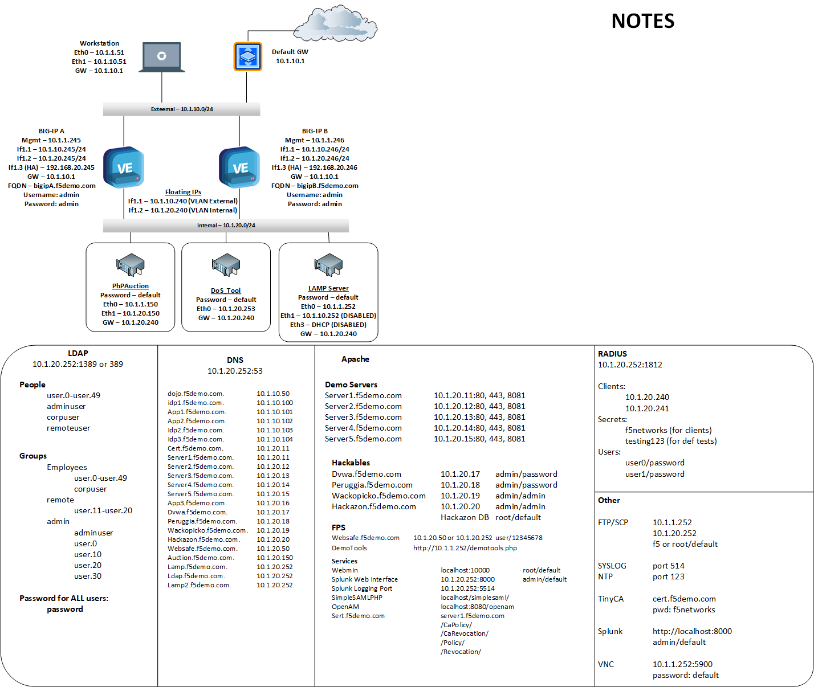

BIG-IP® Local Traffic Manager (LTM) - V13.1 Lab Guide
=====================================================

This lab guide is designed for you to get an understanding of the BIG-IP
Local Traffic Manager (LTM) product.

Lab Overview
------------

-  F5 BIG-IP LTM VE, licensed using F5-BIG-VE-LAB-LIC

-  Your BIG-IP is as close to factory default as possible. Only the
   following changes have been made:

   -  The management IP has already been configured

   -  The initial setup has been completed. (Licensing and Platform
      information)

   -  The Idle Timeout was modified from 1200 seconds to 7200 seconds

   -  The Welcome messages for the GUI and SSH were changed.

   -  An archive file base-setup-and-licensing.ucs was created allowing
      you to revert to the base settings above.

Various directory and application services are available within the lab
environment.

DO NOT COPY INFORMATION FROM THE SCREENSHOTS. THEY ARE FOR REFERENCE
ONLY.

Scenario
--------

Your customer has the following environment. The servers sit on the
customers internal VLANs, the virtual servers will exist in another VLAN
in the DMZ. The customer does not want to rework their networking and
does not wish to use the LTM as the default gateway. Our solution will
be to use SNATs to force traffic to pass through the BIG-IP to return
through the LTM.

|image1|

.. toctree::
   :maxdepth: 1
   :glob:

   bonus/bonus*
   module*/lab*

