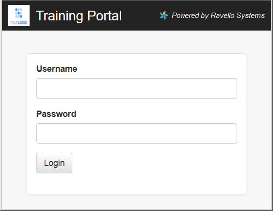
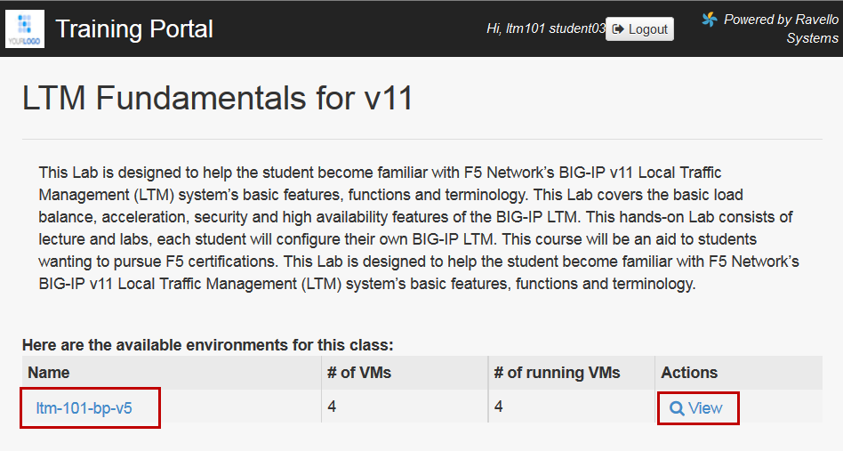
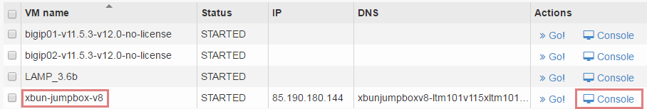
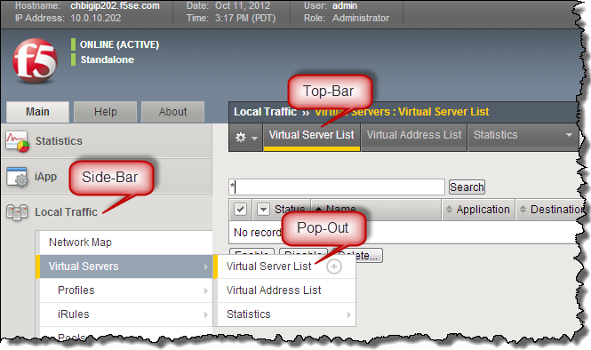

Lab 1: Access the Lab Environment
=================================

You will now gain access to your lab environment and your BIG-IP. The first agenda item is to log in to the training portal. After this, you will create a remote desktop session to the training environment and access your BIG-IP.

Access the Lab Environment
~~~~~~~~~~~~~~~~~~~~~~~~~~

#. Using Firefox or Chrome open a connection to the training portal supplied by the instructor

   #. Using the IP address supplied by the instructor log on to the training portal

      #. http://<ip_address_supplied_by_instructor/

         |image0|

      #. User: **ltm101student**\ X (where **X** is your student number)

      #. Password: **PieINtheSKYltm101**

   #. Open the blueprint or the view link.

      |image1|

   #. Find the Xunbutu jumpbox in the list of applications and select console to access the jumpbox via the browser. Alternately you can use the IP address associated with the jumpbox to access it via RDP.

      |image2|

   #. Access the **xbun-jumpbox** using the **Console** (watch for pop-up blockers)

      #. User: **f5student**

      #. Password: **f5DEMOs4u**

#. To access the BIG-IP open a new browser window and

   #. Click the bookmark **bigip01**

      #. User: **admin**

      #. Nomenclature for GUI navigation begins on the side-bar and then goes to the pop-up or top-bar.

         |image3| 

      #. For example: **Go to Local Traffic >> Virtual Servers >> Virtual List**

