Lab 2: The Basics (Networking, Pools and Virtual Servers)
=========================================================

In this lab we will access the Management GUI. We will then create the
VLANs and assign self IP addresses to our VLAN. As mentioned during our
lecture portion, BIG-IPs may be put in-line or one-armed depending on
your customer’s requirements and topology.

Creating VLANs
~~~~~~~~~~~~~~

   You will need create two untagged VLANs, one client-side VLAN
   (**client_vlan**) and one server-side VLAN (**server_vlan)** for the
   devices in your network.

#. From the sidebar select **Network** **>> VLANs** then select **Create**

   |image0|

   #. Under **General Properties**:

      #. **Name**: client_vlan

   #. The name is for management purposes only, you could name them after your children or pets

      #. **Tag**: <leave blank>

         #. Entering a tag is only required for “\ **Tagged**\ ” (802.1q)
            interfaces. “\ **Untagged**\ ” interfaces will automatically
            get a tag which is used for internal L2 segmentation of
            traffic.

   #. Under **Resources** in the **Interfaces** section:

      #. **Interface**: 1.1

      #. **Tagging**: Untagged

      #. Select the **Add** button. Leave all other items at the default setting.

         |image1|

When you have completed your VLAN configuration, hit the **Finished** button
   
Create another untagged VLAN named **server_vlan** on interface **1.2.**

Assigning a Self IP addresses to your VLANs
~~~~~~~~~~~~~~~~~~~~~~~~~~~~~~~~~~~~~~~~~~~

Go to **Network >> Self IPs**, select **Create**.

|image15|

#. Create a new self IP, for the **server_vlan** and **client_vlan** VLANs. In **Network >> Self IPs >> New Self IP**, under **Configuration** enter:

::

                             **Server-Side                     Client-side**

      **Name**:               server_ip                        client_ip

      **IP Address**:         10.1.20.245                      10.1.10.245

      **Netmask**:           255.255.255.0                    255.255.255.0

      **VLAN**:              server_vlan                       client_vlan

      **Port** **Lockdown**:  Allow None                        Allow None
\

   #. The default “\ **Allow** **None**\ ” means the Self IP would
      respond only to ICMP.
   
   #. The “\ **Allow** **Defaults**\ ” selection opens the following
      on the self IP of the VLAN

      #. TCP: ssh, domain, snmp, https

      #. TCP: 4353, 6699 (for F5 protocols, such as HA and iQuery)

      #. UDP: 520, cap, domain, f5-iquery, snmp

      #. PROTOCOL: ospf

   #. **NOTE:** Even with **“Allow None”** chosen, traffic destined
      for a virtual server or object on the F5 (e.g. NAT) are able to
      pass through without issue as any object created on the F5 is by
      default allowed to pass through.

When you have completed your self-IP configuration, hit the |image3|
button. You should have something similar to the following

   |image4|

Assigning the Default Gateway
~~~~~~~~~~~~~~~~~~~~~~~~~~~~~

#. Go to **Network > Routes** and then **Add**.

   #. Here is where we assign our default gateway (and other static
      routes as desired)

      |image5|

   #. Under **Properties**

      #. **Name**: default_gateway

      #. **Destination**: 0.0.0.0

      #. **Netmask**: 0.0.0.0

      #. **Resource**: Use Gateway…

      #. **Gateway** **Address**: 10.1.10.1

      #. When you have completed defining your default gateway, hit the
         |image6| button

#. Verify your network configuration

   #. Ping your client-side self IP (**10.1.10.245**) to verify
      connectivity

   #. Use an SSH utility, such as puTTY, to access your BIG-IP
      management port at 10.1.1.245.

      #. User: **root** Password: **default**

      #. Ping your default gateway, 10.1.10.1

      #. Ping a web server at 10.1.20.11.

Creating Pools
~~~~~~~~~~~~~~

In this lab we will build a pool and virtual server to support our web
site and verify our configurations by accessing our web servers through
the BIG-IP. Verification will be performed visually and through various
statistical interfaces.

#. From the sidebar, select **Local Traffic >>** **Pools** then select
   **Create**. Here we will create our new pool

   |image7|

   #. Under **Configuration**:

      #. **Name**: www_pool

         #. The name is for management purposes only, no spaces can be
            used

      #.  **Description**: <optional>

      #. **Health** **Monitor**: http

   #. Under **Members:**

      #. **Load Balancing Method**: <leave at the default Round Robin>

      #.  **Priority Group Activation**: <leave at default>

      #. **New Members**:

+-------------+------------------+
| **Address** | **Service Port** |
+=============+==================+
| 10.1.20.11  | 80               |
+-------------+------------------+
| 10.1.20.12  | 80               |
+-------------+------------------+
| 10.1.20.13  | 80               |
+-------------+------------------+

      #. As you enter each IP address and port combination, hit the **Add** button

      |image8|

When you have completed your pool configuration, hit the **Finished** button

Creating Virtual Servers
~~~~~~~~~~~~~~~~~~~~~~~~

Now let’s build our virtual server

#. Under **Local Traffic** >> **Virtual Servers**, click the **“+”** icon

   |image9|

   #. Under **General Properties**

      #. **Name:** www_vs

      #. **Description**: <optional>

      #. **Type:** Standard

      #. **Source/Address:** <leave blank>

         #. **Note:** The default is 0.0.0.0/0, all source IP address are allowed

      #. **Destination** **Address/Mask:** 10.1.10.100

         #. **NOTE:** The default mask is /32

      #. **Service Port**: 80 or HTTP

   #. Under **Configurations**

      #. The web servers do not use the BIG-IP LTM as the default
         gateway. This means return traffic will route around the
         BIG-IP LTM and the TCP handshake will fail. To prevent this
         we can configure SNAT Automap on the Virtual Server. This
         will translate the client IP to the self IP of the egress
         VLAN and ensure the response returns to the BIG-IP.

      #. **Source Address Translation**: Auto Map

      |image10|

   #. Under **Resources**

      #. **iRules**: none

      #. **Default Pool**: From the drop down menu, select the pool (**www_pool**) which you created earlier

      #. **Default Persistence Profile**: None

      #. **Fallback Persistence Profile**: None

When you have completed your virtual server configuration, hit the **Finished** button

You have now created a Virtual Server (Note: Items in blue are links)

   |image11|

#. Now let’s see if our virtual server works!

   #. Open the browser to the Virtual Server you just created

   #. Refresh the browser screen several times (use “<ctrl>” F5)

|image12|

   * Go to your BIG-IP and view the statistics for the **www_vs** virtual
      server and the **www_pool** pool and its associated members

   * Go to **Statistics > Module Statistics > Local Traffic**

      * Choose **Virtual Servers** from drop down

|image13|

   * Go to **Local** **Traffic >> Virtual Servers >> Statistics**

   * Go to **Local** **Traffic >> Pools >> Statistics**

      *  Did each pool member receive the same number of connections?

      *  Did each pool member receive approximately the same number of
         bytes?

      * Note the Source and Destination address when you go to directly
        and through the virtual server

* Let’s archive our configuration in case we have to fall back later.

   * Go to **System >> Archives** and select **Create**.

      * Name your archive **lab2_the_basics_net_pool_vs**

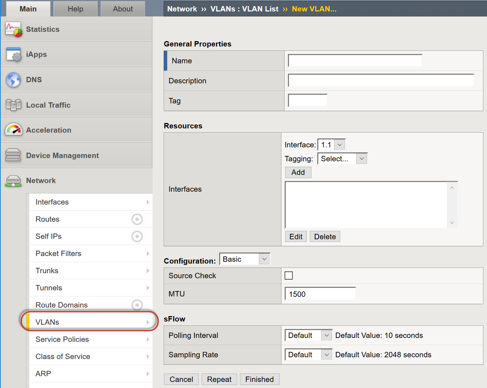
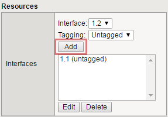
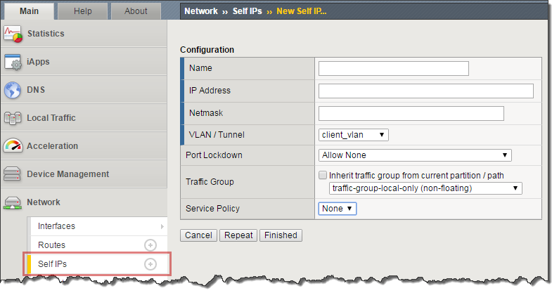

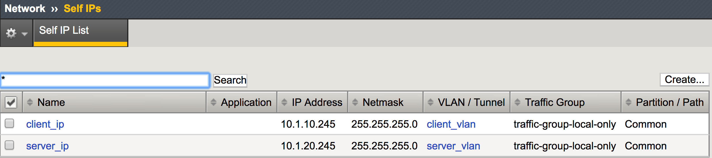
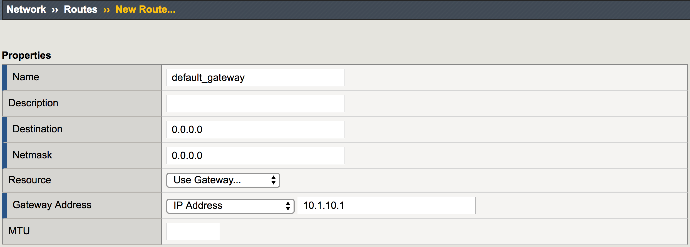

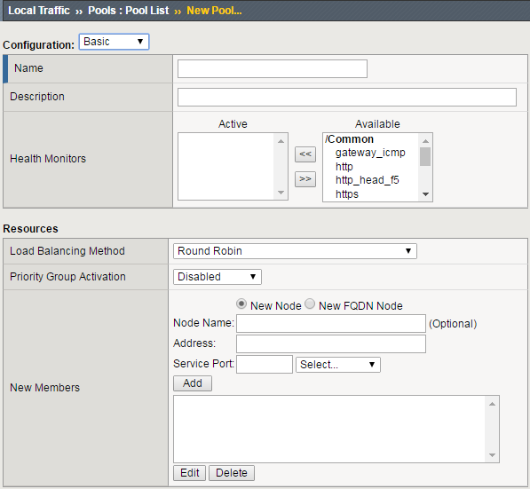
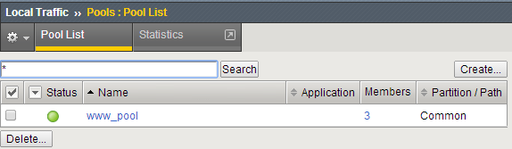
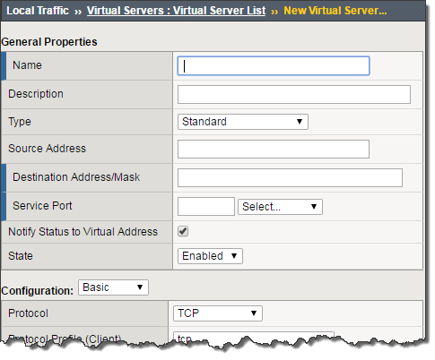
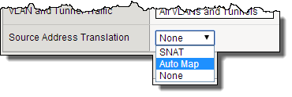
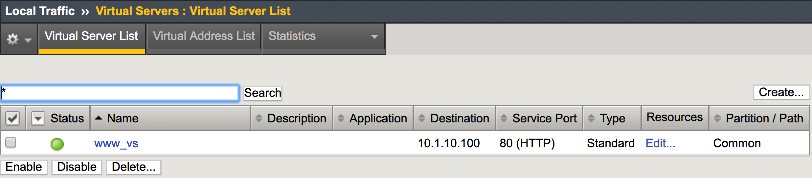
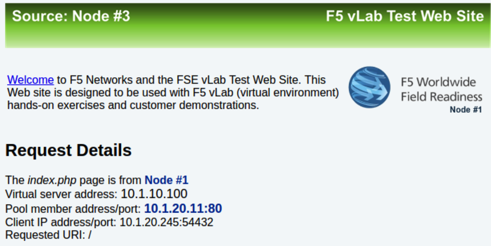
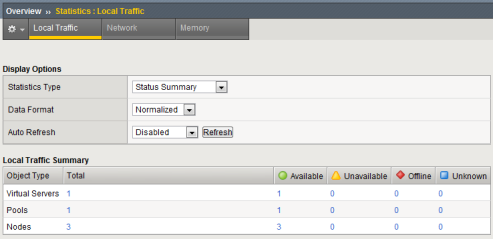
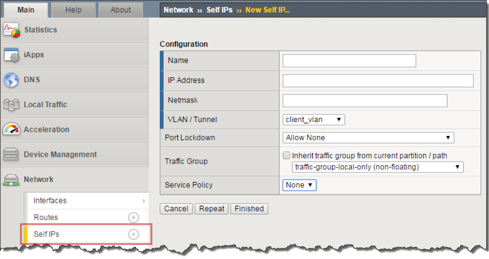
