Lab 3: Load Balancing, Monitoring and Persistence
=================================================

Objectives:

-  Configure and review Ratio load balancing

-  Build and test priority groups

-  Build a content monitor that looks for a receive string and requires authentication

-  Build and review simple (source IP) persistence and cookie persistence.

Ratio Load Balancing
~~~~~~~~~~~~~~~~~~~~

#. Go to Local **Traffic >> Pools** and select **www_pool** and then **Members** from the top bar or you could click on the **Members** link in the Pool List screen.

   |image0|

   .. note:: When we created the pool, we performed all of our configurations on one page, but when we modify a pool the **Resource** information is under the **Members** tab

#. Under **Load** **Balancing** section

   a. Change the **Load** **Balancing** **Method** to **Ratio (Member)**

   #. As you look at the drop-down menu, notice most load balancing methods have two options: (Node) or (Member). Remember the difference?

      |image1|

   #. Don’t forget the **Update** button

   #. Then under **Current Members**

      i. Select the first member in the pool **10.1.20.11:80**.

      #. Under the **Configuration** section

         #. Change the **Ratio** of the member to 3

         |image2|

   #. Select the **Update** button

#. Verification

   a. Check the pool statistics by selecting **Statistics** on the top bar, if you are still in **Local Traffic >> Pools**, or by going to **Statistics >> Module Statistics >> Local Traffic** and selecting **Pool** from **Statistics Type**.

   #. Reset the statistics for your **www_pool** pool by checking the boxes next to the pool members and hitting the **Reset** button

      i. Browse to your **www_vs** **(10.1.10.100)** virtual server

      #.  Refresh the browser screen several times (use “<ctrl>” F5)

      #. Select the **Refresh** button on the **Statistics** screen

      #. How many total connections has each member taken?

      #. Is the ratio of connections correct between the members?

   #. Now go back and put the pool load balancing method back to Round Robin

      i. Reset the statistics

      #. Refresh the virtual server page several times

      #. Refresh the statistics

      #. Does the ratio setting have any impact now?

Priority Groups Lab
~~~~~~~~~~~~~~~~~~~

Let’s look at priority groups. In this scenario we will treat the **.13** server as if it were in a disaster recovery site that can be reached over a backhaul. The customer would like to maintain at least two members in the pool for redundancy and load. They would find this beneficial to allow connections to proceed during a maintenance window or during an outage.

#. Go to **Local Traffic >> Pools >> www_pool**

   a. Select the **Members** tab.

      i.  Set the **Load Balancing Method** back to **Round Robin**

      #. Set the **Priority Group Activation** to **Less than …** **2** Available Members.

         |image3|

   #. Don’t forget to hit the **Update** button

   #. Select the pool members **10.128.20.11** and **10.128.20.12** and set their **Priority Group** to **2**.

      i. This will allow you to change the priority on that particular member.

         |image4|

#. Review your settings and let’s see how load balancing reacts now

   a. Select the **Statistics** tab.

   #. Reset the pool statistics.

   #. Browse to your virtual server and refresh several times.

   #. Refresh your statistics.

   #. Are all members taking connections?

   #. Which member isn’t taking connections?

#. Let’s simulate a maintenance window or an outage by disabling a pool member in the highest priority group (2).

   .. note:: F5 ranks priority from low number to high number. This means, a priority of 1 has a lower priority than 2, and onwards.

      This should cause priority group activation to kick in, since the number of active members in our high priority group has dropped below one.

#. Select the member in the Priority Group 2 and Disable that pool member.

   a. Select the **Disable** button

      |image5|

   #. The status indicator now goes to black, indicating the member has been disabled

#. Once again, select **Statistics**, reset the pool statistics, browse to the virtual server and see which pool members are taking hits now.

Once you are done testing re-enable your disabled pool member.

Monitor Labs
~~~~~~~~~~~~

Objective:

-  Build a default monitor for nodes

-  Build a content monitor for your pool

Default Monitors

1. Go to **Local Traffic >> Nodes**, note the status of the nodes.

   a. Note that the nodes exist in this table, even though they were never specifically configured in the Node section of the GUI. Each time a unique IP address is placed in a pool a corresponding node entry is added and assigned the default monitor (if any).

   #. Select the **Default Monitors** tab.

      |image6|

   #. Notice we have several options. For nodes you will want a generic monitor, so we will choose **icmp**.

   #. Select **icmp** from the **Available** box and hit |image7| to place it in the **Active** box.

   #. Click on the **Update** button to finalize your changes.

#. Select **Node List** or **Statistics** from the top tab.

   a. What are your node statuses?

#. Select **Statistics >> Module Statistics >> Local Traffic**

   a. What are the statuses of your nodes, pool and virtual server?

For those of you who did the **FQDN Pool** extra credit lab, you will notice your FQDN in the node list. The status should be **Available** (Green) even though there wasn’t a monitor. This is because a good status indicates the BIG-IP successfully queried the DNS server for the name. Click on the FQDN node to see additional options, such as query interval.

Content Monitors
~~~~~~~~~~~~~~~~

The default monitor simply tells us the IP address is accessible, but we really don’t know the status of the particular application the node supports. We are now going to create a monitor to specifically test the application we are interested in. We are going to check our web site and its basic authentication capabilities.

#. Browse to **http://10.1.10.100** and on the web page select the **Basic Authentication** link under **Authentication Examples**.

   a. User: **user.1**

   #. Password: **password**

   #. You could use text from this page or text within the source code to test for availability. You could also use HTTP statuses or header information. You will be looking for the HTTP status “\ **200 OK**\ ” as your receive string to determine availability.

   #. Note the URI is **/basic**. You will need this for your monitor.

#. Select **Local Traffic >> Monitor** on the side-bar and select the plus (**+**) sign or **Create**

   |image8|

   a. Now we can create a monitor to check the content of our web page to ensure things are running properly.

      i. **Name**: www_test

      #. **Type**: HTTP

         |image9|

   #. Once you have selected you parent **(Type)** monitor, you can access the **Configuration** section

      i.  **Send String**: Enter the command to retrieve the page you want **“GET /basic/\r\\n"** (no quotes)

      #. In the Receive String box put “\ **200 OK**\ ” (no quotes)

         .. note:: The receive string is not case sensitive.

      #. Enter **user.1**/**password** for the **Username** and **Password**

         |image10|

   #. Click **Finish** and you will be taken back to **Local Traffic >> Monitors**

#. Where is your new Monitor?

   a. |image11|\ **Hint:** Check the lower right hand corner of the Monitors list. Here you can go to the next page or view all Monitors

   #. You can change the number of records displayed per page in **System >> Preferences**

#. Go to **Local Traffic >> Pools >> www_pool** and choose **Properties** from the top bar

   a. Remove the **http** monitor from the Active box.

   #. Select the **www_test** monitor from the Available monitor’s window in the **Configuration** section and move it to the Active window.

      |image12|

#. Once you have selected your parent (Type) monitor, you can access the **Configuration** section

   a. Select **Statistics** from the tabs.

   #. What is the status of the pool and its members?

#. Go to **Local Traffic >> Virtual Servers**. What is the status of your virtual server?

   a. Browse to your **www_vs** virtual server. Which members are taking traffic?

   #. Just for fun reverse the monitor. Now when **200 OK** is returned it indicates the server is not responding successfully. You can see where this would be useful if you were looking for a 404 (bad page) response.

Monitor Testing
~~~~~~~~~~~~~~~

There is now the ability to test monitors. This is tremendously helpful as you no longer need to create monitors and add them to false objects on the BIG-IP. The functionality is now built in to the monitor itself to be less invasive on your infrastructure, and less time consuming all together.

#. Go to **Local Traffic >> Pools >> www_pool**

   a. Under **Configuration**, move the active monitor to **Available**

#. Go to **Monitors** and click on **http**

   a. Click the **Test** tab

   #. Under **Address** plug in **10.1.20.11** and in the port field
      plug in **80**

   #. Click **Test**

      |image13|

   #. Go back to **Local Traffic >> Pools >> www_pool**

      a. Once here, move **http** back to **Active**

Persistence Labs
~~~~~~~~~~~~~~~~

In this lab we will configure a couple types of persistence and view their behavior. For persistence, profiles will have to be created and attached to our virtual server.

Lab Requirements:

-  Prior to beginning the lab verify your **www_pool** has been set to the following parameters:

   -  **Load Balancing Method**: Round Robin

   -  **Priority Group Activation**: Disable

      -  The members **Ratio** and **Priority** **Group** mean nothing since we aren’t using Ratio load balancing and Priority Groups are disabled.

   -  Hit **Update**

   -  Hit your virtual server several times, you should see all 3 servers respond.

Simple (Source Address) Persistence
~~~~~~~~~~~~~~~~~~~~~~~~~~~~~~~~~~~

#. Go to **Local** **Traffic >> Profiles** and select the **Persistence** tab.

   a. From the **Persistence Profiles** screen select the **Create** button.

      |image14|

   #. At the **New Persistence Profile** screen enter:

      i. **Name**: my-src-persist

      #. **Persistence** **Type**: Source Address Affinity

         |image15|

   #. This will add the **Configuration** section to the **General Properties** section.

      i. Note the parent profile.

   #. In the **Configuration** section, set the

      i. **Timeout**: 60 seconds

      #. **Prefix Length**: None

         #. This is the default and is a /32 prefix (255.255.255.255 mask).

         #. Each new IP address will create a new persistence record.

      #. **Hint**: You can’t change these settings until you have checked    the Custom box. This prevents unwanted or unauthorized changes from within the GUI, without explicitly allowing it. Also, it allows you to know what has changed from the default settings.

   #. You have just created your first custom Profile.

      i. Note the check box for your new custom profile isn’t grayed out and can be selected to allow you to delete the profile if desired.

#. Now let’s attach our new profile to the virtual server.

   a. Go to **Local Traffic >> Virtual Server** and ….

      i. Select **www_vs** and the **Resources** tab or ….

      #. Take the shortcut directly to the **Resources** of the virtual server. (Can you find it?)

   #. Set the **Default Persistence Profile** to **my-src-persist**.

      |image16|

   #. Don’t forget to **Update** before leaving the page. *(Be careful, the reminders will stop!)*

   #. Testing Source Address Affinity

      i.  At this point you may want to open a second browser window to the management GUI.

      #. From one management window go to **Statistics >> Module Statistic >> Local Traffic**

      #. Select **Persistence Records** for the **Statistics Type** menu

         |image17|

#. At this point you will see that the Persistence Records statistics display has been disabled (way back in v12.1). A TMSH database command is required to activate it.

   a. SSH to you BIG-IP at 10.1.1.245. Username: **root** Password: **default**

   #. At the prompt enter: **tmsh**

   #. At the TMSH prompt enter the command in the **Persistence Value** GUI.

      i. **modify sys db ui.statistics.modulestatistics.localtraffic.persistencerecords value true**

         #. Tab completion will make this a little easier

#. Now, in this window you can watch your persistence records. You may want to set **Auto Refresh** to 20 seconds.

   |image18|

#. In your other management GUI window go to **www_pool** and clear the member statistics.

   a. Open a browser session to your virtual server and refresh several times.

   #. How many members are taking traffic?

   #. Check you **Persists Records** window. Are there any persistence records?

      i. If you are not Auto Refreshing, don’t forget to hit **Refresh**

   #. Refresh you web page prior to the **Age column** reaching **60.** What happens?

Cookie Persistence (Cookie Insert)
~~~~~~~~~~~~~~~~~~~~~~~~~~~~~~~~~~

#. Go to **Local Traffic >> Profiles >> Persistence** tab and hit **Create**

   a. Let’s name our profile **my_cookie_insert** (original isn’t it)

   #. Our **Persistence Type** will be **Cookie**

   #. This brings us to the **Configuration** section.

      |image19|

#. As you can see, the default **Cookie Method** is **HTTP Cookie Insert**, so we won’t have to modify the **Cookie Method**

   a. The BIG-IP will also create a cookie name for you using a combination   of “\ **BIGipServer**\ ” and the pool name the virtual server service. We will take this default also.

   #. We will use a **session** cookie. Which means the cookie is deleted when the browser is closed.

   #. Select **Finished**

   #. Now attach your cookie persistence profile to your virtual server’s **Default Persistence Profile** by:

      i. Go to **Local Traffic >> Virtual Server >> www_vs >> Resources** tab

      #. Set the **Default Persistence Profile** to **my_cookie_insert**

      #. Hit **Update**

   #. Whoa! Did you just get this error message?

      |image20|

   #. Remember what we said earlier about some Profiles requiring prerequisite Profiles? Since we are looking in the HTTP header for the cookie the prerequisite for the Cookie Profile is the HTTP profile.

#. We will have to go to the virtual server to add the HTTP profile, prior to adding the Cookie Persistence profile.

   a. Select the **Properties** tab on your virtual server

   #. Go to **HTTP Profile** in the **Configuration** section and select the default HTTP (**http**) profile.

      |image21|

   #. Hit the **Update** button

   #. Now we can go back to the **Resource** tab and add our cookie persistence profile.

#. Testing cookie persistence.

   a. If you wish you can watch the member statistics to validate your persistence.

   #. Open a new browser session to your virtual server and refresh several times.

   #. Does the page ever change?

   #. Did you hit a different server?

   #. Refresh several times. Are you hitting the same server?

      i. On the web page under **HTTP Request and Response Information** click the **Display Cookie** link.

         |image23|

Archive your work in the file: **lab3_lb_monitor_and_persist**

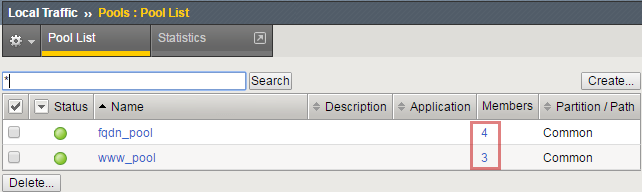
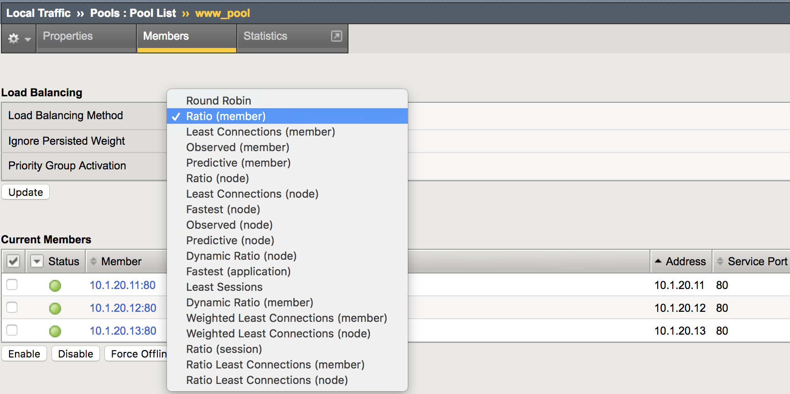
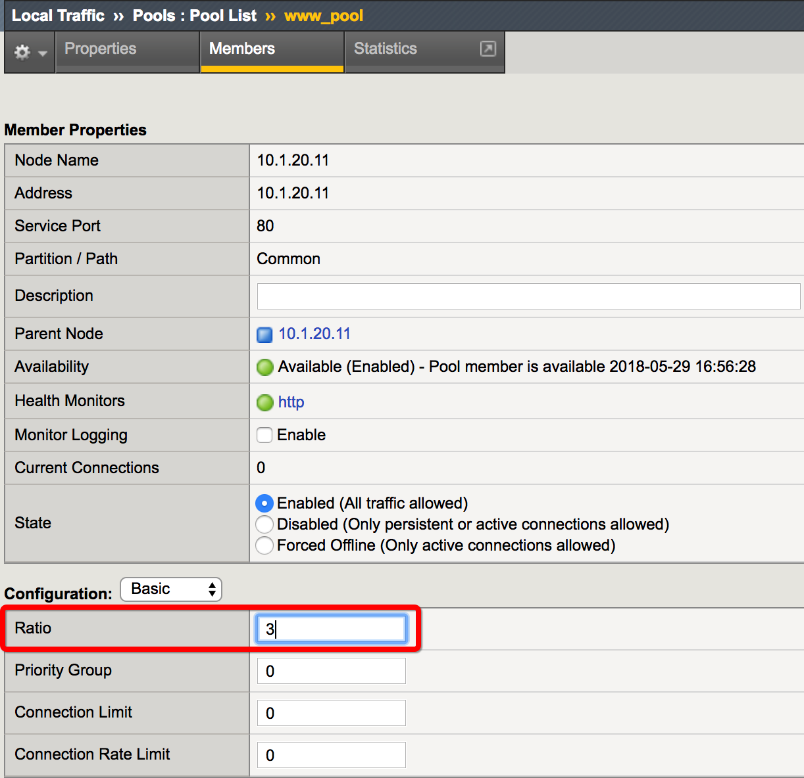
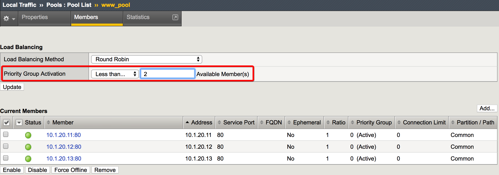
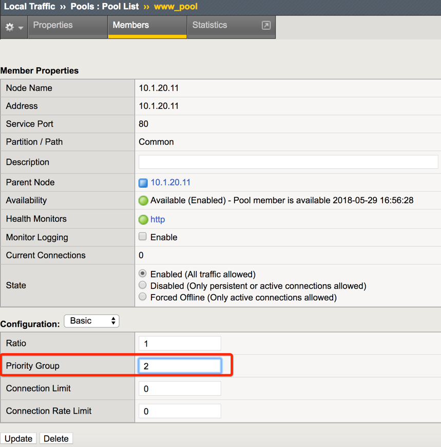
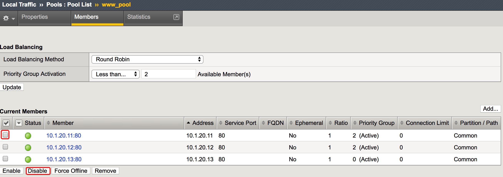
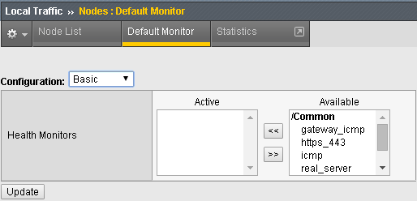

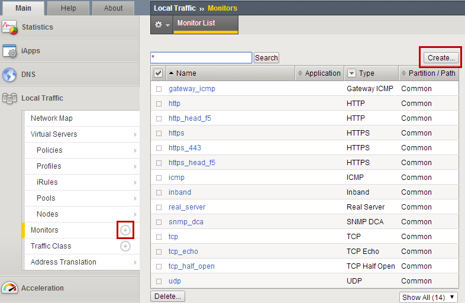
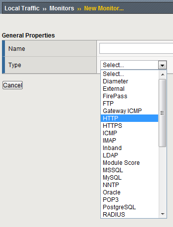
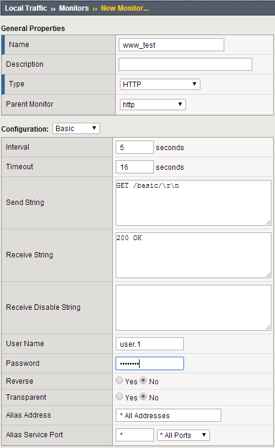
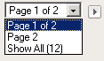
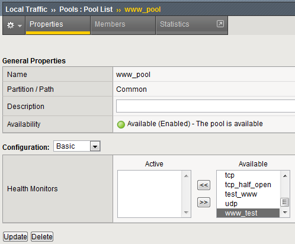
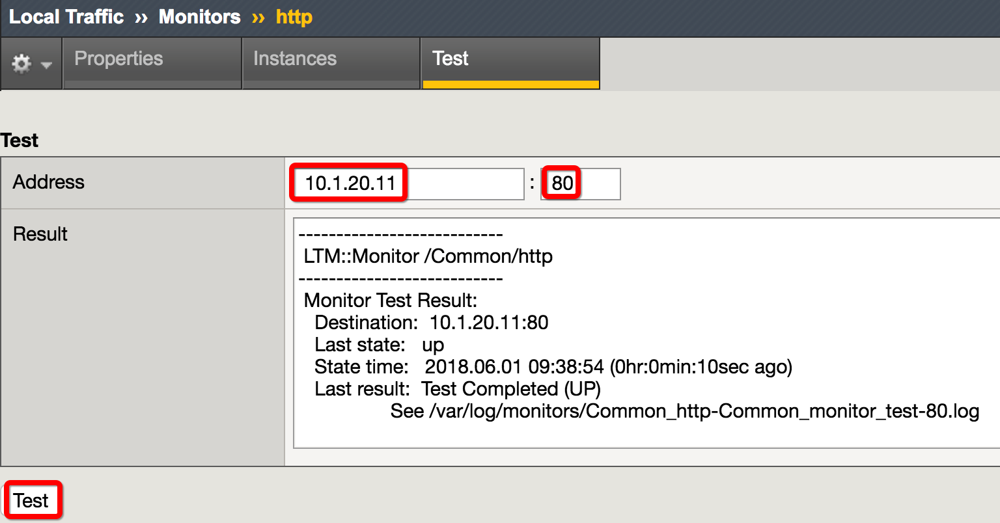
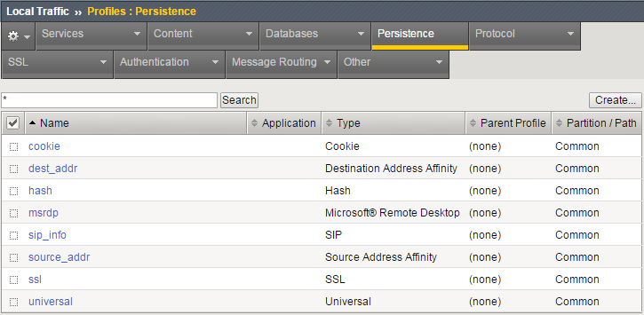
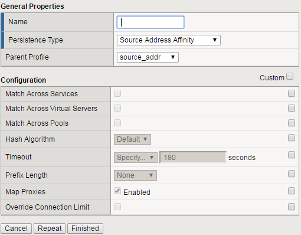
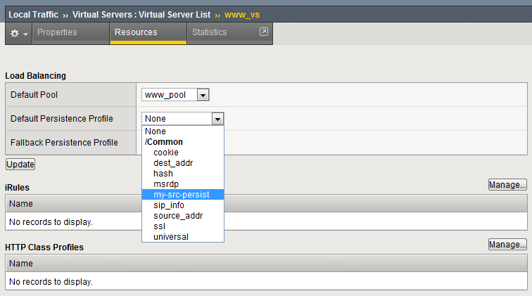
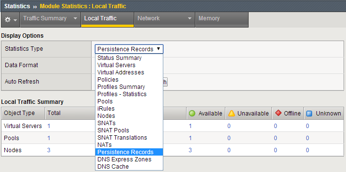
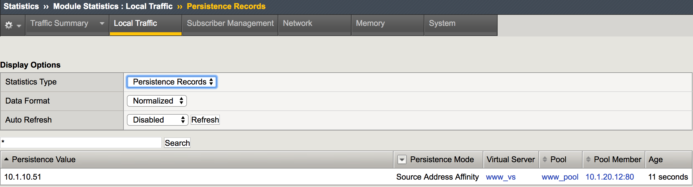
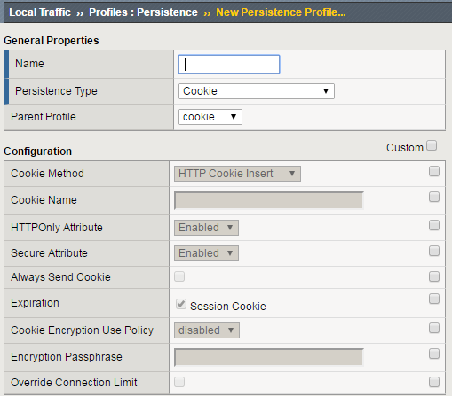
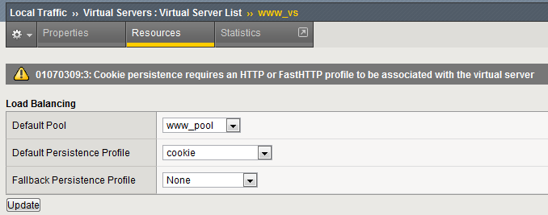
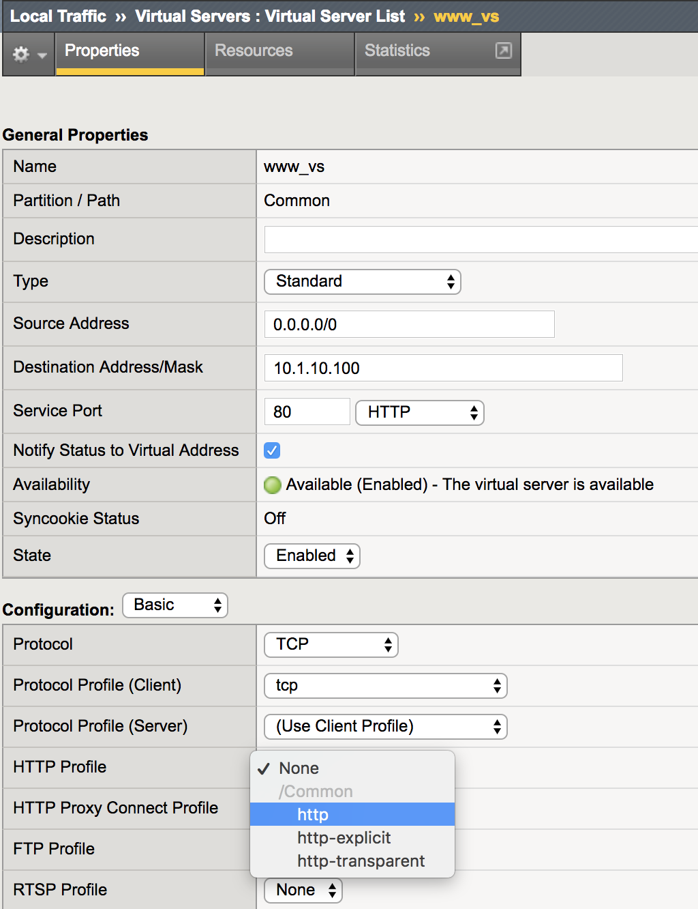
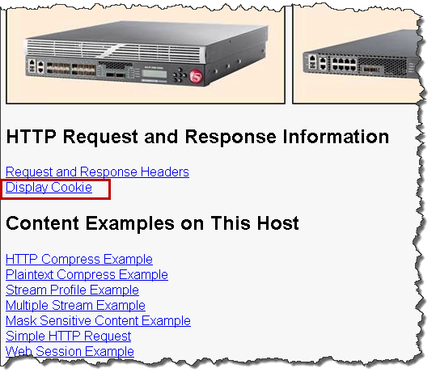
