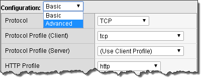
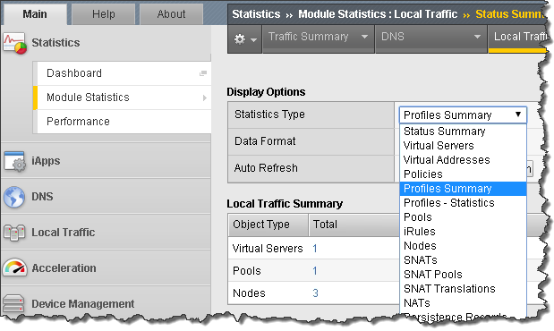
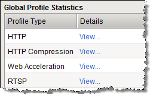
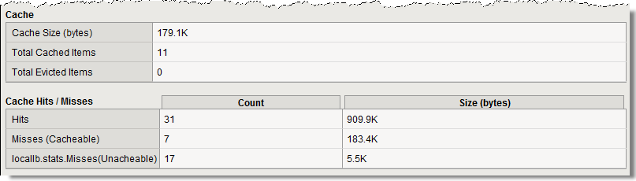
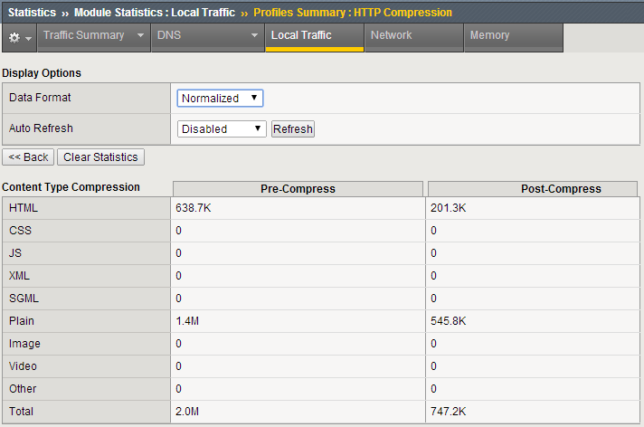

Lab 4: Accelerating Applications Lab
====================================

Objectives:

-  Assign client-side and server-side profiles

-  Set up caching for your web site

-  Set up compression for your web site

Lab Prerequisites:

-  Prior to starting this lab remove the cookie persistence profile from
   your virtual server.

TCP Express
~~~~~~~~~~~

1. Set client-side and server-side TCP profiles on your virtual server
   properties.

   a. In some earlier version you would be required to select the
      **Advanced** menu to see the Client and Server protocol profiles.

|image1|

a. If you chose to use the **Advanced** menu you would see a whole array
   of new options. There are **Basic** and **Advanced** drop downs on
   many of the GUI menus. You can always see **Advanced** menus by
   changing the preferences in **System >> Preferences.**

b. From the drop-down menus place the **tcp-wan-optimized** profile on
   the client-side and the **tcp-lan-optimized** profile on the
   server-side.

..

   |image2|

HTTP Optimization - RamCache Lab
~~~~~~~~~~~~~~~~~~~~~~~~~~~~~~~~

1. Visit your virtual server’s web page and refresh it several times.
   Note the Source Node for the pictures of the BIG-IPs. They change
   depending on where the connection is coming from. The Source Node
   information is part of the picture.

2. Go to **Local Traffic >> Profiles >> Services >> Web Acceleration**
   or **Acceleration >> Profiles >> Web Acceleration**

a. Create a new profile named **www-opt-caching** using
   **optimized-caching** as the Parent Profile.

b. Take all the defaults, no other changes are required.

3. Open up your **www_vs** virtual server.

a. At the **HTTP Profile** drop down menu make sure **http** is
   selected.

b. Under **Acceleration** at **Web Acceleration** **Profile** select
   your new caching profile; **www-opt-caching**

c. Clear the statistics on your pool and the refresh the main web page
   several times.

   i.  The pictures do not change. Why do you think that is?

   ii. Go to your pool. Are all pool members taking connections?

4. Now go to **Statistics >> Module Statistics >> Local Traffic** on the
   sidebar. From the **Statistics Type** drop-down menu select
   **Profiles Summary**

|image3|

5. **Select** the View link next to the **Web Acceleration** profile
   type

|image3|

|image4|

6. You can get more detailed information on RamCache entries at the CLI
   level

a. Log onto the CLI of your BIG-IP via SSH using the root account (user:
   **root** password: **default**).

b. At the CLI go into **tmsh** at the **(tmos)#** prompt

c. At the shell prompt enter **show ltm profile ramcache
   www-opt-caching**

HTTP Optimization - HTTP Compression Lab
~~~~~~~~~~~~~~~~~~~~~~~~~~~~~~~~~~~~~~~~

1. Go to **Local Traffic >> Profiles >> Service>HTTP Compression** or
   **Acceleration >> Profiles >> Web Acceleration**

   a. Create a new profile, **www-compress**, using the
      **wan-optimized-compression** default profile.

2. Open up your **www_vs** virtual server.

a. At the **HTTP Profile** drop down menu make sure **http** is selected

b. At the **Web Acceleration** drop-down menu select **None**

   iii. *For the purpose of this lab we don’t want caching interfering
        with our response headers*

c. At the **HTTP Compression** drop-down menu select the HTTP
   compression profile you just created

1. Now open your virtual server’s web page and under **Content Examples
   on This Host** select the **HTTP Compress Example** and **Plaintext
   Compress Example** link

   a. Now off to the statistics on the sidebar. Under the **Local
      Traffic** drop-down menu select **Profiles Summary**

   b. Select the **View** link next to the **HTTP Compression** profile
      type

|image5|

c. On the web page under **HTTP** **Request and Response Information**
   select the **Request and Response Headers** link.

   i. Notice you no longer see the **Accept-Encoding** header in the
      **Request Headers Received at the Server** section

Archive your work in a file called: **lb4_acceleration**

.. |image2| image:: images/image2.png
   :width: 5.13542in
   :height: 2.93965in

