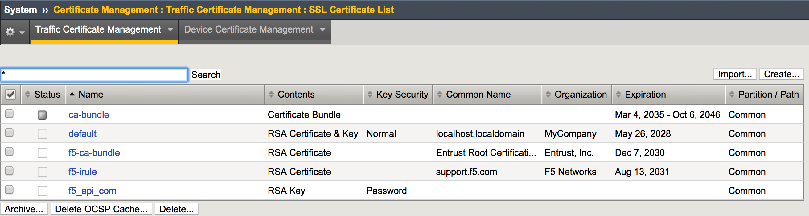
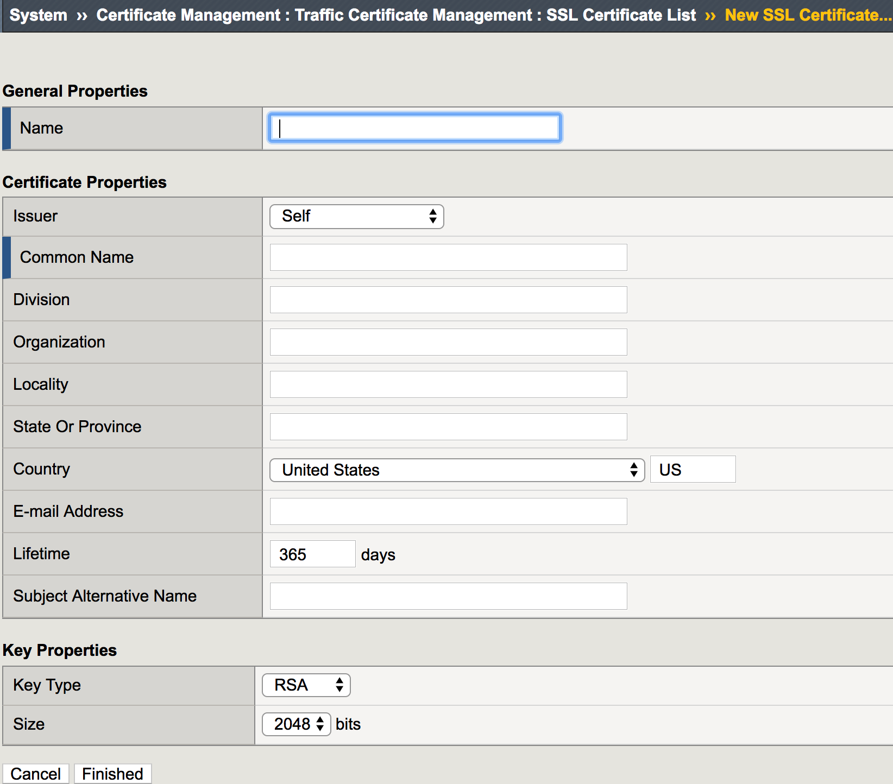
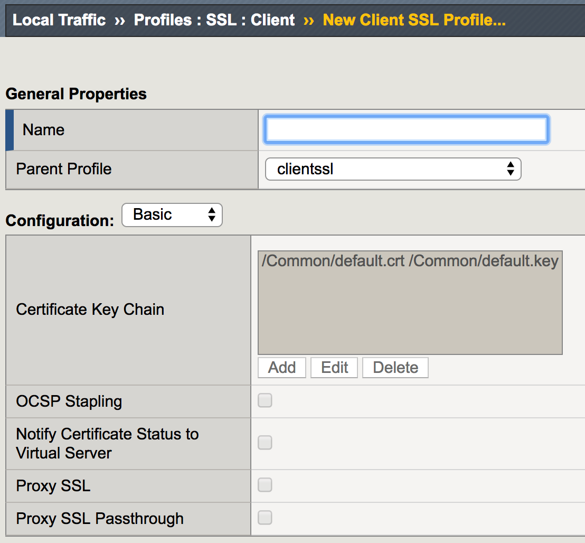
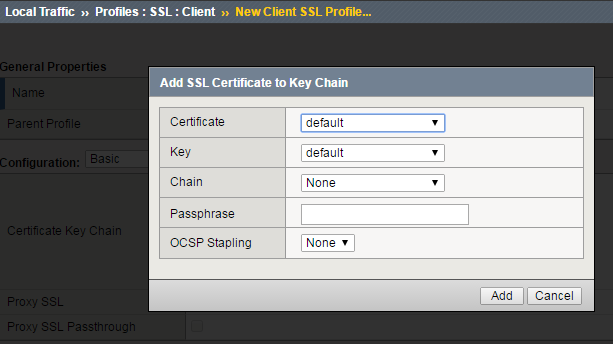
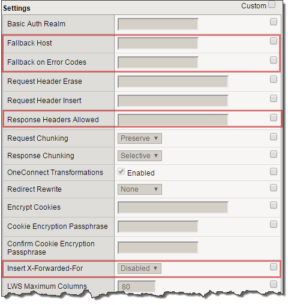

Lab 5: SSL Offload and Security
===============================

In this Lab we will configure client-side SSL processing on the BIG-IP

Objective:

-  Create a self-signed certificate

-  Create a client SSL profile

-  Modify your HTTP virtual server to use HTTPS

-  Add additional security to your HTTPS web server using the HTTP profile

We will create a self-signed certificate and key for a client SSL profile to attach to our virtual server

Creating a Self-signed certificate and key
~~~~~~~~~~~~~~~~~~~~~~~~~~~~~~~~~~~~~~~~~~

#. Go to **System >> Certificate Management >> Traffic Certificate Management >> SSL Certificate List** and select **Create**

|image1|

   .. note:: The default key size is **2048**. You can save SSL resources on the **server-side** by lowering this key size

      |image2|

   #. Enter:

      #.   **Name**: my-selfsigned-cert

      #.  **Issuer**: Self

      #. **Common Name**: www.f5demo.com

      #.  Fill out the rest any way you would like

Creating SSL Client Profile
~~~~~~~~~~~~~~~~~~~~~~~~~~~

#. Go to **Local** **Traffic >> Profiles >> SSL >> Client** menu and select **Create**

|image3|

   #. Under **General Properties**

      #. **Name**: my_clientssl_profile

   #. Under **Configuration** in the **Certificate Key Chain** section, select the **Custom** box and hit **Add**

      #.  In the **Add SSL Certificate to Key Chain** pop-up select:

         #. **Certificate**:      my-selfsigned-cert

         #. **Key**:                 my-selfsigned-cert

      #. Select **Add**

         |image4|

   #. Hit **Finished.**

Building our New Secure Virtual Server
~~~~~~~~~~~~~~~~~~~~~~~~~~~~~~~~~~~~~~

#. Go to **Local Traffic >> Virtual Servers** and hit the **Create** button or hit the **“+”** next to Virtual Servers

   #. **Name**: secure_vs

   #. **Destination Address/Mask**: 10.1.10.105

   #. **Port**: 443 or HTTPS

   #. **SSL Profile (Client)**: my_clientssl_profile (the profile you just created)

   #. **Source Address Translation**: Auto Map (remember why we need this?)

   #. **Default Pool**: www_pool

   #. Default all other settings. (Notice you did not require an HTTP profile)

   #. **Finish**

#. Test our secure server. Go to you **secure_vs** at
   **https://10.1.10.105**

   #. If you want to watch member traffic, go to the **www_pool** and reset the statistics

   #. Browse to your secure virtual server

   #. What port did your pool members see traffic on?

Securing Web Applications with the HTTP profile
~~~~~~~~~~~~~~~~~~~~~~~~~~~~~~~~~~~~~~~~~~~~~~~

#. Let’s begin by creating a custom HTTP profile

   #. Go to **Local Traffic >> Profiles >> Services**, select **HTTP** and create a new profile

   #. Under **General Properties**

      #. **Name**: secure-my-website

   #. Under **Settings**:

      #. Set the **Fallback Host**: http://10.1.1.252 *(this will take you an  internal site)*

      #. **Fallback on Error Codes**: 404 (fallback site if a 404 error is received)

      #. **Response Headers Allowed**: Content-Type Set-Cookie Location

      #. **Insert XForwarded For**: Enabled (because we talked about it earlier)

         |image5|

   #. Attach your new HTTP Profile to your secure (HTTPS) virtual server

#. Browse to your secure virtual server.

   #. Do web pages appear normal?

   #. Now browse to a bad page

      #. For example,

         #. What is the result?

   #. Go to the **Request and Response Headers** page. You should see a sanitized server response at the bottom of the web page and the original client IP address

   #. You can compare the headers by accessing your HTTP virtual server at http://10.1.10.100

   #. While you are looking at the headers, check for the **X-Forwarded-For** header received by the server

   .. note:: Even though the data is encrypted between your browser and the virtual server, the LTM can still modify the data (i.e. resource cloaking) because the data is unencrypted and decompressed within TMOS

Archive your work in a file called: **lab5_security**

