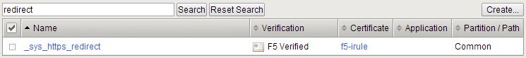
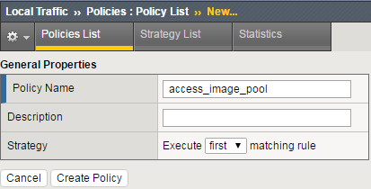
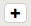
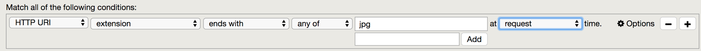
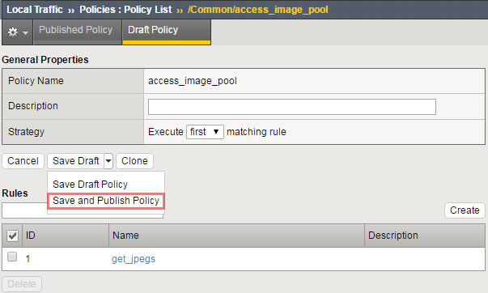
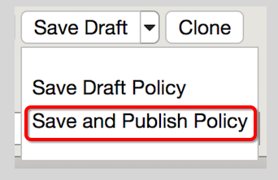
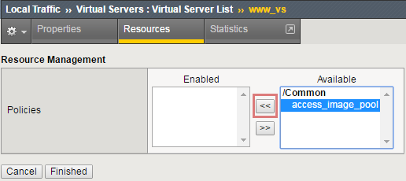
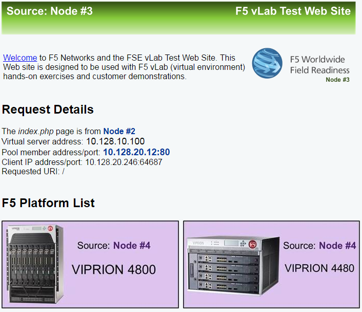
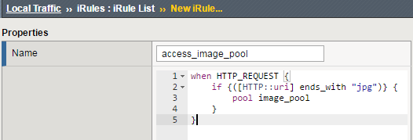
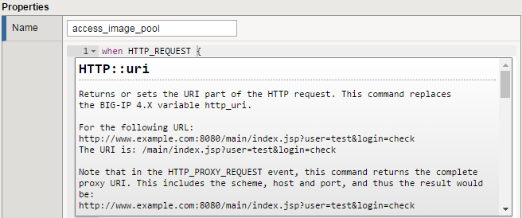

Lab 6: BIG-IP Policies and iRules
=================================

When clients attempt to access your **secure_vs**, you don’t want them
to have to remember to type HTTPS before the web site, but you also
don’t want to open port 80 (HTTP) on your web servers as that is just
asking for trouble. To avoid this issue, you will be creating an HTTP
virtual server that will redirect HTTP to HTTPS and the **secure_vs**.
Also, you will write an iRule and a BIG-IP policy that will retrieve
images from a different pool of servers than the default pool attached
to the virtual server. This will give you a simple comparison between
the two methods. You will use a policy on the HTTP server and an iRule
on the HTTPS virtual server.

Using the Built-in https_redirect iRule
~~~~~~~~~~~~~~~~~~~~~~~~~~~~~~~~~~~~~~~

1. While it would be easy to write your own redirect iRule, note that F5
   has one prebuilt that you can use

   a. Example of simple redirect iRule:

..

   **when HTTP_REQUEST {**

   **HTTP::redirect https://[HTTP::host][HTTP::uri]**

   **}**

2. Go to **Local Traffic >> iRules**

   b. In the search box at the top of the list of iRules, type
      **redirect** and hit **Search.**

|image0|

c. Open the iRule and take a quick look. This is an F5 Verified and
   supported iRule.

3. Create your HTTP-to-HTTPS redirect virtual server.

   a. Go to **Local Traffic >> Virtual Servers** and create a new
      virtual server.

      i.   **Name:** redirect_to_secure_vs

      ii.  **Destination:** <same IP as secure_vs>

      iii. **Service Port:** 80 (HTTP)

      iv.  **Source Address Translation:** None <you don’t need this as
           this traffic is going nowhere>

      v.   **iRule:** **\_**\ sys_https_redirect

      vi.  Hit **Finished**

           1. **WOW!** That didn’t go too far did it. You just got an
              error. If you are going to redirect the HTTP request, you
              need the HOST and URI information and that requires the
              HTTP protocol

   b. In the **Configuration** section make sure the default **http**
      profile is added to the virtual server

   c. HTTP Profile: **http**

   d. Select **Finished**

1. Test your policy by going to **http://<ip address of your virtual>**

   e. You should be redirected to the HTTPS virtual server

   f. As you can see, very small iRules can make a very big difference

Use a BIG-IP Policy to retrieve images from a different pool 
~~~~~~~~~~~~~~~~~~~~~~~~~~~~~~~~~~~~~~~~~~~~~~~~~~~~~~~~~~~~~

1. **Create** a new pool named **image_pool**, use the **http** monitor
   for status, and add one member **10.1.20.14:80**

2. First you will create your policy container and set your match
   strategy

   g. Try to do this using the instructions, but a screen shot of the
      policy is available in the **Appendix** at the end of the lab
      guide if you would like it

3. Go to **Local Traffic >> Policies : Policy List** and select
   **Create**

   h. **Policy_Name:** access_image_pool

   i. **Strategy:** Execute **first** matching rule

   j. **Create Policy**

..

   |image1|

4. Now you can create/view policy rules by selecting **Create**

   k. **Name:** get_jpegs

   l. In the box under **Match all of the following conditions:** select
      the |image2| to the right of **All Traffic**

      vii.  Use the drop-down menus to look at the **HTTP URI** and
            check if it **ends_with** an image type

      viii. Look for JPEGs by adding **jpg** in the box under the **any
            of** box and selecting **Add**

|image3|

m. Under **Do the following when the traffic is** matched, build the
   following operation.

   ix. **Forward Traffic** to the **pool** named **image_pool**

n. **Save**

..

   |image4|

5. The policy is saved in **Draft** form and is not available until
   **Published**. To publish the policy:

   o. Select the **Save Draft Policy** drop-down menu and select **Save
      and Publish Policy**

|image5|

6. Go to the **Resources** section of your **www_vs** virtual server and
   select **Managed** over the **Policies** box

   p. Move **access_image_pool** for the **Available** box to the
      **Enabled** box

|image6|

7. Now test your change by browsing to http://10.1.10.100

   q. If your policy is working correctly, all of the images under **F5
      Platform List** should be from **NODE #4**

   r. Other images are PNG images and have a different extension

|image7|

Use an iRule to Retrieve Images From a Different Pool 
~~~~~~~~~~~~~~~~~~~~~~~~~~~~~~~~~~~~~~~~~~~~~~~~~~~~~~

1. Now you will use an iRule to perform the same image retrieval. Your
   **image_pool** is already created

2. Go to **Local Traffic >> iRules** and select **Create**

   a. **Name:** access_image_pool

   b. In the **Definition** section enter the following:

..

   |image8|

c. This activity is not meant to be “cut and paste”. We want you to get
   comfortable and familiar with typing iRules inside the GUI.

   i. Try hovering the cursor over a command or event, such as,
      **HTTP_REQUEST** or **HTTP:uri**. You will see a definition of the
      item. For example:

..

   |image9|

3. Save your iRule and go to the **Resources** section of your
   **secure_vs** and select **iRules >>** Manage

   d. Move your **access_image_pool** iRule into the **Enabled** box

4. Test your **secure_vs** virtual by going to **https://10.1.10.105**

   e. The results should be the same as before

5. **Extra Credit!** Change both the policy and iRule to access the
   **image_pool** for **png** file types

   f. You should notice one is easier to update than the other

