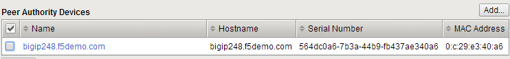
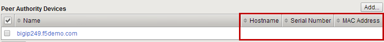

Lab 8: Device Service Clusters (DSC) 
=====================================

We want to familiarize you with the concept of Device and Traffic Groups as well as the building of Active-Standby, Active-Active BIG-IP pairs.  While there is a wizard, for this lab, configuration will be done manually. The wizard will only build A/S HA groups. In order to build Active-Active and beyond a pair you will need to know the four steps to add a device object to a cluster.

Base Networking and HA VLAN
~~~~~~~~~~~~~~~~~~~~~~~~~~~

You will be creating a high availability cluster using the second BIG-IP **(bigip2)** in your lab, so let’s prep our current BIG-IP and create a high availability VLAN.

#. On **BigIpA.f5agility.com** archive your configuration in case you need to revert

#. Go to **System >> Archives** and create a new archive.

#. You will be using your third interface **(1.3)** for Network Failover and ConfigSync. This requires certain ports to be open on the Self IP; TCP port 4353 for ConfigSync, TCP port 1026 for Network Failover and TCP port 6699 for the Master Control Program.

   a.  Build a new untagged VLAN **ha_vlan** on interface **1.3**

   b. Add a self-IP address to the VLAN, **192.168.20.1** net mask **255.255.255.0.**

   c. Under **Port Lockdown**, select **Allow Default**, to open ports required for HA communications.

#. Go to https://10.1.1.246 which is **BigIpB.f5agility.com** and login.

#. Bigip102 has already been licensed and provision. You will need to set up the base networking.

+---------------+-------------------+--------------+---------------+
| **Interface** | **Untagged VLAN** | **Self IP**  | **Netmask**   |
+===============+===================+==============+===============+
| 1.1           | client_vlan       | 10.1.10.246  | 255.255.255.0 |
+---------------+-------------------+--------------+---------------+
| 1.2           | server_vlan       | 10.1.20.246  | 255.255.255.0 |
+---------------+-------------------+--------------+---------------+
| 1.3           | ha_vlan           | 192.168.20.2 | 255.255.255.0 |
+---------------+-------------------+--------------+---------------+

#. Set **Port Lockdown** to **Allow Default**

#. Build the default gateway destination **0.0.0.0**, mask **0.0.0.0**, gateway ip address **10.128.10.1**

#. What is the status your BIG-IPs? Check the upper left-hand corner next to the F5 ball.

Configure HA
~~~~~~~~~~~~

#. **On each BIG-IP**, prior to building the Device Trust, it is recommended to renew the BIG-IP self-signed certificate with valid information and regenerate the local Device Trust certificate

#. Under **System >> Certificate Management >> Device Certificate Management >> Device Certificate,** select the **Renew…** button

      a. **Common Name**: <the Hostname of the BIG-IP in the upper left corner>

      b.  **Country**: United States (or your country of preference)

      c.   **Lifetime**: 3650

#. Lifetime is important. If your cert expires your HA setup will fail

#. Select **Finished**. Your browser will ask to exchange certs with the BIG-IP again

#. Under **Device Management >> Device Trust >> Local Domain** select **Reset Device Trust…**

#. In the **Certificate Signing Authority** select **Generate New Self-Signed Authority** and hit **Update**

#. **On each BIG-IP** configure the device object failover parameters the BIG-IP will send to other BIG-IPs that want to be a part of a sync-only or sync-failover group

   a. Under **Device Management >> Devices**, select the local BIG-IP. It will have the **(Self)** suffix.

   b.  Under **Device Connectivity** on the top bar select:

   c. **ConfigSync**

   d. Use the Self IP address of the HA VLAN for your **Local Address**.

   e. **Failover Network**

#. In the **Failover Unicast Configuration** section select the **Add** button

#. Use the Self IP address the HA VLAN for your **Address**

#. Leave the **Port** at the default setting of 1026

#. **Note:** Multicast is for Viprion chassis’ only

#. **Mirroring**

#. **Primary Local Mirror Address**: use the Self IP address of the HA VLAN for your

#. **Secondary Local Mirror Address:** None

#. On **bigip01.f5agility.com** build the Device Trust.

   a. Under **Device Management >> Device Trust >> Device Trust Members** and select **Add** to add other BIG-IP(s) you will trust.

   #. **Device IP Address**: <management IP address of the BIG-IP to add>

#. You could use any Self IP if the out-of-band management interface is not configured.

   a. Enter the Administrator Username and Password of the BIG-IP you are trusting

   b.  Select **Retrieve Device Information**

#. The certificate information and name from the other BIG-IP should appear

   a.  Select **Device Certificate Matches** to proceed

   b.  Select **Add Device**

#. On each BIG-IP check the other BIG-IP in the **Device Trust Members** list. **Is all the information there?**

   .. image:: images/image1.png
      :width: 5.57547in
      :height: 0.64571in

#. If some information is missing delete the trust and try again

   .. image:: images/image2.png
      :width: 5.57547in
      :height: 0.62307in

#. What are the statuses of your BIG-IPs now?

#. They should be **In Sync**. But wait! Although they show in sync, only a **Sync-Only** group was created. We now need to create a **Sync-Failover** group to facilitate failover.

#. On BigIpA.f5agility.com create a new **Sync-Failover** device group

   a. **Under Device Management >> Device Group** create a new device group

   #.    **Name:** my-device-group

   #.   **Group Type**: Sync-Failover

   #.  Add the members of the group to the **Includes** box

   #. Check the **Network Failover** setting for the group

#. Check **Device Groups** on each BIG-IP

#. Did you have to create the Device Group on the other BIG-IP?

#. Is the full configuration synchronized yet? (No! Only the Device Group is sync’d)

#. What is your sync status?

#. It should be **Awaiting Initial Sync**

   a. Click on the sync status or go to **Device Management >> Overview** (or click on **Awaiting Initial** Sync) of the BIG-IP with the **good/current** configuration

   b. Click the device with the configuration you want to synchronize. **Sync Options** should appear.

   c. **Synchronize to Group**. It could take up to 30 seconds for synchronization to complete.

.. note:: During the **Awaiting Initial Sync** phase either BIG-IP can perform the synchronization and the other BIG-IP will be overwritten.

#. What are the statuses of your BIG-IPs? Do you have an active-standby pair?

#. Are the configurations the same?

#. Now that you have created your HA environment, HA selections will show up for SNAT addresses (not tied to your base network), persistence profiles and connection mirroring on virtual servers.

   a. Go to your **Active** BIG-IP

   b. Go to your persistence profile **my-src-persistence** and check the **Mirror Persistence** box

   c. Go to your **www_vs** virtual server and set the **Default Persistence Profile** to **my-src-persistence**

   d. Synchronize your changes. Did the changes sync?

   e. On each BIG-IP go to **Module Statistics > Local Traffic** and bring up the persistence record statistics

   f. Go to the home page of your www_vs web service (http://10.1.10.100). Refresh a few times.

   g. Check the persistence records on each of your BIG-IPs, you should see the records are mirrored on each device

#. Go to **Device Management >> Traffic Groups**. As you can see the default traffic group “\ **traffic-group-1**\ ” already exists.

   a. Select **traffic-group-1**. Check out the page information and then select **Force to Standby**.

   b. What are the statuses of your BIG-IPs? Go to your web page. What is the client IP?

   c. Go to your self-IP addresses. What traffic group are they in? What does it mean?

   d. Archive your work.

