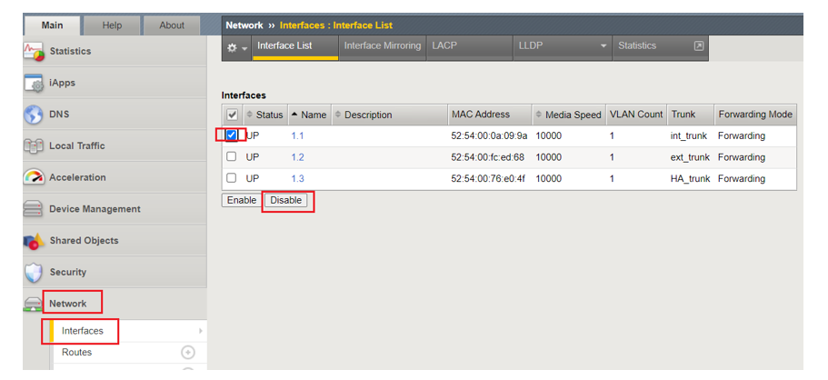
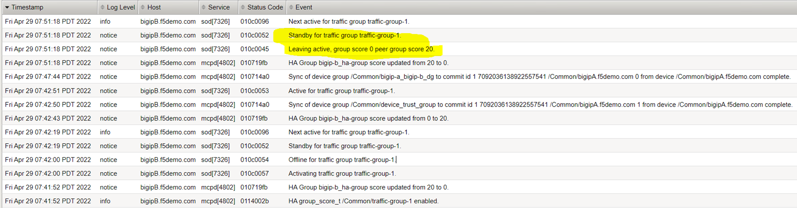
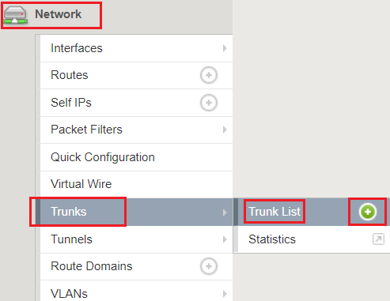
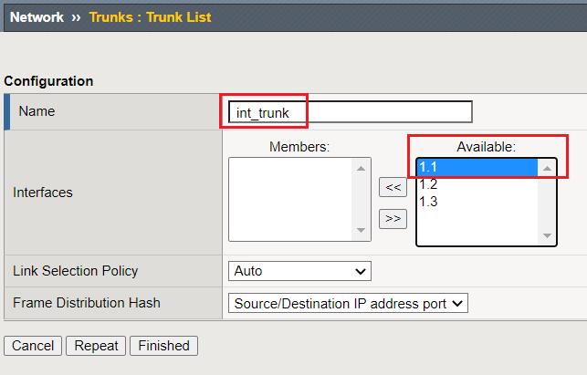

===================================================================
Lab 5: Validating, Testing & Troubleshooting HA Group Functionality
===================================================================

Now that we have succesfully configured HA Groups we will perform a series of validation tests as well as provide tips for troubleshooting
~~~~~~~~~~~~~~~~~~~~~~~~~~~

* Disable an interface to force HA Group actions

* In this task we will manipulate an interface on the active BIG-IP.   We will also disable an interface and observe BIG-IP behavior during failover.
   We will also monitor logs to review the failover process.

* On the active BIG-IP, Navigate to Network, Interfaces, and place  checkmark next to interface 1.1 then click on the **Disable** button.

* During this time observe the BIG-IP status in the upper-left corner of each BIG-IP.  Did a failover event occur and did state change?

*    Observe the log messages from each BIG-IP.  Previously, BIG-IP A was the Standby device.   Conversely, BIG-IP B was previously the Active
      device.

  .. image:: ../images/image91.png
         :width: 5.57547in
         :height: 0.64571in

  .. image:: ../images/image92.png
            :width: 5.57547in
            :height: 0.64571in

#.  We will now re-enable Interface 1.1 on the Standby BIG-IP by performing the following step.

  #. Navigate to Network, Interfaces, Interface List, and place  checkmark next to interface 1.1 then click the **Enable** button.

  .. image:: ../images/image92.png
            :width: 5.57547in
            :height: 0.64571in

#. Did a failover event occur?   If so, why or why not?

**This concludes the **BIG-IP HA Failover - do it the proper way** lab.

**Supplemental Resources:**

   `https://support.f5.com/csp/article/K16947`_

   `https://techdocs.f5.com/en-us/bigip-14-1-0/big-ip-device-service-clustering-administration-14-1-0.html`_

   `https://techdocs.f5.com/en-us/bigip-14-1-0/big-ip-device-service-clustering-administration-14-1-0/creating-an-active-standby-configuration-using-the-configuration-utility.html`_

   `https://support.f5.com/csp/article/K13946`_

   `https://support.f5.com/csp/article/K41983050`_

   `https://support.f5.com/csp/article/K41983050`_

   Ports	Device group members should be able to communicate over ports 443, 4353, 1026 (UDP), and 22 (recommended).
   BIG-IP ASM requires the following additional Policy Sync TCP ports: 6123-6128
**Appendix:**

   •	tmsh commands cheat sheet:

   Task 1:	Create BIG-IP Trunks

   tmsh create net trunk int_trunk interfaces add { 1.1 }
   tmsh create net trunk ext_trunk interfaces add { 1.2 }
   tmsh create net trunk HA_trunk interfaces add { 1.3 }

   Task 2:	Create BIG-IP VLANs

   tmsh create net vlan int_vlan_10 tag 10 interfaces add { int_trunk }
   tmsh create net vlan ext_vlan_20 tag 20 interfaces add { ext_trunk }
   tmsh create net vlan HA_vlan_30 tag 30 interfaces add { HA_trunk }

   Task 3:	Create BIG-IP Self IPs

   tmsh create net self self_vlan10 address 10.1.10.242/24 vlan int_vlan_10
   tmsh create net self self_vlan20 address 10.1.20.242/24 vlan ext_vlan_20
   tmsh create net self self_ha_vlan30 address 10.1.30.242/24 vlan HA_vlan_30

   Task 4:	Define Device Service Cluster High-Availability Settings

   tmsh modify cm device bigip1 configsync-ip 10.1.30.242
   tmsh modify cm device bigip1 unicast-address { { ip 10.1.10.242 } { ip 10.1.20.242 } }

Configure HA
~~~~~~~~~~~~

#.
#.
   .. image:: ../images/image1.png
      :width: 5.57547in
      :height: 0.64571in

   .. image:: ../images/image2.png
      :width: 5.57547in
      :height: 0.62307in

   #. Archive your work.

