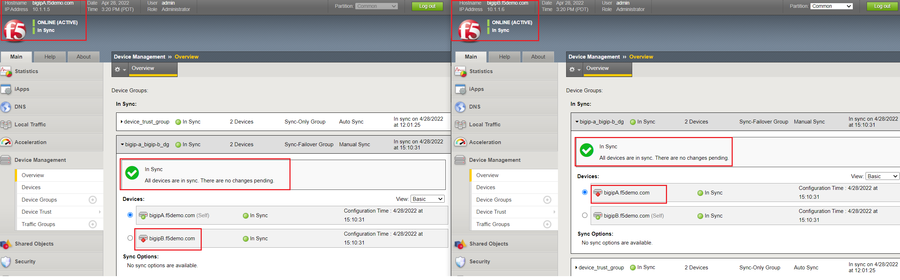
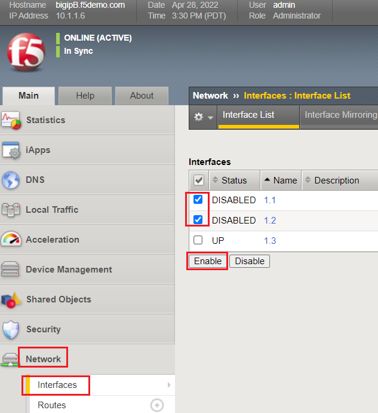

Lab 4:  Test & Validate a Failover Scenario
-------------------------------------------

In Lab 4, we will manipulate a BIG-IP interface to see how it affects basic failover events.

Lab Tasks:
**********
* Task 1: Disable a BIG-IP Interface
* Task 2: Enable both Interfaces on ACTIVE BIG-IP

Task 1: Disable a BIG-IP Interface
==================================

In Task 1, we will simulate a "link down" failure on the ACTIVE
BIG-IP, and determine if the BIG-IP will failover automatically.

We will compare the failover timing once we create & use our HA Group
configuration design.

BONUS: From the BIG-IP CLI, perform a "follow" of the */var/log/ltm* log
to see logging data in real-time:

-  Access the "WEB SHELL" from UDF for each BIG-IP:

   .. image:: ../images/image56.png
      

-  Run the following command at shell prompt:

   **tail -f /var/log/ltm**

   BIG-IP-A:

   .. image:: ../images/image57.png
   
   BIG-IP-B:

   .. image:: ../images/image58.png

#. From the **ACTIVE**, BIG-IP, **Navigate to**:  Network > Interfaces > place a checkmark next to 1.1 & click  the "Disable" button

   .. image:: ../images/image59.png
      :width: 10.23125in
      :height: 6.08333in

+-------------+-------------------------------------------------------+
| Question:   | Did the BIG-IP failover? Why or why not?              |
+=============+=======================================================+
| Answer:     | No, the BIG-IP did not failover, as the interface     |
|             | objects are not part of the HA configuration.         |
+-------------+-------------------------------------------------------+
| Log Output: | Apr 28 15:13:47 bigipB.f5demo.com info lacpd[7293]:   |
|             | 01160016:6: Interface 1.1, link admin status:         |
|             | disabled, link status: up, duplex mode: full, lacp    |
|             | operation state: down                                 |
|             | Apr 28 15:13:47 bigipB.f5demo.com info lacpd[7293]:   |
|             | 01160010:6: Link 1.1 removed from aggregation         |
|             | Apr 28 15:13:47 bigipB.f5demo.com notice mcpd[4745]:  |
|             | 01bb0003:5: Trunk: int_trunk is DOWN                  |
|             | Apr 28 15:13:47 bigipB.f5demo.com notice mcpd[4745]:  |
|             | 01b5004a:5: Link: 1.1 is DISABLED                     |
|             | Apr 28 15:13:50 bigipB.f5demo.com warning sod[7297]:  |
|             | 010c0083:4: No failover status messages received for  |
|             | 3.100 seconds, from device bigipA.f5demo.com          |
|             | (10.1.1.5) (unicast: -> 10.1.10.242).                 |
+-------------+-------------------------------------------------------+

#. Now, from the *ACTIVE* BIG-IP, Disable the 1.2 Interface.

   .. image:: ../images/image60.png
         :width: 7.57431in
         :height: 2.90764in

+----------+----------------------------------------------------------+
| Question | Did the BIG-IPs failover? Are they Active/Standby?       |
+==========+==========================================================+
| Answer   | No failover. Both BIG-IPs in an Active / Active state    |
+----------+----------------------------------------------------------+
| Logs:    | Apr 28 15:19:38 bigipB.f5demo.com info lacpd[7293]:      |
|          | 01160016:6: Interface 1.2, link admin status: disabled,  |
|          | link status: up, duplex mode: full, lacp operation       |
|          | state: down                                              |
|          | Apr 28 15:19:38 bigipB.f5demo.com info lacpd[7293]:      |
|          | 01160010:6: Link 1.2 removed from aggregation            |
|          | Apr 28 15:19:38 bigipB.f5demo.com notice mcpd[4745]:     |
|          | 01bb0003:5: Trunk: ext_trunk is DOWN                     |
|          | Apr 28 15:19:38 bigipB.f5demo.com notice mcpd[4745]:     |
|          | 01b5004a:5: Link: 1.2 is DISABLED                        |
|          | **Apr 28 15:19:41 bigipB.f5demo.com warning sod[7297]:   |
|          | 010c0083:4: No failover status messages received for     |
|          | 3.100 seconds, from device bigipA.f5demo.com (10.1.1.5)  |
|          | (unicast: -> 10.1.20.242).                               |
|          | Apr 28 15:19:41 bigipB.f5demo.com notice sod[7297]:      |
|          | 010c007e:5: Not receiving status updates from peer       |
|          | device bigipA.f5demo.com (10.1.1.5) (Disconnected).**    |
+----------+----------------------------------------------------------+

Task 2: Enable both Interfaces on ACTIVE BIG-IP
===============================================

In Task 2, we will re-enable our BIG-IP interfaces to restore connectivity.

#. **Navigate to**: Network > Interfaces > place checkmarks in 1.1 & 1.2, then click the "Enable" button:

Lab Summary
***********
In this lab, you tested & validated bringing down a BIG-IP interface, simulating a "link failure," and how that affects a failover event.  After completion of these lab tasks, you should have an understanding of how the BIG-IP behaves in a typical HA design.  The following labs will enhance the failover configuration, building a deeper understanding of best practices for HA.

This completes Lab 4.