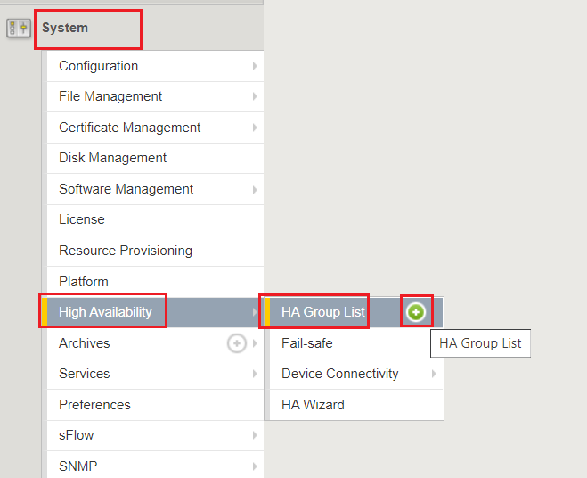

Lab 5:  Create & Enable HA Groups
=================================

Lab Tasks:
==========
* Task 1: Create HA Groups
* Task 2: Enable HA Group as the Preferred Failover Method

**Task 1: Create HA Groups**
^^^^^^^^^^^^^^^^^^^^^^^^^^^^

NOTES:

-  HA group configuration is device specific and is not synced between
   members of a DSC group.

   -  You must create a separate HA group on every device in the device
      group for this traffic group.

-  On each BIG-IP, create an HA Group:

   -  

+--------------+------------------------------------------------------+
| Navigate to: | System --> High Availability --> HA Group List -->   |
|              | click the "+" button                                 |
+--------------+------------------------------------------------------+

..

   

<<<<<<< HEAD

-  Add an HA Group Name; example: bigip-b_ha-group

   .. image:: ../images/image64.png
         :width: 4.28681in
         :height: 4.77778in

=======
-  .. image:: ../images/image63.png
      
.. _section-19:

~

-  Add an HA Group Name; example: bigip-b_ha-group

   -  .. image:: ../images/image64.png

.. _section-20:

>>>>>>> 4e2674a8b91fabc81b1e90a8272e75e58189698b

-  Next, we will add our External Gateway Pool we created earlier to the Pools HA Group Configuration:
    -  Click the "Add" button
|
       -  .. image:: ../images/image131.png
    -  In the Pool drop-down, select "ext_gw_pool," and click the "Add" button:
       -  .. image:: ../images/image132.png

<<<<<<< HEAD
   .. image:: ../images/image65.png
         :width: 7.66667in
         :height: 3.23125in

-  Add the External Trunk object, and click the "Add" button; repeat
   this step for the Internal Trunk object:

   .. image:: ../images/image66.png
         :width: 5.74097in
         :height: 3.33333in

=======

-  Next, we will add our Trunk links to our HA Group Configuration:
    -  Under the Trunks section, click the "Add" button:
       -  .. image:: ../images/image65.png
   

   -  From the drop-down, select the the External Trunk object (ext_trunk), and click the "Add" button:
       -  .. image:: ../images/image133.png
   -  Repeat this step for the Internal Trunk object (int_trunk):
       -  .. image:: ../images/image134.png

.. _section-21:

>>>>>>> 4e2674a8b91fabc81b1e90a8272e75e58189698b

-  Verify that your HA Group Trunk configuration reflects the following, and Click the "Create HA Group" button:

<<<<<<< HEAD
   .. image:: ../images/image67.png
         :width: 10.79653in
         :height: 2.07431in

-  Verify your HA Group Configuration; once complete, click the "Create
   HA Group" button:

   .. image:: ../images/image68.png
         :width: 10.66667in
         :height: 4.83333in

=======
    -  .. image:: ../images/image67.png

.. _section-23:

-
>>>>>>> 4e2674a8b91fabc81b1e90a8272e75e58189698b

-  After HA Group Creation, you should be presented with the following
   screen, showing your HA Group configuration object:

<<<<<<< HEAD
   .. image:: ../images/image69.png
         :width: 6.45347in
         :height: 1.99097in

=======
   -  .. image:: ../images/image69.png
>>>>>>> 4e2674a8b91fabc81b1e90a8272e75e58189698b

<<<<<<< HEAD
1.  Create a Default Gateway pool on the External VLAN

   - Navigate to Local Traffic --> Pools --> Pool List --> then click the \"\+\" button:       
       .. image:: ../images/image121.png
   - Create the pool with the following Settings:       
       .. image:: ../images/image122.png
=======
>>>>>>> 4e2674a8b91fabc81b1e90a8272e75e58189698b

**Task 2: Enable HA Group as the Preferred Failover Method**
^^^^^^^^^^^^^^^^^^^^^^^^^^^^^^^^^^^^^^^^^^^^^^^^^^^^^^^^^^^^

+--------------------------------+------------------------------------+
| On Active BIG-IP, Navigate to: | Device Management --> Traffic      |
|                                | Groups --> *traffic-group-1*       |
|                                | hyperlink                          |
+--------------------------------+------------------------------------+

<<<<<<< HEAD
.. image:: ../images/image70.png
      :width: 6.33333in
      :height: 2.5in

=======
   

-  .. image:: ../images/image70.png

   
>>>>>>> 4e2674a8b91fabc81b1e90a8272e75e58189698b

-  From the "Health Monitor" Section, select the drop-down for "HA
   Group:"

<<<<<<< HEAD
   .. image:: ../images/image71.png
         :width: 7.61111in
         :height: 7.28681in
=======
   -  .. image:: ../images/image71.png

>>>>>>> 4e2674a8b91fabc81b1e90a8272e75e58189698b

-  Select our HA Group we created previously:

   .. image:: ../images/image72.png
         :width: 3.87014in
         :height: 0.97222in

-  Under the Failover Configuration section, select the radio button for
   "Failover to Device With Best HA Score," then click the "**Save**"
   button:

   .. image:: ../images/image73.png
         :width: 6.12014in
         :height: 5.85208in

-  Review the Traffic Groups screen, and verify the Failover Method is
   set to HA Score:

   .. image:: ../images/image74.png
         :width: 7.85208in
         :height: 3.28681in

-  Perform this same procedure to setup the HA Group configuration on
   *bigipB.f5demo.com*

Lab Summary
^^^^^^^^^^^
In this lab, you enhanced your HA configuration to leverage HA Groups.  HA Groups provide the ability to monitor an "object" and take action upon and event.  After completion of these lab tasks, your BIG-IP should be leveraging HA Groups for failover.  In the following lab, we will test & validate how this configuration enhances the failover timing.

This completes Lab 5.