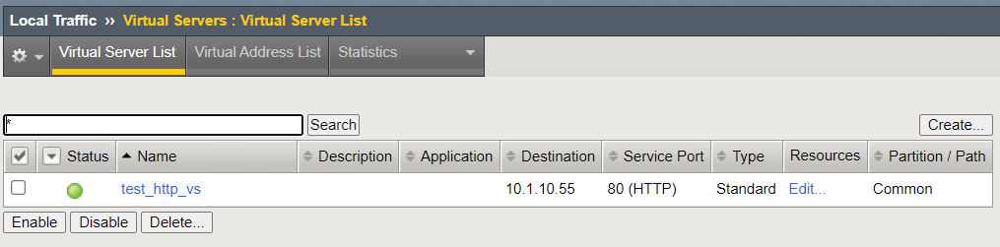
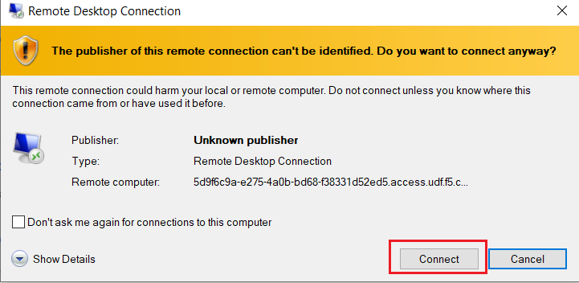
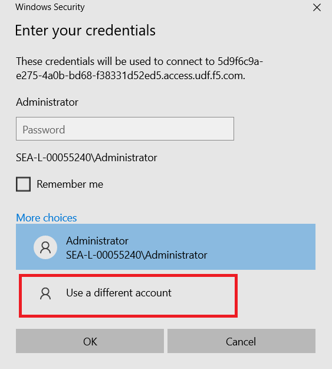
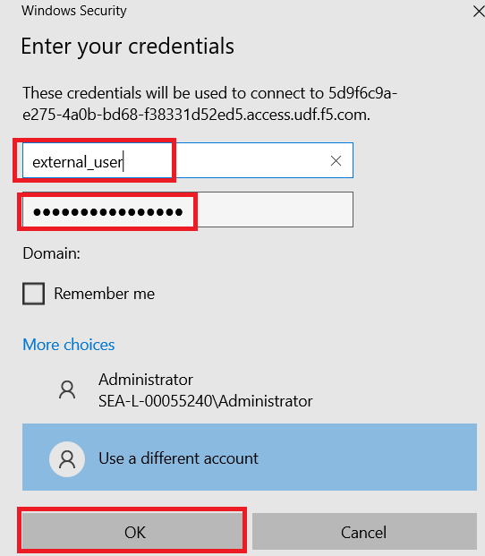

Lab 7: Persistence Mirroring and Connection Mirroring
-----------------------------------------------------

In Lab 7, we will continue to enhance & optimize the BIG-IP configuration for HA.  We will create Virtual Server configuration objects so that we can enhance our HA configuration with Connection & Persistence Mirroring.

Lab Tasks:
==========

* Task 1: Configure Persistence Mirroring Profile
* Task 2: Create LTM Pool Configuration Objects
* Task 3: Configure Connection mirroring
* Task 4: Perform a Configuration Synchronization between BIG-IPs
* Task 5: Test Virtual Server
* Task 6: Validate Persistence Information

Task 1: Configure Persistence Mirroring Profile
===============================================

We will create a new Persistence Profile, enabling persistence mirroring.

Persistance mirroring is used to share persistence information between BIG-IP's in a cluster.

.. note:: 
    
    - By default, persistence mirroring is **NOT** enabled.  
    - You will need to create a dedicated persistence profile that has this setting enabled.

.. note:: 
    
    - **DO NOT** edit default BIG-IP profiles
    - Always create a new profile with the desired settings and use the default profile as parent profiles
    - Default profiles will be overwritten with the next software update

#. On the **ACTIVE** BIG-IP, **Navigate to**: Local Traffic > Profiles > Persistence, and click the **"+"** button to create a new profile:

   .. image:: ../images/image136.png

#. Configure the following Settings for your Custom Persistence Profile:
 
   - **Name:** "source_addr_mirror_persist"
   - **Persitence Type:** Select Source Address Affinity from the Persistnece Type drop-down
   - **Parent Profile:** Ensure the Parent Profile is set to **source_addr**
    
   You will need to place a **checkmark** under the Custom setting for Mirror Persistence:

   .. image:: ../images/image137.png

   Place a **checkmark** in the Mirror Persistence field, and Click the **Finished** button:

   .. image:: ../images/image138.png

#. Search for "source" in the Search field, and you should see two Source Address profiles, one custom and one default:

   .. image:: ../images/image139.png

Task 2: Create LTM Pool Configuration Objects 
=============================================

We will create an LTM Pool Configuration object, which will be used for the backend server pool for our Virtual Server.

.. note:: 
    
    - These steps will be completed on the **ACTIVE** BIG-IP

#. **Navigate to**: Local Traffic > Pools > Pool List > click the **"+"** sign to create a new pool:

   .. image:: ../images/image114.png

#. Create the following Pool Configuration Objects:

   - **Server Pool:**
         
     -  **Name:** server_pool
     -  **Health Monitors:** gateway_icmp
     -  Within the Resources Section:
  
        - **New Node Address:** 10.1.10.200
        - **Service Port:** \* All Services
        - Click the **Add** button
 
        .. image:: ../images/image123.png

#. Click the **Finished** Button:

   .. image:: ../images/image135.png

#. After completion of this task, you should be presented with the following 2 pools:

   .. image:: ../images/image127.png

Task 3:  Configure Connection Mirroring
=======================================

.. note:: 
    - Connection mirroring is configured at the Virtual servers itself.

We will create a simple HTTP Virtual Server object.  
This will be used to demonstrate the additional failover features you can apply at the Virtual Server level.

#. **Navigate to**: Local Traffic > Virtual Servers > Virtual Server List, then click the **"+"** button:

   .. image:: ../images/image128.png

#. Create the Virtual Server with the following settings:

   - General Properties:

     -  **Name:**  test_http_vs
     -  **Type:**  Standard
     -  **Destination Address/Mask:**  10.1.10.55
     -  **Service Port:**  80 (HTTP)    

        .. image:: ../images/image129.png

#. From the Configuration section, at the Basic drop-down, select **Advanced**, and configure the following settings:

   .. image:: ../images/image140a.png

   - **Connection Mirroring:**  Place a **checkmark** on this setting

     .. image:: ../images/image141.png

     .. image:: ../images/image143.png
          
   
   .. note:: 
- We have now finished the configuration for connection mirroring.
- The following steps are required to finish the virtual server configuration so you can test the service. 

   - **Source Address Translation:**  From the drop-down, select AutoMap:

     .. image:: ../images/image148.png
   
   - Under the  **Resources:** Section, Define the following settings, and Click the "Finished" Button:
     
     - **Default Pool:**  server_pool
     - **Default Persistence Profile:**  source_addr_mirror_persist
  
       .. image:: ../images/image142.png

You should be presented with the following Virtual Server object after creation:

Task 4:  Perform a Configuration Synchronization between BIG-IPs
================================================================

**On the ACTIVE BIG-IP**

#. Notice the **Changes Pending** in the upper-left corner

   .. image:: ../images/image52.png

#. Click this hyperlink to go to the Overview screen.

#. Review the recommendations, and perform a ConfigSync to peer

   .. image:: ../images/image53.png

#. While the configuration is being pushed, you will see a **Syncing** icon display in the middle:

   .. image:: ../images/image54.png

#. Once the ConfigSync process is complete, your BIG-IPs should indicate an **In Sync** state, and be in an Active / Standby cluster

#. Verify the sync state:

   .. image:: ../images/image55.png

Task 5: Test Virtual Server
===========================

Pending time, Tasks 5 & 6 are optional.  These Tasks will validate how you can verify persistence records & information.

In a typical HA design, without connection mirroring enabled, only the **ACTIVE** BIG-IP is state-aware of client's sessions.  However, in this lab, we enabled Connection Persistence & Mirroring.

We can test & validate these settings by connecting to our Virtual Server, and review the BIG-IP details to confirm each BIG-IP has sessions (i.e. mirrored configuration).

You will access our UDF Windows Jumphost via RDP for this Task.

#. From UDF, navigate to your components tab, find the Windows Jumphost under Systems, and click the drop-down for **Access**. Select your preferred RDP session.

   .. image:: ../images/image216.png

#. Launch / click the RDP file extension, and Click the **Connect** button at the pop-up prompt:

#. At the "Enter your Credentials" window prompt, select the **More Choices** option, and choose **Use a different account**:

.. image:: ../images/image219.png

#. Use the following credentials, and click the **OK** button:
  - User Name = external_user
  - Password =  admin.F5demo.com

#. If presented with a Security Warning, please click **YES** button: 

   .. image:: ../images/image222.png

#. You should now be logged into your RDP Jumphost; open Chrome browser from the Taskbar, and connect to BIG-IP Virtual Server http://10.1.10.55:

   .. image:: ../images/image223.png

#. You should be presented with a generic NGINX website!  You may "refresh" your page multiple times to generate traffic.

   .. image:: ../images/image224.png

Task 6: Validate Persistence Information
========================================

In this Task, we will confirm mirroring & persistence configuration is present on the BIG-IPs.  We will perform these validation tasks from our traffic management shell (tmsh).

#.  From UDF, in your Components list, use the drop-down under Access of each BIG-IP and open a Web Shell:

   .. image:: ../images/image225.png

#. From each BIG-IP, enter into the traffic-management shell (tmsh); type **tmsh** and hit Enter; you should be placed into (tmos) prompt:

   .. image:: ../images/image226.png

#. Verify the Client Connection to the Virtual Server:

    - Use the following command from (tmos) prompt:  
       - *show sys connection cs-server-addr 10.1.10.55*

.. note:: If you are **NOT** seeing connection information, you may have to generate additonal traffic to your Virtual Server from your RDP Jumphost. Keep refreshing the web browser to create a session.

#. Observe that **EACH** BIG-IP is session-aware of this client session to the Virtual Server. Typically, without connetion mirroring, only the **ACTIVE** BIG-IP would have this session:

BIG-IP-A (Standby):
   
   .. image:: ../images/image227.png

BIG-IP-B (Active):
   
   
   .. image:: ../images/image228.png

#. Verify Persistence Records

    - Review the persistence details for our connection.  Use the following tmsh command on EACH BIG-IP:
       - *show ltm persistence persist-records all-properties*

BIG-IP-A (Standby):
   
   .. image:: ../images/image229.png

BIG-IP-B (Active):
   
   
   .. image:: ../images/image230.png

Lab Summary
===========

In this lab, you enhanced your HA configuration to leverage HA Groups with connection mirroring and persistence mirroring. 

With persistance mirroring and connection mirroring you enable your BIG-IP HA Cluster for a seemless failover without client interruption.

This completes lab 7, and concludes the **BIG-IP HA Failover - Do it the Proper Way** lab.

We hope this lab experience was educational and beneficial.  If you have any feedback, or suggestions on making this better, please provide feedback.

Thank you, 
F5 Solutions Engineers