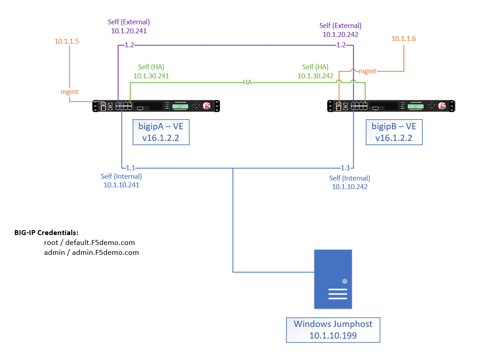

BIG-IP HA - do it the proper way
================================

Time and time again we have seen customers setting up a basic HA setup.
Customer expactation was that in case of a failover the event would be seemless. 
They were surprised that the failover had production traffic impact and were cautious what to expect in the future.

In this lab we will create a BIG-IP active/standby pair with best practices.
The result is a failover configuration that allows minimal impact in case of a failover event.

In order to achieve this, we will address following BIG-IP topics:

1. Architecture - HA Vlan 
2. Layer 2 link failure detection - use Trunks
3. HA Basics 
4. MAC masquerade - address gratuitous ARP issues
5. GW pool - use HA groups to identify network layer issues
6. High avalability (HA) Groups - Failover method
7. Connection mirroring 
8. Persistance mirroring

Architecture
------------

The HA VLAN will be used for HA information, like connection mirroring, HA status updates, config sync and others.

For a secure HA setup it is recommended that the failover information is not send over a data interface/VLAN.
Therefore customer should always use a dedicated HA VLAN. 

The data interafaces should exchange heartbeat information. Therefore the port lockdown on the data interfaces should be set to custom and allow only UDP port 1026.

The HA VLAN self-IP should have port lockdown set to default. The self-IP should be in a IPv4 /29 network CIDR range.

Layer 2 link failure detection
------------------------------

BIG-IP TMOS has no exposure to the physical link state. It does not know if a link is up or down. 

In the past this limitation was handled by a feature called "VLAN Failsafe". 
VLAN Failsafe monitored the traffic on a specific VLAN and acted if no traffic was received. This method took between 10 and 40 seconds to detect a physical link failure.

A better way to failover on Layer 2 link failure is the use of Trunks and High availability (HA) groups.

Why Trunks?
+++++++++++

A trunk can be used for Link Aggregation or channeling of multiple physical interfaces in one bigger pipe.
At the same time a trunk can have only a single interface applied. 

BIG-IP TMOS can see the number of interfaces in a trunk. So we will use this ability to track the link status if a physical interface is up or down. 

**Every physical interface will be part of a trunk.** 

If your architecture uses one interface for external and one interface for internal traffic, then create two Trunks with one interface in each Trunk.

So the trunk object allows BIG-IP TMOS to failover if the one interface in the trunk goes down.

.. note:: **Remember**: Always create a Trunk first. Do not assing VLANs to physical interfaces, assign them to trunks.

Physical interfaces that use a multiple VLANs 
+++++++++++++++++++++++++++++++++++++++++++++

If a physical interface uses 802.1Q VLAN tagging, then it is enough to monitor a single VLAN from that trunk for interface Failover.  

HA Basics
---------

Device Trust
++++++++++++

Create the device trust.

Config Sync
+++++++++++

Set the IP address on the HA VLAN to be config sync address. 

Failover network
++++++++++++++++
We will use Failover **Unicast** Configuration only. Do not use Failover Multicast configuration.

Add all data interfaces and the management interface. **Do not** add HA interface IP address. 

Mirroring
+++++++++

Set the HA VLAN IP address as "Primary Local Mirror Address"

Device Group
++++++++++++

Create a device group with a name of your choice. Include both BIG-IPs and set the Sync type to "Manual with Full Sync"

The setting "Manual with full sync" is best practice for the first sync. It can be changed later.

MAC masquerade
--------------

BIG-IP's default failover mechanism is based on gratuitous ARP.
BIG-IP has to send a gratuitous ARP for every floating IP and service IP address like virtual server IP address and SNAT address.
The gratuitous ARP contains the physical MAC address of the new primary BIG-IP.
With gratuitous ARP, the device that takes over sends gratuitous ARP packets, which asks all hosts on the LAN segment to update their ARP table. 
After the hosts updated their ARP table with the MAC address of the new primary BIG-IP, they send all traffic to the active BIG-IP.

Sometimes hosts like Firewalls or routers do not update their ARP table when they receive a gratuitous ARP.
In this case the firewall or router will keep sending traffic to the old MAC address, which leads to service intererruption.

This issue can be addressed with MAC masquerade.

With MAC masquerade configured, BIG-IP devices will use the MAC masquerade address as source MAC for packets leaving BIG-IP.
In case of a failover, the MAC address will not change.
The new primary BIG-IP will start using the MAC masquerade MAC address.
Now there is no need to update the hosts ARP table. 

The MAC address used for MAC masquerade is free configurable. 
A best practices guide how to choose the MAC masquerade MAC address is described in K-Article K3523. https://support.f5.com/csp/article/K3523

For more information on MAC masquerade see K-Article K13502
https://support.f5.com/csp/article/K13502

Architectures that are recomended for MAC masquerade:
+++++++++++++++++++++++++++++++++++++++++++++++++++++

Traditional Datacenter deployments with BIG-IP applicances, Viprion or Velos Chassis

Architectures that are not recommended for MAC masquerade:
++++++++++++++++++++++++++++++++++++++++++++++++++++++++++

BIG-IP Virtual Edition deployments on VMWare ESXi.

Per default ESXi does not support multiple MAC addresses on a single NIC. 
To enable MAC masquerade the ESXi port group has to have promiscuous mode enabled. 
Check VMWare documentation on promiscuous mode.

Architectures that do not support MAC masquerade:
+++++++++++++++++++++++++++++++++++++++++++++++++

BIG-IP VE deployments in public cloud providers like AWS, Azure and GCP

GW pool
-------

We will use a pool object to facilitate failover for a HA Group. 
The pool member for this pool is the default gateway of the BIG-IP.

We will use a custom gateway_icmp monitor with a short timeout (e.g. 4 sec) and a short interval (1 second).

These settigns will allow BIG-IP to failover within 4 seconds if it cannot reach its default gateway.

Alernative to the default gateway, there can be other IP endpoints within the network that can be monitored within this pool.
As long as thee are pool members available, BIG-IP will assume the network layer is reachable and not use this as a failover trigger.

High availability (HA) Groups
-----------------------------

An HA group is a high availability feature that allows you to specify a set of configuration objects such as trunks, pools, and VIPRION clusters that may be used to raise failover for redundant BIG-IP systems. 
When you associate an HA group with a traffic group instance on a specific device, the BIG-IP system calculates a health score for that device for the associated traffic group, based on trunk, pool, or cluster availability. 
This HA health score determines the device that should be active at any given time and then triggers failover if necessary. 

Best practices on HA groups:
https://support.f5.com/csp/article/K16947

connection mirroring
--------------------

BIG-IP TMOS is a statefull proxy. 
It performs traffic forwarding and most of the time changes source/destination packet information like IP addresses and/or ports.
BIG-IP keeps track of these changes in it's connection table. 

If the connection information is not mirrored to the standby device, then all existing traffic flow during the failover will be interrupted.
Clients will have to establish a new connection, which is perceived as service discruption. 

The importance of connection mirroring is depending on the protocol. 
HTTP based protocols can carry their persistent information at higher layers, so that the individual connection might not be problematic if it has to be rebuild.
Other protocols like FTP are more sensitive, because a large file download might have to restart after a failover.

Per default the connection information is not mirrored to the standby BIG-IP. This has to be done for each Virtual server. 
This allows customers to decide which Virtual IP to mirror and which not.

performance Impact of connection mirroring
++++++++++++++++++++++++++++++++++++++++++

Enabling connection mirroring can have a performance impact in terms of higher CPU load.
The performance impact depends on the type of application traffic and on the Virtual server type.

Performance Layer 4 virtual servers copy the connection setup and connection close packets to the standby device.

Standard virtual server copy the complete data stream to the standby device.

recommended interface speed for connection mirroring
++++++++++++++++++++++++++++++++++++++++++++++++++++

Since the connection mirroring traffic can be significant, it is recommended that the interface speed for the VLAN used for connection mirroring is the same speed as the external inteface.

e.g. is the external interface speed is 10 Gbit/s then the connection mirroring interface should be 10 Gbit/s as well. 

More information on connection mirroring
https://support.f5.com/csp/article/K84303332

persistance mirroring
---------------------

Applications can require that once a client is load balanced to a specific pool member, subsequent requests will be send to the same pool member.
It is important that the persistence information is copied to the standby device, to prevent the same client to be send to another pool member after the failover.
Persistence mirroring is used that.

Persistence information is only send when a new persistence record is created or an old record expired. It has less performance impact on BIG-IP than connection mirroring.

