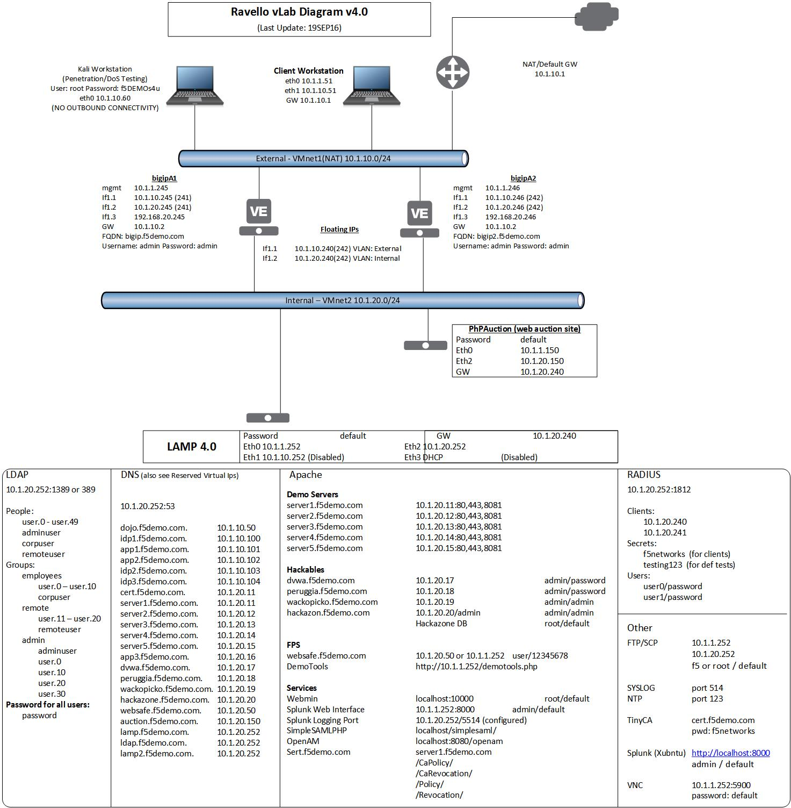

Lab Network Setup
-----------------

In the interest of focusing as much time as possible configuring your
application delivery controller, we have provided some resources and
basic setup ahead of time. These are:

-  Cloud-based lab environment complete with a Windows workstation, a
   virtual BIG-IP (VE), a virtual BIG-IQ acting as a logging node, a
   virtual BIG-IQ acting as a management node, and a back-end banking
   application running on a Linux web server.

-  The virtual BIG-IP has been pre-licensed

If you wish to replicate these labs in your office you will need to
perform these steps accordingly. Additional lab resources are provided
as illustrated in the diagram on the next page.

To access the lab environment, you will require a web browser and
Remote Desktop Protocol (RDP) client software. The web browser will be
used to access the lab training portal. The RDP client will be used to
connect to a Windows workstation, where you will be able to access the
BIG-IP and BIG-IQ management interfaces (HTTPS, SSH).

You class instructor will provide additional lab access details.

Lab Diagram
^^^^^^^^^^^

|image0|

Timing for Labs
^^^^^^^^^^^^^^^

The time it takes to perform each lab varies and is mostly dependent on
accurately completing steps. This can never be accurately predicted but
we strived to derive an estimate among several people each having a
different level of experience. Below is an estimate of how long it will
take for each lab:

+------------------------------------------------------+------------------+
| LAB Name (Description)                               | Time Allocated   |
+======================================================+==================+
| LAB 1 - Networking, Pools and Virtual Servers        | 15 minutes       |
+------------------------------------------------------+------------------+
| LAB 2 - Load Balancing, Monitoring and Persistence   | 15 minutes       |
+------------------------------------------------------+------------------+
| LAB 3 - SSL Offload and Security                     | 10 minutes       |
+------------------------------------------------------+------------------+
| LAB 4 - BIG-IP Policies and iRules                   | 10 minutes       |
+------------------------------------------------------+------------------+
| LAB 5 - Device Service Clusters (DSC)                | 15 minutes       |
+------------------------------------------------------+------------------+
| Bonus Lab - Support and Troubleshooting              | 10 minutes       |
+------------------------------------------------------+------------------+

