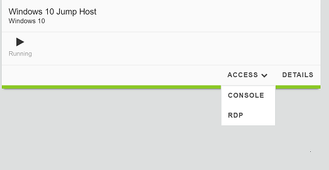
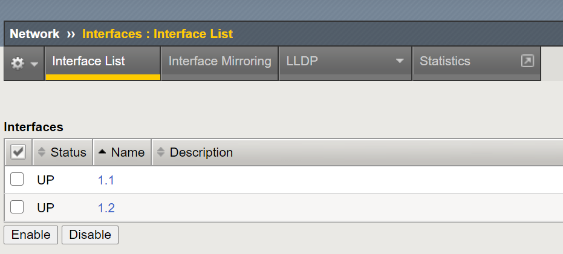
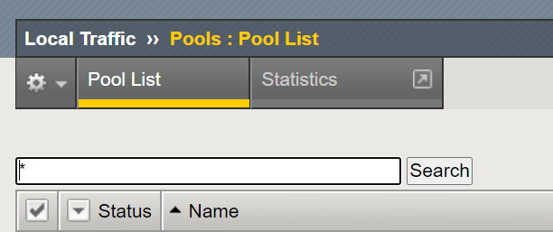
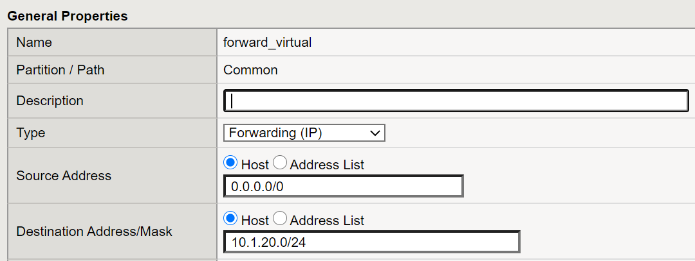
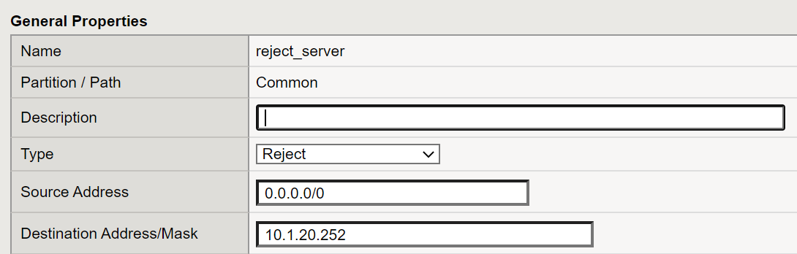

Lab 1: Explore the F5 BIG-IP network configuration
--------------------------------------------------

It is assumed that you have already licensed each of the BIG-IP devices. In this lab you will explore network settings on the BIG-IP.
You will also configure a default route, internal and external vlans, and finally you will configure Self-IP
Addresses and map them to individual VLANs.

^^^^^^^^^^^^^^^^^^^^^^^^^^^^^^^^^^^^^^^^^^^^^^^^^^^^^^^^^^^^^^^^^^^^^^^^

**Task 1** – Connect to the Windows 10 Jumphost via Remote Desktop Protocol **RDP**
Select the **ACCESS** drop down menu under Windows 10 and choose the **RDP** with an appropriate resolution option.

   |image1|

^^^^^^^^^^^^^^^^^^^^^^^^^^^^^^^^^^^^^^^^^^^^^^^^^^^^^^^^^^^^^^^^^^^^^^^^

The Windows 10 Jumphost Remote RDP User ID and Password is located within the
**Documentation** Section.   If you are using MAC or non Windows system you may
need to download the Microsoft Remote Desktop App from the Mac App Store.

  |image24|

#. From the Windows 10 Jumphost using a web browser (Chrome), log into BIG-IP01 (https://10.1.1.4) system with the below credentials.

   **U:** admin **P:** admin.F5demo.com

#. While logged into the BIG-IP01 gui click on the Network menu object, then click on the Interfaces object. Note that there are two interfaces labeled 1.1 and 1.2

   The **Network** menu is where you configure elements for routing and switching.

   |image2|

#. Network interface 1.1 is assigned to the external network while interface 1.2 is assigned to the internal network

#. Now we will create VLANs on these interfaces.

#. From within the **Network** menu click on the VLANs object then click on the **Create**.

#. Enter the name **external**.  Select interface 1.1, click the Tagging drop down menu and ensure the interface is set to **Untagged** then click on the **Add** button.

   Note: The BIG-IP will assign VLAN tags automatically starting from 4094 and decreasing if a tag is not provided.

#. Follow the same process for creating a VLAN named **internal** while ensuring interface 1.2 is selected as **Untagged**.

#. Now we will configure two Self-IP Addresses.

#. From within the **Network** menu click on Self IPs object and click **Create**.

#. Name the first Self IP object **external_selfip**.

#. Assign the 10.1.10.245 IP Address, with a Netmask of 255.255.255.0

#. Ensure the VLAN/Tunnel is set to **External**, while the Port Lockdown should be configured for **Allow None**.

#. Follow the same process for **internal_selfip** using **Internal** VLAN with the following IP Address and Netmask.

   10.1.20.245/255.255.255.0

#. Click Finished after configuring each of the Self IP Addresses

#. The next task is to configure a Network Default Route.

#. Under the Network menu click on the Routes object and click the Add button.

#. Name the Network Default Route object **default_route**

#. The Destination and Netmask should be 0.0.0.0/0 and 0.0.0.0/0

#. Ensure Use Gateway is selected and Gateway Address is set to IP Address.

#. Enter the address 10.1.10.1 and click Finished

^^^^^^^^^^^^^^^^^^^^^^^^^^^^^^^^^^^^^^^^^^^^^^^^^^^^^^^^^^^^^^^^^^^^^^^^

**Task 2** – Create a Pool BIG-IP object and a Virtual Server

We will be configuring a Pool with four member objects.  A pool is a group of pool members.   With few exceptions, all the members of a given pool
host the same content.   Pools are named, and like most objects on BIG-IP systems, their names can begin with a letter or underscore as well as numbers but
should not contain spaces.  Pools also have thier own load balancing method, monitors, and other features defined when a pool is created or modified.
When a new connection is initiated to a virtual server that is mapped to a pool, various criteria, including the pools load balancing method may be used
to determine which member to use for that request.

^^^^^^^^^^^^^^^^^^^^^^^^^^^^^^^^^^^^^^^^^^^^^^^^^^^^^^^^^^^^^^^^^^^^^^^^

#. Open the **Local Traffic > Pools > Pool List** page and click
   **Create**.

   |image3|

#. Use the following information for the new pool. For fields that are
   not specified, leave them set to the default settings.

   +---------------+------------------------------------+
   | Form field    | Value                              |
   +===============+====================================+
   | Name          | LAMP_Server1                       |
   +---------------+------------------------------------+
   | New Members   | Node Name: LAMP_Server1            |
   |               | Address: 10.1.20.11                |
   |               | Service Port: 80 (Click **Add**)   |
   +---------------+------------------------------------+
   | Name          | LAMP_Server2                       |
   +---------------+------------------------------------+
   | New Members   | Node Name: LAMP_Server2            |
   |               | Address: 10.1.20.12                |
   |               | Service Port: 80 (Click **Add**)   |
   +---------------+------------------------------------+
   | Name          | LAMP_Server3                       |
   +---------------+------------------------------------+
   | New Members   | Node Name: LAMP_Server3            |
   |               | Address: 10.1.20.13                |
   |               | Service Port: 80 (Click **Add**)   |
   +---------------+------------------------------------+
   | Name          | LAMP_Server4                       |
   +---------------+------------------------------------+
   | New Members   | Node Name: LAMP_Server4            |
   |               | Address: 10.1.20.14                |
   |               | Service Port: 80 (Click **Add**)   |
   +---------------+------------------------------------+

#. Click **Finished**.

#. Open the **Local Traffic > Virtual Servers > Virtual Server List**
   page and click **Create**.

#. Use the following information for the new virtual server, and then
   click **Finished**.

   +-----------------------------+-----------------+
   | Form field                  | Value           |
   +=============================+=================+
   | Name                        | LAMP            |
   +-----------------------------+-----------------+
   | Destination Address/ Mask   | 10.1.10.200     |
   +-----------------------------+-----------------+
   | Service Port                | 80              |
   +-----------------------------+-----------------+
   | Source Address Translation  | Auto  Map       |
   +-----------------------------+-----------------+
   | Resources > Default Pool    | LAMP            |
   +-----------------------------+-----------------+

#. Use a new tab to access **http://10.1.10.200**.

#. Use **Ctrl + F5** to reload the page several times.

   You should notice the LAMP Pool displaying the respective page elements from all members.
   That’s all it takes to create a basic web application on the BIG-IP system.

#. Close the tab.

#. In the Configuration Utility, open the **Local Traffic > Pools >
   Statistics** page.

#. Expand the **LAMP** pool by clicking on the **+** icon.

   |image4|

   You use the **Statistics** page to identify the amount of traffic sent
   to the pool members. Notice that the requests are evenly distributed
   across all three web servers.

#. Select the checkbox next to **LAMP**, and then click **Reset**.

^^^^^^^^^^^^^^^^^^^^^^^^^^^^^^^^^^^^^^^^^^^^^^^^^^^^^^^^^^^^^^^^^^^^^^^^

**Task 3** – Create an IP Forwarding Virtual Server

An IP forwarding virtual server accepts traffic that matches the virtual server address and forwards it to the destination IP address
that is specified in the request rather than load balancing the traffic to a pool. Address translation is disabled when you create an
IP forwarding virtual server, leaving the destination address in the packet unchanged. When creating an IP forwarding virtual server,
as with all virtual servers, you can create either a host IP forwarding virtual server, which forwards traffic for a single host address,
or a network IP forwarding virtual server, which forwards traffic for a subnet.

^^^^^^^^^^^^^^^^^^^^^^^^^^^^^^^^^^^^^^^^^^^^^^^^^^^^^^^^^^^^^^^^^^^^^^^^

#. From the Windows 10 Jump Host use a new tab to attempt direct access to an internal web server at
   **http://10.1.20.15**.

   Currently you are unable to access resources on the internal network
   from the external Windows workstation.

#. Open the **Start** menu and type **cmd**, then right-click
   **cmd.exe** and select **Run as administrator**, and then click
   **Yes**.

#. At the command prompt, type (or copy and paste):

   ``route add 10.1.20.0 mask 255.255.255.0 10.1.10.245``

   This adds a route to the **10.1.20.0** network through the external self
   IP address (**10.1.10.245**) of the BIG-IP system.

#. Reload the page directed at **http://10.1.20.15**.

   The request fails again, as the BIG-IP system does not have a listener
   to forward this request to the internal network.

#. In the Configuration Utility, open the **Local Traffic > Virtual
   Servers > Virtual Server List** page and click **Create**.

#. Use the following information for the new virtual server, and then
   click **Finished**.

   +-----------------------------+--------------------+
   | Form field                  | Value              |
   +=============================+====================+
   | Name                        | forward\_virtual   |
   +-----------------------------+--------------------+
   | Type                        | Forwarding (IP)    |
   +-----------------------------+--------------------+
   | Source Address/ Mask        | 0.0.0.0/0          |
   +-----------------------------+--------------------+
   | Destination Address/ Mask   | 10.1.20.0/24       |
   +-----------------------------+--------------------+
   | Service Port                | \* All Ports       |
   +-----------------------------+--------------------+
   | Protocol                    | \* All Protocols   |
   +-----------------------------+--------------------+
   | Source Address Translation  | Auto Map           |
   +--------------------------------------------------+

   |image5|

   This virtual server provides access to the **10.1.20.0/24** network on
   all ports and all protocols.

#. Reload the page directed at **http://10.1.20.15**.

   The request is successful. The BIG-IP system doesn’t act as a full
   proxy, it simply forwards requests to the internal network.

You now have access to all ports and all protocols on the **10.1.20.0**
network.

^^^^^^^^^^^^^^^^^^^^^^^^^^^^^^^^^^^^^^^^^^^^^^^^^^^^^^^^^^^^^^^^^^^^^^^^

**Task 4** – Create a Reject Virtual Server

A Reject virtual server rejects any traffic destined for the virtual server IP address.

^^^^^^^^^^^^^^^^^^^^^^^^^^^^^^^^^^^^^^^^^^^^^^^^^^^^^^^^^^^^^^^^^^^^^^^^

#. In the Configuration Utility, on the **Virtual Server List** page
   click **Create**.

#. Use the following information for the new virtual server, and then
   click **Finished**.

   +-----------------------------+-----------------------+
   | Form field                  | Value                 |
   +=============================+=======================+
   | Name                        | reject\_server        |
   +-----------------------------+-----------------------+
   | Type                        | Reject                |
   +-----------------------------+-----------------------+
   | Source Address/ Mask        | 0.0.0.0/0             |
   +-----------------------------+-----------------------+
   | Destination Address/ Mask   | 10.1.20.252           |
   +-----------------------------+-----------------------+
   | Service Port                | \* All Ports          |
   +-----------------------------+-----------------------+
   | Protocol                    | \* All Protocols      |
   +-----------------------------+-----------------------+

   |image6|

#. Reload the page directed at **http://10.1.20.252**.

#. Although you still have access to the **10.1.20.0** network, you no
   longer have access to **10.1.20.252** (LAMP Server).

#. Close the **Browser Tab**.

#. In the command prompt type the following, and then close the command
   prompt.

   ``route DELETE 10.1.20.0``

#. In the Configuration Utility, select the **forward\_virtual** and
   **reject\_win\_server** checkboxes and then click **Delete** and
   **Delete** again.

^^^^^^^^^^^^^^^^^^^^^^^^^^^^^^^^^^^^^^^^^^^^^^^^^^^^^^^^^^^^^^^^^^^^^^^^

Task 5 – Use Different Pool Options

^^^^^^^^^^^^^^^^^^^^^^^^^^^^^^^^^^^^^^^^^^^^^^^^^^^^^^^^^^^^^^^^^^^^^^^^

#. Open the **Local Traffic > Pools > Pool List** page and click
   **LAMP** pool, and then open the **Members** page.

     Currently the pool is using the default load balancing method: **Round Robin**.

#. From the **Load Balancing Method** list select **Ratio (member)**,
   and then click **Update**.

#. Examine the **Current Members** section.

   Currently all members of the LAMP pool member have a ratio of (**1**).

#. Given that there are four members of the LAMP pool we can modify the ration
   of connections to each pool member.  As an example let's go ahead and change
   ratio value for LAMP_Server1 to 4, assign a ratio value of 3 to pool member LAMP_Server2,
   a ratio value of 2 to pool member LAMP_server3, and a ratio value of 1 to
   pool member LAMP_Server1.  The effect this would have is that connection requests would
   be distributed to members of the LAMP pool in following manner **4, 3, 2, 1**.

#. The BIG-IP system provides several Ratio load balancing methods for load balancing traffic
   to pool members including the following:

   +-----------------------------+----------------------------------------------+
   | Form field                  | Value                                        |
   +=============================+==============================================+
   | Ratio (member)              | Ratio member is recommended when the server  |
   |                             | capacity of pool members is different        |
   +-----------------------------+----------------------------------------------+
   | Ratio (Node)                | Ratio Node method can be used when the       |
   |                             | server capacity of pool members is different |
   |                             | and user specified weights are applied to    |
   |                             | all pools which each nodes is a member.      |
   +-----------------------------+----------------------------------------------+
   | Ratio (session)             | Ratio session method can be used for message |
   |                             | based load balancing protocols such as       |
   |                             | RADIUS, DIAMETER, or other protocols         |
   +-----------------------------+----------------------------------------------+
   | Ratio Least Connections     | Use this method when you want the BIG-IP     |
   | (member)                    | to weight connections to each pool member    |
   +-----------------------------+----------------------------------------------+
   | Ratio Least Connections     | Us this method allows the BIG-IP to assign   |
   |                             | ratio weights applies to all pools of which  |
   |                             | each node is a member                        |
   +-----------------------------+----------------------------------------------+
   | Dynamic Ratio               | Dymanic Ratio load balancing actively polls  |
   |                             | pool members and assigns a weight value      |
   |                             | to each member.                              |
   +-----------------------------+----------------------------------------------+

This concludes Lab 1 and a basic introduction into networking concepts,
Virtual Servers, Pools, and Load Balancing methods. Please begin Lab 2.

.. |image4| image:: images/image4.PNG
   :width: 3.32107in
   :height: 0.33645in

.. |image24| image:: images/image24.PNG
   :width: 3.32107in
   :height: 0.33645in
