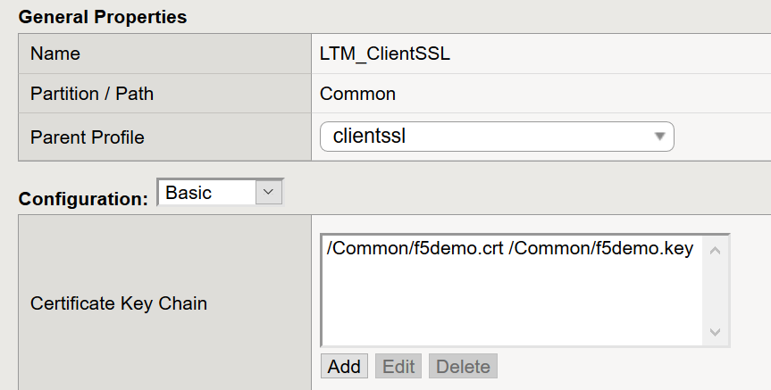
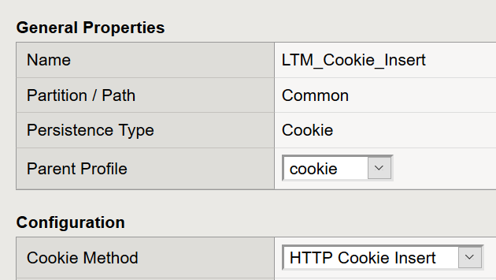

Lab 3: Working with SSL and Persistence
----------------------------------
Profiles are a powerful configuration tool providing an easy
way to define traffic policies and apply those policies across
many virtual servers.  Profiles allow one to change a setting
for traffic across different applications.   Profiles provide
the following:

-  A centralized place to define specific traffic behavior

-  A centralized place to change any setting and have them
   applied to all applications using an existing profile

**Profile Types**

Profiles are grouped to make configuration clearer.  In general, a virtual
server would have at most one profile from a given group.   There are multiple
types of profiles:

-  Services
-  Content
-  Persistence
-  Protocols
-  SSL
-  Authentication
-  Message Routing
-  Other

When you configure a profile you must use an existing profile as template (the parent)
make the desired changes, and save the new profile.   The parent can either be one of
the default templates or a custom template.  If the parent is later changed, the
changes may flow through to your custom profile.

^^^^^^^^^^^^^^^^^^^^^^^^^^^^^^^^^^^^^^^^^^^^^^^^^^^^^^^^^^^^^^^^^^^^^^^^

**Task 1** – Configure a custom Client SSL Profile

^^^^^^^^^^^^^^^^^^^^^^^^^^^^^^^^^^^^^^^^^^^^^^^^^^^^^^^^^^^^^^^^^^^^^^^^

#.  From the Windows 10 Jump Host log into BIG-IP01

#.  Click on **Local Traffic**, then click on **Profiles, SSL,** and then click on the
    **+** sign next to **Client** to create a new Client SSL Profile

#.  Name the custom Profile **LTM_ClientSSL**

#.  Check the **Custom** box

#.  Click on the Add button within the **Certificate Key Chain** section

#.  Select the **f5demo.crt** Certificate, then select the **f5demo.key** and click Add

#.  Click **Finished**

|image11|

^^^^^^^^^^^^^^^^^^^^^^^^^^^^^^^^^^^^^^^^^^^^^^^^^^^^^^^^^^^^^^^^^^^^^^^^

**Task 2** - Configure a custom Persistence Profile

^^^^^^^^^^^^^^^^^^^^^^^^^^^^^^^^^^^^^^^^^^^^^^^^^^^^^^^^^^^^^^^^^^^^^^^^

#.  From the Navigation pane expand the **Local Traffic** section and select
    **Profiles**, **Persistence** and click the **+** sign to create a new Profile.

#.  Name the new Profile **LTM_Cookie_Insert**

#.  Select the **cookie** Parent Profile, then select the **HTTP Cookie Insert** Method.

#.  In the **Cookie Name** field enter **HelloWorld**.

#.  Click Finished

|image12|

^^^^^^^^^^^^^^^^^^^^^^^^^^^^^^^^^^^^^^^^^^^^^^^^^^^^^^^^^^^^^^^^^^^^^^^^

**Task 3** – Configure an SSL Virtual Server

^^^^^^^^^^^^^^^^^^^^^^^^^^^^^^^^^^^^^^^^^^^^^^^^^^^^^^^^^^^^^^^^^^^^^^^^

#. From the Navigation pane, expand the **Local Traffic** section
   and select **Virtual Servers**.

#. Click on **Create**, name the new Virtual Server **LAMP_SSL**

#. Provide a **destination address** of **10.1.10.201**

#. Provide a **service port** of 443

#. Assign the default **http** Profile is selected in the **HTTP Profile (Client)**
   section.
   
#. Assign the **LTM_ClientSSL** Profile to the **LAMP_SSL** Virtual Server
   by scrolling down to the **SSL Profile (Client)** section and selecting the
   **LTM_ClientSSL** Profile.

#. Change the **Source Address Translation** setting to **Auto Map**

#. In the **Resources** section select the **LAMP** Pool as the Default Pool 

#. Select the **LTM_Cookie_Insert** profile as the **Default Persistence Profile**.

#. Click finished when complete.

#. You should now have an SSL Virtual Server with a Client SSL Profile, a Custom
   Persistence Profile, and the Virtual Server should be assigned to the
   **LAMP** Pool.

^^^^^^^^^^^^^^^^^^^^^^^^^^^^^^^^^^^^^^^^^^^^^^^^^^^^^^^^^^^^^^^^^^^^^^^^

**Task 4** - Verifying the new SSL configuration and Persistence

^^^^^^^^^^^^^^^^^^^^^^^^^^^^^^^^^^^^^^^^^^^^^^^^^^^^^^^^^^^^^^^^^^^^^^^^

#.  From the Windows 10 Jump Host open a new tab in Google Chrome and enter **https://10.1.10.201**.

#.  Google Chrome allows a user to view attributes such as SSL certificates and cookies.  In order to verify
    the **HelloWorld** cookie attribute click on the **Not Secure** section to the left of the URL and then click
    the **Cookies** object.   We can view the cookie by clicking the 10.1.10.201 IP Address and then clicking on
    the Cookies object.

#.  Refresh the page a couple of times and check if your persistence profile is working. You should only receive elements from a single server.

^^^^^^^^^^^^^^^^^^^^^^^^^^^^^^^^^^^^^^^^^^^^^^^^^^^^^^^^^^^^^^^^^^^^^^^^

**This concludes Lab 3 and a basic introduction into the different types of Profiles
as well as the capabilities and actions Profiles can have on Virtual Servers.
You are encouraged to become familiar with the behavior Profiles can have on Virtual Servers and Pools.**

