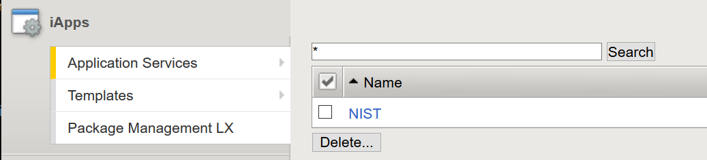

Lab 4 – Introduction to F5 iApps and FAST Templates
---------------------------------------------------

F5 iApps are a powerful features on every BIG-IP system
that provides a better way to architect application delivery.
iApp technology abstracts the many individual components required
to deliver an application grouping resources together in templates
associated with a specific application.  iApps have been available
on the BIG-IP system for a number of years, and consist of
three main components:

-  Application Services
-  Templates
-  Devcentral Ecosystem

^^^^^^^^^^^^^^^^^^^^^^^^^^^^^^^^^^^^^^^^^^^^^^^^^^^^^^^^^^^^^^^^^^^^^^^^

Recently F5 introduced the next phase of evolution for the BIG-IP
ADC platform known ad FAST (F5 Application Services Templates).  FAST
technology was developed for the following reasons:

-  Replacement for deprecated iApp templates
-  Consistent, cross-platform declarative APIs
-  Seamless integration and insertion into CI/CD pipelines
-  Modern development languages like Node.js and Python
-  Templates and automation
-  Declarative Interface
-  JSON Schema
-  Less error prone

In short, FAST will enable and empower customers while they
navigate their digital transformation journey, and ensure
their apps are available, performant, and secure.

^^^^^^^^^^^^^^^^^^^^^^^^^^^^^^^^^^^^^^^^^^^^^^^^^^^^^^^^^^^^^^^^^^^^^^^^

Task 1 – Configure the F5 NIST iApp.   F5 provides a number of different
iApp Templates many of which require multiple F5 modules such as Access
Policy Manager and Application Security Manager to be provisioned.   The
F5 NIST iApp only requires LTM to be provisioned and is relatively simple
to deploy and appply.

^^^^^^^^^^^^^^^^^^^^^^^^^^^^^^^^^^^^^^^^^^^^^^^^^^^^^^^^^^^^^^^^^^^^^^^^

#.  The F5 NIST sp800-53 iApp has already been uploaded to **BIG-IP01**

#.  From the Navigation pane, Under the iApps menu, click on Templates object.
    Click on the f5.nist_sp800-53.v1.0.0 iApp template to view the properties.
    The NIST iApp only requires the LTM module. Please review each section
    of the iApp and become familiar with the various components of an iApp.

    |image14|

#.  For this part of the lab we will provision a new application
    service leveraging iApp templates. The purpose of the template is to configure
    a BIG-IP system to be compliant with security controls outlined in the NIST
    SP800-53 special publication.

#.  Within the iApps menu, click on **Application Services** then click on
    the **+** sign to the right of **Applications**.

#.  Name the Application **NIST**, click the down arrow to the right of
    **Template** and select the **f5.nist_sp800-53.v1.0.0** iApp.

#.  Under the **Usage Banner -- AC-8** enter a custom banner message.

#.  Enter **time.google.com** in the NTP Server field.

#. Leave all other fields with their default settings.

#.  Click **Finished**

#.  Now that the **NIST** iApp has been applied to the BIG-IP system
    it's possible to modify the application service if necessary.
    Access **Application Services** under the **iApps** menu and then click
    on **NIST**. Once the service opens select **Reconfigure** to make changes.

^^^^^^^^^^^^^^^^^^^^^^^^^^^^^^^^^^^^^^^^^^^^^^^^^^^^^^^^^^^^^^^^^^^^^^^^

Task 2 - Introduction to FAST **F5 Application Services Templates**

^^^^^^^^^^^^^^^^^^^^^^^^^^^^^^^^^^^^^^^^^^^^^^^^^^^^^^^^^^^^^^^^^^^^^^^^

**F5 FAST Documentation** can be found at  https://clouddocs.f5.com/products/extensions/f5-appsvcs-extension/latest/

**F5 FAST templates** are hosted on Github at the following URL - https://github.com/F5Networks

The **f5-appsvcs-3.21.0-4.noarch.rpm** F5 Fast Template file has already been uploaded to the BIG-IP devices

^^^^^^^^^^^^^^^^^^^^^^^^^^^^^^^^^^^^^^^^^^^^^^^^^^^^^^^^^^^^^^^^^^^^^^^^

#.  From the Windows 10 Jumphost ssh into each BIG-IP and enter the following command:
    ``touch /var/config/rest/iapps/enable``

    **BIGIP01 10.1.1.4** and **BIGIP02 10.1.1.6** U: **root** / P: **admin.F5demo.com**.

#.  **(Already completed)** The rpm import process is normally accomplished by clicking the iApps menu, then clicking
    **Package Management LX**, and then **import** and selecting the rpm file. This is a required step to leverage F5 FAST.

    Note: You should see the f5-appsvcs template is the list.

#.  On the Windows 10 Jump Host launch Postman

    |image15|

#.  Click **Create a request** in the center of the application.

#.  The request type should default to **GET** and we will need to change that to a **POST** request

#.  Enter the following within **request URL** in **Postman** https://10.1.1.4/mgmt/shared/appsvcs/declare

#.  Click on the **Authorization** tab and change type to **Basic Auth**.

    |image16|

#.  Enter the BIG-IP credentials **U: admin / P: admin.F5demo.com**

#.  Click on the **Body** section in Postman, then click **raw** and change the **orange Text** to **JSON**

    |image17|

#.  Open the text file on the Desktop named **Hello_World**.

#.  Copy the contents of the **Hello_World** file.

#.  Paste the contents of the **Hello_World** text file

#.  Click the **SEND** button in Postman

#.  Examine the response Body below the request and you should see a **"code": 200** response.

#.  Log back into BIG-IP01 web interface and select the **Sample_01** partition at the top right of the screen.

    |image18|

#.  Open the **Virtual Server** list under **Local Traffic** and you will see a new **Virtual Server** named **service**.

    |image19|

#.  Open the **Network Map** under **Local Traffic** and you should see the **Virtual Server** **service** 
    has an associated **pool** named **web\_pool** with two pool members.

#. Change the **partition** at the top right back to **Common**.

^^^^^^^^^^^^^^^^^^^^^^^^^^^^^^^^^^^^^^^^^^^^^^^^^^^^^^^^^^^^^^^^^^^^^^^^

Completion of this task illustrates a simple Hello World FAST Template
and the completion of the LTM Essentials lab. For more information on FAST
please refer to the documentation link below.

-  https://clouddocs.f5.com/products/extensions/f5-appsvcs-templates/latest/

.. |image15| image:: images/image15.PNG
   :width: 3.32107in
   :height: 0.33645in
.. |image16| image:: images/image16.PNG
   :width: 3.32107in
   :height: 0.33645in
.. |image17| image:: images/image17.PNG
   :width: 3.32107in
   :height: 0.33645in
.. |image18| image:: images/image18.PNG
   :width: 3.32107in
   :height: 0.33645in
.. |image19| image:: images/image19.PNG
   :width: 6.32107in
   :height: 4.33645in
