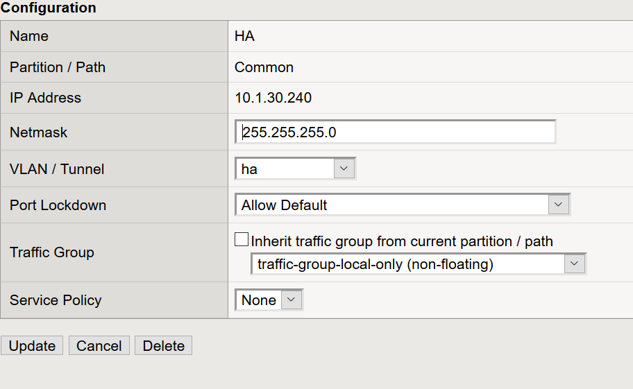
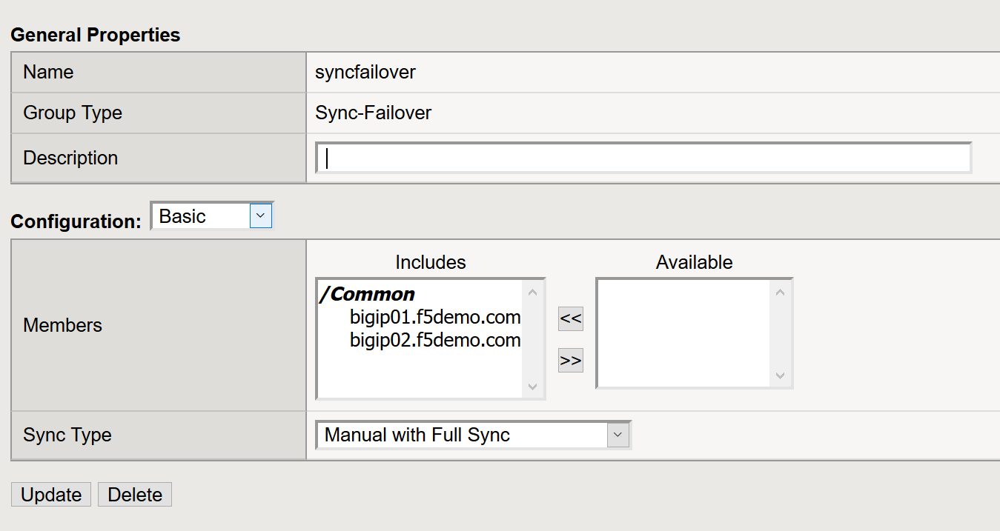

Lab  5 High Availability
------------------------

BIG-IP systems are generally deployed in pairs since redundant systems add
reliability and management stability over a single system.  BIG-IP systems
typically are configured in Active-Standby mode.   This lab will familiarize
students with High-Availability.   High-Availability on the BIG-IP platform
is referred to as Device Service Clusters (DSC)

^^^^^^^^^^^^^^^^^^^^^^^^^^^^^^^^^^^^^^^^^^^^^^^^^^^^^^^^^^^^^^^^^^^^^^^^

Students will be configuring a High-Availability cluster using both BIGIP01
and BIGIP02 with BIGIP01 serving as the Active device in the DSC cluster.

^^^^^^^^^^^^^^^^^^^^^^^^^^^^^^^^^^^^^^^^^^^^^^^^^^^^^^^^^^^^^^^^^^^^^^^^

**Task 2** - Configure the failover networking

^^^^^^^^^^^^^^^^^^^^^^^^^^^^^^^^^^^^^^^^^^^^^^^^^^^^^^^^^^^^^^^^^^^^^^^^

#. From the Windows 10 Jumphost log into BIGIP01 and BIGIP02

#. Configure the HA VLAN on both BIG-IP systems by navigation to the Network
   pane, clicking on VLANs, and click on create.

#. On BIGIP01 and BIGIP02 assign Network Interface 1.3 to a VLAN called **HA**

#. The next step will be to configure a Self-IP for the HA VLAN.

#. Use the below table as a reference for Self-IP addresses on each BIG-IP:

   **Be sure to click Finished when complete**

   +--------------+--------------------------------+
   | Form field   | Value                          |
   +==============+================================+
   | Name         | BIGIP01                        |
   +--------------+--------------------------------+
   | IP Address   | 10.1.30.240                    |
   +--------------+--------------------------------+
   | Netmask      | 255.255.255.0                  |
   +--------------+--------------------------------+
   | VLAN/Tunnel  | HA                             |
   +--------------+--------------------------------+
   | Port Lockdown| Allow Default                  |
   +--------------+--------------------------------+

   |image20|

   +--------------+--------------------------------+
   | Form field   | Value                          |
   +==============+================================+
   | Name         | BIGIP02                        |
   +--------------+--------------------------------+
   | IP Address   | 10.1.30.241                    |
   +--------------+--------------------------------+
   | Netmask      | 255.255.255.0                  |
   +--------------+--------------------------------+
   | VLAN/Tunnel  | HA                             |
   +--------------+--------------------------------+
   | Port Lockdown| Allow Default                  |
   +--------------+--------------------------------+

   |image21|

#. On each BIG-IP configure the device object failover parameters the BIG-IP will send to other BIG-IP systems that are part of a sync-only or sync-failover group

#. Under Device Management, Devices, select the local BIG-IP **it will be notated with the (Self) suffix.**

#. Under Device Connectivity on the top bar select:

#. ConfigSync

#. Use the Self-IP Address of the HA VLAN for the local addresses

#. Failover Network

#. In the **Failover Unicast Configuration** section select the **Add** button

#. Use the Self-IP address of the HA VLAN for the **Address**

#. Leave the **Port** at the default setting of 1026

^^^^^^^^^^^^^^^^^^^^^^^^^^^^^^^^^^^^^^^^^^^^^^^^^^^^^^^^^^^^^^^^^^^^^^^^

**Task 2** - Configure the Device Trust

^^^^^^^^^^^^^^^^^^^^^^^^^^^^^^^^^^^^^^^^^^^^^^^^^^^^^^^^^^^^^^^^^^^^^^^^

#.  On BIGIP01 from the **Navigation** pane, click on **Device Trust**
    **Device Trust Members**, and select **Add**.

#.  On BIGIP01, enter 10.1.1.6 which is the Management address of BIGIP02
    and enter the admin User ID and Password.

#. On BIGIP02, follow the same process, but enter 10.1.1.4 which is the
   Management IP Address of BIGIP01.   The admin User ID and Password should
   be the same for both BIG-IP systems.

|image22|

^^^^^^^^^^^^^^^^^^^^^^^^^^^^^^^^^^^^^^^^^^^^^^^^^^^^^^^^^^^^^^^^^^^^^^^^

**Task 3** - Configure a Sync-Failover Group

^^^^^^^^^^^^^^^^^^^^^^^^^^^^^^^^^^^^^^^^^^^^^^^^^^^^^^^^^^^^^^^^^^^^^^^^

#.  On BIGIP01, Under the **Device Management** Navigation pane, click on
    **Device Group** and create a new device Group named **syncfailover**.

#. Add BIGIP01 and BIGIP02 to the **Includes** box.

#. Check the **Network Failover** setting for the group.

#. Attempt to perform a **Manual** sync by clicking on the **Overview** section
   under the **Device Management** Navigation menu.

#. From BIGIP01 click on the **sync** button.

-  Was the full synchronization successful?

-  Are the configurations identical on both BIG-IP systems?

|image23|

^^^^^^^^^^^^^^^^^^^^^^^^^^^^^^^^^^^^^^^^^^^^^^^^^^^^^^^^^^^^^^^^^^^^^^^^

**Task 4** - Configure a Floating Traffic-Group

^^^^^^^^^^^^^^^^^^^^^^^^^^^^^^^^^^^^^^^^^^^^^^^^^^^^^^^^^^^^^^^^^^^^^^^^

The default Traffic-Group processes application traffic for the local device.
A Floating Traffic-Group contains the following objects:

- Virtual IP addresses
- NATs
- SNAT translation addresses
- Self IP Addresses
- Folders

#. From the **Device Management** Navigation pane, click on **Traffic Groups**

#. Click on create

#. Name the new Floating Traffic-Group **traffic-group-1**

#. The **Failover Method** default should be set to
   **Failover using Preferred Device Order and then Load Aware**

#. Ensure BIGIP01 and BIGIP02 have been added to the **Preferred Order**
   window.

#.  Click on **Create Traffic Group**

.. |image21| image:: images/image21.PNG
   :width: 6.32107in
   :height: 2.33645in
.. |image22| image:: images/image22.PNG
   :width: 6.32107in
   :height: 5.33645in

