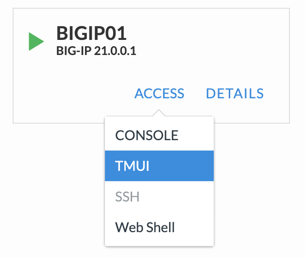
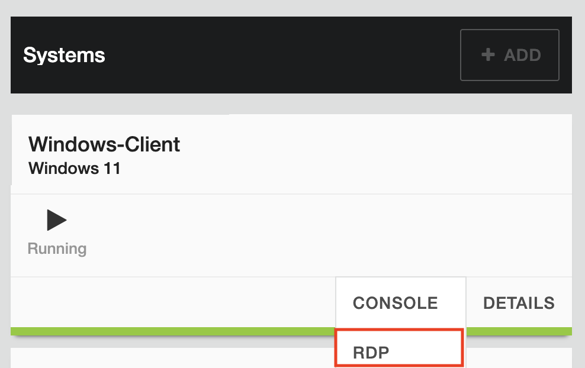

Working With The Lab
====================

For the labs, you will access the BIG-IP, an Ubuntu client and a Windows 11 client.  You can choose to access the BIG-IP and Ubuntu client from the UDF **Access** dropdown for each device or RDP to the Windows 11 client and do the work from there.  

Option 1: Access from UDF (Preferred)
-------------------------------------
Each component within the UDF deplyment has multiple connection methods from the **Access** dropdown.  Here is an example of the Access options for BIGIP01

* For BIGIP01, you will use TMUI and SSH options during the labs.  TMUI creadentials are:
  
   | User: admin
   | Password: admin.F5demo.com
   | SSH login does not require a password

* For Ubuntu-Client, you will use SSH and no password is needed
* For Windows-Client, you will use RDP.  An RDP file will save to your browser's download location.

   | User: labUser
   | Password: lab.F5demo.com

Option 2: Access from the Windows-Client (not needed?)
-----------------------------------------

* For Windows-Client, you will use RDP.
  

* An RDP file will save to your browser's download location.  Find and click on the download RDP file.

   | User: labUser
   | Password: lab.F5demo.com

You can access the BIGIP01 UI using the Chrome bookmark

Recap
-----
You now have the following:

* Logged into the UDF portal
* A working UDF deployment
* Access to the key Lab components