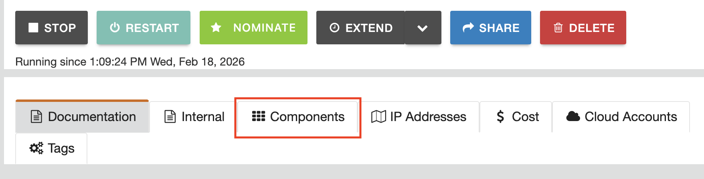
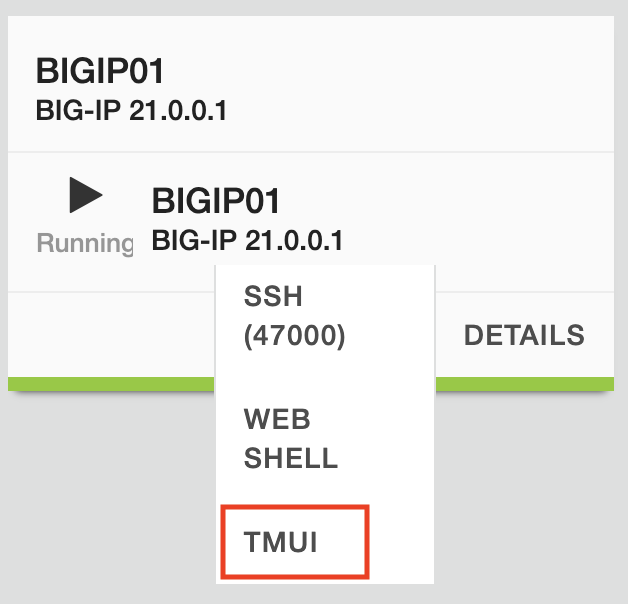
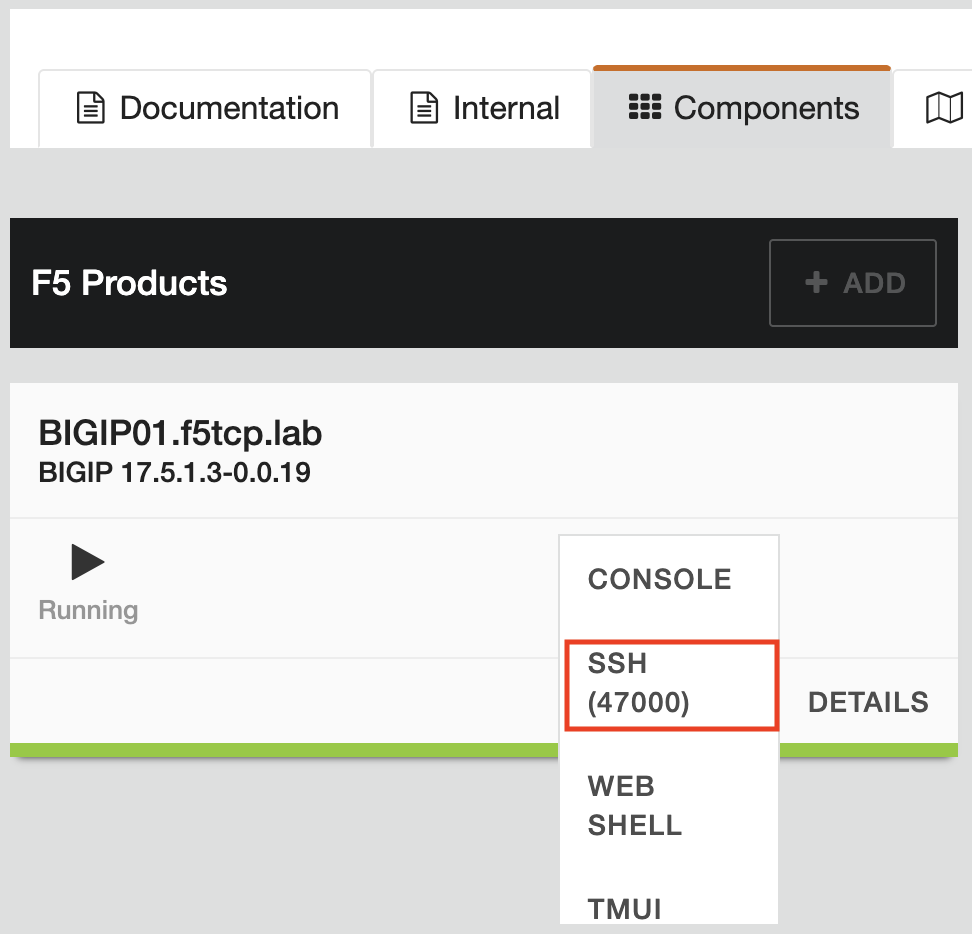
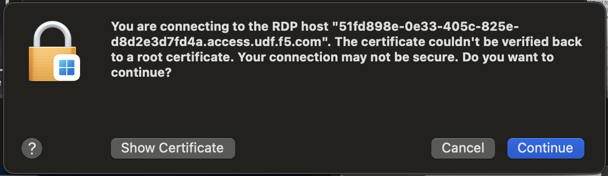

Working With Components
=======================

UDF refers to lab elements as Components.  For the labs, you will access a BIG-IP, an Ubuntu client and a Windows 11 client.  You can choose to access the BIG-IP and Ubuntu client from the UDF **Access** dropdown for each Component or RDP to the Windows 11 client and do the work from there.  

Access from UDF Components Tab
------------------------------

1. Find the Components tab from the Course Deployment in UDF.  Each component within the deployment has multiple connection methods from the **Access** dropdown as you'll see in the connection instructions for each device.

2. For BIGIP01, you will use TMUI and SSH options during the labs

3. For BIGIP01 UI, select TMUI from the Access dropdown

4. Login with the following credentials:

   | User: admin
   | Password: admin.F5demo.com

5. For SSH to BIGIP01, select SSH from the Access dropdown

6. Click Open Terminal, if prompted

.. image:: ../images/udf_open_terminal
    :width: 400px 

7. Type yes to 'continue connecting' if prompted

.. figure:: ../images/udf_continue_conn.png
    :width: 500px

   SSH Key authentication is used for this connection so no credentials are needed.
   |

8. For the Ubuntu-Client, you only need to use SSH

.. immge:: ../images/udf_client_ssh.png
    :width: 500px

9. You may see the same prompts show with the BIGIP01 SSH connection
10. For Windows-Client, you will use RDP.  An RDP file will save to your browser's download location.

.. image:: ../images/udf_RDP_option.png
    :width: 500px

11.  Find the .RDP file and click to open with you RDP client
12. Use the following credentials:

   | User: labUser
   | Password: lab.F5demo.com

.. image:: ..images/udf_RDP_login.png
    :width: 650px

13. Click continue to the connection prompt

Recap
-----
You now have the following:

* Logged into the UDF portal
* A working UDF deployment
* Access to the key Lab components