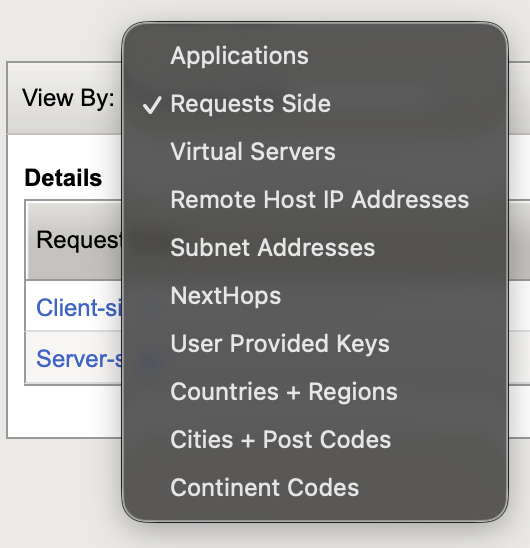
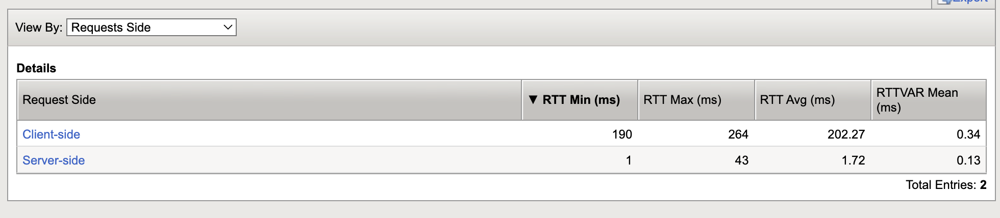

Task 2: Review AVR TCP Data
===========================

In the last section you focused on HTTP stats.  In this section, you will review the TCP data collected by AVR.

1. From the left menu, select **Statistics > Analytics > TCP**

   .. image:: ../images/avr_tcp_open.png
       :width: 450px

2. Click on the different TCP statistics options from the top menu to see the different data available.

   .. image:: ../images/avr_tcp_stats_menu.png
       :width: 700px

   |

   .. figure:: ../images/avr_tcp_rtt.png
      :width: 900px

      **RTT** - Shows the Round-Trip time including application time (data transfer or server think time)
      
      |

   .. figure:: ../images/avr_tcp_goodput.png
      :width: 900px

      **Goodput** - Shows the throughput excluding protocol overhead and retransmissions.  This is the actual throughput to the client or server.  The upper graph is total through the system and the lower graph shows average goodput per connection.  At the bottom of the page, you can filter the data on client-side or server-side.  By default, both sides are shown.
      
      |  

   .. figure:: ../images/avr_tcp_delay.png
      :width: 900px

      **Delay State** - Shows the time spent on each phase of the TCP connection.  This view helps to show where the greatest delays are.  There isn't any packet loss injected into this lab so the RETX value should be low but in production environments you may see high values on the WAN side.  The times could be reduced with TCP profile tuning but we are not going to cover packet loss tunings in this course.
      
      |

   .. figure:: ../images/avr_tcp_connections.png
      :width: 900px

      **Connections** - Shows the connection length in milliseconds as well as the number of connections opened and closed.
      
      |    

   .. figure:: ../images/avr_tcp_packets.png
      :width: 900px

      **Packets** - Shows packet loss rate (should be zero in the lab) as well as tocal packets sent and recieved.

      |   

3. Click on Expand Advanced Filters under the middle of the TCP Statistics menu.  Once open, the title changes to Collapse Advanced Filters as shown below.

   .. figure:: ../images/avr_tcp_adv_filters.png
      :width: 500px

      You can filter each graph on the options in the above image.  Click **Update** at the bottom to apply any filter changes

**Note:** By default, all of the graphs show total stats for all Virtual Servers with an AVR TCP profile assigned.  Also, all of the graphs include a **View By** filter at the bottom but it was not shown in the images above.

The **Requests Side** filter is shown by default

