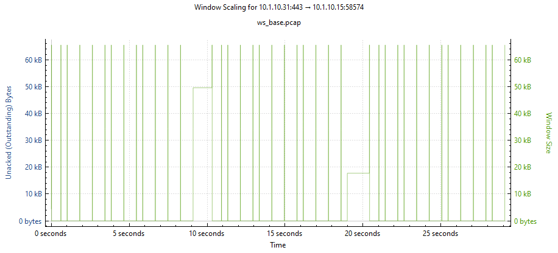
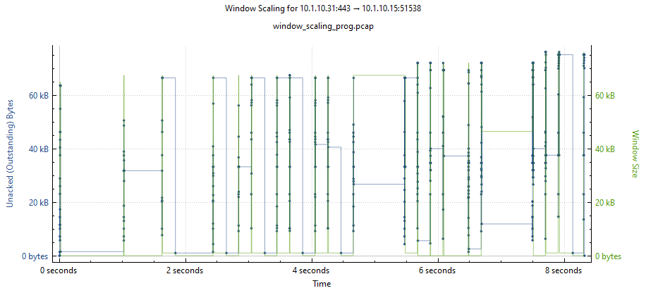
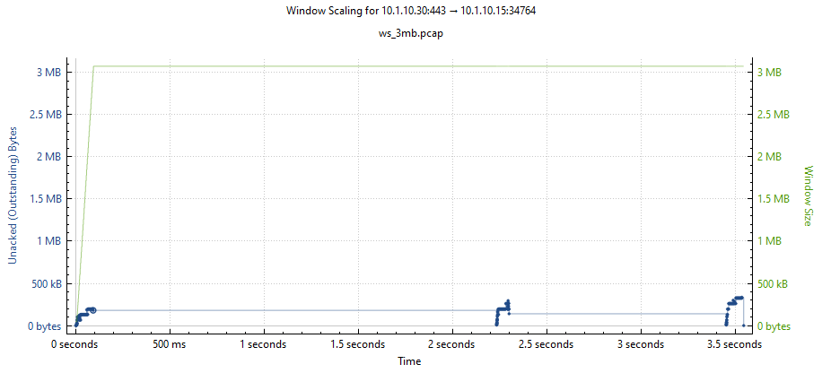

Task 2:  TCP Window Scaling Review
==================================

To speed up the process, you will just review TCP Window Scale screenshots taken from packet captures from the 3 TCP profiles in used in the previous selection.

#. Base Condition - tcp-wan-optimized/tcp-lan-optimized TCP Profiles assigned

    Server-side: The TCP Window size is limited to 65353 bytes because Window Scaling is not enabled.  The TCP Window drops to zero many times throughout the single TCP stream.

#. TCP-Progressive

    Server-side: The TCP Window size grows a bit larger towards the end of the TCP stream but there are still many drops to zero bytes.  This is due to the was TCP_Progressive calculates the buffers with a low latency link.

#. Tcp_3mb Profile

    Server-side: The TCP Window size grows to 3mb in about 100ms and stays there throughout the TCP stream.  There are TCP Zero Window events.

    

#. From the left-side menu, go to Local Traffic > Profiles > Protocol > TCP.
#. Click the **Parent Profile** column title to sort the profiles

  Most profiles in TMOS have a parent/child structure (or from CLI - defaults-from structure).  Within the list of TCP profiles, you can see that all profiles source from the base profile named tcp. 

.. image:: ../images/tcp_profiles_sorted.png

  As TMOS has upgraded over the years, changes have been made to the base TCP profile and to maintain compatability with previous relases, new child profiles have been created to override the base profile with the setting of the older profiles <<reword??>>

* Click on the tcp-legacy profile to see how options are overridden from the TCP parent profile.  The key option carried over from the older TCP profile is the Memory Management Send Buffer limit of 65535 bytes.  This is the 16-bit Window size limit from the original TCP standard (RFC 793).

.. image:: ../images/tcp_legacy_buffers.png

  If tcp-wan-optimized/tcp-lan-optimized profiles are in use, they are based on the older tcp-legacy parent profile with the small send buffer.  This small does not allow for TCP Window Scaling.

* Connect to the Ubuntu-Client via SSh using the Access dropdown

.. image:: ../images/udf_slient_ssh.png

* Click 'open terminal' if prompted
  
.. image:: ../images/udf_open_terminal.png

* Type 'yes' in response to the fingerprint prompt
  
 .. image:: ../images/udf_fingerprint.png

* Connect to BIGIP01 via SSH using the Access dropdown of the component and follow the same prompts as with the Ubuntu-Client
* Start a packet capture from the SSH window of BIGIP01::

What is this command doing?

  timeout 5s: Run the command for 5s then quit
  tcpdump:  Command to run
  -nni: No name resolution and No part resolution - just return the raw numbers
  internal: The 'interface' name - the server-side VLAN in the lab
  host 10.1.10.15:  The internal floating selfIP used as the source filter
  tcp[14:2] == 0:  Bytes 14 and 15 of the TCP header showing TCP window size - we want zero
  tcp[13] == 16: Filtering on TCP ACK as TCP Zero can also be seen with FIN during connection close
  -s 500: We only concerned with TCP flags so the snaplength is 500 Bytes

timeout 5s tcpdump -nni internal host 10.1.10.15 and 'tcp[14:2] == 0 && tcp[13] == 16' -s 500

  Since we have background traffic running through BIGIP01, you should see 500-700 packets during the 5s capture.

Samples::

09:51:20.983280 IP 10.1.10.15.36658 > 10.1.10.32.443: Flags [.], ack 1114961, win 0, options [nop,nop,TS val 1824155031 ecr 3982370403], length 0
09:51:20.984960 IP 10.1.10.15.56662 > 10.1.10.30.443: Flags [.], ack 1050717, win 0, options [nop,nop,TS val 1824155032 ecr 909863226], length 0
09:51:20.991289 IP 10.1.10.15.36528 > 10.1.10.32.443: Flags [.], ack 1552257, win 0, options [nop,nop,TS val 1824155038 ecr 3982370620], length 0
09:51:20.996657 IP 10.1.10.15.33414 > 10.1.10.32.443: Flags [.], ack 1560945, win 0, options [nop,nop,TS val 1824155043 ecr 3982370624], length 0
09:51:20.999251 IP 10.1.10.15.36820 > 10.1.10.32.443: Flags [.], ack 458642, win 0, options [nop,nop,TS val 1824155046 ecr 3982370421], length 0

The capture output shows the SelfIP (10.1.10.15) of BIGIP01 sending a TCP Zero Window to the application pool members (10.1.10.30-34).  This means BIGIP01 is telling the pool members to stop sending data while it waits for the the client-side to catchup.  As mentioned earlier, the client had 200ms of latency injected in the path to BIGIP01.

Go the the UI of BIGIP01 and change the TCP profiles of web01_vs1 to F5-tcp-progressive and click the Update button at the bottom of the page to save changes.

 .. image:: ../images/tcp_progressive.png

Go back to the BIGIP01 SSH window and run the same packet capture.  You should see a reduction in TCP Zero Window packets - maybe 300-450 packets in 5s.  This is an improvement but not the best for the traffic in the lab.  As we saw during Lab 2, there is a mix of 16kB-3MB files going through the system.  The f5-tcp-progressive TCP profile adjusts the TCP buffers based on connection conditions.  It uses bandwidth delay product to calculate the TCP buffers.  see https://my.f5.com/manage/s/article/K15800216 for more information.  Also see https://my.f5.com/manage/s/article/K3422 for content spooling.  In the lab, there is very low latency on the server-side connetions (pool members) and higher latency on the client-side connections.  With most HTTP traffic the client is requesting something from the server (GET) and the server is replaying withh the requested data.  The f5-tcp-progressive TCP profile is not adequately setting the buffers because the sending side is high bandwidth with low latency.

Go back to the BIGIP01 UI and change webo1_vs1 to use a custom TCP profile configure for the lab with 3MB (tcp_3mb) buffers and click update at the bottom of the page to save the change.  Higher buffers will use more memory for each TCP connection  while f5-tcp-progressive can also use more CPU as it calculates the buffer sizes.
 
 .. image:: ../images/tcp_progressive.png

How does TCP Zero Window affect traffic performance?  Using a 2nd Virtual Server on BIGIP01

