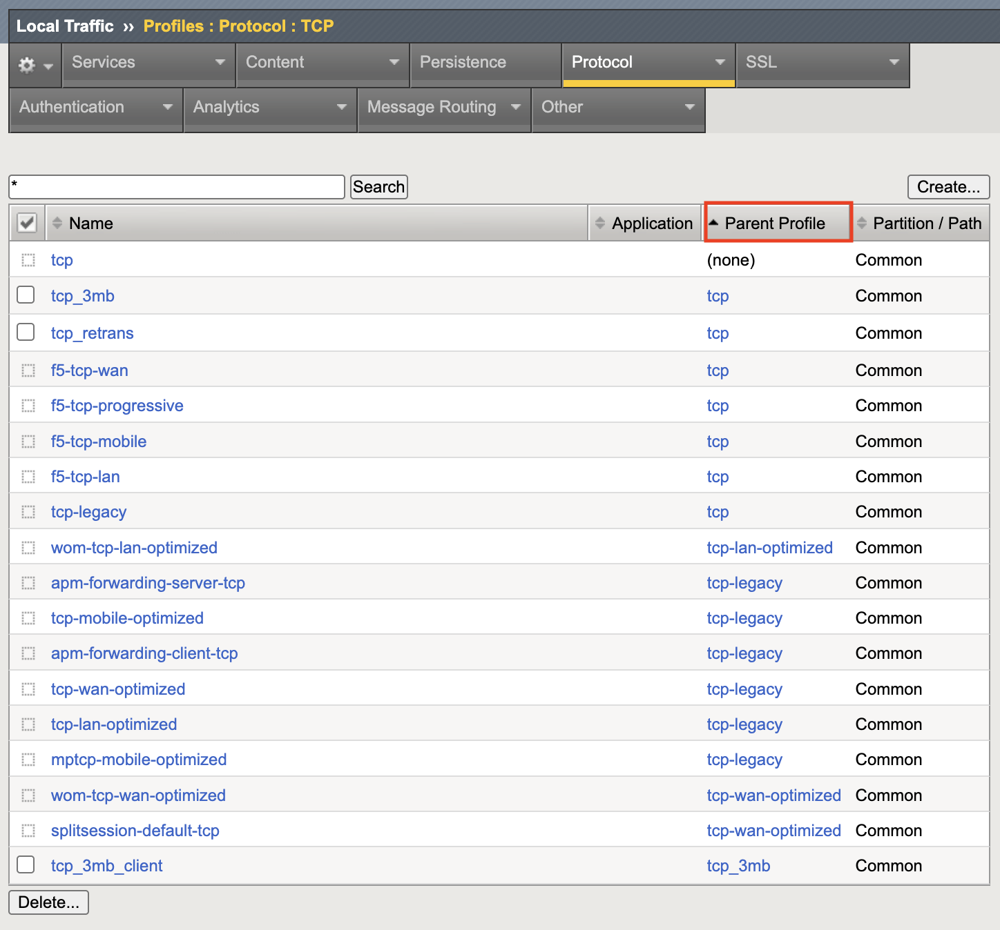
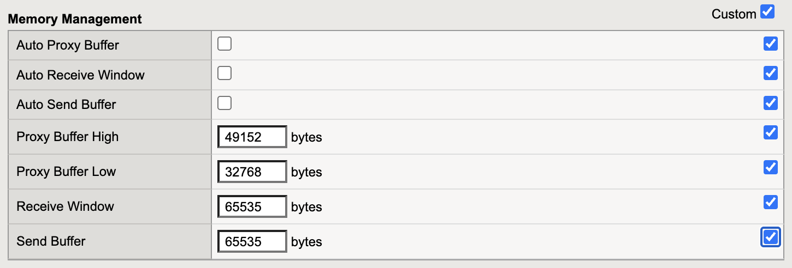
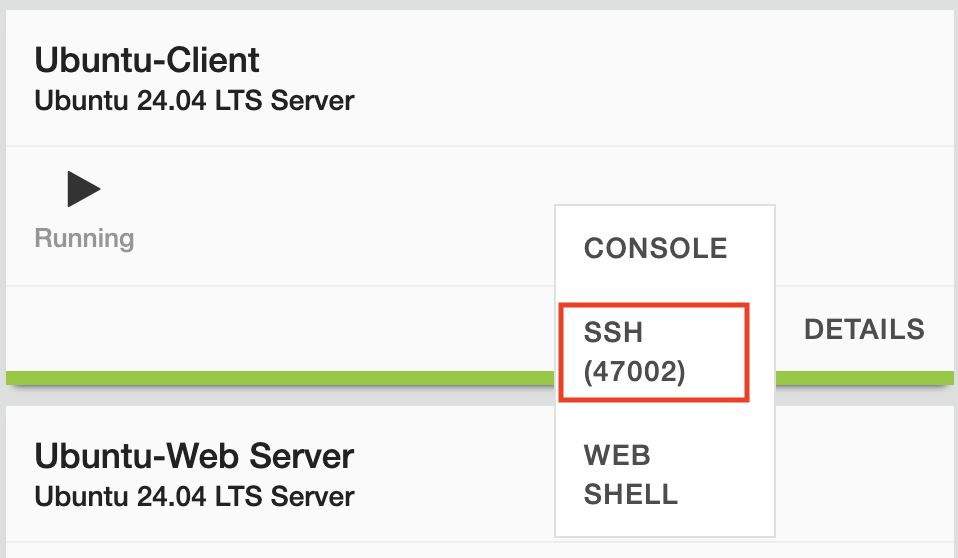
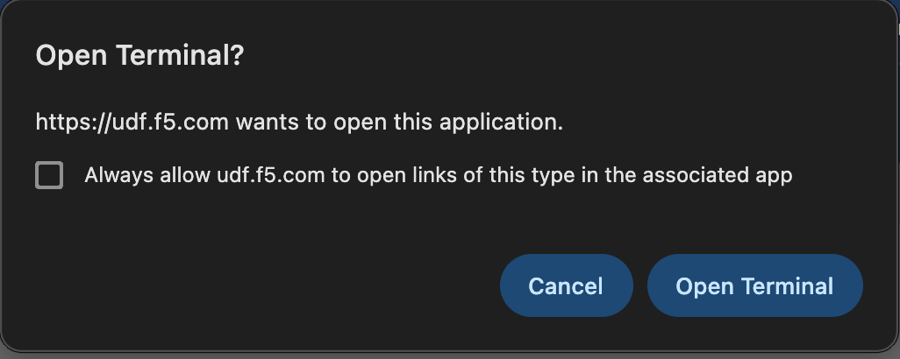
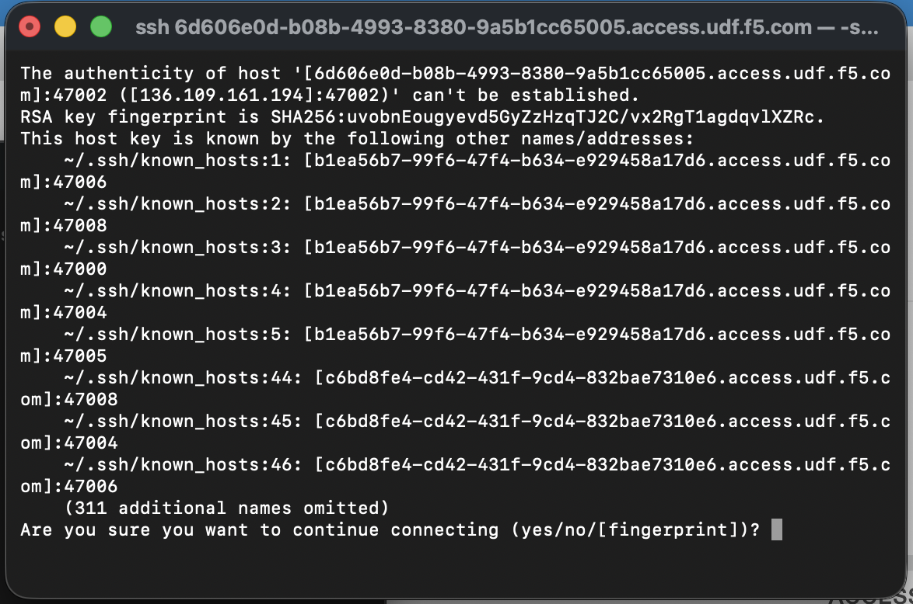

Task 1: Review Base TCP Profiles
================================

Review general TCP profiles available to TMOS.

#. From the left-side menu, go to Local Traffic > Profiles > Protocol > TCP.
#. Click the **Parent Profile** column title to sort the profiles

   Most profiles in TMOS have a parent/child structure (or from CLI - defaults-from structure).  Within the list of TCP profiles, you can see that all profiles end up sourcing from the base profile named tcp. 

   As TMOS has upgraded over the years, changes have been made to the base TCP profile and to maintain compatability with previous relases, new child profiles have been created to override the base profile with the settings of the older profiles <<reword??>>

3. Click on the tcp-legacy profile to see how options are overridden from the TCP parent profile.  The key option carried over from the older TCP profile is the Memory Management Send Buffer limit of 65535 bytes.  This is the 16-bit Window size limit from the original TCP standard (RFC 793).

   At this point, the web01-vs1 Virtual Server is using the older TCP profiles - tcp-wan-optimized (client-side) and tcp-lan-optimized (server-side).  These profiles are parented from tcp-legacy and have small TCP buffers that do not allow for TCP Window scaling.  These profiles are commonly assigned to Virtual Servers on BIG-IPs that have been upgraded from older versions of TMOS -  For exaample v10 > v12 > v14 > v15 > v17. 

4. Connect to the Ubuntu-Client via SSh using the Access dropdown

5. Click 'open terminal' if prompted
  

  
6. Type 'yes' in response to the fingerprint prompt
  

7. Connect to BIGIP01 via SSH using the Access dropdown of the component and follow the same prompts as with the Ubuntu-Client

  .. image:: ../images/udp_bigip01_ssh.png
      :width: 500px

8.Click Open Terminal if prompted

.. image:: ../images/udp_client_ssh.png
    :width: 500px

9. Enter 'yes' if prompted for fingerprint

10. Start a packet capture from the SSH window of BIGIP01::

  timeout 5s tcpdump -nni internal host 10.1.10.15 and 'tcp[14:2] == 0 && tcp[13] == 16' -s 500

What is this following TCPDUMP command doing?

  | timeout 5s: Run the command for 5s then quit
  | tcpdump:  Command to run
  | -nni: No name resolution and No part resolution and interface
  | internal: The 'interface' name - the server-side VLAN in the lab
  | host 10.1.10.15:  The internal floating selfIP used as the source filter
  | tcp[14:2] == 0:  Bytes 14 and 15 of the TCP header showing TCP window size - we want zero
  | tcp[13] == 16: Filtering on TCP ACK as TCP Zero can also be seen with FIN during connection close
  | -s 500: We only concerned with TCP flags so the snaplength is 500 Bytes

  Since we have background traffic running through BIGIP01, you should see 500-700 packets during the 5s capture.

Capture Examples (you may need to scroll to the right to see all of the text)::

  09:51:20.983280 IP 10.1.10.15.36658 > 10.1.10.32.443: Flags [.], ack 1114961, win 0, options [nop,nop,TS val 1824155031 ecr 3982370403], length 0
  09:51:20.984960 IP 10.1.10.15.56662 > 10.1.10.30.443: Flags [.], ack 1050717, win 0, options [nop,nop,TS val 1824155032 ecr 909863226], length 0
  09:51:20.991289 IP 10.1.10.15.36528 > 10.1.10.32.443: Flags [.], ack 1552257, win 0, options [nop,nop,TS val 1824155038 ecr 3982370620], length 0
  09:51:20.996657 IP 10.1.10.15.33414 > 10.1.10.32.443: Flags [.], ack 1560945, win 0, options [nop,nop,TS val 1824155043 ecr 3982370624], length 0
  09:51:20.999251 IP 10.1.10.15.36820 > 10.1.10.32.443: Flags [.], ack 458642, win 0, options [nop,nop,TS val 1824155046 ecr 3982370421], length 0

The capture output shows BIGIP01 Internal SelfIP (10.1.10.15) sending TCP Zero Window ACKs to the application pool members (10.1.10.30-34).  This means BIGIP01 is telling the pool members to stop sending data while it waits for the the client-side to catchup.  As mentioned earlier, the client had 200ms of latency injected in the path to BIGIP01.

11. From the BIGIP01 SSH window, run the following packet capture filtering on SYN and SYN/ACK packets ('tcp[13] & 2 != 0') from the client.::

    tcpdump -nni external host 10.1.30.6 and 'tcp[13] & 2 != 0' -c 4

    The output will be similar to this::

      11:08:34.619362 IP 10.1.30.6.44976 > 10.1.20.103.443: Flags [S], seq 1493890342, win 64240, options [mss 1460,sackOK,TS val 141834751 ecr 0,nop,wscale 7], length 0 in slot1/tmm1 lis= port=1.2 trunk=
      11:08:34.619417 IP 10.1.20.103.443 > 10.1.30.6.44976: Flags [S.], seq 4100418120, ack 1493890343, win 4380, options [mss 1460,sackOK,TS val 1828788666 ecr 141834751], length 0 out slot1/tmm1 lis=/Common/web01_vs1 port=1.2 trunk=

    The client (10.1.30.6) is advertising TCP Window Scale capability with option 'wscale 7'.  BIGIP01 is responding without a wscale option since the TCP buffers sizes are limited to TCP base maximums of 65535 Bytes. 

