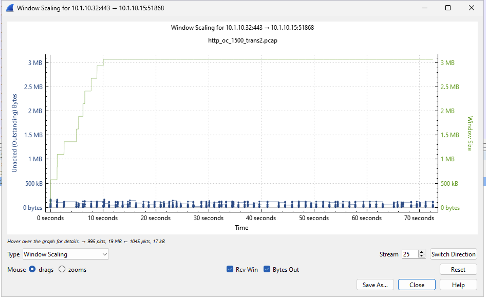
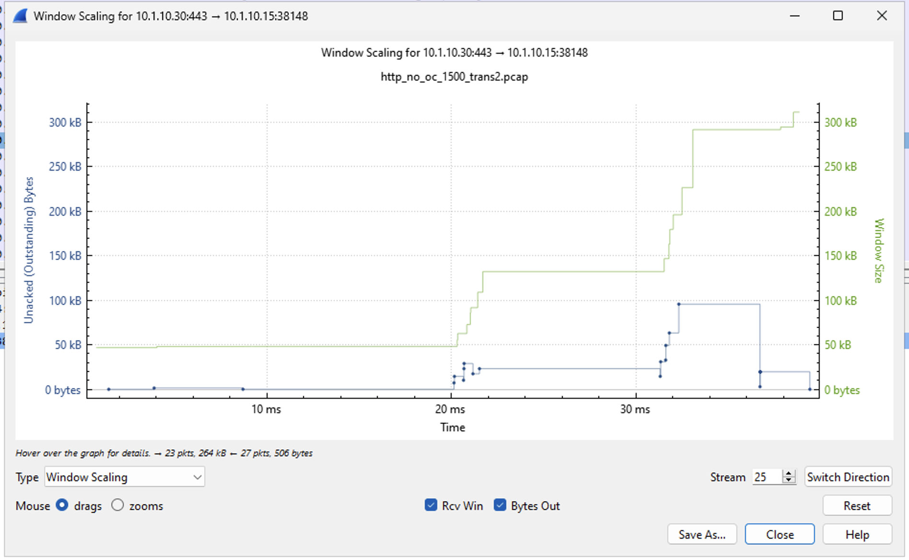

Task 1: Enabling Layer 7 LB for HTTP
====================================

By default, TMOS load balances HTTP traffic at layer 4.  If a client connects to an HTTP Virtual Server and requests a log of files and resources through typical browsing through a web site, the load balancing decision .is done during the initial TCP connection.  All of the requests will goo to a single pool member.

In most cases this could be OK many applications being front-end by a CDN <<or other examples??>> requests forom multiple end clients could get aggregated before hitting the Virtual Server.  With TMOS, it is possible to load balance at the application layer (Layer 7 LB) by enabling the OneCOnnect profile on the HTTP Virtual Server.

Here is an example (need a graphic):

A live-streaming TV provider is front-ending their application with a CDN and has a back-end cache layer of 50 servers ahead of the video ingest servers.  The CDN may merge multiple requests together on the way in to the Virtual Server - Requests for channel A, B, C, D all within a single TCP stream.  With L7 LB, TMOS can break out each request and send it to a specific pool member.  This allows for more warm cache hits and a reduction in cache layer storage redundancy as all channel data doesn't have to be on each cache layer server. <<boil this down?>>

1. From the BIGIP01 UI, go to **Local Traffic > Pools > Pool List**
2. Click on **web02_pool**
3. Click on **Statistics** from the top right menu
   
   .. image:: ../images/http_pool_stats_button.png
       :width: 400px

4. Clear any pool stats if they are not already all zeros. Click the check mark next to the **Status** dropdown on the left to select all pool members. Then clcik reset at the bottom to clear all of the stats.

   .. image:: ../images/http_pool_stats_reset.png
       :width: 700px

5. Click the **Auto Refresh** dropdown and set the time to 20 seconds
   
   .. image:: ../images/http_pool_stats_refresh20.png
       :width: 450px

6. From the Ubuntu-Client SSH window, run the following command::

      ~/http_l7

   The script uses curl to request a list of 5 files 2 times from HTTPS Virtual Server **web02_vs1** over a single TCP connection.

7. From BIGIP01 UI, check the pool stats.  You should see all 10 requests have gone to a single server
   
   .. image:: ../images/http_pool_stats_base.png
       :width: 950px

8. Clear the pool stats again (see step 4)
9. Go to **Local Traffic > Virtual Servers > Virtual Server List** and click on Virtual Server **web02_vs1**
10. Go to the **Acceleration** section at the bottom of the Virtual Server properties and select **lab_OneConnect** for the OneConnect Profile.  Click the **Update** button to save the changes

    ..image:: ../images/http_oc_select.png
        :width: 600px

    When a OneConnect profile is enabled for an HTTP virtual server, and an HTTP client sends multiple requests within a single connection, the BIG-IP system is able to process each HTTP request individually.  See https://my.f5.com/manage/s/article/K7208 for more information about the OneConnect profile and specifically the section on Content Switching.

11. From the Ubuntu-Client SSH window, run the following test command again::

      ~/http_l7.sh

12. From BIGIP01 UI, check the pool stats again.  You should see all 10 requests spread across the 5 pool members
   
   .. image:: ../images/http_pool_stats_l7.png
       :width: 950px

OneConnect Summary
------------------

The typical use for a OneConnect profile is to reduce TCP connection time by re-using idle TCP connections.  In most cases, the lan-side TMOS to pool member TCP 3-way handshake is less than 1ms.  There will also be a TMOS memory savings with the connection re-use but 3-way handshake time reduction will be small.  The TCP connection re-use may also help in environments where the application servers are unable to support a large number of active connections.

The larger time savings comes from re-using idle pool member TLS connections.  In this lab environment, the typical TLS handshake is 18ms. Saving 18ms per connection can be important when you scale that up to many thousands of connections per second. of The net time savings will vary based on connection rate and concurency.

Here are some connection re-use numbers from the lab::

    ---------------------------------------
    Ltm::OneConnect Profile: lab_OneConnect
    ---------------------------------------
    Virtual Server Name   N/A
                    
    Connections        
    Current Idle         23
    Maximum              23
    Total Reuses       1477
    New                  23

These number were a result of a 1500 HTTPS transaction test with each being a new client-side TCP connection.  The concurency rate was ~23 during the test.  Starting with zero idle TCP connections, 23 new TCP connections were opened to the servers with 1477 connections being re-used during the 1500 HTTPS transactions.

Here are some of the time and packet savings from the same test::

    No OneConnect Profile Assigned
        Total Packets:  145,431
        Client Packets: 76,515
        Server Packets: 68,916
        Total Time:     76.13s
        Server Time:    74.12s

    With OneConnect Assigned
        Total Packets:  121,529
        Client Packets: 78,290 
        Server Packets: 43,239
        Total Time:     75.21s
        Server Time:    70.17s

There is a reduction in server-side packet count due to 1477 fewer TCP and TLS handshakes.  The packet count is also reduced from the TCP Window staying large during the re-used connections.  For this test, the server-side connections were open for around 70s. 

Without OneConnect, the server-side connections are only open for the length of a single client request - around 38ms for the 256KB requests in the test.

