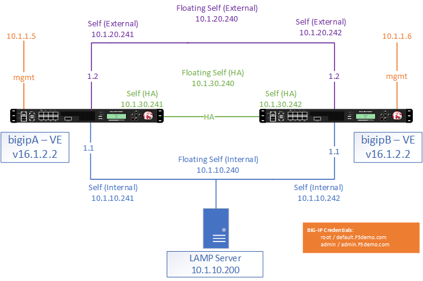

Getting Started
---------------

You will be using our Unified Demo Framework (UDF) environment to complete the tasks in this lab.  All configuration can be completed from a Web browser.

Lab Topology Diagram
--------------------

The following components have been included in your lab environment:

#. F5 BIG-IP VE (bigip01)

#. Ubuntu router

#. Ubuntu Client

#. Ubuntu Webserver

#. Windows Client

Lab Components
---------------

The following table lists the management IP addresses and credentials for all components:

.. list-table:: 
   :widths: auto
   :align: center
   :header-rows: 1

   * - Host
     - Management IP
     - username:password
   * - bigip01
     - 10.1.1.1
     - **admin**:admin.F5demo.com *and/or* **root**:root.F5demo.com
     - Windows Client
     - 10.1.1.6
     - **labUser**:lab.F5demo.com