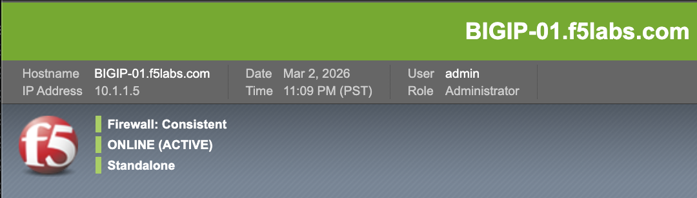
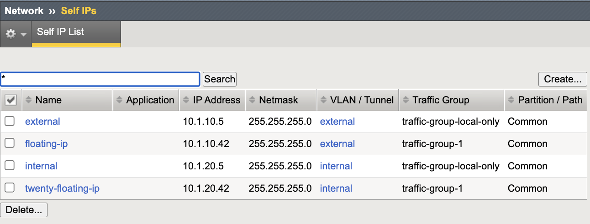
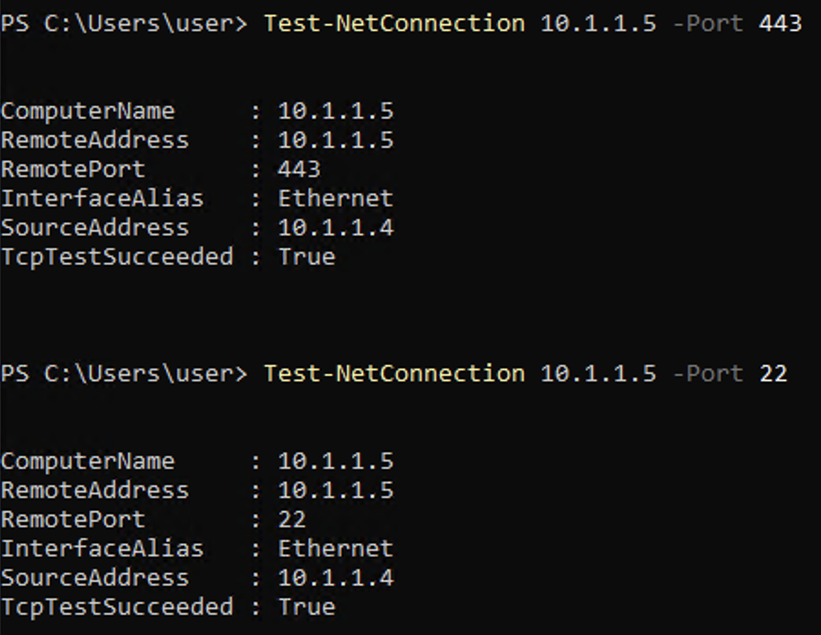
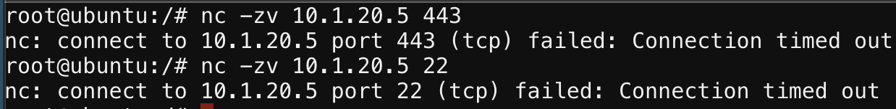
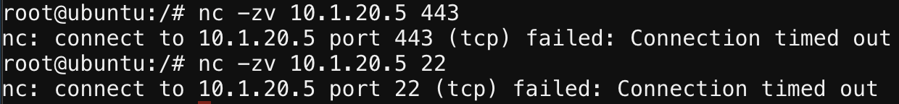
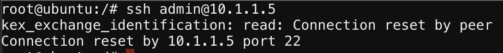

Control-Plane Segmentation Validation
=====================================

Control-plane segmentation must be empirically validated to ensure that
administrative services are reachable only through intended network paths.
Configuration alone does not guarantee isolation.

This lab validates the combined effect of Outer Layer controls by confirming:

* Management services are accessible only via the management interface
* Data-plane VLANs do not expose control-plane services
* No unintended lateral movement paths exist
* Administrative access paths are deterministic and controlled

This lab validates network-layer segmentation only.
Authentication and authorization enforcement are validated separately
in the Middle Layer.

Executive Summary
-----------------

   Segmentation design must be empirically validated.
   This lab confirms that IP Allowlisting and Self IP Port Lockdown
   work together to eliminate alternate management paths and
   enforce control-plane isolation.

Threat Scenario
---------------

In the absence of proper segmentation validation:

* A data-plane Self IP may inadvertently expose SSH or HTTPS.
* Broad source access to the management IP may allow lateral movement.
* Routing misconfigurations may create alternate administrative paths.
* Firewall rules may not reflect actual device-level exposure.

Segmentation validation ensures that:

* Only authorized administrative hosts can reach the management IP.
* Data-plane VLAN interfaces do not expose management services.
* No unintended control-plane access paths exist.

Objective
---------

This lab will:

* Inventory BIG-IP management and data-plane interfaces
* Validate management service reachability on the management interface
* Validate management service non-reachability on data-plane Self IPs
* Document an exposure matrix as evidence of segmentation posture

Hardened Enterprise Reference Design
------------------------------------

.. note::

   Validation should be performed from representative network locations:

   * Authorized administrative host (management network)
   * Data-plane host (DMZ or internal VLAN)

.. nwdiag::
   :caption: Reference Design – Segmentation Validation Paths
   :name: control-plane-segmentation-validation-reference-design

   nwdiag {

     network mgmt {
       address = "Management Network\n10.1.1.0/24\n(Admin Workstation)";
     }

     network dmz {
       address = "External / DMZ Network\n10.1.10.0/24\n(Data Plane)";
     }

     network internal {
       address = "Internal Application Network\n10.1.20.0/24\n(Data Plane)";
     }

     bigip {
       shape = "roundedbox";
       description = "BIG-IP\nControl Plane: Mgmt 10.1.1.5 (Admin Access Allowed)\nData Plane: Self IPs 10.1.10.5 / 10.1.20.5 (Mgmt Services Blocked)";
     }

     mgmt -- bigip;
     dmz -- bigip;
     internal -- bigip;

   }

.. note::

   Administrative access to the BIG-IP control plane must occur only
   through the management network. Data-plane VLANs must not expose
   management services.

---------------------------------------------------------------------

Recommended Validation Targets
------------------------------

Validate the following interfaces:

+----------------------+---------------------------+-----------------------------+
| Interface Type       | Address                   | Expected Mgmt Service Reach |
+======================+===========================+=============================+
| Management IP        | 10.1.1.5                  | Reachable (authorized only) |
+----------------------+---------------------------+-----------------------------+
| External Self IP     | 10.1.10.5                 | Not reachable               |
+----------------------+---------------------------+-----------------------------+
| Internal Self IP     | 10.1.20.5                 | Not reachable               |
+----------------------+---------------------------+-----------------------------+

Services in scope:

* SSH (TCP 22)
* HTTPS / TMUI (TCP 443)

---------------------------------------------------------------------

Lab Procedure
-------------

Step 1 – Identify Interface Inventory
~~~~~~~~~~~~~~~~~~~~~~~~~~~~~~~~~~~~~

1. Log in to the BIG-IP Configuration Utility.
2. Record the following:

   * Management IP (**Platform → Configuration**)
   * External Self IP (**Network → Self IPs**)
   * Internal Self IP (**Network → Self IPs**)

---------------------------------------------------------------------

Platform configuration showing the BIG-IP management IP address.

---------------------------------------------------------------------

Self IP inventory identifying external and internal data-plane interfaces.

---------------------------------------------------------------------

Record the following values:

* Mgmt IP: ``10.1.1.5``
* External Self IP: ``10.1.10.5``
* Internal Self IP: ``10.1.20.5``

---------------------------------------------------------------------

Step 2 – Validate Management IP Reachability (Authorized Path)
~~~~~~~~~~~~~~~~~~~~~~~~~~~~~~~~~~~~~~~~~~~~~~~~~~~~~~~~~~~~~~

From the authorized administrative host
(**Windows Jump Host – 10.1.1.4**):

.. code-block:: powershell

   Test-NetConnection 10.1.1.5 -Port 443
   Test-NetConnection 10.1.1.5 -Port 22

Expected:

* ``TcpTestSucceeded : True`` (for enabled services)

Authorized-path validation confirming that management services are
reachable only from the approved administrative host.

---------------------------------------------------------------------

Step 3 – Validate Data-Plane Self IP Non-Reachability
~~~~~~~~~~~~~~~~~~~~~~~~~~~~~~~~~~~~~~~~~~~~~~~~~~~~~

Administrative services must not be reachable on data-plane Self IPs.

External Network Validation
^^^^^^^^^^^^^^^^^^^^^^^^^^^

From the **Windows Jump Host external interface (10.1.10.10)**:

.. code-block:: powershell

   Test-NetConnection 10.1.10.5 -Port 443
   Test-NetConnection 10.1.10.5 -Port 22

Expected:

* ``TcpTestSucceeded : False``

External Self IP validation confirming that SSH (22) and HTTPS (443)
are not exposed on the data plane.

.. note::

   The Windows Jump Host contains multiple network interfaces.
   Windows selects the source interface automatically based on the
   destination network.

Internal Network Validation
^^^^^^^^^^^^^^^^^^^^^^^^^^^

From the **Ubuntu App Services host (10.1.20.9)**:

.. code-block:: bash

   nc -zv 10.1.20.5 443
   nc -zv 10.1.20.5 22

Expected:

* Connection timed out
* Connection refused

Internal Self IP validation confirming that management services are not
reachable from application networks.

.. note::

   ICMP echo responses may still succeed.
   This validation tests TCP service reachability only.

---------------------------------------------------------------------

Step 4 – Validate Unauthorized Access to Management IP
~~~~~~~~~~~~~~~~~~~~~~~~~~~~~~~~~~~~~~~~~~~~~~~~~~~~~~

.. note::

   In UDF environments the management network may be routable
   from other lab networks. The validation focuses on whether
   administrative login is permitted, not whether the TCP
   socket itself responds.

From the **Ubuntu App Services host (10.1.20.9)** attempt to reach the
BIG-IP management interface:

.. code-block:: bash

   ssh admin@10.1.1.5

Expected:

* Permission denied
* Connection closed by remote host

This confirms that only the authorized administrative host
(10.1.1.4) can successfully authenticate to the BIG-IP
management interface.

---------------------------------------------------------------------

Step 5 – Document the Exposure Matrix
~~~~~~~~~~~~~~~~~~~~~~~~~~~~~~~~~~~~~

Complete and document the following matrix:

+----------------------+----------------------+--------------------+--------------------+--------------------+--------------------+--------+
| Source Host          | Target Interface     | TCP 22 Expected    | TCP 22 Observed    | TCP 443 Expected   | TCP 443 Observed   | Result |
+======================+======================+====================+====================+====================+====================+========+
| Windows Jump Host    | Mgmt IP (10.1.1.5)   | Open               |                    | Open               |                    |        |
| 10.1.1.4             | (authorized)         |                    |                    |                    |                    |        |
+----------------------+----------------------+--------------------+--------------------+--------------------+--------------------+--------+
| Ubuntu App Services  | Mgmt IP (10.1.1.5)   | Blocked            |                    | Blocked            |                    |        |
| 10.1.20.9            | (unauthorized)       |                    |                    |                    |                    |        |
+----------------------+----------------------+--------------------+--------------------+--------------------+--------------------+--------+
| Windows Jump Host    | External Self IP     | Blocked            |                    | Blocked            |                    |        |
| 10.1.10.10           | (10.1.10.5)          |                    |                    |                    |                    |        |
+----------------------+----------------------+--------------------+--------------------+--------------------+--------------------+--------+
| Ubuntu App Services  | Internal Self IP     | Blocked            |                    | Blocked            |                    |        |
| 10.1.20.9            | (10.1.20.5)          |                    |                    |                    |                    |        |
+----------------------+----------------------+--------------------+--------------------+--------------------+--------------------+--------+

This matrix serves as documented evidence that control-plane segmentation
is functioning as designed.

---------------------------------------------------------------------

Validation Summary
------------------

If segmentation is correctly enforced:

* Management services are reachable only through the management interface
* Only authorized administrative hosts can reach the management IP
* Unauthorized hosts cannot reach the management IP
* Data-plane VLAN Self IPs do not expose SSH or HTTPS
* No alternate administrative access paths exist

Outer Layer Alignment
---------------------

This lab validates the combined effect of:

* IP Allowlisting – controls **who** may access management services
* Self IP Port Lockdown – controls **where** management services are exposed

Together they enforce:

* Deterministic administrative access paths
* Network-layer least privilege
* Control-plane isolation
* Zero Trust segmentation principles

Success Criteria
----------------

* Mgmt IP reachable for authorized host on required ports
* Mgmt IP not reachable for unauthorized hosts
* External Self IP not reachable on SSH/HTTPS
* Internal Self IP not reachable on SSH/HTTPS
* Exposure matrix completed and documented as evidence