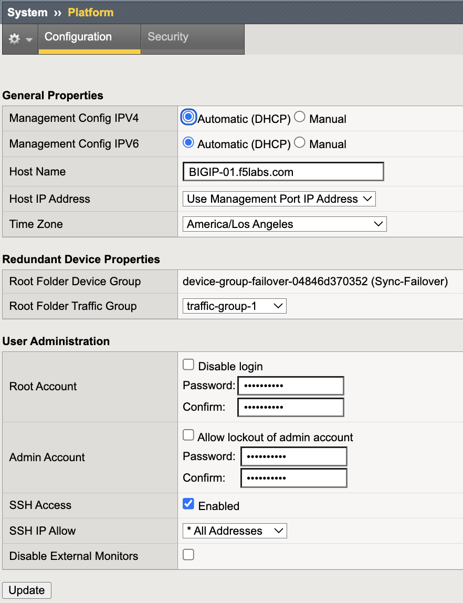
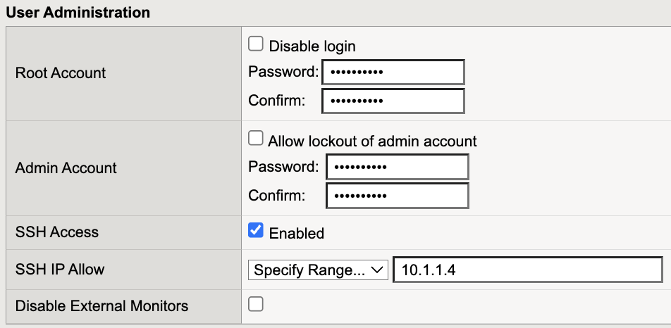
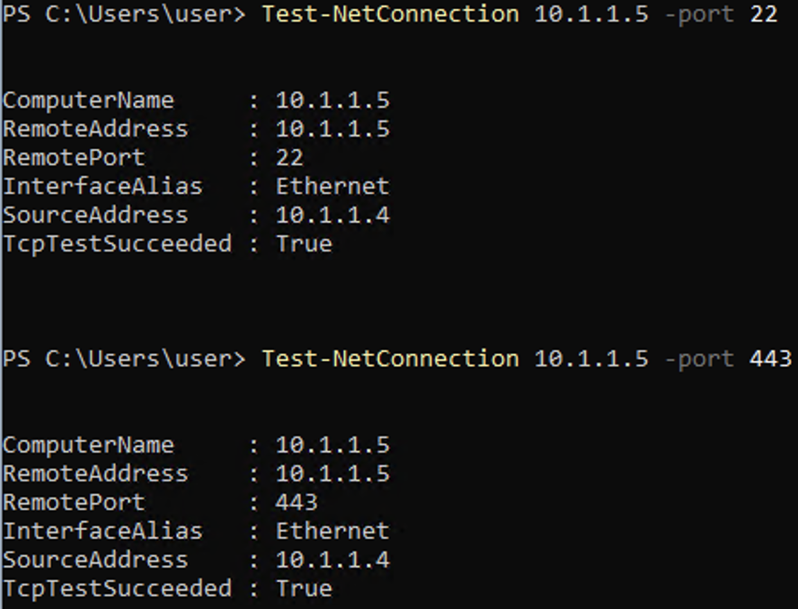
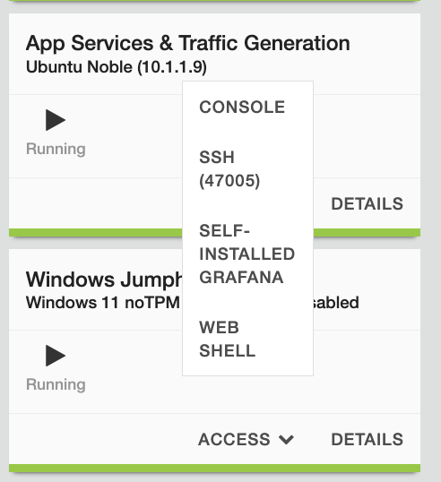
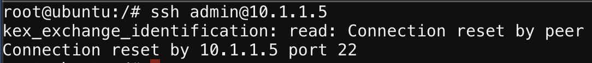

IP Allowlisting
===============

IP Allowlisting restricts administrative access to the BIG-IP device
based on source IP address. Only explicitly approved management and
monitoring systems should be able to initiate connections to the
BIG-IP management interface (OOB management), not data-plane Self IPs.

This mechanism is a critical Outer Layer boundary control.

.. admonition:: Executive Summary
   :class: important

   Administrative access must be restricted by explicit source IP.
   Broad internal access (e.g., 10.0.0.0/8) undermines segmentation and
   should not be permitted without explicit risk acceptance.

   IP Allowlisting complements Self IP Port Lockdown by controlling
   who may access management services, while Port Lockdown controls
   where those services are exposed.

Threat Scenario
---------------

In the absence of IP allowlisting:

* A compromised internal host could attempt SSH brute-force access
  to the BIG-IP management IP.
* A flat enterprise network could allow unintended access to TMUI.
* Monitoring services (SNMP) could be queried from unauthorized segments.
* Lateral movement within the network could reach the control plane.

IP Allowlisting reduces this risk by ensuring only explicitly approved
administrative and monitoring systems can reach management services.

Objective
---------

This lab will:

* Identify management-plane exposure
* Restrict SSH access by source IP
* Restrict SNMP access to monitoring systems
* Validate unauthorized access attempts are blocked

Hardened Enterprise Reference Design
------------------------------------

.. note::

   IP Allowlisting should exist at multiple layers:
   upstream firewall enforcement and device-level enforcement.

.. nwdiag::
   :caption: Reference Design – Administrative Access Control
   :name: ip-allowlisting-reference-design

   nwdiag {

     network admin    { address = "Authorized Admin Subnet"; }
     network monitor  { address = "Monitoring Systems"; }
     network firewall { address = "Upstream Firewall"; }
     network mgmt     { address = "BIG-IP Management IP"; }

     admin -- firewall;
     monitor -- firewall;
     firewall -- mgmt;

   }

Recommended Administrative Posture
-----------------------------------

+----------------------+----------------------+--------------------+--------------------------------------+
| Source               | Destination          | Service            | Action                               |
+======================+======================+====================+======================================+
| Authorized Admin     | BIG-IP Mgmt IP       | SSH (22)           | Permit                               |
+----------------------+----------------------+--------------------+--------------------------------------+
| Authorized Admin     | BIG-IP Mgmt IP       | HTTPS (443)        | Permit                               |
+----------------------+----------------------+--------------------+--------------------------------------+
| Monitoring Systems   | BIG-IP Mgmt IP       | SNMP (161)         | Permit                               |
+----------------------+----------------------+--------------------+--------------------------------------+
| Any                  | BIG-IP Mgmt IP       | Mgmt Ports         | Deny                                 |
+----------------------+----------------------+--------------------+--------------------------------------+

Administrative Services of Concern
----------------------------------

+----------------+-----------------------------------------+
| Port           | Service                                 |
+================+=========================================+
| TCP 22         | SSH                                     |
+----------------+-----------------------------------------+
| TCP 443        | TMUI / HTTPS                            |
+----------------+-----------------------------------------+
| UDP 161        | SNMP                                    |
+----------------+-----------------------------------------+
| TCP 4353       | iControl REST / big3d (if required)     |
+----------------+-----------------------------------------+

.. warning::

   Allowing entire RFC1918 ranges defeats the purpose of allowlisting.
   Only explicitly approved administrative systems should be permitted.

---------------------------------------------------------------------

Lab Procedure
-------------

Step 1 – Identify Management IP
~~~~~~~~~~~~~~~~~~~~~~~~~~~~~~~

1. Log in to the BIG-IP Configuration Utility.
2. Locate the Management IP displayed in the upper left corner.

In this lab environment the BIG-IP management IP is:

``10.1.1.5``

.. image:: ../_images/ip-allowlisting-01-ssh-access-all-addresses.png
   :alt: SSH access enabled with IP Allow set to All Addresses
   :align: center
   :width: 900px

---------------------------------------------------------------------

Step 2 – Inspect SSH Access Scope
~~~~~~~~~~~~~~~~~~~~~~~~~~~~~~~~~~

1. Navigate to **System → Platform → Configuration**.
2. Scroll to **SSH Access**.
3. Review the **SSH IP Allow** configuration.

If configured broadly (for example ``0.0.0.0/0`` or a large internal range),
administrative access may be overly permissive.

.. note::

   SSH IP Allow applies to the management interface.
   Self IP administrative exposure is controlled separately using
   Self IP Port Lockdown.

---------------------------------------------------------------------

Step 3 – Restrict SSH to the Authorized Jumphost
~~~~~~~~~~~~~~~~~~~~~~~~~~~~~~~~~~~~~~~~~~~~~~~~~

1. Under **SSH IP Allow**, select **Specify Range**.
2. Enter the authorized administrative Jumphost:

``10.1.1.4``

3. Click **Update**.

SSH access is now restricted to the authorized administrative host.

---------------------------------------------------------------------

Step 4 – Validate Authorized SSH Access
~~~~~~~~~~~~~~~~~~~~~~~~~~~~~~~~~~~~~~~

Execution Context:

* Host: **Windows Jumphost (10.1.1.4)**
* Network Interface: **Management Network (10.1.1.0/24)**
* Powershell

Run the following commands:

.. code-block:: powershell

   Test-NetConnection 10.1.1.5 -Port 22
   Test-NetConnection 10.1.1.5 -Port 443

Expected:

* ``TcpTestSucceeded : True``

---------------------------------------------------------------------

Step 5 – Validate Unauthorized Access Blocked
~~~~~~~~~~~~~~~~~~~~~~~~~~~~~~~~~~~~~~~~~~~~~

Execution Context:

* Host: **App Services & Traffic Generation system (10.1.1.9)**
* Network: **Non-authorized administrative host**
* Webshell

This test must be performed from a **non-authorized host**.

In this lab environment we will use the **App Services & Traffic Generation system (10.1.1.9)**.

Access the host as follows:

1. In the UDF environment, locate **App Services & Traffic Generation**.
2. Click **ACCESS**.
3. Select **WEB SHELL**.

This opens a terminal session directly on the App Services host.

Run the following command:

.. code-block:: bash

   ssh admin@10.1.1.5

Expected result:

* Connection timed out
* Connection refused

This confirms that SSH access is restricted to approved administrative systems.

---------------------------------------------------------------------

Validation Summary
------------------

After remediation:

* SSH restricted to the authorized administrative host
* HTTPS reachable only from approved administrative sources
* SNMP restricted to monitoring systems
* Unauthorized hosts blocked at the management interface

Outer Layer Alignment
---------------------

IP Allowlisting protects:

* **Who** may access management services.

Self IP Port Lockdown protects:

* **Where** management services are exposed.

Together they enforce:

* Least privilege
* Deterministic administrative access paths
* Control-plane isolation
* Zero Trust segmentation principles

Success Criteria
----------------

* Only the authorized administrative host (10.1.1.4) can access SSH
* Unauthorized hosts cannot reach management services
* SNMP access restricted to approved monitoring systems
* No broad internal ranges permitted
* Management access remains operational for approved sources