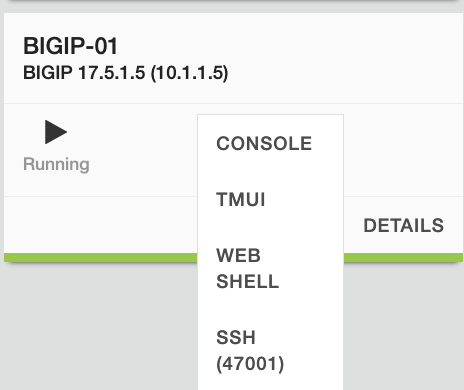
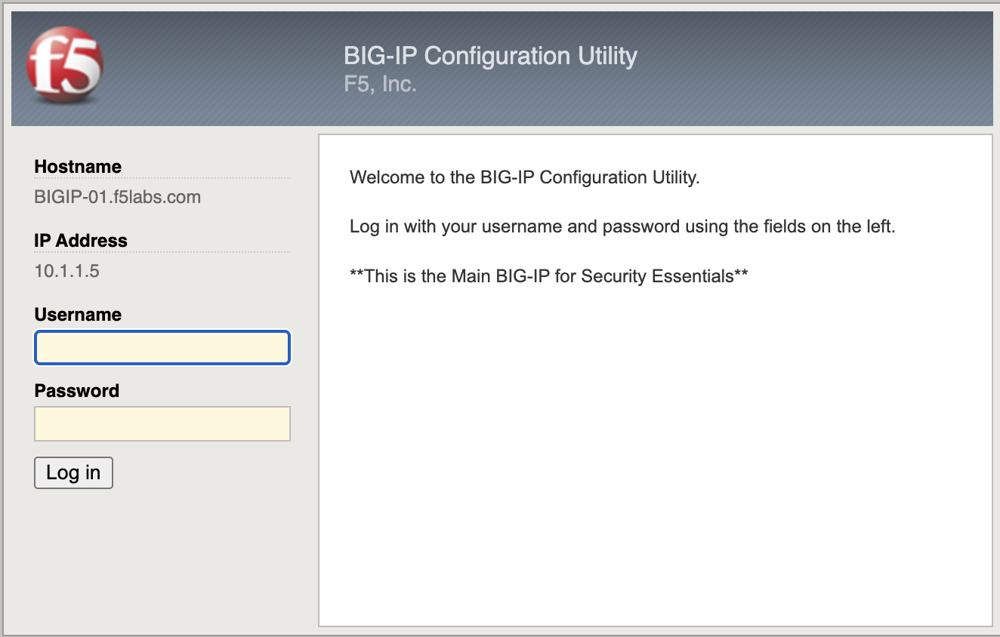
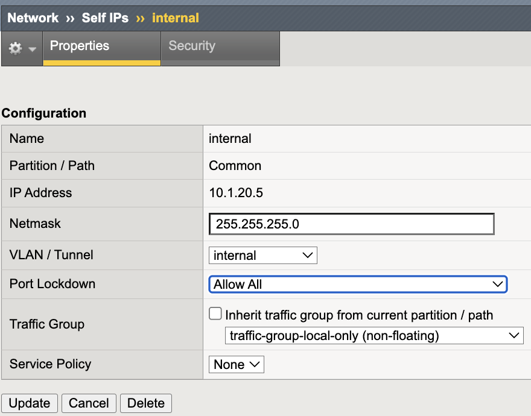
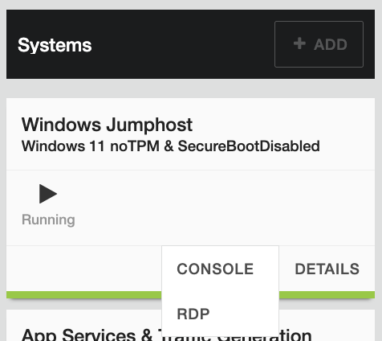
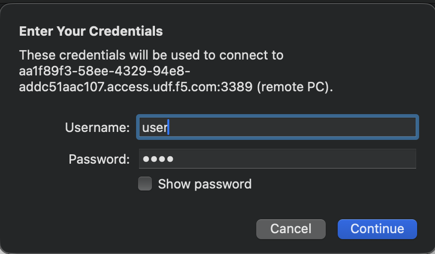

Self IP Port Lockdown
=====================

Self IP Port Lockdown restricts which control-plane services are exposed
via data-plane VLAN interfaces. Even without virtual servers configured,
Self IPs may respond to administrative services unless explicitly limited.

This mechanism is a critical Outer Layer boundary control.

.. admonition:: Executive Summary
   :class: important

   Production data-plane VLANs must enforce a default-deny posture
   using **Allow None**. Administrative services must never be reachable
   from DMZ or application VLANs.

   Self IP Port Lockdown complements IP Allowlisting by ensuring that
   management services are not exposed to unintended network segments.

Threat Scenario
---------------

In the absence of Port Lockdown hardening:

* A compromised workload on a server VLAN could attempt SSH access
  to the BIG-IP Self IP.
* An insider on an application network could reach HTTPS (TMUI).
* Lateral movement could expose the control plane to credential abuse
  or exploit attempts.

Port Lockdown reduces this attack surface by restricting control-plane
service exposure on data-plane interfaces.

Objective
---------

This lab will:

* Identify data-plane Self IPs
* Demonstrate unintended service exposure
* Apply least-privilege Port Lockdown across data-plane VLANs
* Validate service restriction from representative data-plane hosts
* Reinforce Outer Layer segmentation principles

Hardened Enterprise Reference Design
------------------------------------

.. note::

   This is a reference design. Your topology may differ, but the principle
   remains: data-plane VLANs should never expose control-plane services.

.. nwdiag::
   :caption: Outer Layer – Self IP Port Lockdown Reference Design (Control-Plane Exposure)
   :name: self-ip-port-lockdown-reference-design

   nwdiag {

     internet [shape = "cloud", description = "Untrusted / Internet"];

     network mgmt {
       address = "Management Network\n10.1.1.0/24\n(Admin Access)";
     }

     network external {
       address = "External / DMZ VLAN\n10.1.10.0/24\n(Data Plane)";
     }

     network internal {
       address = "Internal App VLAN\n10.1.20.0/24\n(Data Plane)";
     }

     bigip [shape = "roundedbox", description = "BIG-IP\nMgmt: 10.1.1.5\nSelf IPs: 10.1.10.5 / 10.1.20.5"];

     mgmt -- bigip;
     external -- bigip;
     internal -- bigip;

   }

---------------------------------------------------------------------

Lab Procedure
-------------

Step 0 – Access the BIG-IP in UDF
~~~~~~~~~~~~~~~~~~~~~~~~~~~~~~~~~

Before beginning the lab, log in to the BIG-IP Configuration Utility
(TMUI) from the **UDF environment**.

1. In the **UDF deployment**, select the **Access** tab.
2. Locate the **BIG-IP TMUI** link.
3. Click the link to open the BIG-IP Configuration Utility in a new browser tab.
4. Log in using the following credentials:

   * **Username:** ``admin``
   * **Password:** ``f5Twister!``

After successful authentication, the **BIG-IP Configuration Utility dashboard**
will appear. You are now ready to begin the lab.

Step 1 – Identify Data-Plane Self IPs
~~~~~~~~~~~~~~~~~~~~~~~~~~~~~~~~~~~~~

1. Log in to the BIG-IP Configuration Utility.
2. Navigate to **Network → Self IPs**.
3. Identify Self IPs associated with:

   * External VLAN
   * Internal VLAN

.. image:: ../_images/self-ip-port-lockdown-01-baseline-self-ip-list.png
   :alt: Baseline Self IP list
   :align: center
   :width: 900px

Baseline view of configured Self IPs prior to lockdown validation.

Record the data-plane Self IPs for this lab:

* External Self IP: ``10.1.10.5``
* Internal Self IP: ``10.1.20.5``

---------------------------------------------------------------------

Step 2 – Inspect Port Lockdown Mode (Internal and External)
~~~~~~~~~~~~~~~~~~~~~~~~~~~~~~~~~~~~~~~~~~~~~~~~~~~~~~~~~~~

Port Lockdown must be evaluated on **all data-plane VLAN Self IPs**.

1. Click the **internal Self IP (10.1.20.5)**.
2. Review the **Port Lockdown** setting.

3. Return to the Self IP list.
4. Click the **external Self IP (10.1.10.5)**.
5. Review the **Port Lockdown** setting.

If either Self IP is set to **Allow Default**, administrative services may be
exposed on that VLAN via the data-plane interface.

.. note::

   In the next steps you will validate exposure from a data-plane host, then
   remediate by applying **Allow None** to BOTH the internal and external
   data-plane Self IPs. This ensures downstream segmentation validation steps
   (including External Self IP checks) are deterministic.

---------------------------------------------------------------------

Step 3 – Validate Service Exposure (Internal Data Plane)
~~~~~~~~~~~~~~~~~~~~~~~~~~~~~~~~~~~~~~~~~~~~~~~~~~~~~~~~

Execution Context:

* Host: **Windows Jumphost**
* Network Interface: **10.1.20.0/24 (Internal Data Plane)**
* Git Bash

Access Windows Jumphost with RDP:
Username: user 
Password: user

Run the following commands:

.. code-block:: powershell

   timeout 2 bash -c "</dev/tcp/10.1.20.5/443" && echo "443 OPEN" || echo "443 BLOCKED"
   timeout 2 bash -c "</dev/tcp/10.1.20.5/22"  && echo "22 OPEN"  || echo "22 BLOCKED"

Expected (vulnerable state):

* Port 22: OPEN
* Port 443: OPEN

.. image:: ../_images/self-ip-port-lockdown-03-exposed-ports-test.png
   :alt: Exposed control-plane ports validation
   :align: center
   :width: 900px

Baseline validation from a data-plane host showing TCP 443 and 22 reachable.

.. note::

   The Windows Jumphost is multi-homed. Ensure the test originates from
   the **10.1.20.0/24 interface**.

   You can confirm this using:

   .. code-block:: powershell

      ipconfig

---------------------------------------------------------------------

Step 4 – Remediate with Allow None (Internal and External)
~~~~~~~~~~~~~~~~~~~~~~~~~~~~~~~~~~~~~~~~~~~~~~~~~~~~~~~~~~

Apply a default-deny Port Lockdown posture to **all data-plane Self IPs**.

Internal Self IP (10.1.20.5)
^^^^^^^^^^^^^^^^^^^^^^^^^^^^^

1. Navigate to **Network → Self IPs**.
2. Click the **internal Self IP (10.1.20.5)**.
3. Change **Port Lockdown** to **Allow None**.
4. Click **Update**.

.. image:: ../_images/self-ip-port-lockdown-04-internal-selfip-allow-none.png
   :alt: Internal Self IP configured with Allow None
   :align: center
   :width: 900px

External Self IP (10.1.10.5)
^^^^^^^^^^^^^^^^^^^^^^^^^^^^^

1. Navigate to **Network → Self IPs**.
2. Click the **external Self IP (10.1.10.5)**.
3. Change **Port Lockdown** to **Allow None**.
4. Click **Update**.

.. note::

   Capture a screenshot of the external Self IP set to **Allow None** and
   save it alongside the other lab images (Module 1).

   Suggested filename:
   ``self-ip-port-lockdown-04-external-selfip-allow-none.png``

.. note::

   Do not apply **Allow None** to a VLAN currently used for management
   access. Ensure OOB management access remains available before enforcing
   this control.

---------------------------------------------------------------------

Step 5 – Re-Test from Data-Plane Host (Internal Data Plane)
~~~~~~~~~~~~~~~~~~~~~~~~~~~~~~~~~~~~~~~~~~~~~~~~~~~~~~~~~~~

Execution Context:

* Host: **Windows Jumphost**
* Network Interface: **10.1.20.0/24 (Internal Data-Plane Network)**
* Git Bash

Run the following commands:

.. code-block:: powershell

   timeout 2 bash -c "</dev/tcp/10.1.20.5/443" && echo "443 OPEN" || echo "443 BLOCKED"
   timeout 2 bash -c "</dev/tcp/10.1.20.5/22"  && echo "22 OPEN"  || echo "22 BLOCKED"

Expected (secure state):

* Port 22: BLOCKED
* Port 443: BLOCKED

.. image:: ../_images/self-ip-port-lockdown-05-ports-blocked-test.png
   :alt: Ports blocked after Allow None
   :align: center
   :width: 900px

Post-remediation validation from the data-plane host showing
control-plane services no longer reachable.

.. note::

   ICMP echo responses may still succeed. Port Lockdown restricts
   control-plane services, not basic IP reachability.

---------------------------------------------------------------------

Validation Summary
------------------

After remediation:

* SSH not reachable on internal data-plane VLAN Self IP
* HTTPS not reachable on internal data-plane VLAN Self IP
* External / DMZ data-plane VLAN Self IP also uses **Allow None**
* Control-plane services are not exposed on data-plane VLAN interfaces

Outer Layer Alignment
---------------------

IP Allowlisting protects:

* **Who** can access management services.

Self IP Port Lockdown protects:

* **Where** management services are exposed.

Together they enforce:

* Least privilege
* Network segmentation
* Control-plane isolation

Success Criteria
----------------

* Internal and External data-plane VLAN Self IPs use **Allow None**
* No administrative services reachable from data-plane hosts
* Management interface access remains functional
* No unintended exposure remains