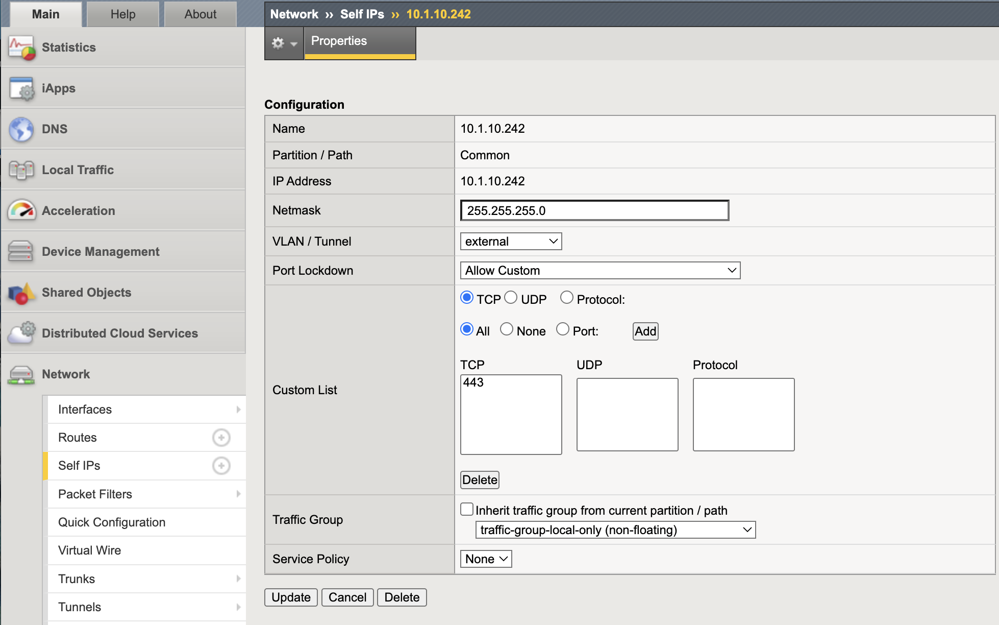

Self IP Port Lockdown
=====================

Self IP Port Lockdown restricts which control-plane services are reachable
on each VLAN. Even without virtual servers configured, Self IPs may respond
to administrative services unless explicitly limited.

This mechanism is a critical Outer Layer boundary control.

Executive Summary
-----------------

   Production data-plane VLANs must enforce a default-deny posture
   using **Allow None**. Administrative services must never be exposed
   on DMZ or application VLANs.

   Self IP Port Lockdown complements IP Allowlisting by ensuring that
   management services are not reachable from unintended network segments.

Objective
---------

This lab will:

* Identify data-plane Self IPs
* Demonstrate unintended service exposure
* Apply least-privilege Port Lockdown
* Validate service restriction from a data-plane host
* Reinforce Outer Layer segmentation principles

Hardened Enterprise Reference Design
------------------------------------

.. note::

   This is a reference design. Your topology may differ, but the principle
   remains: data-plane VLANs should never expose control-plane services.

.. nwdiag::
   :caption: Reference Design – Control Plane Segmentation
   :name: selfip-port-lockdown-reference-design

   nwdiag {
     internet [shape = cloud];
     network dmz     { address = "External VLAN (Data Plane)"; }
     network internal{ address = "Internal VLAN (Data Plane)"; }
     network mgmt    { address = "OOB Management"; }

     internet -- dmz;

     bigip [description = "BIG-IP\nMgmt: Restricted\nData Plane: Allow None"];

     dmz -- bigip;
     internal -- bigip;
     mgmt -- bigip;
   }

Recommended VLAN Posture
------------------------

+----------------+----------------------------+--------------------+--------------------------------------+
| VLAN           | Purpose                    | Port Lockdown Mode | Rationale                             |
+================+============================+====================+======================================+
| Mgmt (OOB)     | Administrative access      | Allow Default      | Isolated management network           |
+----------------+----------------------------+--------------------+--------------------------------------+
| External (DMZ) | Client-side data plane     | Allow None         | Prevent control-plane exposure        |
+----------------+----------------------------+--------------------+--------------------------------------+
| Internal       | Server-side data plane     | Allow None         | Prevent lateral movement              |
+----------------+----------------------------+--------------------+--------------------------------------+

Port Lockdown Modes
-------------------

+--------------+---------------------------------------------------+
| Mode         | Behavior                                          |
+==============+===================================================+
| Allow None   | Blocks all control-plane services                 |
+--------------+---------------------------------------------------+
| Allow Default| Enables system-defined administrative services    |
+--------------+---------------------------------------------------+
| Allow Custom | Enables only explicitly defined services          |
+--------------+---------------------------------------------------+

.. warning::

   "Allow Default" on production VLANs may expose SSH and HTTPS
   to unintended network segments.

---------------------------------------------------------------------

Lab Procedure
-------------

Step 1 – Identify Data-Plane Self IPs
~~~~~~~~~~~~~~~~~~~~~~~~~~~~~~~~~~~~~

1. Log in to the BIG-IP Configuration Utility.
2. Navigate to **Network → Self IPs**.
3. Identify Self IPs associated with:
   * External VLAN
   * Internal VLAN

.. figure:: ../_images/self-ip-port-lockdown-01-baseline-self-ip-list.png
   :alt: Baseline Self IP list
   :align: center
   :width: 900px

   Baseline view of configured Self IPs prior to lockdown validation.

Document the IP address of the internal (data-plane) Self IP
(for example: ``10.1.20.242``). You will use this IP in Steps 3 and 5.

---------------------------------------------------------------------

Step 2 – Inspect Port Lockdown Mode
~~~~~~~~~~~~~~~~~~~~~~~~~~~~~~~~~~~~

1. Click the internal Self IP.
2. Review the **Port Lockdown** setting.

If it is set to **Allow Default**, control-plane services
may be exposed on this VLAN.

   External Self IP configured with the default Port Lockdown posture (pre-hardening).

---------------------------------------------------------------------

Step 3 – Validate Service Exposure
~~~~~~~~~~~~~~~~~~~~~~~~~~~~~~~~~~

From a host on the same data-plane network
(for example: Windows Jumpbox on 10.1.20.0/24):

.. code-block:: powershell

   Test-NetConnection 10.1.20.242 -Port 443
   Test-NetConnection 10.1.20.242 -Port 22

Expected (vulnerable state):

* TcpTestSucceeded: True

.. figure:: ../_images/self-ip-port-lockdown-03-exposed-ports-test.png
   :alt: PowerShell validation showing exposed control-plane ports on the Self IP
   :align: center
   :width: 900px

   Baseline validation from a data-plane host showing TCP 443 and 22 reachable (vulnerable state).

This confirms control-plane services are reachable
from the data-plane VLAN.

---------------------------------------------------------------------

Step 4 – Remediate with Allow None
~~~~~~~~~~~~~~~~~~~~~~~~~~~~~~~~~~

1. Navigate back to the Self IP configuration.
2. Change **Port Lockdown** to:

   **Allow None**

3. Click **Update**.

.. figure:: ../_images/self-ip-port-lockdown-04-internal-selfip-allow-none.png
   :alt: Internal Self IP configured with Port Lockdown set to Allow None
   :align: center
   :width: 900px

   Remediation: Internal Self IP Port Lockdown set to Allow None (default-deny for control-plane services).

This enforces a default-deny posture.

---------------------------------------------------------------------

Step 5 – Re-Test from Data-Plane Host
~~~~~~~~~~~~~~~~~~~~~~~~~~~~~~~~~~~~~

From the same Windows host:

.. code-block:: powershell

   Test-NetConnection 10.1.20.242 -Port 443
   Test-NetConnection 10.1.20.242 -Port 22

Expected (secure state):

* TcpTestSucceeded: False
* Warning: TCP connect failed

.. figure:: ../_images/self-ip-port-lockdown-05-ports-blocked-test.png
   :alt: PowerShell validation showing control-plane ports blocked after Allow None
   :align: center
   :width: 900px

   Post-remediation validation from the data-plane host: TCP 443 and 22 blocked while ICMP remains reachable.

---------------------------------------------------------------------

Validation Summary
------------------

After remediation:

* SSH not reachable on data-plane VLAN
* HTTPS not reachable on data-plane VLAN
* Control-plane services isolated to management interface only

Outer Layer Alignment
---------------------

IP Allowlisting protects:

* **Who** can access management services.

Self IP Port Lockdown protects:

* **Where** management services are exposed.

Together they enforce:

* Least privilege
* Network segmentation
* Control-plane isolation

Success Criteria
----------------

* Data-plane VLAN Self IPs use **Allow None**
* No administrative services reachable from data-plane hosts
* Management interface access remains functional
* No unintended exposure remains
