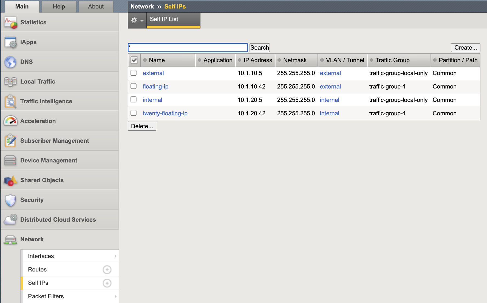
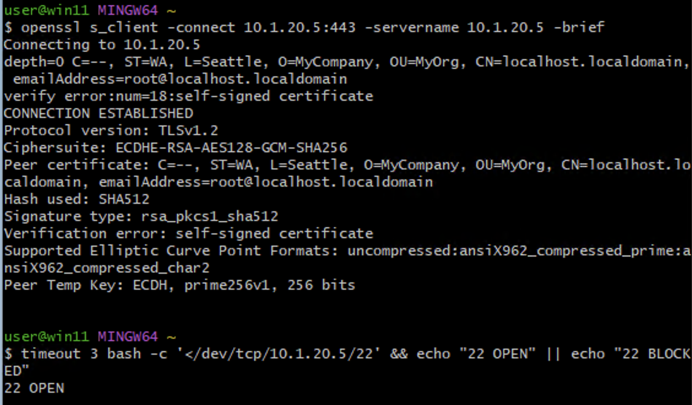
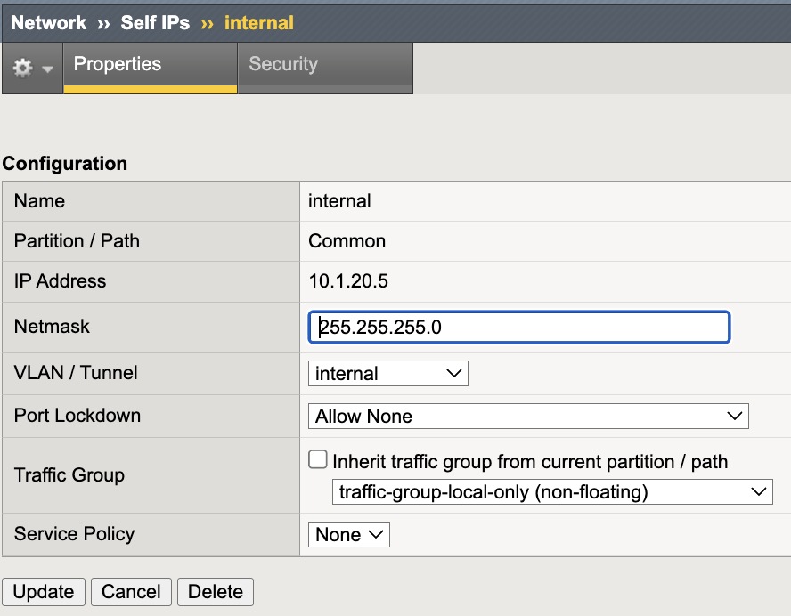
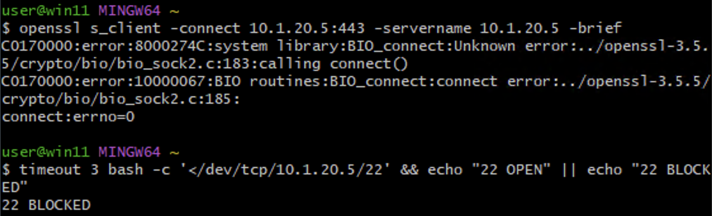

Self IP Port Lockdown
=====================

Self IP Port Lockdown restricts which control-plane services are exposed
via data-plane VLAN interfaces. Even without virtual servers configured,
Self IPs may respond to administrative services unless explicitly limited.

This mechanism is a critical Outer Layer boundary control.

Executive Summary
-----------------

   Production data-plane VLANs must enforce a default-deny posture
   using **Allow None**. Administrative services must never be reachable
   from DMZ or application VLANs.

   Self IP Port Lockdown complements IP Allowlisting by ensuring that
   management services are not exposed to unintended network segments.

Threat Scenario
---------------

In the absence of Port Lockdown hardening:

* A compromised workload on a server VLAN could attempt SSH access
  to the BIG-IP Self IP.
* An insider on an application network could reach HTTPS (TMUI).
* Lateral movement could expose the control plane to credential abuse
  or exploit attempts.

Port Lockdown reduces this attack surface by restricting control-plane
service exposure on data-plane interfaces.

Objective
---------

This lab will:

* Identify data-plane Self IPs
* Demonstrate unintended service exposure
* Apply least-privilege Port Lockdown
* Validate service restriction from a data-plane host
* Reinforce Outer Layer segmentation principles

Hardened Enterprise Reference Design
------------------------------------

.. note::

   This is a reference design. Your topology may differ, but the principle
   remains: data-plane VLANs should never expose control-plane services.

.. nwdiag::
   :caption: Reference Design – Control Plane Segmentation
   :name: selfip-port-lockdown-reference-design

   nwdiag {
     internet [shape = cloud];
     network dmz     { address = "External VLAN (Data Plane)"; }
     network internal{ address = "Internal VLAN (Data Plane)"; }
     network mgmt    { address = "OOB Management"; }

     internet -- dmz;

     bigip [description = "BIG-IP\nMgmt: Restricted\nData Plane: Allow None"];

     dmz -- bigip;
     internal -- bigip;
     mgmt -- bigip;
   }

---------------------------------------------------------------------

Lab Procedure
-------------

Step 1 – Identify Data-Plane Self IPs
~~~~~~~~~~~~~~~~~~~~~~~~~~~~~~~~~~~~~

1. Log in to the BIG-IP Configuration Utility.
2. Navigate to **Network → Self IPs**.
3. Identify Self IPs associated with:
   * External VLAN
   * Internal VLAN

Baseline view of configured Self IPs prior to lockdown validation.

Document the IP address of the internal (data-plane) Self IP
(for example: ``10.1.20.242``). You will use this IP in Steps 3 and 5.

---------------------------------------------------------------------

Step 2 – Inspect Port Lockdown Mode
~~~~~~~~~~~~~~~~~~~~~~~~~~~~~~~~~~~~

1. Click the internal Self IP.
2. Review the **Port Lockdown** setting.

If it is set to **Allow Default**, administrative services may be
exposed on this VLAN via the data-plane interface.

---------------------------------------------------------------------

Step 3 – Validate Service Exposure
~~~~~~~~~~~~~~~~~~~~~~~~~~~~~~~~~~

From a host on the same data-plane network
(for example: Windows Jumpbox on 10.1.20.0/24):

.. code-block:: powershell

   openssl s_client -connect 10.1.20.5:443 -servername 10.1.20.5 -brief
   timeout 3 bash -c '</dev/tcp/10.1.20.5/22' && echo "22 OPEN" || echo "22 BLOCKED"

Expected (vulnerable state):

* TcpTestSucceeded: True

Baseline validation from a data-plane host showing TCP 443 and 22 reachable (vulnerable state).

This confirms that administrative services are exposed to the
data-plane network segment, creating lateral movement risk.

---------------------------------------------------------------------

Step 4 – Remediate with Allow None
~~~~~~~~~~~~~~~~~~~~~~~~~~~~~~~~~~

1. Navigate back to the Self IP configuration.
2. Change **Port Lockdown** to:

   **Allow None**

3. Click **Update**.

.. note::

   Do not apply **Allow None** to a VLAN currently used for management
   access. Ensure OOB management access remains available before enforcing
   this control.

Remediation: Internal Self IP Port Lockdown set to Allow None (default-deny posture).

This enforces a default-deny posture for control-plane services
on the data-plane VLAN.

---------------------------------------------------------------------

Step 5 – Re-Test from Data-Plane Host
~~~~~~~~~~~~~~~~~~~~~~~~~~~~~~~~~~~~~

From the same Windows host:

.. code-block:: powershell

   openssl s_client -connect 10.1.20.5:443 -servername 10.1.20.5 -brief
   timeout 3 bash -c '</dev/tcp/10.1.20.5/22' && echo "22 OPEN" || echo "22 BLOCKED"

Expected (secure state):

* TcpTestSucceeded: False
* Warning: TCP connect failed

Post-remediation validation from the data-plane host: TCP 443 and 22 blocked.

.. note::

   ICMP echo responses may still succeed. Port Lockdown restricts
   control-plane services, not basic IP reachability.

---------------------------------------------------------------------

Validation Summary
------------------

After remediation:

* SSH not reachable on data-plane VLAN
* HTTPS not reachable on data-plane VLAN
* Control-plane services isolated to management interface only

Outer Layer Alignment
---------------------

IP Allowlisting protects:

* **Who** can access management services.

Self IP Port Lockdown protects:

* **Where** management services are exposed.

Together they enforce:

* Least privilege
* Network segmentation
* Control-plane isolation

Success Criteria
----------------

* Data-plane VLAN Self IPs use **Allow None**
* No administrative services reachable from data-plane hosts
* Management interface access remains functional
* No unintended exposure remains