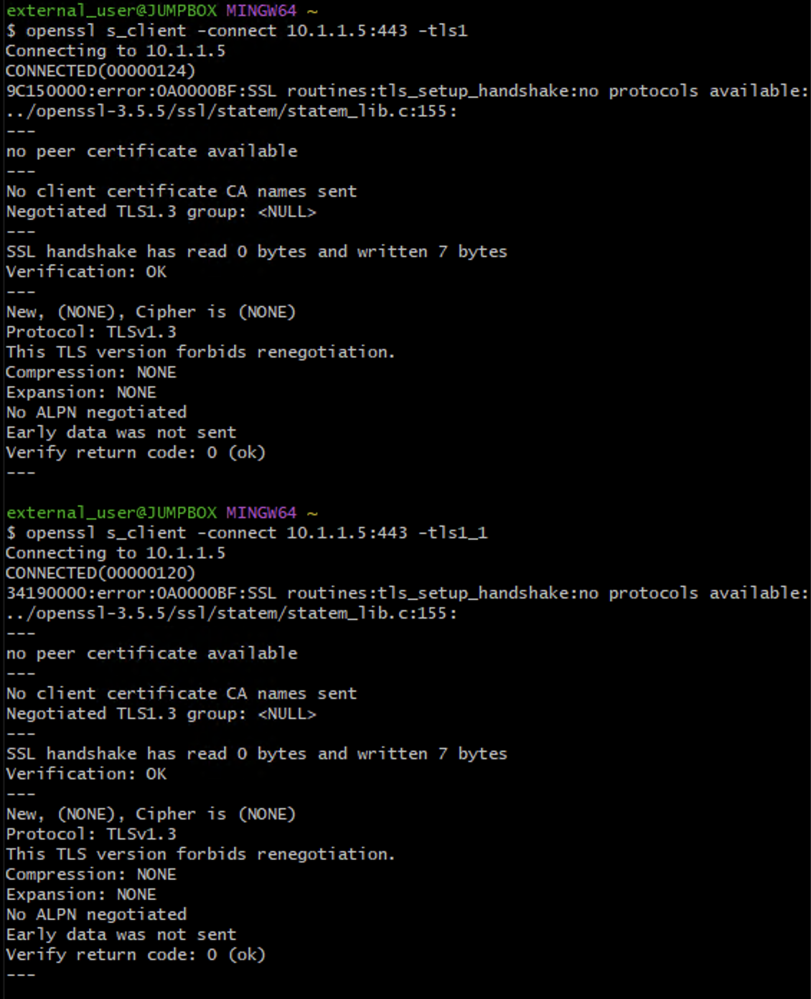
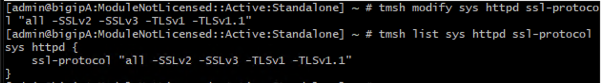
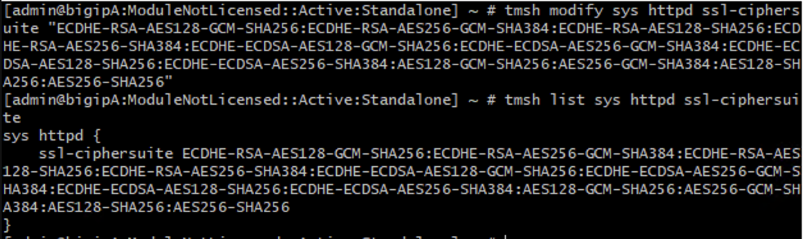
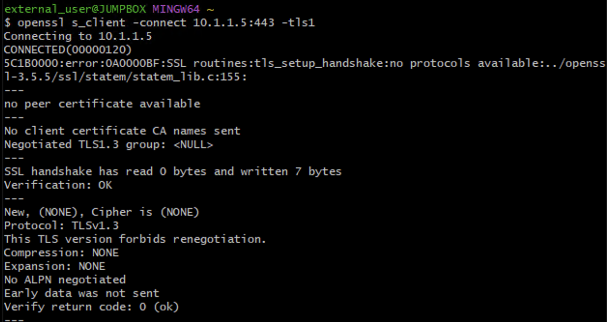
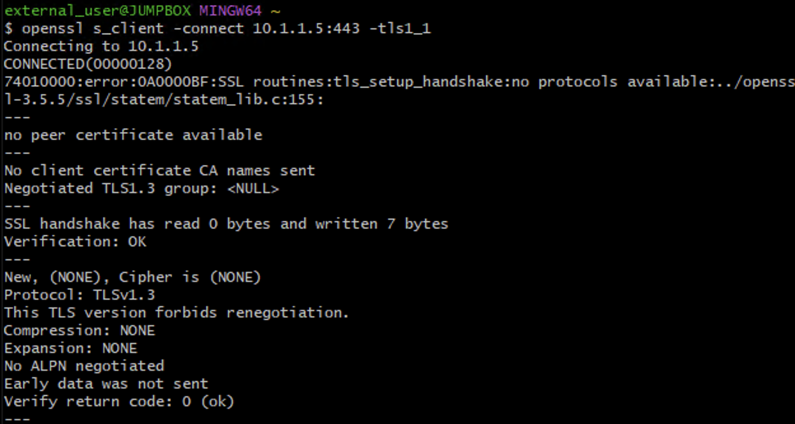
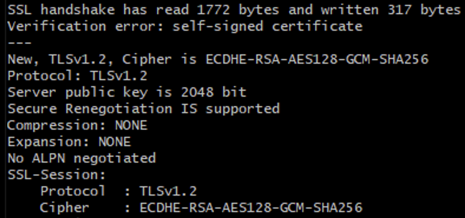
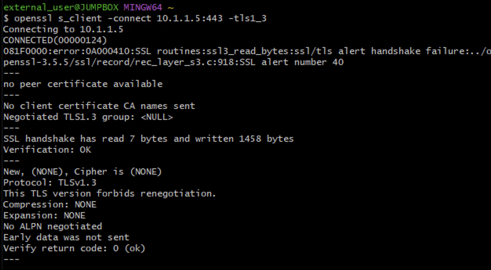
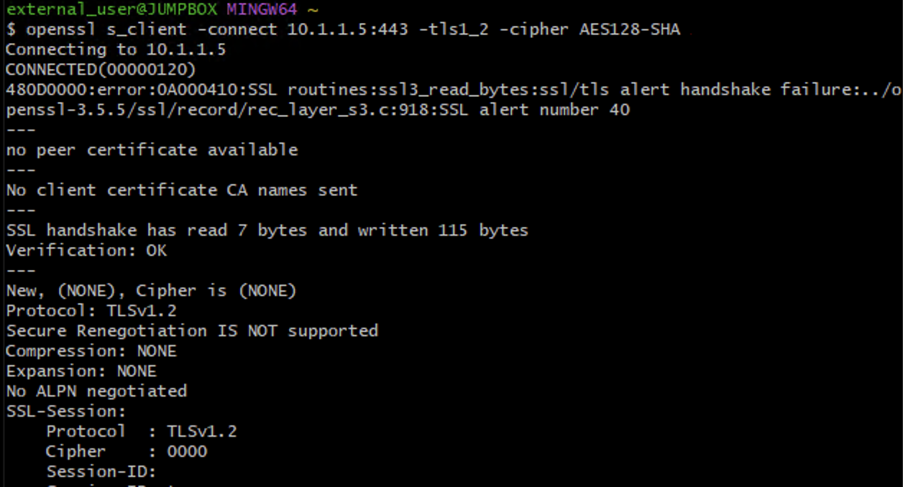

Administrative TLS Hardening – TMUI & iControl REST
===================================================

Administrative HTTPS services on the BIG-IP management interface must enforce modern TLS versions and strong cipher suites.

This lab hardens TLS posture for:

* TMUI (HTTPS management interface)
* iControl REST (management-plane API)

This mechanism is a critical Middle Layer cryptographic control.

This lab focuses on management-plane TLS hardening. Data-plane TLS hardening for application virtual servers is covered in the TLS and Cipher Hardening lab.

Executive Summary
-----------------

Administrative interfaces must not support legacy TLS versions or weak cipher suites.

Weak protocol exposure on the management interface increases the risk of downgrade attacks, cryptographic exploitation, and compliance violations.

Hardening must be validated using deterministic handshake testing.

Threat Scenario
---------------

In the absence of administrative TLS hardening:

* Attackers may negotiate TLS 1.0 or TLS 1.1.
* Weak cipher suites may be offered.
* Downgrade attacks may force weaker protocol selection.
* Credential interception risk increases under legacy crypto.
* Compliance audits (PCI DSS, NIST) may flag non-compliant exposure.

Administrative TLS hardening reduces these risks by enforcing modern cryptographic standards on management-plane services.

Objective
---------

This lab will:

* Observe baseline TLS posture of the management interface
* Harden management TLS protocol versions
* Enforce strong cipher posture
* Validate deterministic protocol enforcement
* Confirm administrative access remains functional

.. warning::

   Modifying management-plane TLS settings can result in administrative lockout.

   Before applying changes:

   * Ensure console access is available.
   * Confirm an authorized administrative host is accessible.
   * Do NOT close your current session until validation succeeds.

Hardened Enterprise Reference Design
------------------------------------

The management interface should:

* Allow TLS 1.2 only (TLS 1.3 may not be active on the management plane in this TMOS build)
* Disable TLS 1.0 and TLS 1.1
* Enforce strong ECDHE-based cipher suites
* Align with enterprise cryptographic policy

Middle Layer Cohesion
---------------------

Within the Middle Layer:

* MFA validates administrative identity.
* Administrative TLS hardening protects management transport security.
* API Access Control enforces privilege boundaries.

Together, these controls prevent credential abuse, downgrade attacks, and unauthorized configuration changes.

Phase 1 – Baseline Management TLS Observation
---------------------------------------------

From the Windows Jumpbox (Git Bash):

Test TLS 1.0:

.. code-block:: bash

   openssl s_client -connect 10.1.1.5:443 -tls1

.. image:: /class9/module2_middle/_images/phase1_base_tlsv1.png
   :align: center
   :alt: Baseline TLS handshake results prior to hardening
   :width: 900px   

Test TLS 1.1:

.. code-block:: bash

   openssl s_client -connect 10.1.1.5:443 -tls1_1

<<<<<<< HEAD
Test TLS 1.2:
=======
<<<<<<< Updated upstream
Test TLS 1.2 (Expected: Success)
=======
.. image:: /class9/module2_middle/_images/phase1_base_tlsv1_1.png
   :align: center
   :alt: Baseline TLS handshake results prior to hardening
   :width: 900px
Test TLS 1.2:
>>>>>>> Stashed changes
>>>>>>> 9612adc (Class9: align outer/middle labs and screenshots to current environment)

.. code-block:: bash

   openssl s_client -connect 10.1.1.5:443 -tls1_2

<<<<<<< HEAD
=======
.. image:: /class9/module2_middle/_images/phase1_base_tlsv1_2.png
   :align: center
   :alt: Baseline TLS handshake results prior to hardening
   :width: 900px

<<<<<<< Updated upstream
=======
>>>>>>> 9612adc (Class9: align outer/middle labs and screenshots to current environment)
Test TLS 1.3:

.. code-block:: bash

<<<<<<< HEAD
   openssl s_client -connect <mgmt-ip>:443 -tls1_3

=======
   openssl s_client -connect 10.1.1.5:443 -tls1_3

.. image:: /class9/module2_middle/_images/phase1_base_tlsv1_3.png
   :align: center
   :alt: Baseline TLS handshake results prior to hardening
   :width: 900px

>>>>>>> Stashed changes
>>>>>>> 9612adc (Class9: align outer/middle labs and screenshots to current environment)
Capture:

* Negotiated protocol
* Negotiated cipher suite

<<<<<<< HEAD

=======
<<<<<<< Updated upstream
.. figure:: ../_images/administrative-tls-hardening-01-baseline-tls-observation.png
   :align: center
   :alt: Baseline TLS handshake against management interface

   Baseline TLS handshake results for the management interface prior to hardening.
=======
.. image:: /class9/module2_middle/_images/phase1_base_tlsv1.png
   :align: center
   :alt: Baseline TLS handshake results prior to hardening
   :width: 900px

Baseline TLS handshake results for the management interface prior to hardening.
>>>>>>> Stashed changes
>>>>>>> 9612adc (Class9: align outer/middle labs and screenshots to current environment)

If TLS 1.0 or TLS 1.1 succeeds, legacy protocol exposure is confirmed.

Phase 2 – Harden Management TLS Configuration (TMOS 17.5.x)
------------------------------------------------------------

In TMOS 17.5.x, management TLS is configured using:

.. code-block:: bash

   tmsh modify sys httpd

It is NOT configured via sys db variables or direct file edits.

Step 1 – Disable Legacy Protocols
~~~~~~~~~~~~~~~~~~~~~~~~~~~~~~~~~~

From an active SSH session:

.. code-block:: bash

   tmsh modify sys httpd ssl-protocol "all -SSLv2 -SSLv3 -TLSv1 -TLSv1.1"

Verify:

.. code-block:: bash

<<<<<<< HEAD
   tmsh list sys httpd ssl-protocol

Expected result:

.. code-block:: text

   ssl-protocol "all -SSLv2 -SSLv3 -TLSv1 -TLSv1.1"

=======
<<<<<<< Updated upstream
.. figure:: ../_images/administrative-tls-hardening-02-hardened-config.png
   :align: center
   :alt: Hardened management TLS configuration screen
=======
   tmsh list sys httpd ssl-protocol

Expected result:

.. image:: /class9/module2_middle/_images/phase2_step1.png
   :align: center
   :alt: Management TLS protocol hardened
   :width: 900px

Management TLS protocol configuration updated to disable TLS 1.0 and TLS 1.1.
>>>>>>> Stashed changes
>>>>>>> 9612adc (Class9: align outer/middle labs and screenshots to current environment)

Step 2 – Enforce Balanced Enterprise Cipher Posture
~~~~~~~~~~~~~~~~~~~~~~~~~~~~~~~~~~~~~~~~~~~~~~~~~~~~

<<<<<<< HEAD
=======
<<<<<<< Updated upstream
---------------------------------------------------------------------
=======
>>>>>>> 9612adc (Class9: align outer/middle labs and screenshots to current environment)
Apply reduced cipher list:

.. code-block:: bash

   tmsh modify sys httpd ssl-ciphersuite "ECDHE-RSA-AES128-GCM-SHA256:ECDHE-RSA-AES256-GCM-SHA384:ECDHE-RSA-AES128-SHA256:ECDHE-RSA-AES256-SHA384:ECDHE-ECDSA-AES128-GCM-SHA256:ECDHE-ECDSA-AES256-GCM-SHA384:ECDHE-ECDSA-AES128-SHA256:ECDHE-ECDSA-AES256-SHA384:AES128-GCM-SHA256:AES256-GCM-SHA384:AES128-SHA256:AES256-SHA256"

Verify:

.. code-block:: bash

   tmsh list sys httpd ssl-ciphersuite

<<<<<<< HEAD

=======
.. image:: /class9/module2_middle/_images/phase2_step2.png
   :align: center
   :alt: Management TLS cipher suite hardened
   :width: 900px

Management TLS cipher suite reduced to remove SHA1-based ciphers while preserving enterprise compatibility.
>>>>>>> Stashed changes
>>>>>>> 9612adc (Class9: align outer/middle labs and screenshots to current environment)

Phase 3 – Deterministic Validation
-----------------------------------

Test TLS 1.0 (Expected: Failure)

.. code-block:: bash

   openssl s_client -connect 10.1.1.5:443 -tls1

<<<<<<< HEAD

=======
<<<<<<< Updated upstream
Expected Result:

* Handshake failure
* No cipher negotiated

.. figure:: ../_images/administrative-tls-hardening-03-tls10-blocked.png
=======
.. image:: /class9/module2_middle/_images/phase3_test_1_0.png
>>>>>>> Stashed changes
>>>>>>> 9612adc (Class9: align outer/middle labs and screenshots to current environment)
   :align: center
   :alt: TLS 1.0 handshake failure after hardening
   :width: 900px

TLS 1.0 handshake failure after hardening.

Test TLS 1.1 (Expected: Failure)

.. code-block:: bash

   openssl s_client -connect <mgmt-ip>:443 -tls1_1

<<<<<<< HEAD

=======
<<<<<<< Updated upstream
Expected Result:

* Handshake failure
* No cipher negotiated

.. figure:: ../_images/administrative-tls-hardening-04-tls11-blocked.png
=======
.. image:: /class9/module2_middle/_images/phase3_test_1_1.png
>>>>>>> Stashed changes
>>>>>>> 9612adc (Class9: align outer/middle labs and screenshots to current environment)
   :align: center
   :alt: TLS 1.1 handshake failure after hardening
   :width: 900px

TLS 1.1 handshake failure after hardening.

Test TLS 1.2 (Expected: Success)

.. code-block:: bash

   openssl s_client -connect <mgmt-ip>:443 -tls1_2

<<<<<<< HEAD

=======
<<<<<<< Updated upstream
.. figure:: ../_images/administrative-tls-hardening-05-tls12-success.png
=======
.. image:: /class9/module2_middle/_images/phase3_test_1_2.png
>>>>>>> Stashed changes
>>>>>>> 9612adc (Class9: align outer/middle labs and screenshots to current environment)
   :align: center
   :alt: TLS 1.2 handshake success after hardening
   :width: 900px

TLS 1.2 handshake success after hardening.

Test TLS 1.3 (Version-Dependent)

.. code-block:: bash

   openssl s_client -connect <mgmt-ip>:443 -tls1_3

<<<<<<< HEAD
In this TMOS build, TLS 1.3 may not be active on the management plane. A handshake failure confirms TLS 1.3 is not enabled for management services.

=======
<<<<<<< Updated upstream
.. figure:: ../_images/administrative-tls-hardening-06-tls13-success.png
   :align: center
   :alt: TLS 1.3 handshake success after hardening
=======
In this TMOS build, TLS 1.3 may not be active on the management plane. A handshake failure confirms TLS 1.3 is not enabled for management services.

.. image:: /class9/module2_middle/_images/phase3_test_1_3.png
   :align: center
   :alt: TLS 1.3 handshake result
   :width: 900px

TLS 1.3 test result against the management interface (version-dependent).
>>>>>>> Stashed changes
>>>>>>> 9612adc (Class9: align outer/middle labs and screenshots to current environment)

Optional – Weak Cipher Validation
~~~~~~~~~~~~~~~~~~~~~~~~~~~~~~~~~

Attempt deprecated SHA1 cipher:

.. code-block:: bash

   openssl s_client -connect <mgmt-ip>:443 -tls1_2 -cipher AES128-SHA

Expected result:

* Handshake failure
* No cipher negotiated

<<<<<<< HEAD

=======
<<<<<<< Updated upstream
---------------------------------------------------------------------
=======
.. image:: /class9/module2_middle/_images/phase3_test_cipher.png
   :align: center
   :alt: Weak cipher rejected
   :width: 900px

Weak cipher negotiation attempt rejected (SHA1-based cipher not permitted).
>>>>>>> Stashed changes
>>>>>>> 9612adc (Class9: align outer/middle labs and screenshots to current environment)

Deterministic Validation Matrix
-------------------------------

+----------------------------------+----------------------+
| Test Case                        | Expected Result      |
+==================================+======================+
| TLS 1.0 handshake                | Fail                 |
+----------------------------------+----------------------+
| TLS 1.1 handshake                | Fail                 |
+----------------------------------+----------------------+
| TLS 1.2 handshake                | Success              |
+----------------------------------+----------------------+
| TLS 1.3 handshake                | Version-dependent    |
+----------------------------------+----------------------+
| Weak cipher negotiation attempt  | Fail                 |
+----------------------------------+----------------------+

Security Controls Validated
---------------------------

+-------------------------------------------+-----------+
| Control                                   | Validated |
+===========================================+===========+
| Legacy protocol elimination               | ✔         |
+-------------------------------------------+-----------+
| Strong cipher enforcement                 | ✔         |
+-------------------------------------------+-----------+
| Deterministic handshake validation        | ✔         |
+-------------------------------------------+-----------+
| Management-plane cryptographic hardening  | ✔         |
+-------------------------------------------+-----------+

---------------------------------------------------------------------

Success Criteria
~~~~~~~~~~~~~~~~

* TLS 1.0 and TLS 1.1 are disabled on the management interface
* TLS 1.2 negotiates successfully
* Weak SHA1-based ciphers are not offered
* Administrative access remains functional
* Deterministic enforcement confirmed via handshake testing