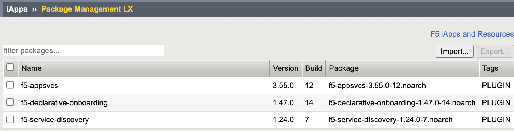
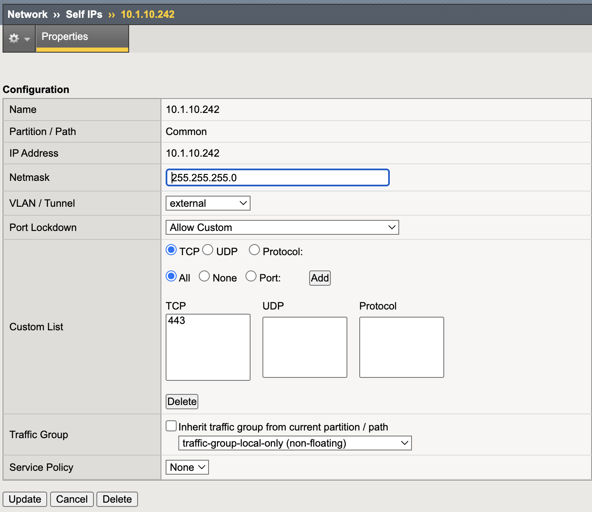
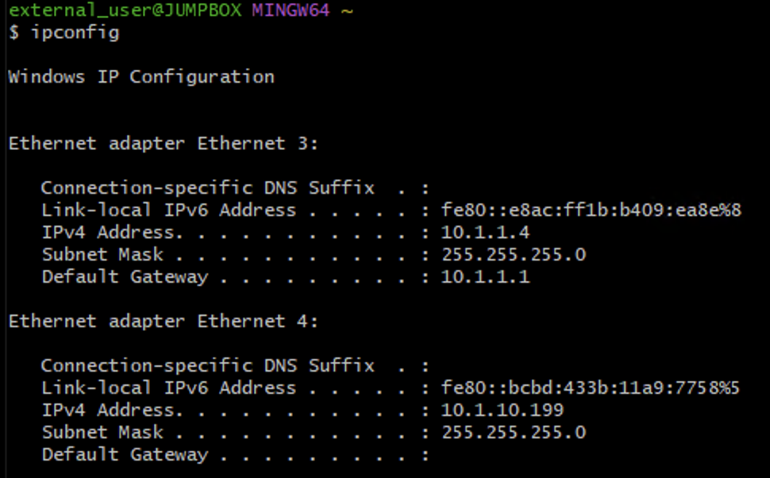
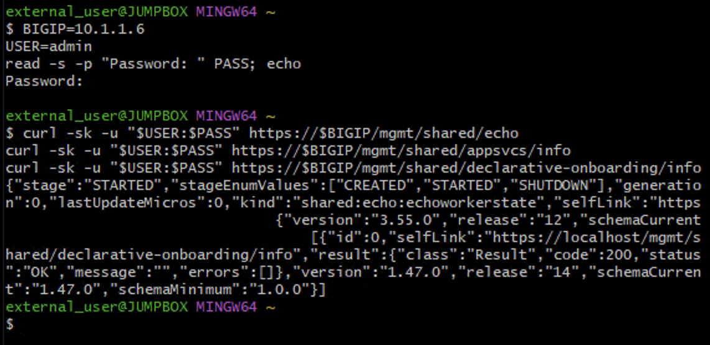
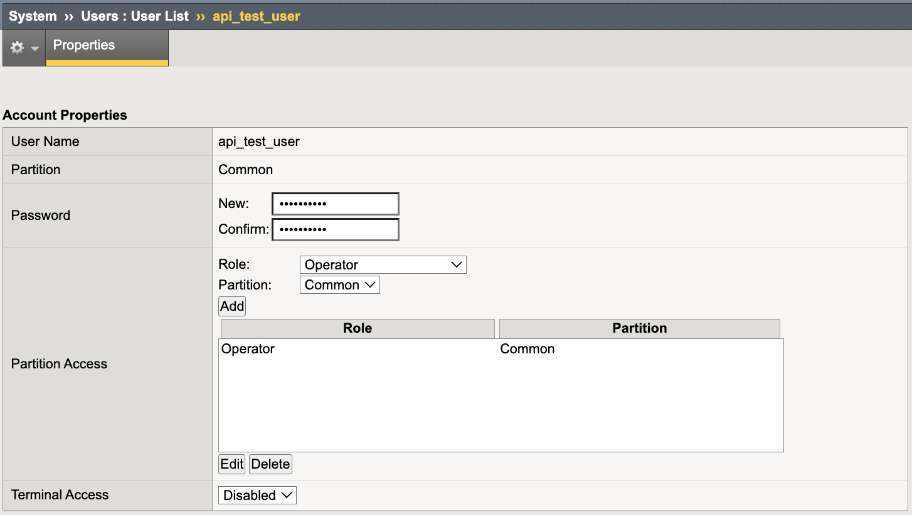
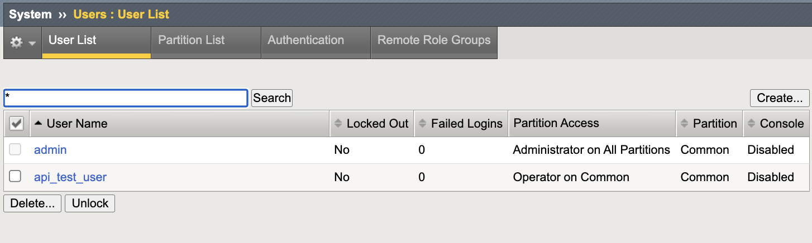
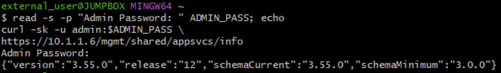

API Access Control – Role-Based Enforcement (AS3 & Declarative Onboarding)
===========================================================================

The Middle Layer enforces authentication and authorization controls
over the BIG-IP control plane. This lab validates secure access
to service extensions (AS3 and Declarative Onboarding) using
role-based authorization and deterministic REST validation.

This lab assumes:

* Network-layer segmentation (Outer Layer) is enforced.
* Administrative authentication (MFA) is in place or delegated to centralized AAA.

This lab focuses on **authorization enforcement** at the REST framework layer.

Authentication answers:

* **Who are you?**

Authorization answers:

* **What are you allowed to do?**

Executive Summary
-----------------

This lab demonstrates secure API access enforcement for BIG-IP
service extensions through layered controls:

* Network segmentation (Outer Layer)
* REST authentication
* Role-based authorization
* Device-scoped extension protection
* Deterministic authorization failure behavior

Together, these controls enforce least privilege and protect
declarative service extensions from unauthorized invocation.

Objective
---------

Validate secure, deterministic API access to BIG-IP service extensions
while enforcing:

* Role-based authorization
* Least privilege validation
* Device-scoped extension protection
* Management-plane isolation (Outer Layer reference)
* Deterministic authorization failure behavior

Threat Model
------------

This lab assumes an adversary may attempt to:

* Use valid credentials with insufficient privileges to invoke device-scoped APIs.
* Access the BIG-IP management API from an authorized network without sufficient privileges.
* Abuse overly privileged accounts to deploy unauthorized configurations.
* Invoke device-scoped service extensions (AS3/DO) using partition-scoped roles.
* Submit unauthorized or destructive declarative configurations.

Controls validated in this lab mitigate these threats via:

* Management-plane segmentation (validated in the Outer Layer module).
* Strict REST authentication enforcement.
* Role-based authorization at the REST framework layer.
* Explicit denial of device-scoped extension access to non-administrative roles.

Architecture Overview
---------------------

AS3 and Declarative Onboarding operate under:

::

   /mgmt/shared/*

These endpoints are:

* Device-scoped
* Not partition-scoped
* Protected by REST framework authorization
* Not configurable for partition-level delegation

Authorization Flow:

1. Client authenticates using REST Basic Authentication.
2. REST framework validates the user’s credentials.
3. Authorization policy evaluates the user’s assigned role.
4. Service extension executes only if role permits.

---------------------------------------------------------------------

Phase 1 – Baseline Validation
-----------------------------

Verify AS3 and DO Installed
^^^^^^^^^^^^^^^^^^^^^^^^^^^^

Navigate to:

::

   iApps → Package Management LX

Confirm the following packages are installed:

* ``f5-appsvcs``
* ``f5-declarative-onboarding``

   Package Management LX showing AS3 and DO installed.

Management Surface Baseline (Outer Layer Reference)
^^^^^^^^^^^^^^^^^^^^^^^^^^^^^^^^^^^^^^^^^^^^^^^^^^^

   External Self IP port lockdown baseline documenting exposed management surface.

Jumphost Source IP Baseline
^^^^^^^^^^^^^^^^^^^^^^^^^^^

   Jumphost source interfaces used for deterministic API testing.

Baseline API Reachability (Administrator)
^^^^^^^^^^^^^^^^^^^^^^^^^^^^^^^^^^^^^^^^^^

REST Basic Authentication is used for deterministic validation.

From the Windows Jumphost:

.. code-block:: bash

   read -s -p "Admin Password: " ADMIN_PASS; echo
   curl -sk -u admin:$ADMIN_PASS \
   https://10.1.1.6/mgmt/shared/appsvcs/info

Expected:

* HTTP 200
* JSON response containing AS3 version information

This confirms:

* Management plane reachable
* AS3 extension operational
* Administrative authorization functioning

.. admonition:: Security Principle
   :class: important

   Management-plane reachability alone does not grant configuration authority.
   Authorization enforcement occurs at the REST framework layer.

---------------------------------------------------------------------

Phase 2 – Least Privilege Enforcement (Operator Denied)
-------------------------------------------------------

Create Restricted User
^^^^^^^^^^^^^^^^^^^^^^

Create a local user with limited privileges:

* Username: ``api_test_user``
* Role: Operator
* Partition: Common
* Terminal Access: Disabled

Test AS3 Access (GET)
^^^^^^^^^^^^^^^^^^^^^

.. code-block:: bash

   read -s -p "Operator Password: " OP_PASS; echo
   curl -sk -u api_test_user:$OP_PASS \
   https://10.1.1.6/mgmt/shared/appsvcs/info

Expected:

* HTTP 401 (Unauthorized / Authorization failed)

Test Declarative Onboarding Access (GET)
^^^^^^^^^^^^^^^^^^^^^^^^^^^^^^^^^^^^^^^^

.. code-block:: bash

   curl -sk -u api_test_user:$OP_PASS \
   https://10.1.1.6/mgmt/shared/declarative-onboarding/info

Expected:

* HTTP 401 (Unauthorized)

Test AS3 Declaration Attempt (POST)
^^^^^^^^^^^^^^^^^^^^^^^^^^^^^^^^^^^

.. code-block:: bash

   curl -sk -u api_test_user:$OP_PASS \
     -H "Content-Type: application/json" \
     -X POST \
     https://10.1.1.6/mgmt/shared/appsvcs/declare \
     --data-binary @test.json

Expected:

* HTTP 401 (Unauthorized)

Why This Fails
^^^^^^^^^^^^^^

AS3 and Declarative Onboarding operate under:

::

   /mgmt/shared/*

These are device-scoped service extensions.

Partition-scoped roles (Operator, Application Editor) cannot invoke
shared extension endpoints.

This failure confirms proper REST authorization enforcement.

.. admonition:: Architectural Insight
   :class: note

   Service extensions execute at the device scope.
   Partition roles apply only to configuration objects
   (virtual servers, pools, etc.), not to shared REST extensions.

---------------------------------------------------------------------

Phase 3 – Administrative Authorization (Allowed)
------------------------------------------------

Test Administrative Access
^^^^^^^^^^^^^^^^^^^^^^^^^^

.. code-block:: bash

   read -s -p "Admin Password: " ADMIN_PASS; echo
   curl -sk -u admin:$ADMIN_PASS \
   https://10.1.1.6/mgmt/shared/appsvcs/info

Expected:

* HTTP 200
* JSON response returned

This confirms:

* Successful authentication
* Proper authorization
* Correct privilege boundary

---------------------------------------------------------------------

Deterministic Validation Matrix
-------------------------------

+-------------------------------------------+-----------------------------+-----------------------------+
| Test Case                                 | Expected Result             | Observed Result             |
+===========================================+=============================+=============================+
| Operator GET AS3 info                     | HTTP 401                    |                             |
+-------------------------------------------+-----------------------------+-----------------------------+
| Operator GET DO info                      | HTTP 401                    |                             |
+-------------------------------------------+-----------------------------+-----------------------------+
| Operator POST AS3 declare                 | HTTP 401                    |                             |
+-------------------------------------------+-----------------------------+-----------------------------+
| Administrator GET AS3 info                | HTTP 200 + JSON             |                             |
+-------------------------------------------+-----------------------------+-----------------------------+

---------------------------------------------------------------------

Security Controls Validated
---------------------------

+-------------------------------------------+-----------+
| Control                                   | Validated |
+===========================================+===========+
| REST authentication enforcement           | ✔         |
+-------------------------------------------+-----------+
| Role-based authorization enforcement      | ✔         |
+-------------------------------------------+-----------+
| Device-scoped extension protection        | ✔         |
+-------------------------------------------+-----------+
| Least privilege validation                | ✔         |
+-------------------------------------------+-----------+
| Deterministic failure behavior            | ✔         |
+-------------------------------------------+-----------+

---------------------------------------------------------------------

Detection & Evidence
--------------------

Relevant log locations include:

* ``/var/log/restjavad.*`` – REST authentication and authorization events
* ``/var/log/restnoded/restnoded.log`` – AS3 request handling
* ``System → Logs → Audit`` – User and configuration changes

Authorization failures generate:

* HTTP 401 responses
* REST framework log entries
* No MCP configuration transactions
* No configuration modification events

---------------------------------------------------------------------

Middle Layer Cohesion
---------------------

Within the Middle Layer:

* MFA validates administrative identity.
* TLS enforces secure transport.
* API Access Control enforces privilege boundaries.

Together, these controls prevent credential abuse,
transport downgrade, and unauthorized configuration deployment.

---------------------------------------------------------------------

Success Criteria
----------------

* Operator role denied access to device-scoped endpoints
* Administrator role permitted access
* HTTP 401 returned for unauthorized requests
* No configuration changes occur for denied attempts
* Deterministic privilege boundary confirmed