Data Plane TLS and Cipher Hardening
===================================

TLS and cipher hardening reduces the risk of cryptographic downgrade,
weak cipher negotiation, and non-compliant protocol exposure.

In the Middle Layer, hardened TLS profiles enforce modern protocol
versions and strong cipher suites for application traffic on the
BIG-IP data plane.

This lab focuses on data-plane TLS enforcement for application
virtual servers. Administrative TLS hardening for TMUI is addressed
separately.

This mechanism is a critical Middle Layer cryptographic control.

.. admonition:: Executive Summary
   :class: important

   Applications must enforce modern TLS versions and strong cipher suites.
   Legacy protocols and weak cryptographic algorithms must be disabled
   unless explicitly required and formally risk-approved.

   Hardening must be validated using deterministic handshake testing —
   not configuration inspection alone.

Data Plane TLS Exposure Surface
-------------------------------

+----------------------+------------+----------------------------------+
| Interface            | Port       | Purpose                          |
+======================+============+==================================+
| HTTPS Virtual Server | TCP 443    | Application TLS termination      |
+----------------------+------------+----------------------------------+

TLS enforcement occurs at the BIG-IP virtual server through the
configured **Client SSL profile**.

Data Plane TLS Enforcement Architecture
---------------------------------------

.. nwdiag::
   :caption: BIG-IP Data Plane TLS Termination
   :name: dataplane-tls-architecture

   nwdiag {

     network client {
       address = "Client\n10.1.10.10";
     }

     network bigip {
       address = "BIG-IP Virtual Server\n10.1.10.50\nTLS Termination (HTTPS 443)";
     }

     network backend {
       address = "Application Server\n10.1.20.9\nHTTP / HTTPS";
     }

     client -- bigip;
     bigip -- backend;

   }

Threat Scenario
---------------

In the absence of TLS hardening:

* Legacy clients may negotiate TLS 1.0 or 1.1.
* Weak ciphers (e.g., 3DES, RC4) may be offered.
* Downgrade attacks may force weaker protocol selection.
* Compliance audits (PCI DSS, NIST) may flag non-compliant exposure.
* Sensitive application traffic may be cryptographically weakened.

TLS hardening reduces this risk by enforcing modern protocol and
cipher negotiation at the data plane.

Objective
---------

This lab will:

* Inspect an existing HTTPS virtual server
* Observe baseline TLS posture
* Create a hardened Client SSL profile
* Apply hardened configuration to a virtual server
* Validate deterministic protocol enforcement
* Confirm weak protocols and ciphers are eliminated

Hardened Enterprise Reference Design
------------------------------------

The goal is to standardize strong TLS posture at the BIG-IP data plane.

.. note::

   Use dedicated SSL profiles.
   Never modify built-in profiles directly.

Middle Layer Cohesion
---------------------

Within the Middle Layer:

* MFA protects **administrative authentication**
* TLS and Cipher Hardening protects **transport confidentiality and integrity**
* API Access Control protects **administrative authorization**

Together, these controls prevent credential abuse,
downgrade attacks, and privilege misuse.

----

Pre-Provisioned Lab Environment
-------------------------------

The lab environment includes:

* A functional HTTPS virtual server
* Associated pool and backend members
* Default ``clientssl`` profile applied

Students are not required to build the baseline application service.

Students will configure **BIGIP-01**.

Test traffic originates from the **Windows Jump Host (10.1.10.10)**.

----

Phase 1 – Inspect Baseline HTTPS Service
----------------------------------------

Step 1 – Locate HTTPS Virtual Server
~~~~~~~~~~~~~~~~~~~~~~~~~~~~~~~~~~~~

1. Navigate to **Local Traffic → Virtual Servers**.
2. Identify the preconfigured HTTPS virtual server  
   (example: ``primary-app-site-1-https-vip``).
3. Confirm:

   * Destination Address: ``10.1.10.50``
   * Service Port: ``443 (HTTPS)``
   * SSL Profile (Client): ``clientssl``
   * Default Pool assigned

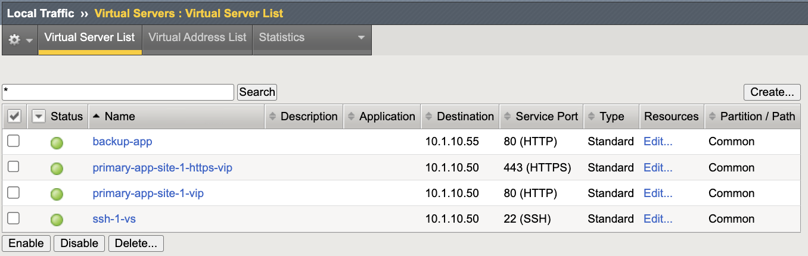

Step 2 – Confirm Backend Health
~~~~~~~~~~~~~~~~~~~~~~~~~~~~~~~

1. Navigate to **Local Traffic → Pools**.
2. Identify the associated pool.
3. Confirm:

   * Members are green (Available)
   * Health monitor is functioning

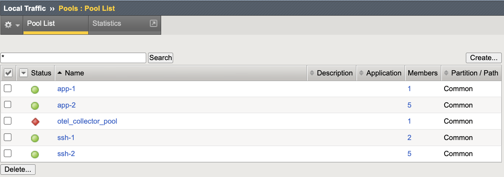

----

Phase 2 – Baseline TLS Observation
----------------------------------

Execution Context:

* Host: **Windows Jump Host (10.1.10.10)**
* Tool: **Git Bash (OpenSSL client)**
* Network Interface: **External / Client Network (10.1.10.0/24)**

Open **Git Bash** on the Windows Jump Host.

.. note::

   The ``openssl s_client`` command produces verbose output.

   To view only the negotiated protocol and cipher, you may optionally
   filter the output:

   .. code-block:: bash

      openssl s_client -connect 10.1.10.50:443 -tls1_2 2>/dev/null | grep -E "Protocol|Cipher"

Test TLS 1.2 (Expected: Success)
~~~~~~~~~~~~~~~~~~~~~~~~~~~~~~~~

.. code-block:: bash

   openssl s_client -connect 10.1.10.50:443 -tls1_2

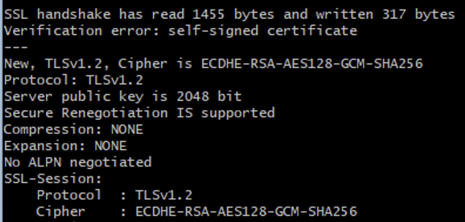

Test TLS 1.1 (Expected: Likely Success)
~~~~~~~~~~~~~~~~~~~~~~~~~~~~~~~~~~~~~~~

.. code-block:: bash

   openssl s_client -connect 10.1.10.50:443 -tls1_1

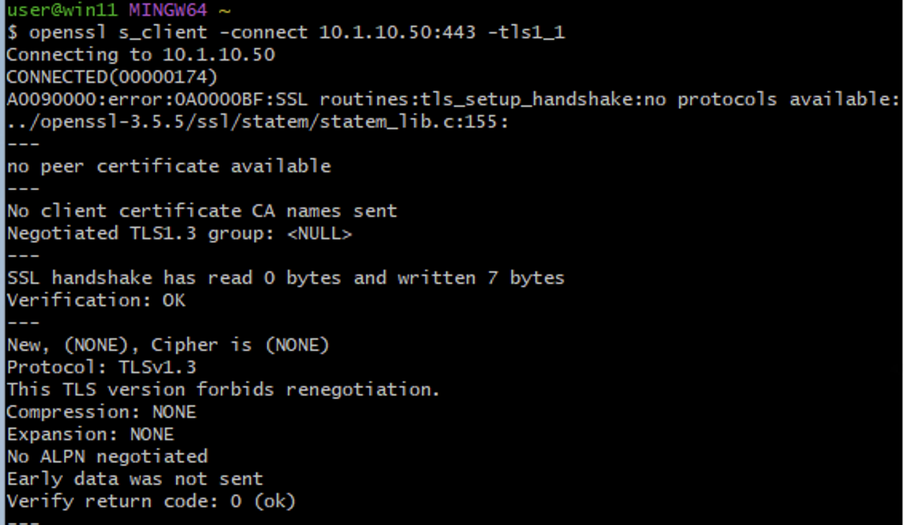

Test TLS 1.0 (Expected: Likely Success)
~~~~~~~~~~~~~~~~~~~~~~~~~~~~~~~~~~~~~~~

.. code-block:: bash

   openssl s_client -connect 10.1.10.50:443 -tls1

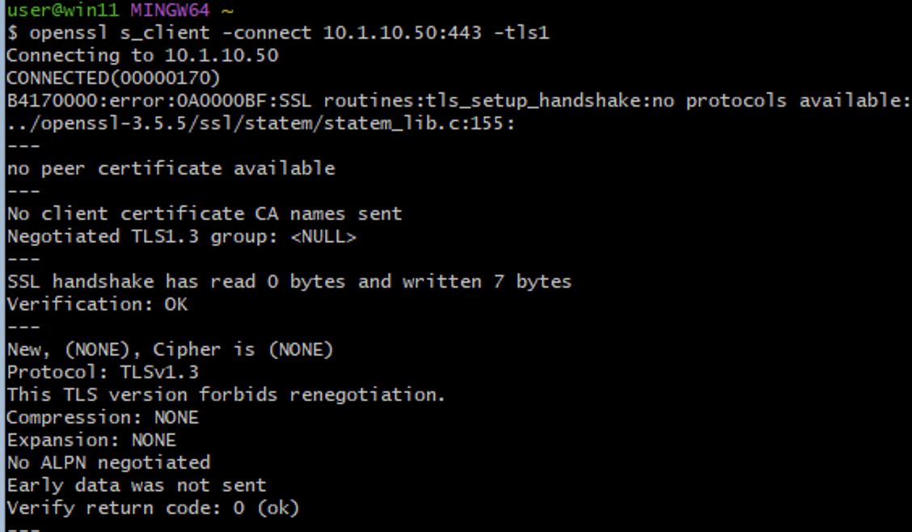

If TLS 1.0 or TLS 1.1 succeeds, legacy protocol exposure is confirmed.

----

Phase 3 – Create Hardened Client SSL Profile
---------------------------------------------

1. Navigate to **Local Traffic → Profiles → SSL → Client → Create**.
2. Configure:

   * Name: ``clientssl_hardened``
   * Parent Profile: ``clientssl``

3. Disable:

   * SSLv3
   * TLS 1.0
   * TLS 1.1

4. Enable:

   * TLS 1.2
   * TLS 1.3

5. Set the cipher group:

::

   f5-secure

.. note::

   TLS 1.3 cipher suites are managed independently from legacy cipher
   strings in newer TMOS versions.

   Ensure TLS 1.3 posture aligns with enterprise cryptographic policy.

6. Click **Finished**.

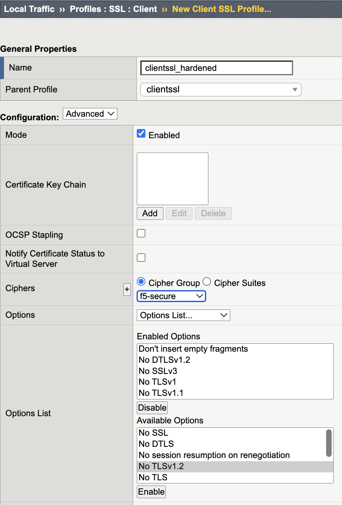

----

Phase 4 – Apply Hardened Profile
--------------------------------

1. Navigate to **Local Traffic → Virtual Servers**.
2. Select ``primary-app-site-1-https-vip``.
3. Replace the Client SSL profile with:

   ``clientssl_hardened``

4. Click **Update**.

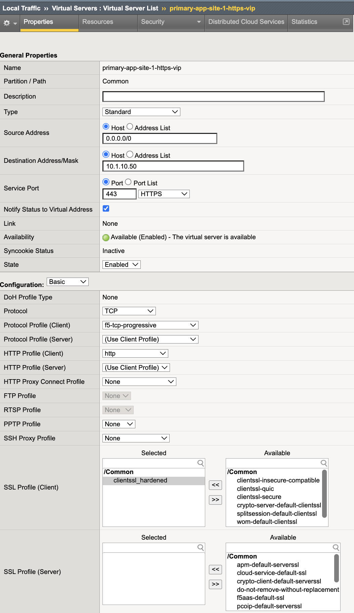

----

Phase 5 – Deterministic Validation
----------------------------------

Execution Context:

* Host: **Windows Jump Host (10.1.10.10)**
* Tool: **Git Bash (OpenSSL client)**
* Network Interface: **External / Client Network (10.1.10.0/24)**

Test TLS 1.0 (Expected: Failure)
~~~~~~~~~~~~~~~~~~~~~~~~~~~~~~~~

.. code-block:: bash

   openssl s_client -connect 10.1.10.50:443 -tls1

Expected result:

* Handshake failure
* No cipher negotiated

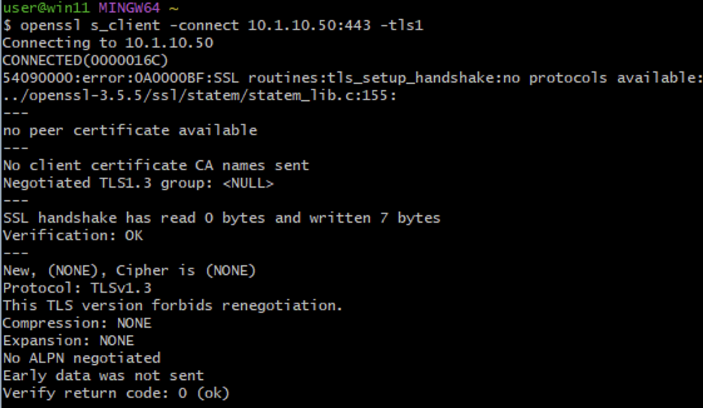

Test TLS 1.1 (Expected: Failure)
~~~~~~~~~~~~~~~~~~~~~~~~~~~~~~~~

.. code-block:: bash

   openssl s_client -connect 10.1.10.50:443 -tls1_1

Expected result:

* Handshake failure
* No cipher negotiated

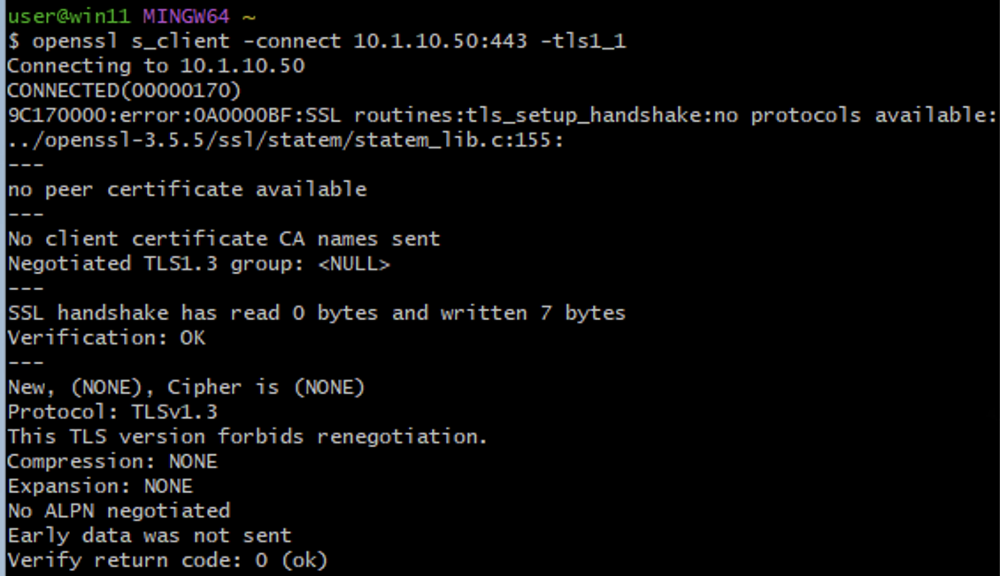

Test TLS 1.2 (Expected: Success)
~~~~~~~~~~~~~~~~~~~~~~~~~~~~~~~~

.. code-block:: bash

   openssl s_client -connect 10.1.10.50:443 -tls1_2

Test TLS 1.3 (Expected: Success)
~~~~~~~~~~~~~~~~~~~~~~~~~~~~~~~~

.. code-block:: bash

   openssl s_client -connect 10.1.10.50:443 -tls1_3

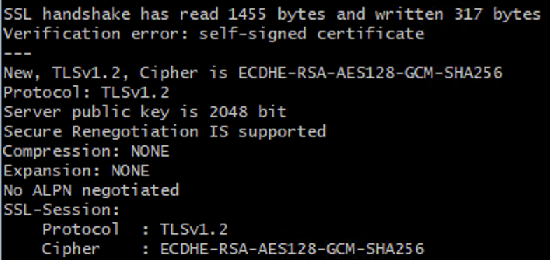

Optional – Weak Cipher Validation
~~~~~~~~~~~~~~~~~~~~~~~~~~~~~~~~~

Test a deprecated cipher (Expected: Failure)

.. code-block:: bash

   openssl s_client -connect 10.1.10.50:443 -cipher DES-CBC3-SHA

Expected result:

* Handshake failure
* Cipher not negotiated

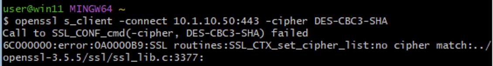

----

Validation Summary
------------------

After remediation:

* TLS 1.0 disabled
* TLS 1.1 disabled
* Only TLS 1.2 and TLS 1.3 permitted
* Weak ciphers removed
* Backend service remains operational
* Deterministic enforcement confirmed via handshake testing

Success Criteria
----------------

* Virtual server supports only TLS 1.2 and TLS 1.3
* TLS 1.0 and TLS 1.1 are blocked
* Weak ciphers are not offered
* Application availability maintained
* Protocol enforcement verified through active testing