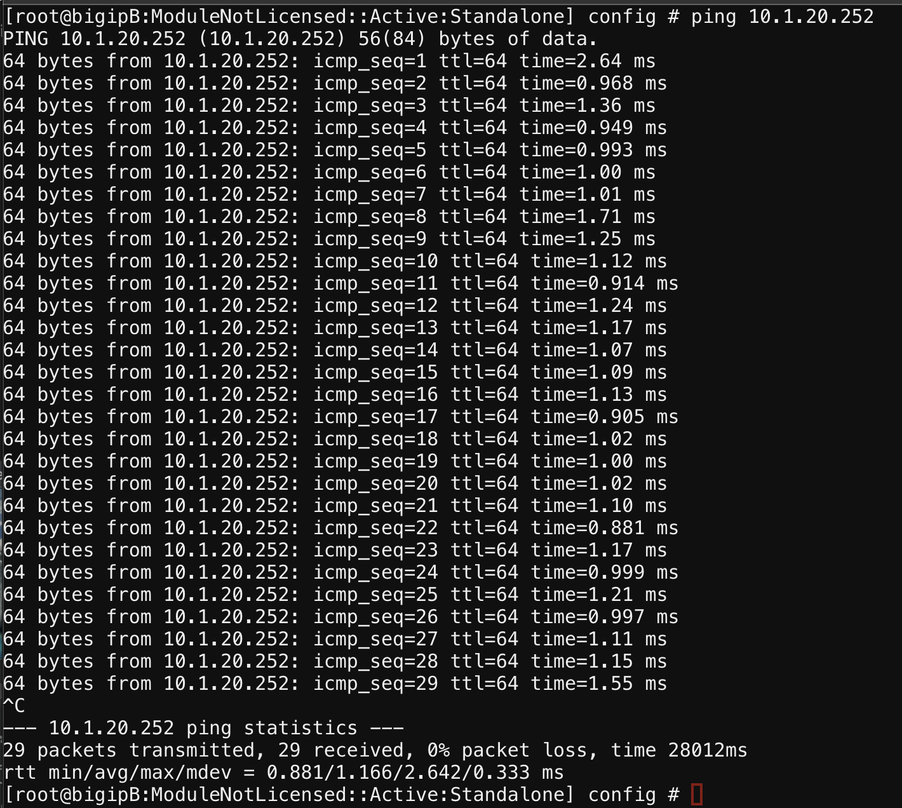
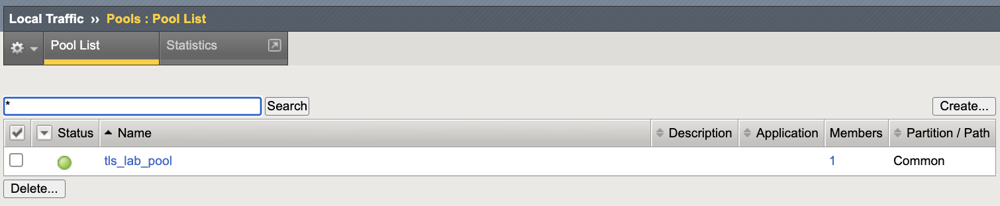
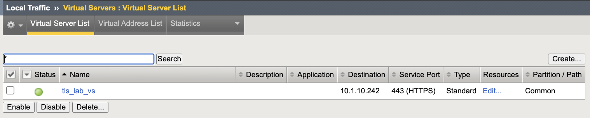
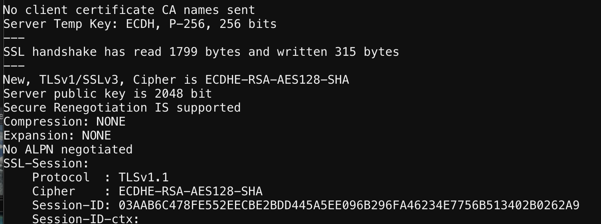
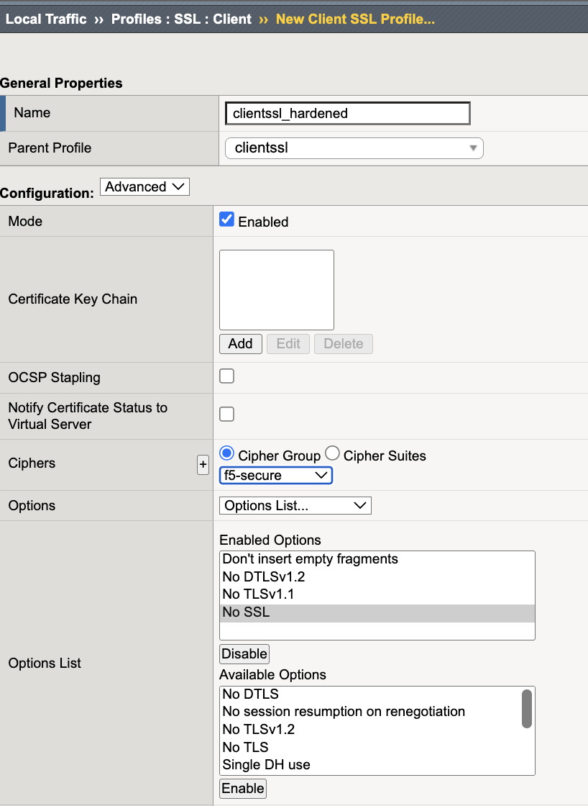
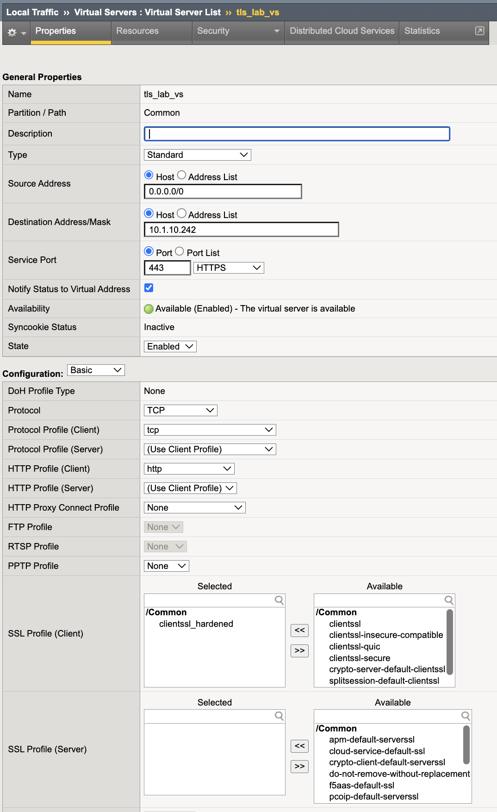

Data Plane TLS and Cipher Hardening
========================

TLS and cipher hardening reduces the risk of cryptographic downgrade,
weak cipher negotiation, and non-compliant protocol exposure.

In the Middle Layer, hardened TLS profiles enforce modern protocol
versions and strong cipher suites for application traffic on the
BIG-IP data plane.

This lab focuses on data-plane TLS enforcement for application
virtual servers. Administrative TLS hardening for TMUI is addressed
separately.

This mechanism is a critical Middle Layer cryptographic control.

Executive Summary
-----------------

Applications must enforce modern TLS versions and strong ciphers.
Legacy protocols and weak cryptographic algorithms must be disabled
unless explicitly required and risk-approved.

Hardening must be validated using deterministic handshake testing,
not configuration inspection alone.

Threat Scenario
---------------

In the absence of TLS hardening:

* Legacy clients may negotiate TLS 1.0 or 1.1.
* Weak ciphers (e.g., 3DES, RC4) may be offered.
* Downgrade attacks may force weaker protocol selection.
* Compliance audits (PCI DSS, NIST) may flag non-compliant exposure.
* Sensitive application traffic may be cryptographically weakened.

TLS hardening reduces this risk by enforcing modern protocol and
cipher negotiation at the data plane.

Objective
---------

This lab will:

* Build a baseline HTTPS application service
* Observe default TLS posture
* Create a hardened Client SSL profile
* Apply hardened configuration to a virtual server
* Validate deterministic protocol enforcement
* Confirm weak protocols and ciphers are eliminated

Hardened Enterprise Reference Design
------------------------------------

The goal is to standardize strong TLS posture at the BIG-IP data plane.

.. note::

   Use dedicated SSL profiles.
   Never modify built-in profiles directly.

Middle Layer Cohesion
---------------------

Within the Middle Layer:

* MFA protects **administrative authentication**.
* TLS and Cipher Hardening protects **transport confidentiality and integrity**.
* API Access Control protects **administrative authorization**.

Together, these controls prevent credential abuse, downgrade attacks,
and privilege misuse.

---------------------------------------------------------------------

Phase 0 – Backend Reachability Validation
------------------------------------------

Before building TLS services, confirm backend reachability.

1. Open BIG-IP **Web Shell**.
2. Run:

.. code-block:: bash

   ping 10.1.20.252

Expected Result:
Successful replies with 0% packet loss.

This confirms pool member reachability and isolates TLS testing
from backend connectivity issues.

---------------------------------------------------------------------

Phase 1 – Build Baseline HTTPS Service
---------------------------------------

Step 1 – Create Pool
~~~~~~~~~~~~~~~~~~~~

1. Navigate to **Local Traffic → Pools → Create**.
2. Configure:

   * Name: ``tls_lab_pool``
   * Health Monitor: ``http``

3. Add member:

   * Address: ``10.1.20.252``
   * Service Port: ``80``

4. Click **Finished**.

Step 2 – Create HTTPS Virtual Server
~~~~~~~~~~~~~~~~~~~~~~~~~~~~~~~~~~~~~

1. Navigate to **Local Traffic → Virtual Servers → Create**.
2. Configure:

   * Name: ``tls_lab_vs``
   * Destination Address: ``10.1.10.242``
   * Service Port: ``443``
   * HTTP Profile: ``http``
   * SSL Profile (Client): ``clientssl`` (default)
   * Default Pool: ``tls_lab_pool``

3. Click **Finished**.

---------------------------------------------------------------------

Phase 2 – Baseline TLS Observation
-----------------------------------

From the jumphost:

Test TLS 1.2 (Expected: Success)

.. code-block:: bash

   openssl s_client -connect 10.1.10.242:443 -tls1_2

Test TLS 1.0 (Expected: Likely Success)

.. code-block:: bash

   openssl s_client -connect 10.1.10.242:443 -tls1

Test TLS 1.1 (Expected: Likely Success)

.. code-block:: bash

   openssl s_client -connect 10.1.10.242:443 -tls1_1

If TLS 1.0 or TLS 1.1 succeeds, this confirms legacy protocol exposure.

Capture evidence.

.. image:: ../_images/tls-and-cipher-hardening-03-baseline-tls10-success.png
   :alt: TLS 1.0 negotiation success before hardening
   :width: 900

---------------------------------------------------------------------

Phase 3 – Create Hardened Client SSL Profile
---------------------------------------------

1. Navigate to **Local Traffic → Profiles → SSL → Client → Create**.
2. Configure:

   * Name: ``clientssl_hardened``
   * Parent Profile: ``clientssl``

3. Disable:

   * SSLv3
   * TLS 1.0
   * TLS 1.1

4. Enable:

   * TLS 1.2
   * TLS 1.3

5. Set cipher string:

   ECDHE+AES-GCM:ECDHE+CHACHA20:!3DES:!RC4:!MD5:!EXPORT:!NULL

.. note::

   TLS 1.3 cipher suites are managed separately from legacy cipher
   strings in newer TMOS versions. Ensure TLS 1.3 posture aligns
   with enterprise policy where applicable.

6. Click **Finished**.

---------------------------------------------------------------------

Phase 4 – Apply Hardened Profile
---------------------------------

1. Navigate to **Local Traffic → Virtual Servers → tls_lab_vs**.
2. Replace Client SSL profile with ``clientssl_hardened``.
3. Click **Update**.

---------------------------------------------------------------------

Phase 5 – Deterministic Validation
-----------------------------------

Test TLS 1.0 (Expected: Failure)

.. code-block:: bash

   openssl s_client -connect 10.1.10.242:443 -tls1

Expected Result:

* Handshake failure
* No cipher negotiated

.. figure:: ../_images/tls-and-cipher-hardening-06-tls10-failed.png
   :alt: TLS 1.0 handshake fails after hardening
   :align: center
   :width: 90%

Test TLS 1.1 (Expected: Failure)

.. code-block:: bash

   openssl s_client -connect 10.1.10.242:443 -tls1_1

Expected Result:

* Handshake failure
* No cipher negotiated

.. figure:: ../_images/tls-and-cipher-hardening-07-tls11-failed.png
   :alt: TLS 1.1 handshake fails after hardening
   :align: center
   :width: 90%

Test TLS 1.2 (Expected: Success)

.. code-block:: bash

   openssl s_client -connect 10.1.10.242:443 -tls1_2

.. image:: ../_images/tls-and-cipher-hardening-08-tls12-success.png
   :alt: TLS 1.2 negotiation success with hardened profile
   :width: 900
   :align: center   

Test TLS 1.3 (Expected: Success)

.. code-block:: bash

   openssl s_client -connect 10.1.10.242:443 -tls1_3

.. image:: ../_images/tls-and-cipher-hardening-09-tls13-success.png
   :alt: TLS 1.3 negotiation success with hardened profile
   :width: 900
   :align: center

Optional – Weak Cipher Validation
~~~~~~~~~~~~~~~~~~~~~~~~~~~~~~~~~~

Test a deprecated cipher (Expected: Failure)

.. code-block:: bash

   openssl s_client -connect 10.1.10.242:443 -cipher DES-CBC3-SHA

Expected Result:

* Handshake failure
* Cipher not negotiated

---------------------------------------------------------------------

Success Criteria
----------------

* Virtual server supports only TLS 1.2 / 1.3
* TLS 1.0 and 1.1 are blocked
* Weak ciphers are not offered
* Backend service remains reachable
* Deterministic enforcement confirmed via handshake testing