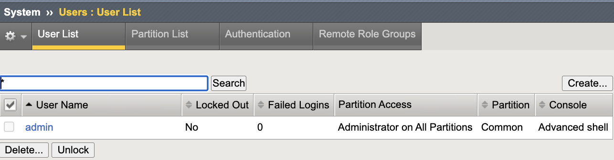
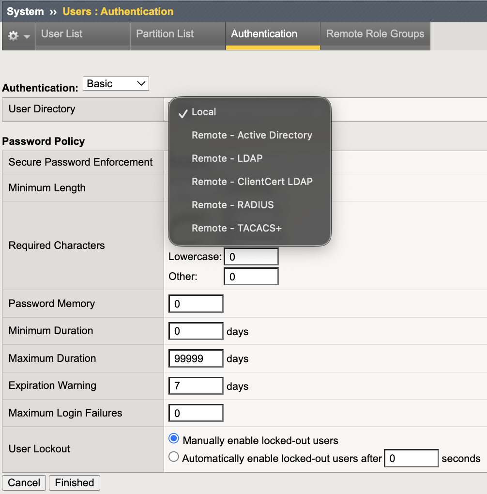
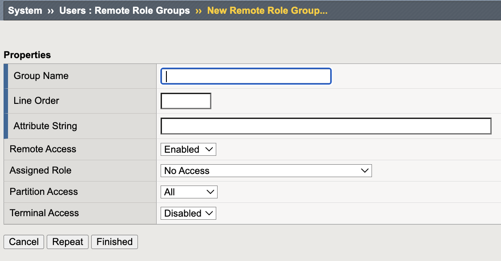

Multi-Factor Authentication
===========================

Multi-Factor Authentication (MFA) strengthens administrative access by
requiring a second factor beyond username and password.

In the Middle Layer, MFA protects the authentication process by preventing
credential-only administrative compromise. BIG-IP administrative authentication
is delegated to a centralized AAA or identity provider (IdP) that enforces MFA
for TMUI and SSH access paths.

Authentication answers the question:

* **Who are you?**

Authorization (covered in the API Access Control lab) answers:

* **What are you allowed to do?**

This mechanism is a critical Middle Layer identity control.

.. admonition:: Executive Summary
   :class: important

   Administrative access must require MFA whenever supported by
   enterprise identity infrastructure.

   BIG-IP should delegate authentication to a centralized AAA or IdP
   that enforces MFA, while maintaining deterministic local fallback
   for break-glass recovery.

Threat Scenario
---------------

In the absence of MFA enforcement:

* A stolen or phished password could grant administrative access.
* Password reuse across systems could expose TMUI or SSH.
* Credential stuffing could target management interfaces.
* A compromised workstation could be used for lateral administrative access.

MFA reduces this risk by requiring a second authentication factor
before administrative access is granted.

Objective
---------

This lab will:

* Review centralized MFA integration architecture
* Examine BIG-IP remote authentication configuration options
* Demonstrate safe configuration review without activation
* Reinforce deterministic fallback principles
* Validate break-glass account posture
* Understand authentication vs authorization separation

.. warning::

   Misconfiguration of remote authentication can result in administrative lockout.

   Before enabling remote authentication in production:

   * Ensure console or SSH access is available.
   * Confirm a documented break-glass local administrator account exists.
   * Validate network reachability to the remote AAA server.
   * Test login before ending the session.

Hardened Enterprise Reference Design
------------------------------------

The goal is to integrate BIG-IP administrative authentication with a
centralized identity provider that enforces MFA.

.. note::

   BIG-IP does not natively generate MFA challenges.
   It relies on the upstream AAA or identity provider to enforce MFA
   before returning an authentication decision.

   BIG-IP can integrate with enterprise AAA systems such as:

   * RADIUS
   * TACACS+
   * LDAP (when upstream MFA is enforced)
   * SAML (administrative support depends on TMOS version and platform capability)

   The reference design assumes MFA enforcement occurs at the upstream
   identity provider. BIG-IP consumes the authentication result and
   applies role mapping locally.

.. nwdiag::
   :caption: Reference Design – BIG-IP Administrative Access with Centralized MFA
   :name: mfa-reference-design

   nwdiag {
     internet [shape = cloud];

     network admin     { address = "Authorized Admin Subnet"; }
     network bigipmgmt { address = "BIG-IP Management IP"; }
     network idp       { address = "Enterprise AAA / IdP (MFA Enforced)"; }

     admin -- bigipmgmt;
     bigipmgmt -- idp;
   }

Recommended MFA Posture
-----------------------

+----------------------+----------------------------+-------------------------------------------+
| Access Path          | Authentication Source      | Requirement                                |
+======================+============================+===========================================+
| TMUI (HTTPS/443)     | Centralized AAA / IdP      | MFA enforced by AAA / IdP                  |
+----------------------+----------------------------+-------------------------------------------+
| SSH (TCP/22)         | Centralized AAA            | MFA or strong step-up policy               |
+----------------------+----------------------------+-------------------------------------------+
| Break-glass account  | Local (restricted)         | Stored securely, monitored, least use      |
+----------------------+----------------------------+-------------------------------------------+

Middle Layer Cohesion
---------------------

Within the Middle Layer:

* MFA protects **administrative authentication**.
* TLS and Cipher Hardening protects **administrative transport security**.
* API Access Control protects **administrative authorization**.

Together, these controls prevent credential abuse, transport downgrade,
and privilege misuse.

---------------------------------------------------------------------

Lab Environment Notice
----------------------

This lab environment does not include a live RADIUS, TACACS+, LDAP,
or SAML identity provider.

Remote authentication will NOT be activated.

This lab focuses on configuration review and architectural understanding,
not activation of remote authentication.

Students will:

* Review configuration interfaces
* Discuss enterprise integration requirements
* Validate break-glass posture
* Understand fallback behavior
* Simulate authentication drift scenarios safely

---------------------------------------------------------------------

GUI Configuration Procedure
---------------------------

Step 1 – Confirm Administrative Baseline
~~~~~~~~~~~~~~~~~~~~~~~~~~~~~~~~~~~~~~~~

1. Log in to TMUI from the lab jump host.
2. Navigate to **System → Users → User List**.
3. Confirm the presence of a documented local break-glass administrator.
4. Verify partition access and role assignments.

Baseline administrative users prior to centralized authentication integration.

---------------------------------------------------------------------

Step 2 – Review Authentication Configuration Screen
~~~~~~~~~~~~~~~~~~~~~~~~~~~~~~~~~~~~~~~~~~~~~~~~~~~~

1. Navigate to **System → Users → Authentication**.
2. Observe available authentication modes.
3. Review the following options:

   * Local
   * Remote – RADIUS
   * Remote – TACACS+
   * LDAP
   * SAML (where supported)

Do NOT change the authentication source in this lab.

Baseline authentication mode set to Local.

---------------------------------------------------------------------

Step 3 – Discuss Remote Authentication Requirements (Conceptual)
~~~~~~~~~~~~~~~~~~~~~~~~~~~~~~~~~~~~~~~~~~~~~~~~~~~~~~~~~~~~~~~~~

In a production environment, enabling Remote – RADIUS would require:

* Confirmed reachability to the RADIUS server
* Correct shared secret configuration
* Remote role group mapping
* Fallback to Local enabled
* Successful login validation before session termination

Failure to validate reachability may result in administrative lockout.

---------------------------------------------------------------------

Step 4 – Review Remote Role Groups Configuration
~~~~~~~~~~~~~~~~~~~~~~~~~~~~~~~~~~~~~~~~~~~~~~~~~

1. Navigate to **System → Users → Remote Role Groups**.
2. Click **Create** (do not save changes).
3. Review configuration fields:

   * Attribute String (e.g., RADIUS Class, TACACS+ privilege level,
     LDAP group membership, or SAML assertion)
   * Assigned Role
   * Partition Access

Remote Role Groups configuration interface used to map AAA attributes to BIG-IP administrative roles.

This configuration maps AAA-returned attributes to BIG-IP roles
for dynamic authorization enforcement after successful authentication.

.. note::

   No AAA attributes will be evaluated in this lab environment.
   This step is demonstrative only.

---------------------------------------------------------------------

Verification (Simulation)
--------------------------

In a production deployment:

* Administrative login is delegated to centralized AAA.
* MFA challenge occurs upstream at the identity provider.
* BIG-IP consumes the authentication result.
* Role mapping is enforced dynamically.

In this lab:

* Authentication remains local.
* Role mapping configuration is reviewed.
* Fallback principles are discussed conceptually.

---------------------------------------------------------------------

Instructor Notes
----------------

.. admonition:: Instructor Guidance
   :class: tip

   Reinforce the following principles:

   * Always validate AAA reachability before enabling remote authentication.
   * Always configure deterministic fallback.
   * Always test login before ending configuration.
   * Remote authentication without reachability validation is operationally unsafe.

---------------------------------------------------------------------

Lab Challenge – Authentication Drift Scenario
---------------------------------------------

Scenario:

A local administrator account is being used instead of centralized MFA.

Student Tasks:

1. Identify the account under **System → Users**.
2. Confirm it bypasses centralized authentication.
3. Restrict or document it as break-glass only.
4. Explain how centralized MFA would enforce stronger control.

Local accounts in MFA-enabled environments should be disabled,
restricted, or documented strictly as break-glass access.

---------------------------------------------------------------------

Success Criteria
----------------

* Break-glass account documented
* Authentication vs authorization distinction understood
* Authentication screen reviewed
* Remote authentication risks understood
* Fallback behavior explained correctly
* Centralized MFA integration architecture understood